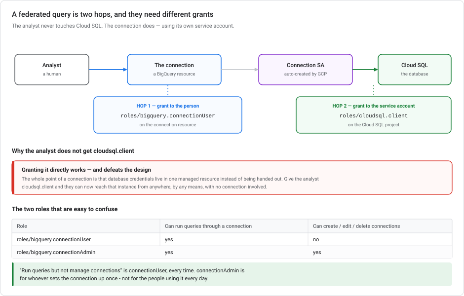
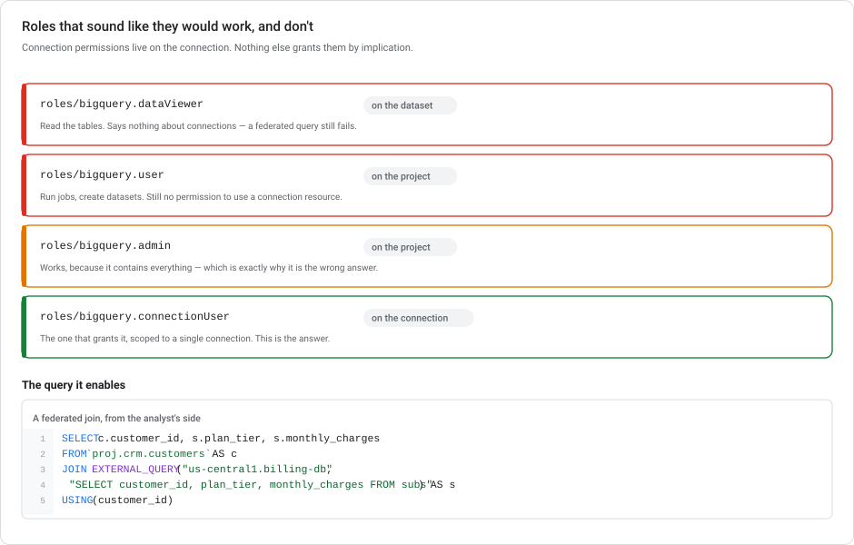

# BigQuery connections and federated data

**How BigQuery reaches things that aren't in BigQuery**: Cloud SQL, Spanner, Cloud Storage, Vertex AI models. Also which IAM role you need to let an analyst use a connection without letting them create one.

> **Module, not a lab.** This is the access-control layer under the labs: every `AI.GENERATE` call in [Lab 1](../../mlops-gcp/labs/lab-01-sentiment-analysis-bigquery-gemini.md) and every `ML.ANNOTATE_IMAGE` in [Lab 4](../../mlops-gcp/labs/lab-04-image-vision-lowcode-bigquery.md) runs through a connection.

---

## ⏱ What changed recently

| When | What |
|---|---|
| **2026** | Connections are how BigQuery reaches Gemini. Every `AI.GENERATE` / `AI.EMBED` / `ML.ANNOTATE_IMAGE` call goes through a **`CLOUD_RESOURCE`** connection whose service account holds `roles/aiplatform.user` — the same mechanism as a Cloud SQL connection, different target service. |
| **22 Apr – 21 May 2026** | The Vertex AI → Gemini Enterprise Agent Platform rebrand did not change connection resources, role names, or `EXTERNAL_QUERY`. |

---

## 1. What a connection is

A **connection** is a first-class BigQuery resource. It has a name, a location, an IAM policy, and its own **service account**. BigQuery creates that service account for you.

That service account is the core of the design. When BigQuery reaches out to Cloud SQL, it does **not** use the caller's identity. It uses the connection's service account.



So a federated query is **two hops with two different grants**:

| Hop | Who | Needs | On what |
|---|---|---|---|
| 1 | The **analyst** | `roles/bigquery.connectionUser` | the **connection** |
| 2 | The **connection's service account** | `roles/cloudsql.client` | the **Cloud SQL project** |

The analyst never gets a database credential and never gets `cloudsql.client`. They get permission to *use a connection*, and the connection has the database access.

### Types of connection

| Type | Reaches | Service account needs |
|---|---|---|
| **Cloud SQL** (MySQL / PostgreSQL) | `EXTERNAL_QUERY()` against a live database | `roles/cloudsql.client` |
| **Cloud Spanner** | `EXTERNAL_QUERY()` against Spanner | `roles/spanner.databaseReader` |
| **Cloud resource** | Vertex AI models, Cloud Storage object tables, remote functions | `roles/aiplatform.user`, `roles/storage.objectViewer` |
| **AWS / Azure** | BigQuery Omni | provider-side role |
| **Spark** | Stored procedures for Apache Spark | varies |

Same shape every time: create the connection, find its auto-generated service account, grant that service account access to the target.

---

## 2. A role that is easy to miss



**Connection permissions live on the connection resource. Nothing else grants them by implication.**

| Role | What it grants | Enables a federated query? |
|---|---|---|
| `roles/bigquery.dataViewer` | Read tables and views in a dataset | **No.** Says nothing about connections. |
| `roles/bigquery.user` | Run jobs, create datasets, list resources | **No.** Still no connection permission. |
| `roles/bigquery.connectionUser` | **Use** existing connections | **Yes** — and cannot create, edit or delete them. |
| `roles/bigquery.connectionAdmin` | Use **and** create/update/delete connections | Yes, and far more than asked for. |
| `roles/bigquery.admin` | Everything in BigQuery | Yes, and *much* more than asked for. |

**"Run queries but not manage connections" is `roles/bigquery.connectionUser`, every time.** `connectionAdmin` is for whoever sets the connection up once — not for the people using it daily.

The analyst also still needs ordinary BigQuery access on the BigQuery side: `roles/bigquery.dataViewer` on the datasets they read, and `roles/bigquery.jobUser` to run jobs at all. Connection access is *additional*, not a replacement.

### Why not just grant the analyst `cloudsql.client`?

It works, and it defeats the design.

The point of a connection is that database access lives in **one managed resource** instead of being spread across people. Grant the analyst `roles/cloudsql.client` and they can reach that instance **from anywhere, by any means** (Cloud SQL Proxy, a local psql, an application they write), with no connection and no BigQuery involved. You wanted to let them run a join. Instead you gave them the database.

Scope also differs: `connectionUser` is granted **on a single connection**. `cloudsql.client` on a project covers every instance in it.

---

## 3. Setting one up

```bash
# 1. Create the connection. It lives in a location, like a dataset.
bq mk --connection \
  --location=us-central1 \
  --project_id=analytics-prod \
  --connection_type=CLOUD_SQL \
  --properties='{"instanceId":"billing-prod:us-central1:billing-db","database":"billing","type":"POSTGRES"}' \
  --connection_credential='{"username":"bq_reader","password":"..."}' \
  billing-db

# 2. Find the service account BigQuery created for it.
bq show --connection --format=prettyjson analytics-prod.us-central1.billing-db
#   -> "serviceAccountId": "bqcx-123456789-ab1c@gcp-sa-bigquery-condel.iam.gserviceaccount.com"

# 3. Grant THAT identity access to Cloud SQL - in the Cloud SQL project.
gcloud projects add-iam-policy-binding billing-prod \
  --member="serviceAccount:bqcx-123456789-ab1c@gcp-sa-bigquery-condel.iam.gserviceaccount.com" \
  --role="roles/cloudsql.client"

# 4. Grant the ANALYST use of the connection - and nothing else.
gcloud beta bigquery connections add-iam-policy-binding billing-db \
  --location=us-central1 --project=analytics-prod \
  --member="user:analyst@example.com" \
  --role="roles/bigquery.connectionUser"
```

Step 4 is a binding **on the connection**, not on the project. That is what makes it least privilege: the analyst can use `billing-db` and no other connection.

> **The database username and password are stored in the connection**, encrypted, and are never visible to people holding `connectionUser`. Create a **read-only** database user for it. The connection is a shared, reusable credential, so everyone using it inherits whatever that user can do. Rotate it like any other secret; see [Git and version control](../../mlops-gcp/modules/GIT-FOR-ML-ON-GCP.md) for why "delete the leaked one" is not rotation.

---

## 4. Using it — `EXTERNAL_QUERY`

```sql
SELECT
  c.customer_id,
  c.signup_date,
  s.plan_tier,
  s.monthly_charges
FROM `analytics-prod.crm.customers` AS c
JOIN EXTERNAL_QUERY(
  "analytics-prod.us-central1.billing-db",
  "SELECT customer_id, plan_tier, monthly_charges FROM subscriptions WHERE active = true"
) AS s
USING (customer_id)
```

Two things to notice:

**The inner query is the *source* dialect, not BigQuery's.** That string is sent to PostgreSQL and executed there. `true` is Postgres syntax; a BigQuery function inside it will fail. This is easy to miss.

**Push filters into the inner query.** Everything the inner query returns crosses the network and is materialised in BigQuery. `WHERE active = true` inside `EXTERNAL_QUERY` transfers a fraction of what `WHERE` applied outside would.

### When the source has a type BigQuery doesn't

Some source types have no BigQuery equivalent, and the query **fails before returning a single row**:

> *"If your external query contains a data type that's unsupported in BigQuery, the query will fail immediately."*

**The unsupported lists are per engine, and shorter than people expect for MySQL:**

| Engine | Unsupported |
|---|---|
| **MySQL** | `GEOMETRY`, `BIT` (the full list) |
| **PostgreSQL** | `money`, `uuid`, `jsonb`, `interval`, `inet`, `cidr`, `macaddr`, `macaddr8`, `time with time zone`, `pg_lsn`, `txid_snapshot`, `tsquery`, `tsvector`, and the geometric types `point`, `line`, `lseg`, `box`, `path`, `polygon`, `circle` |

**The fix goes inside the inner query**, because there is nowhere else it can go:

```sql
-- MySQL: ST_AsText is the documented conversion for GEOMETRY
JOIN EXTERNAL_QUERY(
  "myproject.us-central1.store-db",
  "SELECT store_id, ST_AsText(location) AS location_wkt FROM stores"
) AS s

-- PostgreSQL: cast to text
JOIN EXTERNAL_QUERY(
  "myproject.us-central1.billing-db",
  "SELECT account_id::text AS account_uuid, amount::numeric::text AS amount FROM ledger"
) AS b
```

> **A BigQuery UDF or `SAFE_CAST` on the outside cannot rescue this.** The failure happens while validating `EXTERNAL_QUERY`'s arguments. You get `Invalid table-valued function external_query`, so nothing in your BigQuery query ever runs. The conversion has to happen in the *source* database, in the *source* dialect. This is the [dialect rule](#4-using-it-externalquery) again, in a stronger form.

> **PostgreSQL reports the type as a numeric OID, not a name** — `Postgres type (OID = 790) isn't supported now`. That's `money`. Look the OID up in `pg_type` rather than guessing which column is at fault.

**Two things that don't help, and one that's a different problem:**

- **Piping through Dataflow to a staging table** works, but it is huge overhead for something a `CAST` in the inner query fixes.
- **A UDF after the fact** — see above; there is no "after".
- **`default_type_for_decimal_columns`** is unrelated. It maps **only** MySQL `DECIMAL` / PostgreSQL `numeric` onto `float64`, `numeric`, `bignumeric` or `string`. It exists because *"the BigQuery NUMERIC value range is smaller than in MySQL and PostgreSQL"*. It fixes precision overflow, not type support.

**A few silent mappings to know about**, even when nothing errors:

| Source | Becomes | Watch for |
|---|---|---|
| MySQL `UNSIGNED BIGINT` | `NUMERIC` | not `INT64` |
| MySQL `TIME` | `TIME` | BigQuery's range is `00:00:00`–`23:59:59`; MySQL allows ±838 hours |
| MySQL / PG `TIMESTAMP` | `TIMESTAMP` | *"retrieved as UTC timezone no matter where"* you call from |
| PG `timestamp without time zone` | **`DATETIME`** | with time zone becomes `TIMESTAMP` — different types |
| PG `json` | `STRING` | but **`jsonb` is unsupported entirely** |

### When federated queries are the wrong tool

They read the operational database **live**. That's the feature and the risk.

| Situation | Better option |
|---|---|
| Feature engineering over full history, repeatedly | **Datastream** or scheduled export into BigQuery. Repeated federated scans hammer a production database. |
| The source is a wide table you always join fully | Replicate it. You're paying network for the same rows every run. |
| You need a point-in-time snapshot | Federated queries see *now*. Two runs of the same training query can differ — a reproducibility problem, see [Kubeflow Pipelines §8](../../mlops-gcp/modules/KUBEFLOW-PIPELINES-ON-GCP.md). |
| A dashboard refreshing every minute | You've built a load generator pointed at your billing database. |

**Federated queries are for joining a small, current lookup into analytics** — the plan tier, the current status, the config row. For ML training data, land it in BigQuery first, where it is stable, partitioned, and cheap to re-read.

---

## 5. The same mechanism, for AI

Every AI function in the labs is a connection call:

```sql
-- The connection here is CLOUD_RESOURCE, and its service account
-- holds roles/aiplatform.user rather than roles/cloudsql.client.
SELECT AI.GENERATE(
  ('Classify the sentiment: ', review_text),
  connection_id => 'us.gemini-conn',
  endpoint => 'gemini-2.5-flash',
  output_schema => 'sentiment STRING, confidence FLOAT64'
).sentiment
FROM `myproject.reviews.raw`
```

So the access-control story is identical: an analyst who should be able to *run* `AI.GENERATE` needs `roles/bigquery.connectionUser` on `us.gemini-conn`, and the connection's service account needs `roles/aiplatform.user`. Nobody needs Vertex AI permissions personally.

**And the location has to match.** A connection in `us` serves datasets in `us`. A `us-central1` connection does not work with a `US` multi-region dataset. In practice, most "connection not found" errors are a location mismatch, not a permission problem.

---

## 6. Anti-patterns

**Granting `connectionAdmin` because `connectionUser` "sounds too weak".** It reads as a smaller role than it is. `connectionUser` is exactly the run-queries permission; `connectionAdmin` adds the ability to delete the connection everyone depends on.

**Granting the target-service role to humans.** `cloudsql.client`, `aiplatform.user`, `storage.objectViewer` belong to the **connection's service account**. If a person needs them, they have a use case that isn't federated queries.

**One connection for everything.** A connection is a shared credential and a shared IAM boundary. One per source system, per environment — the same reasoning as per-trigger service accounts in [CI/CD for ML](../../mlops-gcp/modules/CI-CD-FOR-ML-ON-GCP.md).

**A read-write database user in the connection.** Everyone with `connectionUser` inherits it. Read-only, always.

**Federated queries as an ETL pipeline.** Every run is live load on production. That's what Datastream is for.

**Reaching for Dataflow when a source-side `CAST` would do.** An unsupported column type is a one-line fix inside `EXTERNAL_QUERY`, not a reason to build a pipeline.

---

## 7. Test your understanding

<details markdown="1">
<summary><b>1.</b> An analyst must run federated queries against Cloud SQL but must not create or modify connections. Minimum roles?</summary>

**`roles/bigquery.connectionUser` on the connection** for the analyst, and **`roles/cloudsql.client` on the Cloud SQL project** for the connection's auto-created service account.

Two grants, two identities. `bigquery.dataViewer` and `bigquery.user` don't grant connection access at all, and `bigquery.connectionAdmin` adds create/update/delete, which the requirement rules out.
</details>

<details markdown="1">
<summary><b>2.</b> Why not grant the analyst <code>roles/cloudsql.client</code> directly?</summary>

Because it gives them the database, not the query. With `cloudsql.client` they can connect to that instance by any route (proxy, local client, their own code), completely outside BigQuery. The connection exists so that credential stays in one managed resource instead of being handed to people.
</details>

<details markdown="1">
<summary><b>3.</b> Your <code>EXTERNAL_QUERY</code> string uses <code>SAFE_CAST</code> and fails. Why?</summary>

The inner string runs on the **source** database, in the source dialect. `SAFE_CAST` is BigQuery syntax; PostgreSQL does not have it. Write the inner query in Postgres, and do BigQuery-specific work outside `EXTERNAL_QUERY`.
</details>

<details markdown="1">
<summary><b>4.</b> Your training pipeline federates into Cloud SQL every night. What breaks?</summary>

Two things. **Reproducibility**: the source is live. Re-running last week's training query reads today's data, so you cannot reconstruct what the model was trained on. **The production database**: you've pointed a scanning workload at an operational system.

Land it in BigQuery on a schedule (Datastream, or a scheduled export), partitioned by date, and train from that.
</details>

---

## Summary

A BigQuery **connection** is a resource with its own **auto-created service account**, and that service account, not the caller, is what reaches the external system. So access is always **two grants**: `roles/bigquery.connectionUser` to the person, **on the connection**, and the target-service role (`roles/cloudsql.client`, `roles/aiplatform.user`, `roles/storage.objectViewer`) to the **connection's service account**, on the target. `bigquery.dataViewer` and `bigquery.user` grant no connection access at all, and `bigquery.connectionAdmin` grants create/update/delete you probably didn't intend. Inside `EXTERNAL_QUERY`, the inner string is the **source database's dialect** and everything it returns crosses the network, so push filters in. Federated queries also read **live** production data. That suits a small current lookup, but not building training sets, which need to be stable and reproducible.

---

## References

- [Cloud SQL federated queries](https://cloud.google.com/bigquery/docs/cloud-sql-federated-queries)
- [Working with connections](https://cloud.google.com/bigquery/docs/working-with-connections)
- [BigQuery IAM roles and permissions](https://cloud.google.com/bigquery/docs/access-control)
- Related: [CI/CD for ML](../../mlops-gcp/modules/CI-CD-FOR-ML-ON-GCP.md) · [Low-code AI on Google Cloud](../../mlops-gcp/modules/LOW-CODE-AI-ON-GCP.md) · [Lab 1](../../mlops-gcp/labs/lab-01-sentiment-analysis-bigquery-gemini.md)
