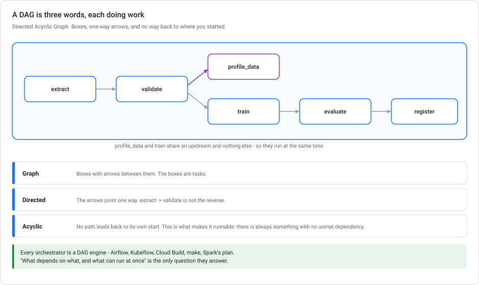
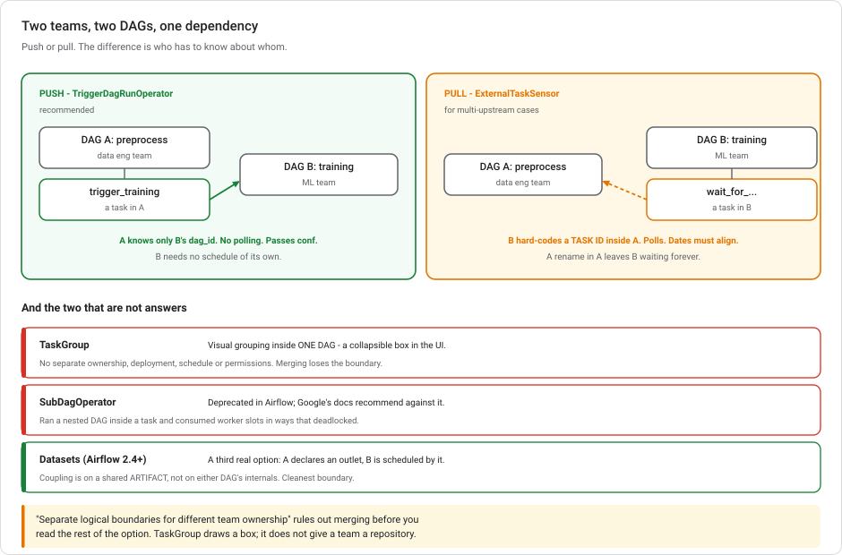

# Cloud Composer, Airflow, and what a DAG is

**Starting from "I have never heard the word DAG"** and ending at cross-DAG dependencies between two teams' pipelines. That is where most Composer questions live.

> **Module, not a lab.** [Kubeflow Pipelines](../../mlops-gcp/modules/KUBEFLOW-PIPELINES-ON-GCP.md) is the ML-native orchestrator; this is the general-purpose one. The comparison in §6 is useful even if you never touch Airflow.

---

## Deprecations and Version Notes

| When | Detail |
|---|---|
| **Ongoing** | **`SubDagOperator` is deprecated** in Airflow and Google's docs recommend against it — performance and deadlock problems. Use `TaskGroup` for visual grouping and `TriggerDagRunOperator` for cross-DAG dependencies. |
| **Composer 3** | The current generation, with more of the Airflow infrastructure managed for you. Composer 1 is end-of-life. |
| **Airflow 2.x** | The TaskFlow API (`@task` decorators) and datasets/data-aware scheduling are the modern authoring styles; the operator patterns below still apply. |

---

## 1. DAG basics

**DAG = Directed Acyclic Graph.** Each of the three words matters:

- **Graph** — a set of boxes (tasks) with arrows between them.
- **Directed** — the arrows have a direction. `extract → transform` is not `transform → extract`.
- **Acyclic** — no cycles. You cannot follow the arrows and end up where you started.

```
extract ──▶ validate ──▶ train ──▶ evaluate ──▶ register
                 │
                 └──────▶ profile_data
```



That's a DAG. Five tasks, and the arrows say **what must finish before what starts**. `train` waits for `validate`. `profile_data` also waits for `validate`. Nothing connects it to `train`, so the two run **in parallel**.

**Why "acyclic" matters:** a cycle would mean task A waits for B which waits for A. Nothing could ever start. Forbidding cycles is what makes the graph *executable*. You can always find a task with no unmet dependencies to run next.

**Why this is the universal shape for pipelines:** every orchestrator is a DAG engine. Airflow DAGs, Kubeflow pipelines, Cloud Build steps, `make` targets, Spark's execution plan — all the same idea. Once you see it, "what depends on what, and what can run at the same time" is the only question an orchestrator answers.

> **A DAG is not a schedule and not a loop.** The graph says *ordering*. When it runs is a separate setting. And "run this for each of 50 files" is not a cycle. It is 50 parallel branches, which is still acyclic.

---

## 2. Airflow's vocabulary

**Apache Airflow** is the most widely used DAG orchestrator. You write DAGs in Python; Airflow schedules and runs them.

| Term | Description |
|---|---|
| **DAG** | The whole workflow. One Python file, usually one DAG. |
| **Task** | One node. A thing that runs. |
| **Operator** | The *template* a task is built from — `BashOperator`, `PythonOperator`, `BigQueryInsertJobOperator`. A task is an instantiated operator. |
| **Sensor** | An operator that **waits**, by polling, until a condition is true. |
| **DAG run** | One execution of the whole DAG, for one logical date. |
| **Task instance** | One task, in one DAG run. |
| **Execution date** / **logical date** | The *data interval* a run represents — not the wall-clock time it started. |
| **Scheduler** | The process deciding what to run next. |
| **XCom** | "Cross-communication" — small values passed between tasks. |

```python
from airflow import DAG
from airflow.operators.bash import BashOperator
import pendulum

with DAG(
    dag_id="preprocess_training_data",
    schedule="0 2 * * *",
    start_date=pendulum.datetime(2026, 8, 1, tz="Asia/Jakarta"),
    catchup=False,
) as dag:
    extract = BashOperator(task_id="extract", bash_command="...")
    validate = BashOperator(task_id="validate", bash_command="...")

    extract >> validate          # the arrow. extract must finish first.
```

The `>>` operator *is* the arrow. That one line declares the whole dependency.

> **`execution_date` is easy to misread.** A daily DAG scheduled at 02:00 with logical date **2026-08-24** *starts* at 02:00 on **2026-08-25**. It processes the interval that just ended. The date names the data, not the clock. This matters in §4.

**Cloud Composer** is Google's managed Airflow: they run the scheduler, the database, the workers, and the web UI. You put DAG files in a Cloud Storage bucket and Composer picks them up.

---

## 3. One DAG or two?

Real scenario: a **preprocessing** DAG owned by the data engineering team, and a **training** DAG owned by the ML team. Training must run after preprocessing succeeds.

The tempting move is to merge them into one DAG and use a `TaskGroup` for tidiness. **`TaskGroup` is visual grouping only** — it draws a collapsible box in the UI. It gives you no separate ownership, no separate deployment, no separate schedule, no separate permissions. One file, one team's repository, one deployment. If the requirement says "separate logical boundaries for different team ownership", merging contradicts it directly.

So: two DAGs, and a cross-DAG dependency.

---

## 4. Cross-DAG dependencies

There are two real mechanisms. Choosing between them is the main question.



### `TriggerDagRunOperator` — push

The last task of DAG A **triggers** DAG B.

```python
from airflow.operators.trigger_dagrun import TriggerDagRunOperator

trigger_training = TriggerDagRunOperator(
    task_id="trigger_model_training",
    trigger_dag_id="model_training",
    conf={"data_path": "gs://bucket/validated/{{ ds }}"},   # pass config through
    wait_for_completion=False,
)

validate >> trigger_training      # runs only if validate succeeded
```

The dependency is explicit, a visible task in DAG A. There's no polling, so waiting costs nothing, and `conf` passes configuration straight to the triggered DAG — the output path, the partition date. Because it's a downstream task, upstream failure simply means it never runs. And B needs no schedule of its own; it's triggered, not scheduled.

### `ExternalTaskSensor` — pull

A task at the *start* of DAG B **polls** until a named task in DAG A succeeds.

```python
from airflow.sensors.external_task import ExternalTaskSensor

wait_for_preprocessing = ExternalTaskSensor(
    task_id="wait_for_preprocessing",
    external_dag_id="preprocess_training_data",
    external_task_id="validate",
    execution_delta=timedelta(hours=0),    # must line up the logical dates
    mode="reschedule",
)
```

It requires matching logical dates: the sensor looks for a run of A at a *specific* logical date derived from B's, and different schedules mean fiddling with `execution_delta` or `execution_date_fn` — getting that subtly wrong is a classic Airflow bug. It also polls. In `poke` mode it occupies a worker slot the entire time; `reschedule` mode is better but still repeated scheduler work. Worst of all, it inverts ownership: DAG B now hard-codes a **task id inside DAG A**, so the other team can rename a task and leave your DAG silently waiting forever.

### Choosing

| | `TriggerDagRunOperator` | `ExternalTaskSensor` |
|---|---|---|
| Direction | A pushes B | B pulls from A |
| Coupling | A knows B's **dag_id** | B knows A's **dag_id and task_id** |
| Schedules | Independent | Must align |
| Cost of waiting | none | polling |
| Passes parameters | yes, via `conf` | no |
| Fails how | B never runs | B waits, then times out |

**For "one DAG must run after another completes successfully, with clear team boundaries", `TriggerDagRunOperator` is the recommended pattern.** It's explicit, it doesn't poll, it doesn't couple to another team's internal task names, and it carries configuration forward.

`ExternalTaskSensor` earns its place when **B has several upstreams** and it's cleaner for B to declare what it needs than for four teams to each remember to trigger it. It also fits when you cannot modify A.

> **`SubDagOperator` is not a third option.** It's deprecated: it ran a nested DAG inside a task, consuming worker slots in ways that deadlocked real deployments. Google's docs recommend `TaskGroup` or `TriggerDagRunOperator` instead. Wherever you find it suggested, that suggestion predates the deprecation.

### A third mechanism: Datasets

Airflow 2.4+ added **data-aware scheduling**. DAG A declares it *produces* a dataset; DAG B declares it is *scheduled by* that dataset. Airflow runs B when A updates it — no trigger task, no sensor, no shared task ids.

```python
data = Dataset("gs://bucket/validated/")
# In A:  validate = PythonOperator(..., outlets=[data])
# In B:  with DAG("model_training", schedule=[data]): ...
```

The coupling is now on a **shared artifact** rather than on either DAG's internals. That is the cleanest boundary of the three. If you describe the requirement as *"DAG B depends on an artifact, not on DAG A finishing"*, that phrasing points straight at datasets.

---

## 4a. Sharing one environment between teams

Composer runs continuously and costs real money (§5), so several teams usually share one environment. Then one team's retraining DAG saturates the workers and everyone else's time-sensitive pipeline queues behind it.

The fix is **Airflow pools**. They are the only concurrency control scoped to *an arbitrary set of tasks* rather than to a DAG or to the whole environment.

### The four concurrency limits, and what each is scoped to

| Setting | Scope | Limits |
|---|---|---|
| **`[core] parallelism`** | **the whole environment** | Total task instances running at once, across every DAG |
| **`max_active_runs_per_dag`** | one DAG | How many *runs* of it can be in flight |
| **`max_active_tasks_per_dag`** | one DAG | How many of *its* tasks run at once |
| **Pools** | **any set of tasks you choose** | Slots available to tasks assigned to that pool |

Only the last one can express *"team A gets at most this much of the environment"*. A team is not a DAG. It is several DAGs, and it is not the whole environment either.

### Pools

A pool is a named bucket of **slots**. Create one per team, give it a slot count, and have each team tag their tasks with it:

```python
train = PythonOperator(
    task_id="train_model",
    python_callable=train,
    pool="team_ml_platform",     # which bucket
    pool_slots=2,                # how many slots this task occupies
)
```

A task only starts when its pool has a free slot; otherwise it waits. So a team that queues forty tasks against a twelve-slot pool delays **itself**, and nobody else. That is the governance property. The blast radius of one team's bad day is their own pool.

Pools are managed in the Airflow UI under **Admin → Pools**, or via the CLI, so allocation stays an environment-owner decision while DAG authoring stays with the teams. Tasks that name no pool land in `default_pool`.

> **`priority_weight` orders the queue *within* a pool**, not across pools. It decides who goes first when a team's own tasks compete for their own slots. It cannot let one team jump another's allocation. That is the behaviour you want.

### Limits of the other three settings

**Lowering `[core] parallelism`** shrinks the environment for everyone. The well-behaved teams get slower alongside the greedy one, and the ratio between them doesn't change at all. You have made the shared resource smaller without dividing it.

**`max_active_tasks_per_dag`** caps concurrency *within a single DAG*. A team with six DAGs at ten tasks each still fields sixty concurrent tasks while respecting every per-DAG limit. It is a useful setting, but it is not a per-team boundary.

**Deferrable operators** (`deferrable=True`) are useful here, but they solve a different problem. A task that submits a Vertex training job and waits normally occupies a worker slot for the whole wait, doing nothing. Deferring hands it to the triggerer and frees the slot until the job finishes. That reduces *waste* and raises everyone's effective capacity. But it sets no ceiling: a team can still take more than their share, just more efficiently. Use them **and** pools.

> **The principle generalises.** Heavy computation shouldn't run on Airflow workers at all. Submit it to Vertex and let the task wait (deferrably). Pools then govern the orchestration slots, which is all they are meant to govern.

---

## 5. Composer cost model

**Composer runs continuously.** The scheduler, the web server, and the Airflow metadata database are always up, whether or not any DAG is running. That's a standing bill measured in **hundreds of dollars a month** for a small environment, before any of your tasks execute.

That single fact decides most "should I use Composer" questions:

| You have | Use |
|---|---|
| One daily SQL statement | A [BigQuery scheduled query](../../mlops-gcp/labs/lab-03-serving-ml-models-lowcode.md) — free |
| A few steps, no existing Airflow | Cloud Workflows, or Cloud Scheduler → Cloud Run |
| An ML DAG with caching and lineage | [Vertex AI Pipelines](../../mlops-gcp/modules/KUBEFLOW-PIPELINES-ON-GCP.md) — ~$0.03/run, nothing between runs |
| A broad data platform: 200 DAGs across warehouses, SaaS APIs, ML | **Cloud Composer** |

---

## 6. Composer vs Vertex AI Pipelines

Both run DAGs. They serve different scopes rather than competing.

| | **Cloud Composer (Airflow)** | **Vertex AI Pipelines (KFP)** |
|---|---|---|
| Built for | General data orchestration | ML workflows specifically |
| Unit of work | A task, running on a shared worker | A **container**, running on its own machine |
| Idle cost | **Continuous** | **Zero** |
| Caching | No | **Yes** — unchanged steps are skipped |
| ML lineage | No | **Yes** — [ML Metadata](../../mlops-gcp/modules/VERTEX-ML-METADATA.md) automatically |
| Ecosystem | Hundreds of provider operators | ML components |
| Per-step hardware | Awkward | Native — GPUs per step |

**They compose.** A very common production shape is Airflow owning the broad schedule and data movement, with one task that submits a Vertex AI Pipeline and waits. Airflow handles the enterprise plumbing, Vertex handles the ML DAG.

> **If you already run Airflow, use it.** If you don't, ML alone is a weak reason to adopt it — Vertex AI Pipelines gives you caching, lineage and per-step hardware with no standing cost.

---

## 7. Common Orchestration Mistakes

**Merging two teams' DAGs to avoid a cross-DAG dependency.** You've traded a clean boundary for a shared file and a shared deploy. `TaskGroup` doesn't restore the boundary; it only draws a box.

**`ExternalTaskSensor` in `poke` mode for a long wait.** It holds a worker slot the entire time. Use `reschedule`, or use `TriggerDagRunOperator`.

**Reaching for `SubDagOperator`.** Deprecated, and it caused real deadlocks.

**Assuming `execution_date` is "now".** It's the data interval. Building `CURRENT_DATE()` into a task instead of using `{{ ds }}` makes backfills wrong and reruns non-reproducible — the same reproducibility point as [KFP §8](../../mlops-gcp/modules/KUBEFLOW-PIPELINES-ON-GCP.md).

**Adopting Composer for one ML pipeline.** You've taken on a permanent bill and an Airflow upgrade treadmill to run something Vertex AI Pipelines would run for cents.

**Heavy computation inside an Airflow task.** Airflow workers are for *orchestration*. Training a model in a `PythonOperator` puts your job on a shared worker with no GPU. Submit it to Vertex and let the task wait — deferrably, so it isn't holding a slot while it does.

**Throttling the whole environment to contain one team.** Lowering `[core] parallelism` slows everyone equally and changes nobody's share. Pools (§4a) are the per-team boundary.

---

## 8. DAG Design Scenarios

<details markdown="1">
<summary><b>1.</b> Preprocessing DAG and training DAG, different teams, training must follow preprocessing. Most maintainable pattern?</summary>

**`TriggerDagRunOperator` as the final task of the preprocessing DAG.**

Explicit, no polling, passes configuration via `conf`, and the coupling is only on the downstream dag_id. `ExternalTaskSensor` would need matching logical dates and would hard-code a task id from the other team's DAG. Merging contradicts the separate-ownership requirement — `TaskGroup` is visual grouping only. `SubDagOperator` is deprecated.
</details>

<details markdown="1">
<summary><b>2.</b> What does the "acyclic" in DAG buy you?</summary>

Executability. A cycle means two tasks each waiting on the other, so nothing can start. Forbidding cycles guarantees there is always some task with all dependencies met. That is what makes the graph runnable.
</details>

<details markdown="1">
<summary><b>3.</b> When is <code>ExternalTaskSensor</code> the better choice?</summary>

When B has **several** upstream DAGs and it's cleaner for B to declare its own needs than for every producer to remember to trigger it. It also fits when you can't modify the upstream DAG. Consider Airflow **Datasets** first if you're on 2.4+: it gives the same pull-style dependency without hard-coding another DAG's task ids.
</details>

<details markdown="1">
<summary><b>4.</b> You have one ML retraining pipeline. Composer or Vertex AI Pipelines?</summary>

**Vertex AI Pipelines.** Composer's scheduler, web server and database run continuously — hundreds of dollars a month before your DAG does anything. Vertex AI Pipelines costs about $0.03 per run and nothing in between, and adds caching and lineage. Composer earns its keep at data-platform scale, not for one pipeline.
</details>

---

## DAGs and Cross-Team Coordination, Recapped

A **DAG** is tasks with directed arrows and no cycles. The arrows say what must finish before what starts, unconnected tasks run in parallel, and forbidding cycles is what makes the graph executable. Every orchestrator is a DAG engine. In **Airflow**, tasks are instantiated **operators**, `>>` is the arrow, and **`execution_date` names the data interval rather than the wall clock**. For a dependency between two teams' DAGs, **`TriggerDagRunOperator`** is the recommended pattern: explicit, no polling, passes config via `conf`, and couples only on the downstream `dag_id`. **`ExternalTaskSensor`** pulls instead. It needs aligned logical dates and hard-codes another DAG's task id, so it fits multi-upstream cases. **Airflow Datasets** do the same job coupled on a shared artifact instead. **`SubDagOperator` is deprecated** and **`TaskGroup` is visual grouping only**, so neither solves cross-DAG ownership. **Composer runs continuously**. This is why one ML pipeline belongs on Vertex AI Pipelines, while Composer earns its cost at data-platform scale.

---

## Further Reading on Airflow

- [Cloud Composer documentation](https://cloud.google.com/composer/docs)
- [Writing DAGs in Cloud Composer](https://cloud.google.com/composer/docs/how-to/using/writing-dags)
- [Group tasks inside DAGs](https://cloud.google.com/composer/docs/composer-2/group-tasks-inside-dags)
- [Airflow: cross-DAG dependencies](https://airflow.apache.org/docs/apache-airflow/stable/howto/operator/trigger_dagrun.html)
- Related: [Kubeflow Pipelines](../../mlops-gcp/modules/KUBEFLOW-PIPELINES-ON-GCP.md) · [Event-driven ML automation](../../mlops-gcp/modules/EVENT-DRIVEN-ML-AUTOMATION.md) · [CI/CD for ML](../../mlops-gcp/modules/CI-CD-FOR-ML-ON-GCP.md)
