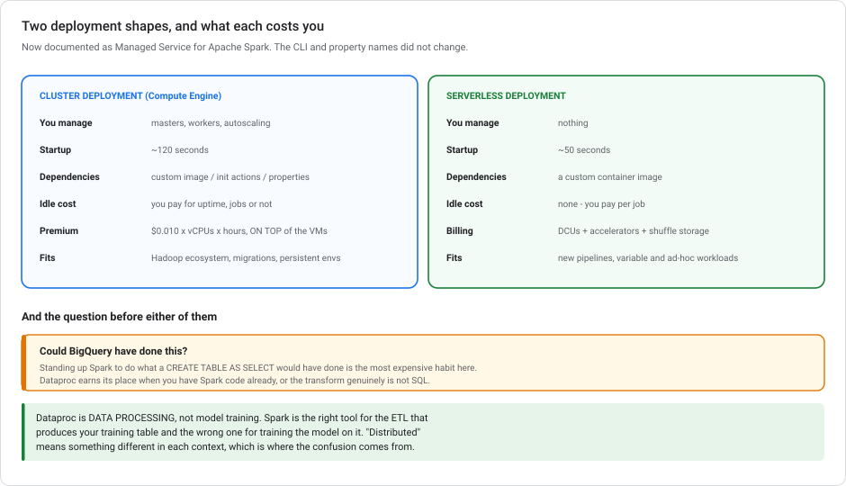
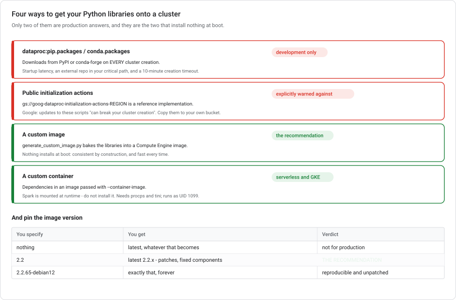

# Dataproc for ML data preparation

**Managed Spark for the ETL that feeds training**, plus the production question that comes up most: how do you get consistent, fast-starting clusters with your own Python dependencies?

> **Module, not a lab.** Dataproc is **data processing, not model training** — see [Where model training actually runs](../../mlops-gcp/modules/VERTEX-TRAINING-COMPUTE.md). Spark is the right tool for the transformation that produces your training table and the wrong one for training the model on it.

---

## What changed recently

| When | What |
|---|---|
| **2026** | Dataproc is now documented as **Managed Service for Apache Spark (formerly Dataproc)**. The `gcloud dataproc` CLI, the `dataproc:` property prefix and the URLs are unchanged — only the prose moved. "Dataproc on Compute Engine" is now **cluster deployment**; "Dataproc Serverless" is now **serverless deployment**. |
| **Ongoing** | Serverless is positioned for *"new pipelines… when building new data pipelines or applications on Spark"*. Clusters keep their place for Hadoop-ecosystem migrations and persistent environments. |
| **Watch out** | A **60-day** custom-image expiry appears in old forks of the image-builder repo. The current documented figure is **365 days**. |

---

## 1. When Dataproc is the answer

| You have | Use |
|---|---|
| SQL-shaped transformation over data already in BigQuery | **BigQuery**. Don't move it. |
| A Python transform on a few GB | A Vertex AI custom job, or a pipeline component |
| Existing Spark/Hadoop code, or real distributed processing | **Dataproc** |
| Streaming with complex windowing | Dataflow (Beam) |

**The BigQuery-first bias is deliberate.** Standing up a Spark cluster to do what a `CREATE TABLE AS SELECT` would have done is the most common way to spend money here. Dataproc earns its place when you have Spark code already, when the transformation cannot be expressed in SQL, or when you're migrating an on-premises Hadoop estate.

---

## 2. Two deployment shapes



| | **Cluster deployment** (Compute Engine) | **Serverless deployment** |
|---|---|---|
| You manage | A cluster: masters, workers, autoscaling | Nothing |
| Startup | **~120 seconds** | **~50 seconds** |
| Dependencies via | **custom images**, init actions, cluster properties | **a custom container image** |
| Idle cost | **you pay for uptime, including idle** | none — you pay per job |
| Billing | `$0.010 × vCPUs × hours` premium **on top of** the VMs, disk and network, per second with a 1-minute minimum | DCUs + accelerators + shuffle storage, per second with a 1-minute minimum |
| Committed use discounts | Compute Engine CUDs | **BigQuery** spend-based CUDs |
| Fits | Hadoop-ecosystem tooling, persistent environments, migrations | New pipelines, variable workloads, ad-hoc analysis |

**If you're building something new and it's batch Spark, look at serverless first.** No cluster to size, no idle bill, half the startup time. The cluster path earns its complexity when you need the wider Hadoop ecosystem, a long-lived environment, or customisation serverless doesn't reach.

---

## 3. Dependencies on a cluster — four options, one recommendation

This is the real production question: *"we have specific Python libraries and we want consistent, fast-starting clusters."*



### Cluster properties — installs at boot

```bash
gcloud dataproc clusters create my-cluster \
  --properties=^#^dataproc:conda.packages=pytorch==1.7.1,coverage==5.5#dataproc:pip.packages=tokenizers==0.10.1
```

`dataproc:conda.packages` and `dataproc:pip.packages` take `pkg1==v1,pkg2==v2` lists. (The `^#^` prefix is gcloud's alternate-delimiter syntax — needed because the values themselves contain commas. `dataproc:conda.env.config.uri` points at a YAML file instead, and **cannot be combined** with the other two.)

It works, but it downloads from PyPI or conda-forge **on every cluster creation**. That means:

- Every cluster start pays the install time. The documented consequence: *"Cluster creation can time out depending on the time required to install the new packages… The timeout is set at 10 minutes."*
- Cluster creation now depends on an external repository being reachable.

Fine for development. Not a production dependency strategy.

### Public initialization actions — someone else's script

Initialization actions are *"executables or scripts that [Dataproc] will run on all nodes in your cluster immediately after the cluster is set up"*, passed with `--initialization-actions`.

Google's warning about the public bucket is direct:

> *"Don't create production clusters that reference initialization actions located in the `gs://goog-dataproc-initialization-actions-REGION` public buckets. These scripts are provided as reference implementations. They are synchronized with ongoing GitHub repository changes, and updates to these scripts can break your cluster creation."*

Your cluster creation depends on a script someone else can change. **If you use one, copy it into your own versioned bucket** and reference your copy. That is the documented fix. It is the same reasoning as pinning a container tag rather than tracking `:latest`.

### A custom image — bake it in

Build a Compute Engine image with your dependencies **already installed**, then create clusters from it. Nothing downloads at boot, so startup is fast and identical every time.

```bash
git clone https://github.com/GoogleCloudDataproc/custom-images
cd custom-images

python3 generate_custom_image.py \
    --image-name=ml-preprocessing-v3 \
    --dataproc-version=2.2.65-debian12 \
    --customization-script=./install-deps.sh \
    --zone=us-central1-a \
    --gcs-bucket=gs://my-image-build-logs
```

The tool boots a temporary VM from the Dataproc base image, runs your customization script on it, and captures the disk as an image. Then:

```bash
gcloud dataproc clusters create prod-preprocessing \
  --image=projects/PROJECT/global/images/ml-preprocessing-v3 \
  --region=us-central1
```

**This is the recommended production approach**, and it answers both halves of the requirement at once: consistency (the image is a fixed artifact) and fast startup (nothing to install).

> **Custom images expire after 365 days — for *cluster creation*.** Existing clusters *"can run indefinitely"*; what stops working is making new ones. There's no renewal API, so the documented answer is automation: rebuild the image on a schedule. (An expired image returns an error carrying a token you can pass back via `dataproc:dataproc.custom.image.expiration.token`. Treat that as break-glass, not a plan.)

### A custom container — for serverless and GKE

On **serverless**, dependencies live in a container image:

```bash
gcloud dataproc batches submit pyspark preprocess.py \
  --container-image=us-central1-docker.pkg.dev/PROJECT/spark/ml-prep:1.4
```

Three things to know when building it: **Spark is mounted at runtime**, so don't install it; you must include the `procps` and `tini` packages; and the container runs as the `spark` user with **UID/GID 1099**, so file permissions must accommodate that.

On **Dataproc on GKE**, the same idea via `spark.kubernetes.container.image` (prefixed `spark:` at cluster creation, unprefixed at job submission), with the image derived from a published Dataproc-on-GKE base. Spark itself cannot be customised there — change it and the image is rejected.

---

## 4. Pin the image version

Image versions read `major.minor.sub-minor-os` — `2.2.65-debian12`. The recommendation is explicit:

> *"For production environments, associate your cluster with a specific `major.minor` image version."*

```bash
gcloud dataproc clusters create prod-preprocessing --image-version=2.2
```

**Not** the full `2.2.65-debian12`, and **not** the default. `2.2` resolves to the newest `2.2.x` at creation time, so you get security patches while Spark and Hadoop versions stay fixed. Pinning the full version freezes you out of patches; taking the default lets a major version change under you.

| You specify | You get | Verdict |
|---|---|---|
| nothing | latest, whatever that becomes | Not for production |
| `2.2` | latest `2.2.x` — patches, fixed components | **Recommended** |
| `2.2.65-debian12` | exactly that, forever | Reproducible, but unpatched |

When building a custom image, build it **from the latest sub-minor in your target minor track**, and rebuild on the latest sub-minor when you refresh. Minor versions are supported for **24 months** after GA.

---

## 5. Reproducibility beyond the image

Two more pieces make a cluster environment repeatable:

**Workflow templates.** A reusable definition of *a graph of jobs plus the cluster to run them on*. In **managed cluster** mode it *"will create an 'ephemeral' cluster to run workflow jobs, and then delete the cluster when the workflow is finished"*. So the cluster configuration is version-controlled with the workflow, every run gets an identical cluster, and nothing is left running afterwards. Templates take parameters, so one definition serves many runs.

**Dataproc Metastore.** A managed Hive metastore that outlives any cluster. It decouples **table definitions** from cluster lifetime: destroy and recreate clusters, or move to serverless entirely, without losing schemas. Multiple engines also share one source of truth.

Together with a pinned image, that's the full reproducible-cluster stack:

> **pinned `major.minor` → custom image built from the latest sub-minor → workflow template with a managed cluster → external Metastore.**

---

## 6. Cost

**Cluster deployment** bills a Dataproc premium *on top of* everything else you're already paying:

```
$0.010 × number of vCPUs × hours
```

24 vCPUs for two hours is `24 × 2 × $0.01 = $0.48` — **the premium alone**. The Compute Engine VMs, Persistent Disk, Cloud Storage and network egress are all billed separately. Per-second billing, one-minute minimum.

**The number that matters is idle time.** You pay for cluster uptime whether jobs are running or not. An ephemeral cluster per workflow (§5) usually beats a long-lived one that sits idle between nightly runs.

**Serverless** bills Data Compute Units, accelerators and shuffle storage, per second with a one-minute minimum, and **nothing between jobs**. Rates are region-dependent — check the pricing page rather than trusting a number in a document.

---

## 7. Anti-patterns

**Using Dataproc for deep learning.** Spark is distributed *data processing*. "Distributed" means something different in each context — see [Where training runs](../../mlops-gcp/modules/VERTEX-TRAINING-COMPUTE.md).

**Standing up a cluster for work BigQuery would have done.** The most expensive habit in this module.

**Referencing public initialization actions in production.** Google says not to, in those words. Copy them to your own versioned bucket.

**Installing dependencies at cluster creation.** Slow, and it fails when an external repository has a bad day. Bake them into an image — the same argument as [custom training containers](../../mlops-gcp/modules/VERTEX-TRAINING-COMPUTE.md#4a-containers-prebuilt-or-your-own).

**Not pinning an image version.** "It worked last month" isn't a configuration.

**A long-lived cluster for nightly batch.** You're renting 24 hours of machines to do 40 minutes of work — the same shape as the endpoint-versus-batch mistake in [batch prediction](../../mlops-gcp/modules/VERTEX-BATCH-PREDICTION.md).

**Assuming your custom image lasts forever.** 365 days, for creating clusters. Automate the rebuild.

---

## 8. Test your understanding

<details markdown="1">
<summary><b>1.</b> Production Dataproc clusters, specific Python libraries, consistent config, minimal creation time. What do you do?</summary>

**Build a custom image with `generate_custom_image.py` with the libraries pre-installed, specify a `major.minor` image version, and create production clusters from that image.**

Both requirements come from the same decision: dependencies baked into the image mean nothing downloads at boot (fast, consistent), and a `major.minor` pin means patches without component drift.

`dataproc:pip.packages` installs at creation time — latency plus a dependency on PyPI being up, with a 10-minute cluster-creation timeout. Public initialization actions are explicitly warned against for production. Dataproc on GKE is a bigger architectural change than the problem asks for.
</details>

<details markdown="1">
<summary><b>2.</b> Why <code>2.2</code> and not <code>2.2.65-debian12</code>?</summary>

`2.2` resolves to the latest `2.2.x` at creation time, so you inherit security patches while Spark and Hadoop stay at fixed versions. The full pin is reproducible *and* frozen — you stop getting fixes and have to bump manually. Google's recommendation is the `major.minor` form.
</details>

<details markdown="1">
<summary><b>3.</b> Your custom image is 400 days old and cluster creation fails. What now?</summary>

Custom images expire at **365 days for cluster creation**. Clusters already running are unaffected and can run indefinitely. Only the creation of new clusters stops.

Rebuild the image (ideally on a scheduled job, since there's no renewal API). There's an expiration-token escape hatch for one-off situations, but support isn't guaranteed for clusters created that way.
</details>

<details markdown="1">
<summary><b>4.</b> New batch Spark pipeline, no existing Hadoop estate. Cluster or serverless?</summary>

**Serverless.** No cluster to provision or size, no idle cost, and roughly 50-second startup against 120. Dependencies go in a container image passed with `--container-image` — remember Spark is mounted at runtime, and the image needs `procps` and `tini`.

Clusters earn their complexity for Hadoop-ecosystem tooling, persistent environments, and migrations off-premises.
</details>

---

## Summary

Dataproc is **managed Spark for the ETL that feeds training**, not for training. It is now documented as *Managed Service for Apache Spark*. For production dependency management the answer is **a custom image built with `generate_custom_image.py`**, because baking libraries in gives you consistency and fast startup in one move; `dataproc:pip.packages`/`conda.packages` install at boot (latency, external-repo dependency, a 10-minute creation timeout), and Google explicitly warns against referencing **public initialization actions** in production because those scripts change underneath you. Copy them to your own versioned bucket. Pin **`major.minor`** so you get patches without component drift, build custom images from the latest sub-minor in that track, and remember images expire at **365 days for cluster creation** while existing clusters run indefinitely. Add **workflow templates with managed ephemeral clusters** and an external **Metastore** for full reproducibility. On the serverless deployment, dependencies live in a **container image** instead. Spark is mounted at runtime, `procps` and `tini` are required, and it starts in about 50 seconds against a cluster's 120, with no idle bill at all.

---

## References

- [Create a custom image](https://cloud.google.com/dataproc/docs/guides/dataproc-images) · [GoogleCloudDataproc/custom-images](https://github.com/GoogleCloudDataproc/custom-images)
- [Cluster image versions](https://cloud.google.com/dataproc/docs/concepts/versioning/overview)
- [Best practices for production](https://cloud.google.com/dataproc/docs/guides/dataproc-best-practices)
- [Initialization actions](https://cloud.google.com/dataproc/docs/concepts/configuring-clusters/init-actions)
- [Configure the Python environment](https://cloud.google.com/dataproc/docs/tutorials/python-configuration)
- [Compare serverless and cluster deployments](https://cloud.google.com/dataproc/docs/concepts/serverless-spark-compare) · [Custom containers for serverless](https://cloud.google.com/dataproc-serverless/docs/guides/custom-containers)
- [Workflow templates](https://cloud.google.com/dataproc/docs/concepts/workflows/overview) · [Dataproc Metastore](https://cloud.google.com/dataproc-metastore/docs/overview)
- Related: [Where model training actually runs](../../mlops-gcp/modules/VERTEX-TRAINING-COMPUTE.md) · [Cloud Composer and DAGs](CLOUD-COMPOSER-AND-DAGS.md) · [CI/CD for ML](../../mlops-gcp/modules/CI-CD-FOR-ML-ON-GCP.md)
