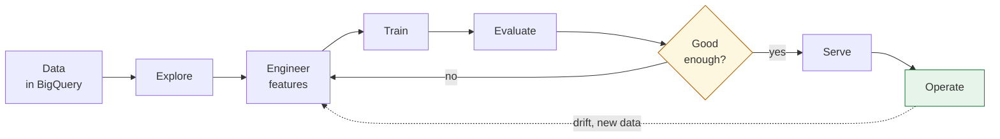
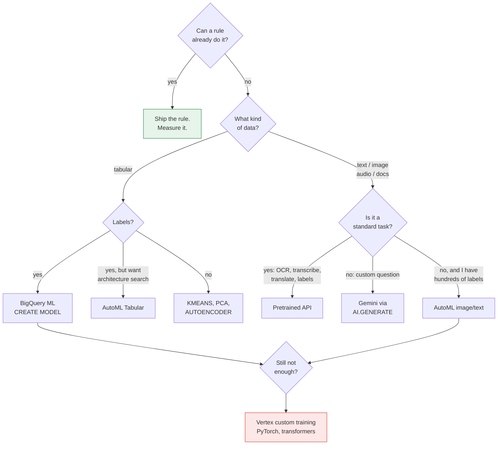
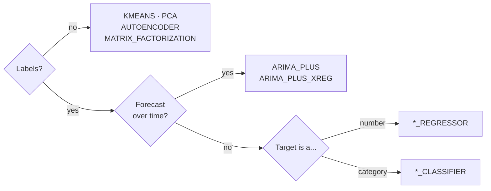
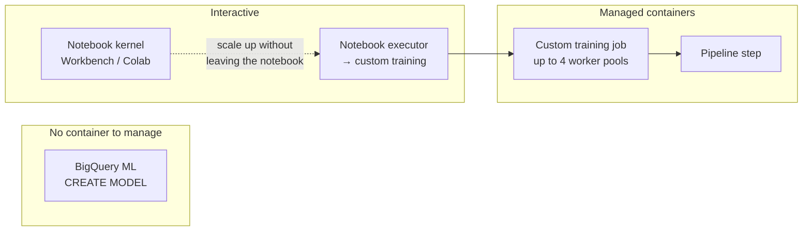
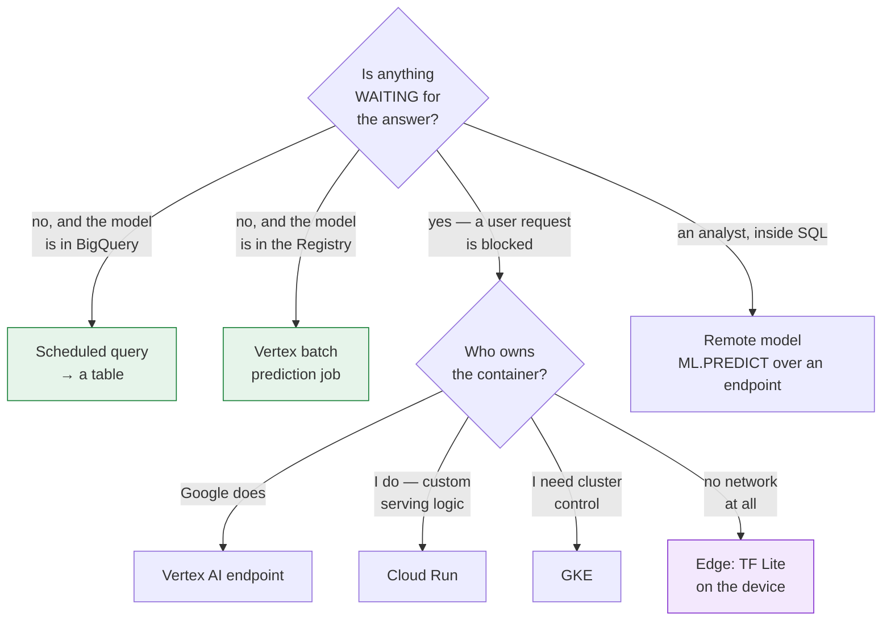
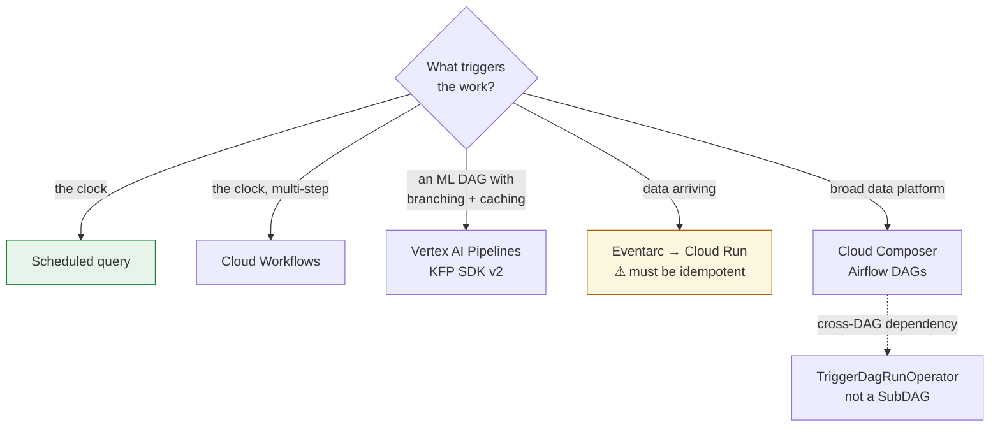
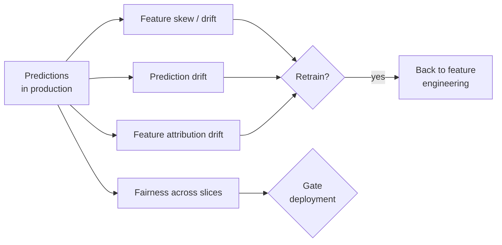
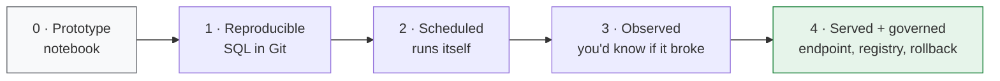

# The big picture — how it all connects

> Every stage of an ML system on Google Cloud has **several valid answers**. This page maps the choices, the questions that decide between them, and which document covers each.
>
> Diagrams render on GitHub.

---

## 1. The lifecycle, and where each document sits

| Stage | Hands-on | Theory |
|---|---|---|
| **Explore** | [Lab 6](labs/lab-06-data-exploration-bigquery-colab.md) | — |
| **Engineer features** | [Lab 5](labs/lab-05-feature-engineering-tabular.md) | [Dataproc](../data-eng-gcp/modules/DATAPROC-AND-SPARK.md) · [BigQuery data validation](modules/BIGQUERY-DATA-VALIDATION.md) |
| **Train** | [Lab 2](labs/lab-02-customer-churn-lowcode-bqml.md) · [Lab 1](labs/lab-01-sentiment-analysis-bigquery-gemini.md) · [Lab 4](labs/lab-04-image-vision-lowcode-bigquery.md) | [Low-code AI](modules/LOW-CODE-AI-ON-GCP.md) · [Where training runs](modules/VERTEX-TRAINING-COMPUTE.md) · [GPUs and TPUs](modules/GPUS-AND-TPUS-FOR-ML.md) · [Gemini tuning](modules/GEMINI-TUNING-ON-VERTEX.md) |
| **Evaluate** | [Lab 2](labs/lab-02-customer-churn-lowcode-bqml.md) | [Fairness & bias](modules/VERTEX-FAIRNESS-AND-BIAS.md) · [Explainability](modules/EXPLAINABILITY-AND-ATTRIBUTION.md) |
| **Serve** | [Lab 3](labs/lab-03-serving-ml-models-lowcode.md) | [Cloud Run](modules/SERVING-MODELS-ON-CLOUD-RUN.md) · [Autoscaling](modules/VERTEX-AUTOSCALING.md) · [LLMs on GKE](modules/SERVING-LLMS-ON-GKE.md) · [Batch prediction](modules/VERTEX-BATCH-PREDICTION.md) · [Networking](modules/GCP-NETWORKING-FOR-ML-SERVING.md) · [Private networking](modules/GCP-PRIVATE-NETWORKING-FOR-ML.md) |
| **Operate** | — | [Monitoring](modules/VERTEX-MODEL-MONITORING.md) · [BigQuery data validation](modules/BIGQUERY-DATA-VALIDATION.md) · [ML Metadata](modules/VERTEX-ML-METADATA.md) |
| **Orchestrate** (spans all) | — | [Kubeflow Pipelines](modules/KUBEFLOW-PIPELINES-ON-GCP.md) · [Event-driven](modules/EVENT-DRIVEN-ML-AUTOMATION.md) · [CI/CD](modules/CI-CD-FOR-ML-ON-GCP.md) · [Composer & DAGs](../data-eng-gcp/modules/CLOUD-COMPOSER-AND-DAGS.md) · [Triggers & cron](../data-eng-gcp/modules/TRIGGERS-SCHEDULES-AND-CRON.md) |
| **Choosing specs** (spans all) | — | [Choosing compute specs](modules/CHOOSING-COMPUTE-SPECS.md) |
| **Cross-cutting** | — | [Scaling prototypes](modules/SCALING-PROTOTYPES-TO-ML.md) · [Git](modules/GIT-FOR-ML-ON-GCP.md) · [API versions](modules/GCP-API-VERSIONS-AND-LAUNCH-STAGES.md) · [BigQuery connections](../data-eng-gcp/modules/BIGQUERY-CONNECTIONS-AND-FEDERATED-DATA.md) |

---

## 2. Build: five ways to get a model

The most consequential choice, and it's decided by **what your data is** and **what you already have** — not by which is most sophisticated.

| Option | You supply | Cost / effort | Covered in |
|---|---|---|---|
| **A rule** | A `WHERE` clause | ~nothing | [Lab 2](labs/lab-02-customer-churn-lowcode-bqml.md) Task 3 |
| **Pretrained API** | Nothing but input | Per call, often free tier | [Low-code AI](modules/LOW-CODE-AI-ON-GCP.md) |
| **Gemini / `AI.GENERATE`** | A prompt + output schema | Per token | [Lab 1](labs/lab-01-sentiment-analysis-bigquery-gemini.md), [Lab 4](labs/lab-04-image-vision-lowcode-bigquery.md) |
| **BigQuery ML** | Data + a `model_type` | Query compute | [Lab 2](labs/lab-02-customer-churn-lowcode-bqml.md) |
| **AutoML** | Labelled data + a budget | Node-hours, real money | [Low-code AI](modules/LOW-CODE-AI-ON-GCP.md) §3 |
| **Custom training** | Code + a container | Node-hours + your time | [Where training runs](modules/VERTEX-TRAINING-COMPUTE.md) |

> **Try left to right, stop at the first that clears the bar.** The instinct to start at "custom training with transformers" is the expensive one. A prompt takes an afternoon and gives you the baseline that tells you whether training is even needed.

### Within BigQuery ML: 23 model types

The [Low-code AI module §3c](modules/LOW-CODE-AI-ON-GCP.md) has the full catalogue. Three questions settle it:

Then pick the family: `LINEAR_REG`/`LOGISTIC_REG` for a baseline, `BOOSTED_TREE_*` for tabular accuracy, `DNN_*` when you explicitly need a neural network, `AUTOML_*` to let Google search.

---

## 3. Train: where the compute lives

The deciding question is **how big and how repeatable**. Prototype in the kernel; the executor is the bridge that lets you scale without rewriting; a custom job is where reproducible work lives. Full detail in [Where training runs](modules/VERTEX-TRAINING-COMPUTE.md).

---

## 4. Serve: the choice people get wrong most often

| Serving option | Cost when idle | Pick it when | Covered in |
|---|---|---|---|
| **Scheduled query → table** | **zero** | Nothing is blocked on the answer. **The common case.** | [Lab 3](labs/lab-03-serving-ml-models-lowcode.md) Task 2 |
| **Vertex batch prediction** | **zero** | Nothing is blocked, and the model lives in the Model Registry rather than BigQuery | [Batch prediction](modules/VERTEX-BATCH-PREDICTION.md) |
| **Vertex AI endpoint** | per node-hour | Standard artifact, want loading + scaling managed | [Lab 3](labs/lab-03-serving-ml-models-lowcode.md), [Autoscaling](modules/VERTEX-AUTOSCALING.md) |
| **Cloud Run** | zero at min-instances=0 | Custom serving logic; you own the container | [Cloud Run](modules/SERVING-MODELS-ON-CLOUD-RUN.md) |
| **GKE** | cluster runs | You already run Kubernetes and need the control | [LLMs on GKE](modules/SERVING-LLMS-ON-GKE.md) |
| **Edge (TF Lite)** | n/a | Latency, connectivity, bandwidth or privacy forbid a round trip | [Low-code AI](modules/LOW-CODE-AI-ON-GCP.md) §4 |
| **Remote model in SQL** | zero | Analysts need the *same* deployed model inside a join | [Lab 3](labs/lab-03-serving-ml-models-lowcode.md) Task 7 |

> **The most expensive mistake in this whole map** is building an endpoint when a nightly scheduled query would have done. An endpoint rents a node 24 hours a day to do twenty minutes of work. Ask what is actually waiting.

The top two rows are the same idea in two places: **batch scoring costs nothing between runs.** Which one you use is decided by where the model already lives, not by how much data there is — `ML.PREDICT` if it is a BigQuery ML model, a [batch prediction job](modules/VERTEX-BATCH-PREDICTION.md) if it is in the Model Registry.

Whatever you pick, the [Networking module](modules/GCP-NETWORKING-FOR-ML-SERVING.md) covers getting traffic to it — and why serverless backends have no health checks.

---

## 5. Orchestrate: how work gets started

Pick the **lightest thing that works** — top to bottom, stop when it fits. See [Kubeflow Pipelines](modules/KUBEFLOW-PIPELINES-ON-GCP.md) for the decision table, [Event-driven ML automation](modules/EVENT-DRIVEN-ML-AUTOMATION.md) for why at-least-once delivery makes idempotency non-optional, and [Composer, Airflow and DAGs](../data-eng-gcp/modules/CLOUD-COMPOSER-AND-DAGS.md) for what a DAG is in the first place — plus why Composer's always-on scheduler makes it the wrong home for a single ML pipeline.

---

## 6. Operate: what you watch once it's live

| Watch | Why | Covered in |
|---|---|---|
| **Skew** (vs training data) | A bug you shipped — preprocessing mismatch | [Monitoring](modules/VERTEX-MODEL-MONITORING.md) |
| **Drift** (vs earlier production) | The world changed after you deployed | [Monitoring](modules/VERTEX-MODEL-MONITORING.md) |
| **Fairness** across slices | Accuracy and fairness are different questions | [Fairness & bias](modules/VERTEX-FAIRNESS-AND-BIAS.md) |
| **Lineage** | "Which data produced this model?" | [ML Metadata](modules/VERTEX-ML-METADATA.md) |

> None of these measure **accuracy** — ground truth arrives months later. They watch what is observable *today*.

---

## 7. The maturity ladder underneath all of it

You don't need every box above. [Scaling prototypes into ML models](modules/SCALING-PROTOTYPES-TO-ML.md) argues you climb one rung when the current one starts hurting:

Cost is near-zero through Stage 3 and jumps at Stage 4 — that's where something starts billing whether or not anyone uses it.

---

## 8. Suggested route through the material

**Track 1 — the tabular spine** (~5 h): [Lab 6](labs/lab-06-data-exploration-bigquery-colab.md) → [Lab 2](labs/lab-02-customer-churn-lowcode-bqml.md) → [Lab 5](labs/lab-05-feature-engineering-tabular.md) → [Lab 3](labs/lab-03-serving-ml-models-lowcode.md)

**Track 2 — unstructured data** (~2.5 h, independent): [Lab 1](labs/lab-01-sentiment-analysis-bigquery-gemini.md) → [Lab 4](labs/lab-04-image-vision-lowcode-bigquery.md)

**Track 3 — the modules**: [Scaling](modules/SCALING-PROTOTYPES-TO-ML.md) first or last, then the serving and operating modules after Lab 3.

Full reasoning in [the labs README](labs/README.md).
