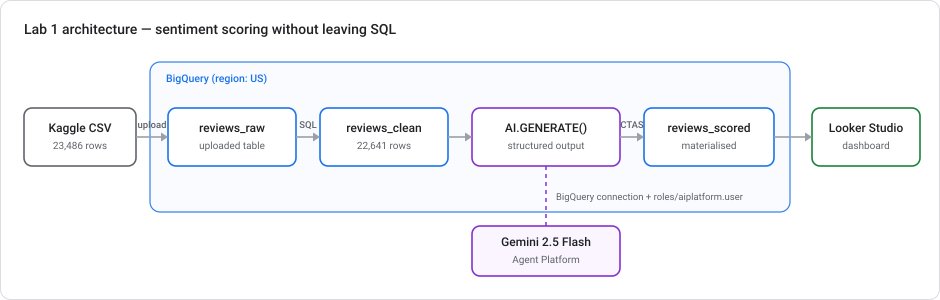
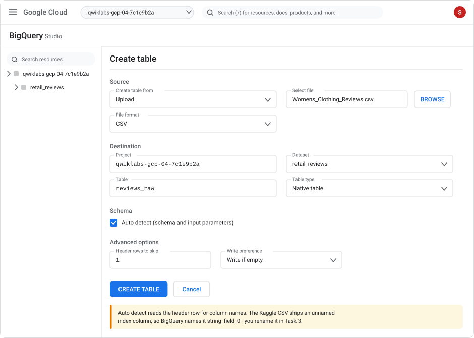
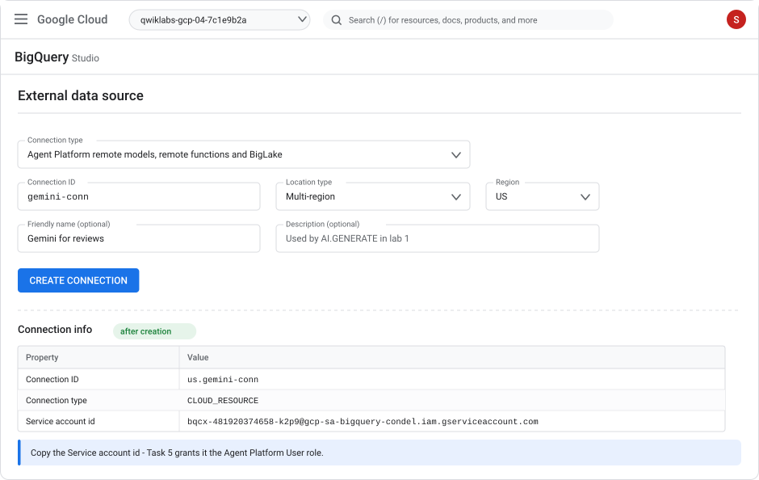
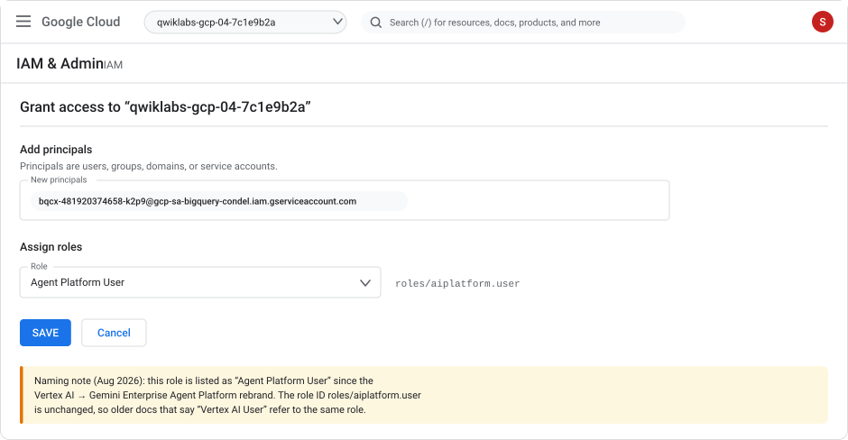
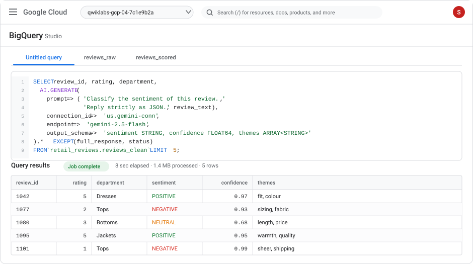
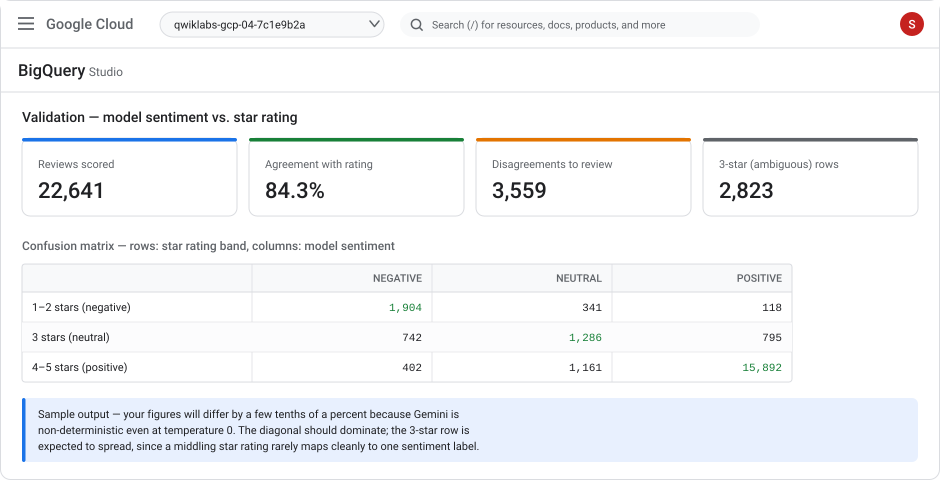
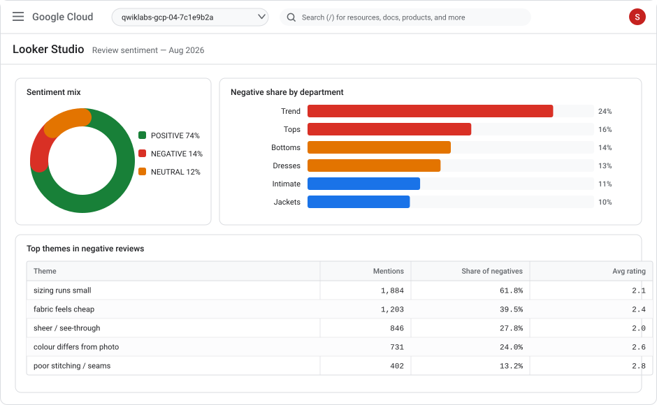

# Lab 1 — Analyze customer review sentiment with Gemini in BigQuery

> **Level** Intermediate  **Duration** 75–90 minutes  **Cost** ~US$2–4 of Gemini usage if you score the full dataset (a sampled path is provided)
> **Products** BigQuery · BigQuery ML · Gemini Enterprise Agent Platform (formerly Vertex AI) · Looker Studio
> **Last updated** 23 August 2026

> **Model retirement — check before you run this.** This lab pins `gemini-2.5-flash`. Google's
> model-versions table gives `gemini-2.5-pro`, `gemini-2.5-flash` and `gemini-2.5-flash-lite` a
> retirement date of **20 October 2026**, with **Gemini 3.5 Flash-Lite** or **Gemini 3.1 Flash-Lite**
> named as the replacement for `gemini-2.5-flash`. Google states: *"While retirement timelines may be
> extended, they won't be moved to an earlier date than what is listed."* After a model retires, calls
> to that ID fail. If you are reading this after that date, swap the endpoint for a current model.
> The SQL does not otherwise change.

---

## Overview

Sentiment analysis used to mean exporting text to a notebook, loading a model, batching predictions, and writing the results back. In BigQuery you can now do the whole thing in SQL: a generative AI function sends each row to a Gemini model running on the Gemini Enterprise Agent Platform and returns a typed column you can `GROUP BY`.

In this lab you take 23,486 real e-commerce clothing reviews from Kaggle, load them into BigQuery, and score every one of them for sentiment, confidence, and the specific product themes the reviewer complained about — without leaving the query editor. Then you do the part most tutorials skip: you check whether the model was *right*, by testing its labels against the star rating the customer gave.



### Objectives

In this lab, you learn how to:

- Load a Kaggle CSV into BigQuery with an explicit schema
- Create a `CLOUD_RESOURCE` connection that lets BigQuery call Gemini, and grant it the right IAM role
- Call `AI.GENERATE` to classify text row by row in SQL
- Force the model into a typed output contract with `output_schema`, so you get real columns instead of a blob of prose
- Score a full table and materialize the results, with a cost-control pattern for large tables
- Do the same job through the classic remote-model route (`CREATE MODEL … REMOTE` + `AI.GENERATE_TABLE`) and know when to prefer it
- Validate LLM output against a ground-truth signal, and read the failure modes
- Turn free-text themes into a ranked, actionable list and publish it to Looker Studio

### Prerequisites

- Comfortable with intermediate SQL (`CTE`s, `GROUP BY`, `UNNEST`)
- A Google Cloud project with billing enabled, and a Kaggle account (free)
- No Python required — this lab is SQL and console work only

---

## ⏱ What changed recently (read this first)

This lab is written against the console as it stands in **August 2026**. Two changes will trip you up if you follow older tutorials:

| Change | What it means for you |
|---|---|
| **Vertex AI was reorganized into the Gemini Enterprise Agent Platform.** Announced 22 Apr 2026; the "Vertex AI" entry left the console navigation on 21 May 2026. | In the console, look for **Agent Platform**, not Vertex AI. Searching "Vertex AI" redirects you there. The API (`aiplatform.googleapis.com`), the IAM role IDs (`roles/aiplatform.user`), and every line of BigQuery ML SQL are **unchanged** — only names and menu paths moved. |
| **The `AI.*` scalar functions are GA and are now the recommended entry point.** | Prefer `AI.GENERATE` over the older `ML.GENERATE_TEXT`. It returns cleaner columns, accepts an `output_schema`, and does not require you to create a remote model first. `ML.GENERATE_TEXT` still works. |

If your console still shows "Vertex AI", your organization is on a delayed rollout — everything in this lab still works, you just navigate to the old menu name.

---

## Setup and requirements

### Task 0. Prepare your project

1. Open the [Google Cloud console](https://console.cloud.google.com) and select (or create) a project.

2. Open **Cloud Shell** (the terminal icon in the top-right toolbar) and set your project:

   ```bash
   export PROJECT_ID=$(gcloud config get-value project)
   export REGION=US
   echo "Project: $PROJECT_ID"
   ```

3. Enable the APIs this lab needs:

   ```bash
   gcloud services enable \
     bigquery.googleapis.com \
     bigqueryconnection.googleapis.com \
     aiplatform.googleapis.com
   ```

   > **Note:** `aiplatform.googleapis.com` is correct even though the product is now called Agent Platform. The service name did not change during the rebrand.

4. Confirm you hold the roles you need. To complete every task you need **BigQuery Admin** (`roles/bigquery.admin`) and **Project IAM Admin** (`roles/resourcemanager.projectIamAdmin`) — the second one is only needed for Task 6, where you grant a role to a service account.

   ```bash
   gcloud projects get-iam-policy $PROJECT_ID \
     --flatten="bindings[].members" \
     --filter="bindings.members:$(gcloud config get-value account)" \
     --format="value(bindings.role)"
   ```

### Region

Use the **US multi-region** for the dataset and the connection throughout this lab. The connection and the dataset must live in compatible locations, and mixing them is the single most common cause of "connection not found" errors later on.

---

## Task 1. Get the dataset from Kaggle

**Dataset:** [Women's E-Commerce Clothing Reviews](https://www.kaggle.com/datasets/nicapotato/womens-ecommerce-clothing-reviews) — `nicapotato/womens-ecommerce-clothing-reviews`

| Property | Value |
|---|---|
| Rows | 23,486 (one per review) |
| Columns | 11 |
| Reviews with text | 22,641 — 845 rows have a rating but no written review |
| File | `Womens Clothing E-Commerce Reviews.csv` (~8 MB) |
| License | CC0 1.0 (public domain dedication) |
| Why this dataset | It carries a **star rating alongside the free text**, which gives you a ground-truth signal to validate the model against in Task 10. Most review datasets don't. |

The data is real commercial data that has been anonymized — references to the retailer in the review text were replaced with the word "retailer".

### Option A — download in the browser

1. Sign in to Kaggle and open the dataset page linked above.
2. Click **Download** and unzip the archive.
3. Rename the file to remove the spaces — it makes every later command simpler:

   `Womens Clothing E-Commerce Reviews.csv` → `Womens_Clothing_Reviews.csv`

### Option B — download in Cloud Shell with the Kaggle CLI

1. On Kaggle, go to **Settings → API → Create New Token**. This downloads `kaggle.json`.
2. Upload `kaggle.json` to Cloud Shell (**⋮ → Upload**), then:

   ```bash
   pip install --quiet kaggle
   mkdir -p ~/.kaggle && mv ~/kaggle.json ~/.kaggle/ && chmod 600 ~/.kaggle/kaggle.json

   kaggle datasets download -d nicapotato/womens-ecommerce-clothing-reviews
   unzip -o womens-ecommerce-clothing-reviews.zip
   mv "Womens Clothing E-Commerce Reviews.csv" Womens_Clothing_Reviews.csv
   wc -l Womens_Clothing_Reviews.csv
   ```

   Expect **23,487** lines — 23,486 data rows plus the header.

> **Heads-up on the first column.** The CSV opens with an unnamed index column (`,Clothing ID,Age,…`). Auto-detect handles this inconsistently, which is why Task 2 gives you an explicit schema instead of relying on it.

---

## Task 2. Create the dataset and load the CSV into BigQuery

### Create the dataset

1. In the console, open **BigQuery → Studio**.
2. In the **Explorer** pane, click **⋮** next to your project → **Create dataset**.
3. Set:
   - **Dataset ID:** `retail_reviews`
   - **Location type:** Multi-region → **US**
4. Click **Create dataset**.

Or in Cloud Shell:

```bash
bq --location=US mk -d retail_reviews
```

### Load the table

1. Click **⋮** next to the `retail_reviews` dataset → **Create table**.
2. Fill in the panel:
   - **Create table from:** `Upload`
   - **Select file:** `Womens_Clothing_Reviews.csv`
   - **File format:** `CSV`
   - **Table:** `reviews_raw`
3. Under **Schema**, click **Edit as text** and paste this — do **not** use Auto detect:

   ```text
   index_id:INT64,clothing_id:INT64,age:INT64,title:STRING,review_text:STRING,rating:INT64,recommended_ind:INT64,positive_feedback_count:INT64,division_name:STRING,department_name:STRING,class_name:STRING
   ```

4. Expand **Advanced options** and set **Header rows to skip** to `1`.
5. Click **Create table**.



The explicit schema is doing real work here: it names the unnamed index column `index_id`, and it lowercases and normalizes every other name so the SQL in the rest of this lab is predictable.

The Cloud Shell equivalent:

```bash
bq --location=US load \
  --source_format=CSV \
  --skip_leading_rows=1 \
  retail_reviews.reviews_raw \
  ./Womens_Clothing_Reviews.csv \
  index_id:INT64,clothing_id:INT64,age:INT64,title:STRING,review_text:STRING,rating:INT64,recommended_ind:INT64,positive_feedback_count:INT64,division_name:STRING,department_name:STRING,class_name:STRING
```

### ✅ Check your work

```sql
SELECT COUNT(*) AS rows_loaded,
       COUNTIF(review_text IS NULL OR TRIM(review_text) = '') AS blank_reviews
FROM `retail_reviews.reviews_raw`;
```

Expect `rows_loaded = 23486` and `blank_reviews = 845`. If `rows_loaded` is 23,487 you left **Header rows to skip** at 0 and the header was ingested as data.

---

## Task 3. Clean and shape the review table

You never want to pay a model to read empty strings. This step also gives every review a stable ID so results stay joinable.

```sql
CREATE OR REPLACE TABLE `retail_reviews.reviews_clean` AS
SELECT
  FORMAT('R%05d', index_id)                     AS review_id,
  clothing_id,
  age,
  NULLIF(TRIM(title), '')                       AS title,
  TRIM(review_text)                             AS review_text,
  rating,
  recommended_ind = 1                           AS recommended,
  positive_feedback_count,
  division_name,
  department_name,
  class_name
FROM `retail_reviews.reviews_raw`
WHERE review_text IS NOT NULL
  AND TRIM(review_text) != '';
```

### ✅ Check your work

```sql
SELECT COUNT(*) AS reviews_with_text,
       MIN(rating) AS min_rating,
       MAX(rating) AS max_rating,
       ROUND(AVG(LENGTH(review_text)), 0) AS avg_chars
FROM `retail_reviews.reviews_clean`;
```

Expect **22,641** rows, ratings spanning 1–5, and an average of roughly 300 characters per review. That average matters: it is what makes the cost estimate in Task 8 predictable.

---

## Task 4. Create the connection from BigQuery to Gemini

BigQuery cannot call a Gemini model directly. It calls it *through a connection* — a resource that owns a Google-managed service account. You grant that service account access to the Agent Platform, and BigQuery then borrows its identity for every `AI.GENERATE` call.

1. In **BigQuery Studio**, click **+ ADD** (above the Explorer pane) → **Connections to external data sources**.
2. Configure the connection:
   - **Connection type:** `Agent Platform remote models, remote functions and BigLake (Cloud Resource)`
   - **Connection ID:** `gemini-conn`
   - **Location type:** Multi-region → **US**
3. Click **Create connection**.



4. In the Explorer, expand **External connections** and click `us.gemini-conn`. **Copy the Service account id** — it looks like `bqcx-<number>-<hash>@gcp-sa-bigquery-condel.iam.gserviceaccount.com`. You need it in the next task.

The Cloud Shell equivalent, which also prints the service account:

```bash
bq mk --connection --location=US --project_id=$PROJECT_ID \
  --connection_type=CLOUD_RESOURCE gemini-conn

bq show --format=prettyjson --connection $PROJECT_ID.US.gemini-conn \
  | grep serviceAccountId
```

> **Shortcut:** BigQuery can auto-provision a connection named `__default_cloudresource_connection__` the first time an AI function needs one, letting you omit `connection_id` entirely. This lab creates the connection explicitly because that is what you will do in any real project — named connections can be shared, audited, and granted narrow permissions, and the default connection cannot be reused across regions.

---

## Task 5. Grant the connection access to Gemini

The connection exists but is powerless until its service account can invoke models.

1. Go to **IAM & Admin → IAM**.
2. Click **Grant access**.
3. In **New principals**, paste the service account id you copied.
4. In **Role**, select **Agent Platform User** (`roles/aiplatform.user`).
5. Click **Save**.



Cloud Shell equivalent:

```bash
SA=$(bq show --format=json --connection $PROJECT_ID.US.gemini-conn \
     | python3 -c "import sys,json; print(json.load(sys.stdin)['cloudResource']['serviceAccountId'])")

gcloud projects add-iam-policy-binding $PROJECT_ID \
  --member="serviceAccount:$SA" \
  --role="roles/aiplatform.user"
```

> **Naming note.** Older tutorials call this role **Vertex AI User**. It is the same role — the ID `roles/aiplatform.user` never changed, only the display name did.

⚠️ **IAM propagation takes up to 60 seconds.** If your first `AI.GENERATE` call fails with a permission error, wait a minute and re-run it before you start debugging anything else. This is the single most common false alarm in this lab.

---

## Task 6. Your first sentiment call

Start small — five rows, no schema, just to prove the wiring works.

```sql
SELECT
  review_id,
  rating,
  review_text,
  AI.GENERATE(
    prompt => (
      'Classify the sentiment of this customer clothing review as exactly one word: ',
      'POSITIVE, NEGATIVE, or NEUTRAL. Return only that word. Review: ',
      review_text
    ),
    connection_id => 'us.gemini-conn',
    endpoint => 'gemini-2.5-flash'
  ).result AS sentiment
FROM `retail_reviews.reviews_clean`
ORDER BY review_id
LIMIT 5;
```

Some things worth noticing:

- **The prompt is a tuple**, not a concatenated string. Each element is joined for you, so you can interleave literal instructions with column values without `CONCAT` gymnastics.
- **`connection_id` uses the `location.name` form** — `us.gemini-conn`, not the full resource path.
- **`endpoint` is optional.** Omit it and BigQuery picks a current stable Gemini; as of August 2026 the default is `gemini-2.5-flash`. Pin it explicitly in anything you intend to keep, so a future default change doesn't silently move your results. Pinning has the opposite risk: a pinned model can retire. `gemini-2.5-flash` retires on **20 October 2026**, so pin *and* diarise.
- **`.result`** pulls the generated text out of the returned `STRUCT`. The struct also carries `full_response` (the raw model response, useful for debugging safety blocks) and `status` (empty string on success, an error message otherwise).

> **Always check `status` before you trust a batch.** A blocked or failed row returns a null `result` and a populated `status` rather than failing the query. Silent nulls are how bad LLM pipelines get to production.

---

## Task 7. Enforce a typed output contract

Free text is fine for five rows and useless for 22,641. `output_schema` makes Gemini return a structured record that BigQuery types as real columns — the model is constrained to the shape you declare.

```sql
SELECT
  review_id,
  rating,
  department_name,
  AI.GENERATE(
    prompt => (
      'You are a retail quality analyst. Analyze this clothing review.\n',
      '- sentiment: POSITIVE, NEGATIVE, or NEUTRAL, judged from the point of view of the reviewer.\n',
      '- confidence: 0.0 to 1.0, how certain you are of that label.\n',
      '- themes: 1 to 3 short lowercase noun phrases naming what the review is about ',
      '(e.g. "sizing runs small", "fabric quality", "colour differs from photo").\n',
      '- actionable_issue: the single most fixable product problem, or "none".\n',
      'Review: ',
      review_text
    ),
    connection_id => 'us.gemini-conn',
    endpoint => 'gemini-2.5-flash',
    model_params => JSON '{"generation_config": {"temperature": 0, "max_output_tokens": 256}}',
    output_schema => 'sentiment STRING, confidence FLOAT64, themes ARRAY<STRING>, actionable_issue STRING'
  ).* EXCEPT (full_response, status)
FROM `retail_reviews.reviews_clean`
ORDER BY review_id
LIMIT 5;
```



Two details that are easy to get wrong:

- **`model_params` must match the Gemini `generateContent` request body.** Generation settings go *inside* `generation_config` — `JSON '{"generation_config": {"temperature": 0}}'`, not `JSON '{"temperature": 0}'`. The latter is accepted as valid JSON and then quietly ignored.
- **`temperature: 0` reduces variance but does not eliminate it.** Gemini is not bit-for-bit deterministic. Re-running this query will change a handful of labels. Plan for that in Task 10 rather than being surprised by it.

---

## Task 8. Score the whole table

Now materialize. Scoring is the expensive step, so you run it **once** into a table rather than re-invoking the model every time someone refreshes a dashboard.

### Choose your path

| Path | Rows | Roughly | Use when |
|---|---|---|---|
| **Sampled** | 2,000 | a few cents | You are learning, or on a tight budget |
| **Full** | 22,641 | a few dollars | You want the validation numbers in Task 10 to be meaningful |

Gemini usage is billed by the Agent Platform at standard token rates on top of BigQuery's own compute — it is **not** covered by the BigQuery free tier. At ~300 characters per review the full run is on the order of 3M input tokens. Check the [current pricing](https://cloud.google.com/vertex-ai/generative-ai/pricing) before you run it; list prices move.

### Run the scoring job

For the sampled path, uncomment the `WHERE` clause. Note the sample is **stratified by rating** — a random 2,000 rows would be ~77% four- and five-star reviews and would tell you almost nothing about how the model handles negative text.

```sql
CREATE OR REPLACE TABLE `retail_reviews.reviews_scored` AS
WITH sampled AS (
  SELECT *,
         ROW_NUMBER() OVER (PARTITION BY rating ORDER BY FARM_FINGERPRINT(review_id)) AS rn
  FROM `retail_reviews.reviews_clean`
)
SELECT
  review_id, clothing_id, age, rating, recommended,
  division_name, department_name, class_name, review_text,
  AI.GENERATE(
    prompt => (
      'You are a retail quality analyst. Analyze this clothing review.\n',
      '- sentiment: POSITIVE, NEGATIVE, or NEUTRAL, judged from the point of view of the reviewer.\n',
      '- confidence: 0.0 to 1.0, how certain you are of that label.\n',
      '- themes: 1 to 3 short lowercase noun phrases naming what the review is about.\n',
      '- actionable_issue: the single most fixable product problem, or "none".\n',
      'Review: ',
      review_text
    ),
    connection_id => 'us.gemini-conn',
    endpoint => 'gemini-2.5-flash',
    model_params => JSON '{"generation_config": {"temperature": 0, "max_output_tokens": 256}}',
    output_schema => 'sentiment STRING, confidence FLOAT64, themes ARRAY<STRING>, actionable_issue STRING'
  ).* EXCEPT (full_response)
FROM sampled
-- WHERE rn <= 400   -- sampled path: 400 per rating × 5 ratings = 2,000 rows
;
```

Note this version keeps `status` (it only drops `full_response`). You want it, because the very next thing you do is check it.

### ✅ Check your work — did anything silently fail?

```sql
SELECT
  COUNT(*)                                    AS rows_scored,
  COUNTIF(status != '')                       AS failed_rows,
  COUNTIF(sentiment IS NULL)                  AS null_sentiment,
  COUNT(DISTINCT sentiment)                   AS distinct_labels,
  STRING_AGG(DISTINCT sentiment ORDER BY sentiment) AS labels
FROM `retail_reviews.reviews_scored`;
```

You want `failed_rows = 0` and `labels = 'NEGATIVE,NEUTRAL,POSITIVE'`. If `distinct_labels` is 4 or more, the model invented a label such as `MIXED` — tighten the prompt wording rather than patching it downstream with a `CASE`.

If some rows did fail, re-score only those rows instead of paying for the whole table again:

```sql
MERGE `retail_reviews.reviews_scored` T
USING (
  SELECT review_id,
         AI.GENERATE(
           prompt => ('Classify sentiment as POSITIVE, NEGATIVE or NEUTRAL. Review: ', review_text),
           connection_id => 'us.gemini-conn',
           endpoint => 'gemini-2.5-flash',
           output_schema => 'sentiment STRING, confidence FLOAT64'
         ) AS g
  FROM `retail_reviews.reviews_scored`
  WHERE status != '' OR sentiment IS NULL
) S
ON T.review_id = S.review_id
WHEN MATCHED THEN UPDATE SET
  T.sentiment = S.g.sentiment,
  T.confidence = S.g.confidence,
  T.status = '';
```

---

## Task 9. The remote-model route (and when to use it)

`AI.GENERATE` is the low-friction path. The older route — register the model as a BigQuery object, then call it — is still fully supported and is better in two situations: when you want the model endpoint **governed as a named object** that queries reference indirectly, and when you want to swap the underlying Gemini version for every downstream query by altering **one** object.

Create the remote model:

```sql
CREATE OR REPLACE MODEL `retail_reviews.gemini_flash`
REMOTE WITH CONNECTION `us.gemini-conn`
OPTIONS (ENDPOINT = 'gemini-2.5-flash');
```

Then call it with the table-valued `AI.GENERATE_TABLE`:

```sql
SELECT review_id, rating, sentiment, confidence, themes
FROM AI.GENERATE_TABLE(
  MODEL `retail_reviews.gemini_flash`,
  (
    SELECT
      review_id, rating,
      CONCAT(
        'Analyze this clothing review. sentiment must be POSITIVE, NEGATIVE or NEUTRAL. ',
        'themes: 1-3 short lowercase noun phrases. Review: ',
        review_text
      ) AS prompt
    FROM `retail_reviews.reviews_clean`
    LIMIT 10
  ),
  STRUCT(
    'sentiment STRING, confidence FLOAT64, themes ARRAY<STRING>' AS output_schema,
    0 AS temperature
  )
);
```

Differences worth internalizing:

| | `AI.GENERATE` (scalar) | `AI.GENERATE_TABLE` (table-valued) |
|---|---|---|
| Setup | None beyond the connection | Requires `CREATE MODEL … REMOTE` first |
| Called as | An expression inside `SELECT` | A table function wrapping a subquery |
| Prompt | A tuple of parts | A column that must be named `prompt` |
| Model params | `model_params` JSON | `STRUCT(… AS temperature)` |
| Best for | Ad-hoc analysis, per-column enrichment | Governed pipelines, centrally versioned endpoints |

> **Naming a Gemini 3 model.** Google's `CREATE REMOTE MODEL` reference now states: *"All of the generally
> available and preview Gemini models are supported."* So a short name such as `gemini-3.5-flash` works, and
> the full endpoint URL is optional rather than required. Earlier material said preview models needed the
> full URL; that applied during the original Gemini 3 preview and no longer holds. The full global-endpoint
> form is still useful for a different reason: it reduces resource-exhausted (429) errors and lets you call
> a model in a region where it is otherwise unavailable. Note the limit — the global endpoint works only
> with `AI.GENERATE_TEXT`. This lab stays on `gemini-2.5-flash` so the outputs match the walkthrough.

---

## Task 10. Validate the model against star ratings

This is the task that separates a demo from an analysis. You have a ground-truth-ish signal — the star rating — that the model never saw. Use it.

```sql
WITH banded AS (
  SELECT
    CASE
      WHEN rating <= 2 THEN '1-2 stars (negative)'
      WHEN rating  = 3 THEN '3 stars (neutral)'
      ELSE                  '4-5 stars (positive)'
    END AS rating_band,
    UPPER(TRIM(sentiment)) AS sentiment
  FROM `retail_reviews.reviews_scored`
  WHERE sentiment IS NOT NULL
)
SELECT
  rating_band,
  COUNTIF(sentiment = 'NEGATIVE') AS negative,
  COUNTIF(sentiment = 'NEUTRAL')  AS neutral,
  COUNTIF(sentiment = 'POSITIVE') AS positive,
  COUNT(*)                        AS total
FROM banded
GROUP BY rating_band
ORDER BY rating_band;
```

And the single headline number:

```sql
SELECT
  COUNT(*) AS scored,
  ROUND(100 * COUNTIF(
    (rating <= 2 AND UPPER(sentiment) = 'NEGATIVE') OR
    (rating  = 3 AND UPPER(sentiment) = 'NEUTRAL')  OR
    (rating >= 4 AND UPPER(sentiment) = 'POSITIVE')
  ) / COUNT(*), 1) AS agreement_pct
FROM `retail_reviews.reviews_scored`
WHERE sentiment IS NOT NULL;
```



### How to read this

Expect agreement in the **low-to-mid 80s**, not the high 90s — and that is the correct result, not a failure. Three things are going on, and only one of them is model error:

1. **The 3-star row is genuinely ambiguous.** A 3-star review is often a positive review with one complaint. Neither the star nor the label is "wrong"; the mapping itself is lossy. This row will always spread.
2. **Ratings and text genuinely disagree.** Customers leave 5 stars while writing "runs small, had to return it". The model is reading the text — arguably it is right and the star is wrong.
3. **Real model error** — the residual after you account for 1 and 2.

Look at the disagreements directly before you conclude anything:

```sql
SELECT rating, sentiment, confidence, review_text
FROM `retail_reviews.reviews_scored`
WHERE rating >= 4 AND UPPER(sentiment) = 'NEGATIVE'
ORDER BY confidence DESC
LIMIT 20;
```

High-confidence disagreements are the interesting ones. If the model is confidently negative about a 5-star review, read the text — you will usually find it is right.

---

## Task 11. Turn themes into an action list

Sentiment alone doesn't tell anyone what to fix. The `themes` array does.

```sql
SELECT
  theme,
  COUNT(*)                       AS mentions,
  ROUND(AVG(rating), 2)          AS avg_rating,
  ROUND(100 * COUNTIF(UPPER(sentiment) = 'NEGATIVE') / COUNT(*), 1) AS pct_negative,
  COUNT(DISTINCT clothing_id)    AS products_affected
FROM `retail_reviews.reviews_scored`, UNNEST(themes) AS theme
WHERE sentiment IS NOT NULL
GROUP BY theme
HAVING COUNT(*) >= 25
ORDER BY mentions DESC
LIMIT 25;
```

Free-text themes are messy by nature — `sizing runs small`, `runs small`, and `small sizing` are one problem in three spellings. Rather than hand-maintaining a synonym list, let the model consolidate its own output:

```sql
SELECT AI.GENERATE(
  prompt => (
    'These are product complaint themes extracted from clothing reviews, with counts. ',
    'Group them into at most 8 distinct business issues. For each, give a canonical name, ',
    'the total mentions, and one concrete recommended action for a merchandising team.\n',
    (SELECT STRING_AGG(FORMAT('%s (%d)', theme, n), '; ')
     FROM (
       SELECT theme, COUNT(*) AS n
       FROM `retail_reviews.reviews_scored`, UNNEST(themes) AS theme
       WHERE UPPER(sentiment) = 'NEGATIVE'
       GROUP BY theme
       ORDER BY n DESC
       LIMIT 60
     ))
  ),
  connection_id => 'us.gemini-conn',
  endpoint => 'gemini-2.5-flash',
  output_schema => 'issue STRING, total_mentions INT64, recommended_action STRING'
) AS consolidated;
```

This is a nice pattern to keep: the **row-level** call extracts, and a **single aggregate** call summarizes. One extra model call, not 22,641.

Worth checking which departments carry the problem:

```sql
SELECT
  department_name,
  COUNT(*) AS reviews,
  ROUND(100 * COUNTIF(UPPER(sentiment) = 'NEGATIVE') / COUNT(*), 1) AS pct_negative,
  ROUND(AVG(rating), 2) AS avg_rating
FROM `retail_reviews.reviews_scored`
WHERE sentiment IS NOT NULL AND department_name IS NOT NULL
GROUP BY department_name
ORDER BY pct_negative DESC;
```

---

## Task 12. Publish to Looker Studio

1. Run the department query above.
2. In the results pane, click **Explore data → Explore with Looker Studio**.
3. Build four tiles:
   - **Pie chart** — record count, broken down by `sentiment`
   - **Bar chart** — `pct_negative` by `department_name`
   - **Table** — top themes from Task 11, sorted by mentions
   - **Scorecard** — total reviews scored
4. **File → Save**, then **Share**.



> **Point the report at `reviews_scored`, never at a live `AI.GENERATE` query.** A dashboard on top of a live model call re-invokes Gemini on every viewer refresh, and the bill scales with how popular your dashboard is. Score once into a table; schedule a refresh if the source data changes.

---

## Cleanup

```bash
bq rm -r -f -d $PROJECT_ID:retail_reviews
bq rm --connection --location=US $PROJECT_ID.US.gemini-conn
```

Then remove the IAM binding if you created a dedicated service account grant:

```bash
gcloud projects remove-iam-policy-binding $PROJECT_ID \
  --member="serviceAccount:$SA" \
  --role="roles/aiplatform.user"
```

---

## Test your understanding

<details markdown="1">
<summary><b>1.</b> You call <code>AI.GENERATE</code> without <code>endpoint</code>. What runs, and why is that risky in production?</summary>

BigQuery selects a current stable Gemini model — `gemini-2.5-flash` as of August 2026. It is risky because Google can move that default. Your results would change without any edit to your SQL, and you would have no record of which model produced last quarter's numbers. Pin the endpoint in anything you keep.
</details>

<details markdown="1">
<summary><b>2.</b> Your query returns rows where <code>sentiment</code> is NULL but the query itself succeeded. What do you check?</summary>

The `status` column. Per-row failures — safety blocks, quota, malformed responses — populate `status` with an error message and return a null result rather than failing the whole query. This is why Task 8 keeps `status` in the materialized table instead of dropping it alongside `full_response`.
</details>

<details markdown="1">
<summary><b>3.</b> Why does this lab stratify the 2,000-row sample by rating instead of taking a random sample?</summary>

The dataset is heavily skewed positive — roughly 77% of reviews are 4 or 5 stars. A random 2,000 rows would contain only a couple of hundred negative reviews, so the validation in Task 10 would be measuring the model almost entirely on easy positive cases. Stratifying gives each rating band equal representation, which is what you need to see where the model struggles.
</details>

<details markdown="1">
<summary><b>4.</b> Agreement with star ratings comes out at 84%. Is the model broken?</summary>

Almost certainly not. Star ratings are not ground truth for text sentiment — they are a related but different signal. Most of the gap is the 3-star band, where a single label cannot represent "good but with one complaint", plus genuine rating/text mismatches where the customer's words are negative and their star is generous. Inspect high-confidence disagreements before concluding the model is at fault.
</details>

<details markdown="1">
<summary><b>5.</b> When would you choose <code>AI.GENERATE_TABLE</code> with a remote model over the scalar <code>AI.GENERATE</code>?</summary>

When you want the endpoint governed as a named BigQuery object. A remote model gives you one place to swap the Gemini version for every query that references it, and it can be permissioned and audited like any other dataset object. The scalar function hardcodes the endpoint into each query, which is fine for analysis and awkward for a shared pipeline.
</details>

<details markdown="1">
<summary><b>6.</b> Where does the money go in this lab, and what is the single most effective way to cut it?</summary>

Almost entirely to Agent Platform token charges for the 22,641 model calls — BigQuery's own compute is trivial by comparison, and Gemini usage is not covered by the BigQuery free tier. The most effective control is to materialize scores once into a table and point everything downstream at that table, rather than re-invoking the model per dashboard refresh. After that: score a stratified sample, cap `max_output_tokens`, and use Flash rather than Pro.
</details>

---

## Congratulations! 🎉

You scored 22,641 real customer reviews for sentiment, confidence, and product themes entirely in SQL, then validated the output against an independent signal and turned it into a ranked action list.

The transferable idea is the shape of the pipeline: **clean → score once into a table → validate against something the model didn't see → aggregate**. The model call is one line in the middle. The engineering around it is what makes the result trustworthy.

### Next steps

- Add `AI.GENERATE_BOOL` to flag reviews needing a human response: `AI.GENERATE_BOOL(('Does this review report a safety or defect issue? ', review_text), connection_id => 'us.gemini-conn').result`
- Use `AI.EMBED` and `VECTOR_SEARCH` to find near-duplicate complaints across products
- Schedule the scoring `MERGE` so only new reviews are ever sent to the model
- Continue to **[Lab 2 — Predict customer churn with BigQuery ML](lab-02-customer-churn-lowcode-bqml.md)**

### References

- [Generative AI overview — BigQuery](https://docs.cloud.google.com/bigquery/docs/generative-ai-overview)
- [The `AI.GENERATE` function](https://docs.cloud.google.com/bigquery/docs/reference/standard-sql/bigqueryml-syntax-ai-generate)
- [The `AI.GENERATE_TABLE` function](https://docs.cloud.google.com/bigquery/docs/reference/standard-sql/bigqueryml-syntax-generate-table)
- [Generate text using a Gemini model — tutorial](https://docs.cloud.google.com/bigquery/docs/generate-text-tutorial-gemini)
- [Default connections in BigQuery](https://docs.cloud.google.com/bigquery/docs/default-connections)
- [Dataset — Women's E-Commerce Clothing Reviews (Kaggle, CC0)](https://www.kaggle.com/datasets/nicapotato/womens-ecommerce-clothing-reviews)
