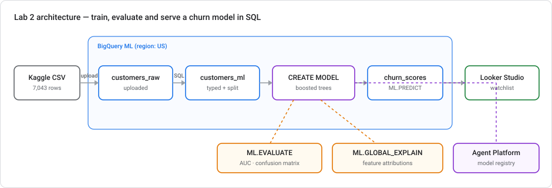
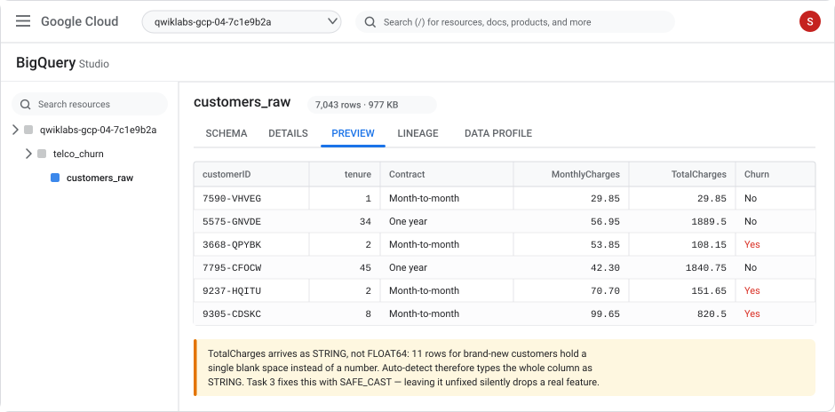
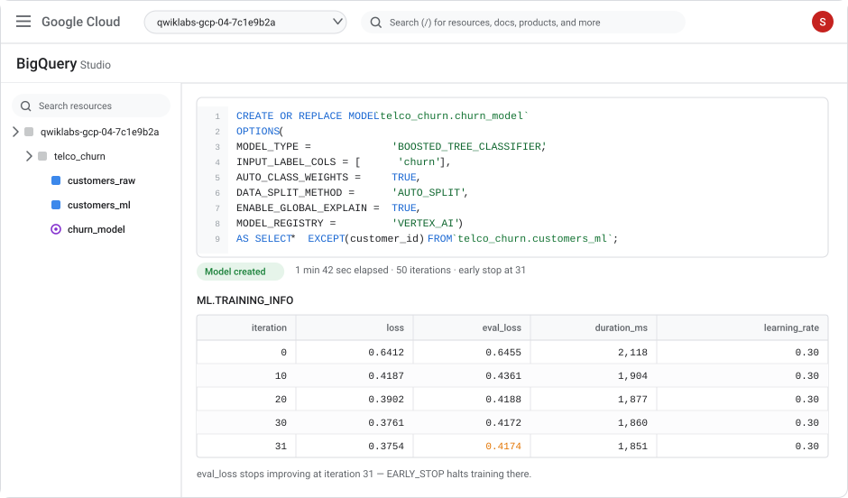
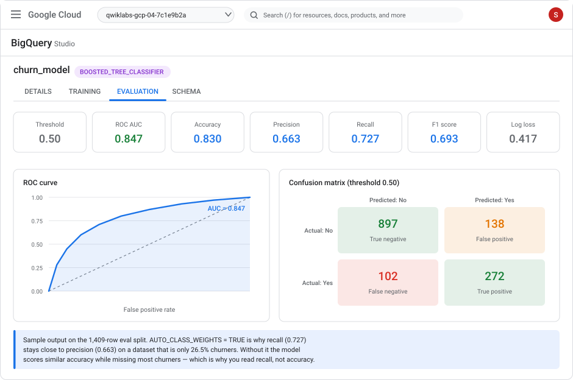
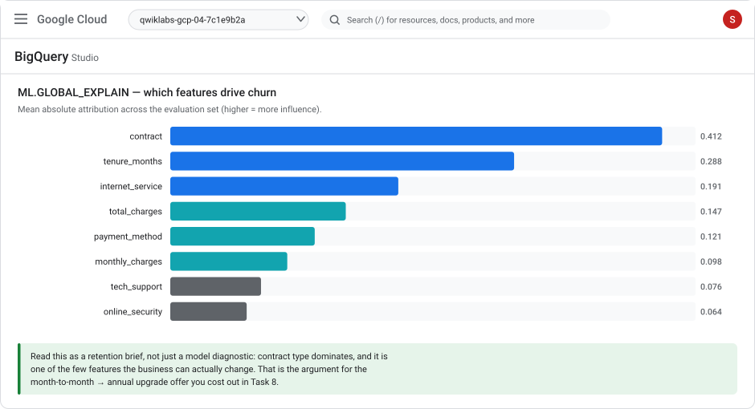
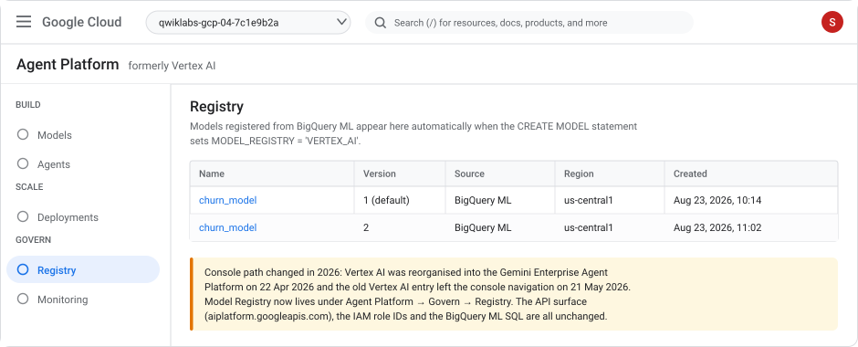
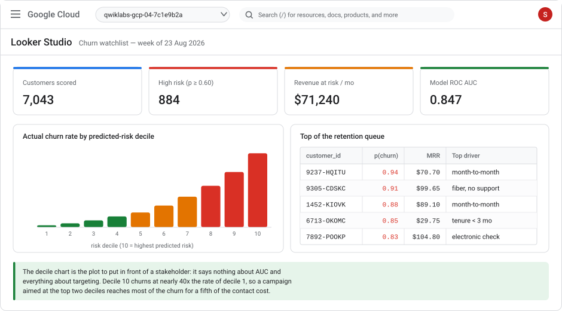

# Lab 2 — Predict customer churn end-to-end with BigQuery ML (no code)

> **Level** Intermediate  **Duration** 90–110 minutes  **Cost** low — training runs in minutes and fits comfortably in the BigQuery free tier for most learners
> **Products** BigQuery · BigQuery ML · Gemini Enterprise Agent Platform (formerly Vertex AI) Model Registry · Looker Studio
> **Last updated** 23 August 2026

---

## Overview

"Low-code ML" usually means a wizard that trains a model and leaves you holding a number you can't explain. This lab does the opposite: you build a complete churn pipeline — ingest, feature prep, training, evaluation, explanation, tuning, scoring, and a business decision — and every step is a SQL statement you can read, review, and put in version control. No notebooks, no Python, no model export.

The dataset is the Telco Customer Churn set from Kaggle: 7,043 subscribers with 21 attributes and a `Churn` flag. It is small, honest, and contains a data-quality trap that most tutorials silently walk past — you'll fix that trap in Task 4 and see exactly what it would have cost you.

The lab ends where a real project ends: not with an accuracy score, but with a threshold chosen because it maximizes retained revenue, and a ranked watchlist someone can actually call.



### Objectives

In this lab, you learn how to:

- Load a Kaggle CSV into BigQuery with an explicit schema, and find the type problem auto-detect hides
- Engineer features and encode a label in plain SQL
- Establish a baseline before training anything, so you can tell whether the model earned its keep
- Train a `BOOSTED_TREE_CLASSIFIER` with `CREATE MODEL`, and handle class imbalance with `AUTO_CLASS_WEIGHTS`
- Evaluate with `ML.EVALUATE`, `ML.CONFUSION_MATRIX`, and `ML.ROC_CURVE` — and know which metric to trust
- Explain the model globally (`ML.GLOBAL_EXPLAIN`) and per customer (`ML.EXPLAIN_PREDICT`)
- Run automated hyperparameter tuning with `NUM_TRIALS`, control the train/eval/test split explicitly, and preprocess inside the model with `TRANSFORM`
- Score every customer, rank them into risk deciles, and pick a decision threshold from expected value rather than from `0.5`
- Register the model in the Agent Platform registry and publish a retention watchlist

### Prerequisites

- Intermediate SQL. No ML background required — the lab explains each metric where you first meet it.
- A Google Cloud project with billing enabled, and a free Kaggle account.
- **Lab 1 is not a prerequisite**, but if you did it, you already have the project setup done.

---

## What changed recently (read this first)

Written against the console as of **August 2026**:

| Change | What it means for you |
|---|---|
| **Vertex AI became the Gemini Enterprise Agent Platform** (announced 22 Apr 2026; the Vertex AI console entry was removed 21 May 2026). | Model Registry now lives at **Agent Platform → Govern → Registry**. Searching "Vertex AI" in the console redirects you. **None of the SQL changed** — the `CREATE MODEL` option is still `MODEL_REGISTRY = 'VERTEX_AI'`, and the API is still `aiplatform.googleapis.com`. |
| Boosted-tree training is still **not available in every BigQuery region**. | Use the **US multi-region** for this lab. If you must use another region, check the BigQuery ML locations page first — a region mismatch surfaces as an unhelpful "model type not supported" error. |

---

## Setup and requirements

### Task 0. Prepare your project

1. Open the [Google Cloud console](https://console.cloud.google.com) and select or create a project.
2. Open **Cloud Shell** and set variables:

   ```bash
   export PROJECT_ID=$(gcloud config get-value project)
   export REGION=US
   echo "Project: $PROJECT_ID"
   ```

3. Enable the APIs:

   ```bash
   gcloud services enable bigquery.googleapis.com aiplatform.googleapis.com
   ```

   You only need `aiplatform.googleapis.com` for Task 11 (registering the model). Everything else is pure BigQuery.

4. You need **BigQuery Admin** (`roles/bigquery.admin`) on the project, plus **Agent Platform User** (`roles/aiplatform.user`) for the registry step.

---

## Task 1. Get the dataset from Kaggle

**Dataset:** [Telco Customer Churn](https://www.kaggle.com/datasets/blastchar/telco-customer-churn) — `blastchar/telco-customer-churn`

| Property | Value |
|---|---|
| Rows | 7,043 (one per customer) |
| Columns | 21 |
| Label | `Churn` — `Yes` / `No` |
| Class balance | 1,869 churners = **26.5%** |
| File | `WA_Fn-UseC_-Telco-Customer-Churn.csv` (~955 KB) |
| Source | IBM sample dataset, published on Kaggle |

Each row is a telecom subscriber: demographics, which services they subscribe to, their contract and payment method, what they pay monthly and in total, and whether they left in the last month.

### Option A — download in the browser

Sign in to Kaggle, open the dataset page, click **Download**, and unzip.

### Option B — Cloud Shell with the Kaggle CLI

```bash
pip install --quiet kaggle
mkdir -p ~/.kaggle && mv ~/kaggle.json ~/.kaggle/ && chmod 600 ~/.kaggle/kaggle.json

kaggle datasets download -d blastchar/telco-customer-churn
unzip -o telco-customer-churn.zip
wc -l WA_Fn-UseC_-Telco-Customer-Churn.csv
```

Expect **7,044** lines — 7,043 customers plus the header.

Before you load it, look at the trap:

```bash
awk -F',' 'NR>1 && $20 == " " {c++} END {print c " rows have a blank TotalCharges"}' \
  WA_Fn-UseC_-Telco-Customer-Churn.csv
```

**11 rows** contain a single space where a number should be. They are brand-new customers with `tenure = 0` who have not been billed yet. Remember this — it defines Task 4.

---

## Task 2. Create the dataset and load the CSV

```bash
bq --location=US mk -d telco_churn
```

Then load with an explicit schema. Note `TotalCharges:STRING` — that is deliberate, and you will see why in a moment.

```bash
bq --location=US load \
  --source_format=CSV \
  --skip_leading_rows=1 \
  telco_churn.customers_raw \
  ./WA_Fn-UseC_-Telco-Customer-Churn.csv \
  customerID:STRING,gender:STRING,SeniorCitizen:INT64,Partner:STRING,Dependents:STRING,tenure:INT64,PhoneService:STRING,MultipleLines:STRING,InternetService:STRING,OnlineSecurity:STRING,OnlineBackup:STRING,DeviceProtection:STRING,TechSupport:STRING,StreamingTV:STRING,StreamingMovies:STRING,Contract:STRING,PaperlessBilling:STRING,PaymentMethod:STRING,MonthlyCharges:FLOAT64,TotalCharges:STRING,Churn:STRING
```

To do it in the console instead: **BigQuery → Studio → ⋮ next to `telco_churn` → Create table**, source **Upload**, table `customers_raw`, then **Edit as text** under Schema and paste the same schema string, with **Header rows to skip = 1**.



### Why not just use Auto detect?

Try it and BigQuery types `TotalCharges` as `STRING` anyway — because of those 11 blank rows, the whole column fails numeric inference. The difference is that auto-detect does it *silently*. Learners who don't notice go on to train a model in which a genuinely predictive feature is being treated as a high-cardinality categorical string, and the model quietly gets worse with no error anywhere. Declaring it `STRING` on purpose means you have to deal with it consciously.

### Check your work

```sql
SELECT
  COUNT(*)                                              AS customers,
  COUNTIF(Churn = 'Yes')                                AS churners,
  ROUND(100 * COUNTIF(Churn = 'Yes') / COUNT(*), 2)     AS churn_rate_pct,
  COUNTIF(SAFE_CAST(TRIM(TotalCharges) AS FLOAT64) IS NULL) AS uncastable_totalcharges
FROM `telco_churn.customers_raw`;
```

Expect `customers = 7043`, `churners = 1869`, `churn_rate_pct = 26.54`, and `uncastable_totalcharges = 11`.

---

## Task 3. Establish a baseline before you model

Never train first. Find out what a stakeholder could already guess, so you have something to beat.

```sql
SELECT
  Contract,
  COUNT(*)                                          AS customers,
  COUNTIF(Churn = 'Yes')                            AS churners,
  ROUND(100 * COUNTIF(Churn = 'Yes') / COUNT(*), 1) AS churn_rate_pct
FROM `telco_churn.customers_raw`
GROUP BY Contract
ORDER BY churn_rate_pct DESC;
```

Month-to-month customers churn at roughly **43%**, one-year at about **11%**, two-year at around **3%**. That single column is a strong predictor on its own.

So the honest baseline is not "26.5% of customers churn". It is: *"flag every month-to-month customer"*. Measure it:

```sql
SELECT
  COUNTIF(Contract = 'Month-to-month')                             AS flagged,
  COUNTIF(Contract = 'Month-to-month' AND Churn = 'Yes')           AS churners_caught,
  ROUND(COUNTIF(Contract = 'Month-to-month' AND Churn = 'Yes')
        / COUNTIF(Churn = 'Yes'), 3)                               AS recall,
  ROUND(COUNTIF(Contract = 'Month-to-month' AND Churn = 'Yes')
        / COUNTIF(Contract = 'Month-to-month'), 3)                 AS precision
FROM `telco_churn.customers_raw`;
```

This rule catches about **88%** of churners at roughly **43%** precision — by contacting more than half your customer base. That is the bar. A model is only worth building if it beats this on precision at comparable recall, or reaches similar recall while contacting far fewer people. Keep these two numbers; you compare against them in Task 10.

---

## Task 4. Fix types and engineer features

```sql
CREATE OR REPLACE TABLE `telco_churn.customers_ml` AS
SELECT
  customerID                                   AS customer_id,

  -- demographics
  gender,
  SeniorCitizen = 1                            AS senior_citizen,
  Partner    = 'Yes'                           AS has_partner,
  Dependents = 'Yes'                           AS has_dependents,

  -- account
  tenure                                       AS tenure_months,
  Contract                                     AS contract,
  PaperlessBilling = 'Yes'                     AS paperless_billing,
  PaymentMethod                                AS payment_method,

  -- services
  PhoneService = 'Yes'                         AS phone_service,
  MultipleLines                                AS multiple_lines,
  InternetService                              AS internet_service,
  OnlineSecurity                               AS online_security,
  OnlineBackup                                 AS online_backup,
  DeviceProtection                             AS device_protection,
  TechSupport                                  AS tech_support,
  StreamingTV                                  AS streaming_tv,
  StreamingMovies                              AS streaming_movies,

  -- money: the fix
  MonthlyCharges                               AS monthly_charges,
  COALESCE(SAFE_CAST(TRIM(TotalCharges) AS FLOAT64), 0.0) AS total_charges,

  -- engineered features
  SAFE_DIVIDE(
    COALESCE(SAFE_CAST(TRIM(TotalCharges) AS FLOAT64), 0.0),
    NULLIF(tenure, 0)
  )                                            AS avg_monthly_spend,

  CASE
    WHEN tenure <= 6  THEN 'new'
    WHEN tenure <= 24 THEN 'growing'
    ELSE                   'established'
  END                                          AS tenure_band,

  (
    CAST(OnlineSecurity    = 'Yes' AS INT64) +
    CAST(OnlineBackup      = 'Yes' AS INT64) +
    CAST(DeviceProtection  = 'Yes' AS INT64) +
    CAST(TechSupport       = 'Yes' AS INT64) +
    CAST(StreamingTV       = 'Yes' AS INT64) +
    CAST(StreamingMovies   = 'Yes' AS INT64)
  )                                            AS addon_count,

  -- label
  Churn                                        AS churn
FROM `telco_churn.customers_raw`;
```

What each engineered feature is for:

- **`avg_monthly_spend`** — `total_charges / tenure`. Diverging from `monthly_charges` means the customer's plan changed, which is a churn signal a raw column can't express. `NULLIF(tenure, 0)` yields `NULL` for the 11 zero-tenure customers rather than a divide-by-zero; BigQuery ML handles nulls natively.
- **`tenure_band`** — churn risk against tenure is a steep curve, not a straight line. Bands let a tree split cleanly on the early-life danger zone.
- **`addon_count`** — how embedded the customer is in the product. Sticky customers hold more add-ons.

**A note on the label.** `churn` stays as the strings `'Yes'` / `'No'` rather than a boolean. Both work, but strings keep `ML.PREDICT` output unambiguous: the probability array is labelled `'Yes'`/`'No'`, so `WHERE label = 'Yes'` reads exactly as intended.

### Check your work

```sql
SELECT
  COUNT(*)                                    AS rows,
  COUNTIF(total_charges = 0)                  AS zero_total_charges,
  COUNTIF(avg_monthly_spend IS NULL)          AS null_avg_spend,
  COUNT(DISTINCT churn)                       AS label_values,
  ROUND(AVG(addon_count), 2)                  AS avg_addons
FROM `telco_churn.customers_ml`;
```

Expect 7,043 rows, `zero_total_charges = 11`, `null_avg_spend = 11`, and `label_values = 2`.

---

## Task 5. Train the model

One statement. This is the whole training step.

```sql
CREATE OR REPLACE MODEL `telco_churn.churn_model`
OPTIONS (
  MODEL_TYPE            = 'BOOSTED_TREE_CLASSIFIER',
  INPUT_LABEL_COLS      = ['churn'],
  AUTO_CLASS_WEIGHTS    = TRUE,
  DATA_SPLIT_METHOD     = 'AUTO_SPLIT',
  EARLY_STOP            = TRUE,
  MAX_ITERATIONS        = 50,
  ENABLE_GLOBAL_EXPLAIN = TRUE,
  MODEL_REGISTRY        = 'VERTEX_AI',
  VERTEX_AI_MODEL_ID    = 'telco-churn-model'
) AS
SELECT * EXCEPT (customer_id)
FROM `telco_churn.customers_ml`;
```

Training takes roughly **1–3 minutes**.

Every option, and why it is there:

| Option | Why |
|---|---|
| `BOOSTED_TREE_CLASSIFIER` | Gradient-boosted trees (XGBoost). The right default for tabular data with mixed categorical and numeric columns — it handles interactions and non-linearity without you scaling or one-hot encoding anything. |
| `AUTO_CLASS_WEIGHTS = TRUE` | **The most important option here.** Only 26.5% of customers churn. Without weighting, the model can score ~73% accuracy by predicting "No" for everyone and finding almost no churners. This reweights the classes so missing a churner is expensive. |
| `DATA_SPLIT_METHOD = 'AUTO_SPLIT'` | For a table this size, BigQuery ML holds out ~20% for evaluation (≈1,409 rows). You never evaluate on rows the model trained on. |
| `EARLY_STOP = TRUE` | Stops when held-out loss stops improving, which prevents overfitting and cuts training time. |
| `ENABLE_GLOBAL_EXPLAIN = TRUE` | **Must be set at training time.** `ML.GLOBAL_EXPLAIN` in Task 7 will not work if you forget it, and you cannot add it afterwards — you would have to retrain. |
| `MODEL_REGISTRY = 'VERTEX_AI'` | Publishes the model to the Agent Platform registry (Task 11). The option value kept its original spelling through the rebrand. |
| `EXCEPT (customer_id)` | An ID column is a perfect identifier and useless as a feature. Leaving it in invites the model to memorize rows. |

> If `MODEL_REGISTRY`/`VERTEX_AI_MODEL_ID` fail in your project (usually a region or permission issue), drop those two lines. Everything except Task 11 works without them.

Watch training converge:

```sql
SELECT *
FROM ML.TRAINING_INFO(MODEL `telco_churn.churn_model`)
ORDER BY iteration;
```



`loss` is training loss, `eval_loss` is held-out loss. While both fall, the model is learning. When `eval_loss` flattens or rises while `loss` keeps falling, it has started memorizing — that is exactly the moment `EARLY_STOP` halts.

---

## Task 6. Evaluate — and pick the right metric

```sql
SELECT *
FROM ML.EVALUATE(
  MODEL `telco_churn.churn_model`,
  (SELECT * EXCEPT (customer_id) FROM `telco_churn.customers_ml`)
);
```

You can also click the model in the Explorer and open its **Evaluation** tab for the same numbers plus charts.



Expect roughly **ROC AUC 0.84–0.86**, accuracy around **0.80–0.83**, precision near **0.65**, recall near **0.72**.

**Read recall and AUC, not accuracy.** On a 26.5% positive class, a model that predicts "No" for everyone scores 73.5% accuracy while catching zero churners. Accuracy is nearly uninformative here.

- **ROC AUC** — the probability the model ranks a random churner above a random non-churner. It is threshold-independent, which makes it the right single number for comparing two models.
- **Recall** — of everyone who actually churned, what fraction did you flag? This is the number the retention team cares about, because a churner you miss is revenue gone.
- **Precision** — of everyone you flagged, what fraction actually churned? This is your wasted-contact cost.

Confirm which class the metrics refer to, and see the raw counts:

```sql
SELECT *
FROM ML.CONFUSION_MATRIX(
  MODEL `telco_churn.churn_model`,
  (SELECT * EXCEPT (customer_id) FROM `telco_churn.customers_ml`),
  STRUCT(0.5 AS threshold)
);
```

And the full trade-off curve:

```sql
SELECT
  threshold,
  ROUND(true_positives  / NULLIF(true_positives + false_negatives, 0), 3) AS recall,
  ROUND(true_positives  / NULLIF(true_positives + false_positives, 0), 3) AS precision,
  true_positives, false_positives, false_negatives, true_negatives
FROM ML.ROC_CURVE(
  MODEL `telco_churn.churn_model`,
  (SELECT * EXCEPT (customer_id) FROM `telco_churn.customers_ml`)
)
WHERE threshold BETWEEN 0.2 AND 0.8
ORDER BY threshold;
```

Nothing says 0.5 is the right threshold. It is a default, not a decision. Task 9 replaces it with one derived from money.

---

## Task 7. Explain the model

A churn score nobody can explain does not get used. BigQuery ML gives you both altitudes.

### Globally — what drives churn overall

```sql
SELECT *
FROM ML.GLOBAL_EXPLAIN(MODEL `telco_churn.churn_model`)
ORDER BY attribution DESC;
```



Expect `contract`, `tenure_months`, and `internet_service` at the top. Read this commercially, not just statistically: **contract type dominates, and it is one of the few drivers the business can actually change.** Tenure you cannot alter; contract type you can influence with an upgrade offer. That is the seed of the intervention you cost out in Task 9.

For a tree-specific view, compare against split-based importance:

```sql
SELECT *
FROM ML.FEATURE_IMPORTANCE(MODEL `telco_churn.churn_model`)
ORDER BY importance_gain DESC;
```

`ML.GLOBAL_EXPLAIN` reports attribution to predictions; `ML.FEATURE_IMPORTANCE` reports how much each feature improved the trees' splits. When they disagree sharply, you usually have correlated features sharing credit — here, `total_charges` and `avg_monthly_spend` both encode spend.

### Per customer — why *this* person is at risk

```sql
SELECT
  customer_id,
  predicted_churn,
  ROUND((SELECT prob FROM UNNEST(predicted_churn_probs) WHERE label = 'Yes'), 3) AS p_churn,
  top_feature_attributions
FROM ML.EXPLAIN_PREDICT(
  MODEL `telco_churn.churn_model`,
  (SELECT * FROM `telco_churn.customers_ml`),
  STRUCT(3 AS top_k_features)
)
ORDER BY p_churn DESC
LIMIT 10;
```

`top_feature_attributions` gives the three features that pushed each individual score, with signed contributions. This is what turns a dashboard row into a call script: *"month-to-month contract, no tech support, four months tenure."*

---

## Task 8. Tune, and preprocess inside the model

### Automated hyperparameter tuning

`NUM_TRIALS` turns `CREATE MODEL` into a search. BigQuery ML trains several candidates and keeps the best.

```sql
CREATE OR REPLACE MODEL `telco_churn.churn_model_tuned`
OPTIONS (
  MODEL_TYPE               = 'BOOSTED_TREE_CLASSIFIER',
  INPUT_LABEL_COLS         = ['churn'],
  AUTO_CLASS_WEIGHTS       = TRUE,
  ENABLE_GLOBAL_EXPLAIN    = TRUE,
  NUM_TRIALS               = 10,
  MAX_PARALLEL_TRIALS      = 2,
  HPARAM_TUNING_OBJECTIVES = ['ROC_AUC'],
  MAX_TREE_DEPTH           = HPARAM_RANGE(3, 10),
  LEARN_RATE               = HPARAM_RANGE(0.05, 0.3),
  L2_REG                   = HPARAM_RANGE(0, 5),
  SUBSAMPLE                = HPARAM_RANGE(0.6, 1.0)
) AS
SELECT * EXCEPT (customer_id)
FROM `telco_churn.customers_ml`;
```

**This runs 10 training jobs** — budget **10–20 minutes**. Reduce `NUM_TRIALS` to 4 if you are short on time; the lesson survives.

Inspect the search:

```sql
SELECT trial_id, hyperparameters, hparam_tuning_evaluation_metrics, is_optimal, status
FROM ML.TRIAL_INFO(MODEL `telco_churn.churn_model_tuned`)
ORDER BY trial_id;
```

The row with `is_optimal = true` is the model you get when you query `churn_model_tuned`. Tuning on this dataset typically buys **0.005–0.015 AUC**. That is a genuinely useful lesson: the features and the label definition matter far more than the hyperparameters. If you want a materially better model, go back to Task 4, not to the search space.

### Controlling the data split

`AUTO_SPLIT` (Task 5) is fine while you're getting a baseline. Two situations need explicit control, and hyperparameter tuning is one of them.

**The five methods:**

| `DATA_SPLIT_METHOD` | What it does |
|---|---|
| `AUTO_SPLIT` *(default)* | BigQuery ML decides by row count. Under 500 rows, everything is training data; between 500 and 50,000, a random 20% becomes evaluation data. |
| `RANDOM` | Rows are randomised, then split by the fractions you give |
| `SEQ` | Split by a column's order — **the honest choice for time-ordered data** |
| `CUSTOM` | You supply a `BOOL` column saying which rows are evaluation |
| `NO_SPLIT` | All input data is training data. No evaluation set at all |

**The rule that catches people:** with **hyperparameter tuning there are three sets, not two** — training, evaluation *and* test. The default is a randomised 80/10/10, with training and evaluation used inside each trial. If you want to control the proportions yourself, you must specify **both** fractions:

```sql
CREATE OR REPLACE MODEL `telco_churn.churn_tuned_explicit`
OPTIONS (
  MODEL_TYPE                = 'BOOSTED_TREE_CLASSIFIER',
  INPUT_LABEL_COLS          = ['churn'],
  AUTO_CLASS_WEIGHTS        = TRUE,
  NUM_TRIALS                = 10,
  DATA_SPLIT_METHOD         = 'RANDOM',
  DATA_SPLIT_EVAL_FRACTION  = 0.15,   -- 15% evaluation
  DATA_SPLIT_TEST_FRACTION  = 0.15    -- 15% test  ->  training is the remaining 70%
) AS
SELECT * EXCEPT (customer_id) FROM `telco_churn.customers_ml`;
```

**Training is whatever is left**: `1 − eval − test`. There is no `DATA_SPLIT_TRAIN_FRACTION`.

Three things worth remembering:

- **Setting only `DATA_SPLIT_EVAL_FRACTION` while tuning is incomplete** — without the test fraction you don't get the three-way split that tuning needs.
- **`NO_SPLIT` and tuning don't mix.** With no evaluation set there is nothing to compare trials against and nothing for early stopping to act on.
- **`AUTO_SPLIT` can't express a target ratio.** It applies its own logic; if the requirement says 70/15/15, you need `RANDOM` (or `SEQ`) plus both fractions.

> **When the data is time-ordered, prefer `SEQ`.** A random split of demand or transaction history lets the model train on the future and be evaluated on the past — the point-in-time problem from [Lab 5](lab-05-feature-engineering-tabular.md), arriving through the split rather than through a feature. `RANDOM` is right when rows are exchangeable; `SEQ` is right when they are not.

---

### Preprocessing inside the model with `TRANSFORM`

`TRANSFORM` moves feature engineering *into* the model, so the same transformations are applied automatically at prediction time. This eliminates training/serving skew — the classic bug where your scoring pipeline preprocesses slightly differently from your training pipeline.

```sql
CREATE OR REPLACE MODEL `telco_churn.churn_model_transform`
TRANSFORM (
  churn,
  contract,
  internet_service,
  payment_method,
  tenure_band,
  senior_citizen,
  addon_count,
  ML.STANDARD_SCALER(monthly_charges)  OVER () AS monthly_charges_scaled,
  ML.STANDARD_SCALER(total_charges)    OVER () AS total_charges_scaled,
  ML.QUANTILE_BUCKETIZE(tenure_months, 5) OVER () AS tenure_bucket
)
OPTIONS (
  MODEL_TYPE         = 'BOOSTED_TREE_CLASSIFIER',
  INPUT_LABEL_COLS   = ['churn'],
  AUTO_CLASS_WEIGHTS = TRUE
) AS
SELECT * EXCEPT (customer_id)
FROM `telco_churn.customers_ml`;
```

With `TRANSFORM`, `ML.PREDICT` takes **raw** rows — you never re-apply the scaling yourself. (Trees don't need scaling, so expect little accuracy change here; the point is the pattern, which matters a great deal for `LOGISTIC_REG` and `DNN_CLASSIFIER`.)

### Optional: is a simpler model good enough?

```sql
CREATE OR REPLACE MODEL `telco_churn.churn_logreg`
OPTIONS (
  MODEL_TYPE         = 'LOGISTIC_REG',
  INPUT_LABEL_COLS   = ['churn'],
  AUTO_CLASS_WEIGHTS = TRUE
) AS
SELECT * EXCEPT (customer_id)
FROM `telco_churn.customers_ml`;
```

Logistic regression usually lands within ~0.01 AUC of the boosted tree on this dataset, trains in seconds, and produces directly readable coefficients via `ML.WEIGHTS`. Always run this comparison before defending a complex model.

> **Going fully hands-off:** `MODEL_TYPE = 'AUTOML_CLASSIFIER'` hands the entire search to Vertex AutoML from the same `CREATE MODEL` statement. It is the most low-code option available — but it has a **minimum training budget measured in hours** and costs substantially more than everything else in this lab combined. Know it exists; don't run it here without checking pricing first.

---

## Task 9. Turn probabilities into a decision

### Score every customer

```sql
CREATE OR REPLACE TABLE `telco_churn.churn_scores` AS
SELECT
  customer_id,
  contract,
  tenure_months,
  monthly_charges,
  churn AS actual_churn,
  (SELECT prob FROM UNNEST(predicted_churn_probs) WHERE label = 'Yes') AS p_churn
FROM ML.PREDICT(
  MODEL `telco_churn.churn_model`,
  (SELECT * FROM `telco_churn.customers_ml`)
);
```

`ML.PREDICT` passes input columns straight through, which is why `customer_id` survives even though the model never saw it as a feature.

### Rank into risk deciles

```sql
SELECT
  decile,
  COUNT(*)                                              AS customers,
  ROUND(AVG(p_churn), 3)                                AS avg_predicted,
  ROUND(AVG(IF(actual_churn = 'Yes', 1, 0)), 3)         AS actual_churn_rate,
  ROUND(SUM(monthly_charges), 0)                        AS monthly_revenue
FROM (
  SELECT *, NTILE(10) OVER (ORDER BY p_churn) AS decile
  FROM `telco_churn.churn_scores`
)
GROUP BY decile
ORDER BY decile;
```

This is the single most persuasive output in the lab. `avg_predicted` should track `actual_churn_rate` closely down the whole table — that is calibration, and it is a stronger claim than any AUC. The top decile should churn at something like **35–40×** the rate of the bottom decile.

### Choose a threshold from expected value

`0.5` is arbitrary. The right threshold depends on what a retention contact costs and what a saved customer is worth.

```sql
DECLARE offer_cost      FLOAT64 DEFAULT 12.0;   -- cost of making a retention offer
DECLARE save_rate       FLOAT64 DEFAULT 0.30;   -- share of contacted churners actually retained
DECLARE months_retained FLOAT64 DEFAULT 12.0;   -- how long a saved customer stays
DECLARE margin_rate     FLOAT64 DEFAULT 0.45;   -- gross margin on revenue

SELECT
  ROUND(th, 2)                                                       AS threshold,
  COUNTIF(p_churn >= th)                                             AS contacted,
  COUNTIF(p_churn >= th AND actual_churn = 'Yes')                    AS churners_reached,
  ROUND(SAFE_DIVIDE(COUNTIF(p_churn >= th AND actual_churn = 'Yes'),
                    COUNTIF(p_churn >= th)), 3)                       AS precision,
  ROUND(SAFE_DIVIDE(COUNTIF(p_churn >= th AND actual_churn = 'Yes'),
                    COUNTIF(actual_churn = 'Yes')), 3)                AS recall,
  ROUND(
    SUM(IF(p_churn >= th AND actual_churn = 'Yes',
           monthly_charges * months_retained * margin_rate * save_rate, 0))
    - COUNTIF(p_churn >= th) * offer_cost
  , 0)                                                                AS net_value
FROM `telco_churn.churn_scores`, UNNEST(GENERATE_ARRAY(0.10, 0.90, 0.05)) AS th
GROUP BY th
ORDER BY th;
```

Find the row where `net_value` peaks. It will **not** be at 0.50 — with these assumptions the optimum usually sits lower, around 0.30–0.40, because a missed churner costs far more than a wasted $12 offer. That asymmetry, not the model, is what sets the threshold.

Change `save_rate` to 0.10 and re-run. The optimum moves sharply, and at pessimistic enough assumptions the whole programme stops being worth running. Being able to show that is more valuable than another 0.01 of AUC.

### Did you beat the baseline?

Compare against Task 3's "contact every month-to-month customer" rule at a comparable contact volume:

```sql
WITH rule_based AS (
  SELECT COUNTIF(contract = 'Month-to-month') AS contacted,
         COUNTIF(contract = 'Month-to-month' AND actual_churn = 'Yes') AS caught
  FROM `telco_churn.churn_scores`
),
model_based AS (
  SELECT COUNTIF(p_churn >= 0.35) AS contacted,
         COUNTIF(p_churn >= 0.35 AND actual_churn = 'Yes') AS caught
  FROM `telco_churn.churn_scores`
)
SELECT 'contract rule' AS approach, contacted, caught,
       ROUND(caught / contacted, 3) AS precision FROM rule_based
UNION ALL
SELECT 'model @ 0.35', contacted, caught,
       ROUND(caught / contacted, 3) FROM model_based;
```

The model should reach similar or better recall while contacting meaningfully fewer customers, at higher precision. **If it doesn't, the honest answer is to ship the rule** — it's free, explainable, and needs no retraining.

---

## Task 10. Register the model in the Agent Platform

Because you set `MODEL_REGISTRY = 'VERTEX_AI'` in Task 5, the model is already registered.

1. In the console, go to **Agent Platform** (search "Vertex AI" — it redirects).
2. In the left navigation, open **Govern → Registry**.
3. You should see `telco-churn-model`, version 1, source **BigQuery ML**.



Re-running the `CREATE OR REPLACE MODEL` statement with the same `VERTEX_AI_MODEL_ID` adds a **new version** rather than overwriting — which is what gives you a rollback path and an audit trail of which model produced which scores.

---

## Task 11. Publish the retention watchlist

Build the table the retention team actually consumes:

```sql
CREATE OR REPLACE VIEW `telco_churn.retention_watchlist` AS
SELECT
  customer_id,
  ROUND(p_churn, 3)                                        AS risk_score,
  CASE
    WHEN p_churn >= 0.60 THEN 'High'
    WHEN p_churn >= 0.35 THEN 'Medium'
    ELSE                      'Low'
  END                                                      AS risk_tier,
  contract,
  tenure_months,
  monthly_charges,
  ROUND(monthly_charges * 12 * 0.45, 0)                    AS annual_margin_at_risk,
  CASE
    WHEN contract = 'Month-to-month' THEN 'Offer 12-month contract with discount'
    WHEN tenure_months <= 6          THEN 'Onboarding check-in call'
    ELSE                                  'Service quality review'
  END                                                      AS suggested_action
FROM `telco_churn.churn_scores`
WHERE p_churn >= 0.35
ORDER BY p_churn DESC;
```

Then:

1. Query the view.
2. Click **Explore data → Explore with Looker Studio**.
3. Build:
   - **Scorecards** — customers scored, high-risk count, total `annual_margin_at_risk`
   - **Bar chart** — `actual_churn_rate` by decile (from the Task 9 query); this is the chart to lead with
   - **Table** — the watchlist itself, sorted by `risk_score`
   - **Filter control** — `risk_tier` and `contract`



> The decile chart persuades stakeholders in a way AUC never does. It says nothing about statistics and everything about targeting: *contact the top two deciles and you reach most of the churn for a fifth of the contact cost.*

---

## Cleanup

```bash
bq rm -r -f -d $PROJECT_ID:telco_churn
```

Delete the registered model separately — dropping the BigQuery dataset does not remove the registry entry:

```bash
gcloud ai models list --region=us-central1 --filter="displayName:telco-churn-model"
gcloud ai models delete MODEL_ID --region=us-central1
```

---

## Test your understanding

<details markdown="1">
<summary><b>1.</b> Your model reports 79% accuracy. Your colleague says that beats the 73.5% you'd get by predicting "No" for everyone, so the model works. What's wrong with that reasoning?</summary>

Accuracy on a 26.5% positive class barely distinguishes a useful model from a useless one — the "always No" model scores 73.5% while catching zero churners, and 79% is not far above it. What matters is whether you find churners: recall, precision, and threshold-independent ROC AUC. The gap between 73.5% and 79% could be almost entirely the majority class.
</details>

<details markdown="1">
<summary><b>2.</b> What does <code>AUTO_CLASS_WEIGHTS = TRUE</code> change, and what happens if you omit it?</summary>

It reweights the training examples inversely to class frequency, so misclassifying a churner costs the model more than misclassifying a non-churner. Omit it and the model drifts toward predicting "No", producing similar accuracy with much lower recall — it catches far fewer of the customers you actually want to find.
</details>

<details markdown="1">
<summary><b>3.</b> You run <code>ML.GLOBAL_EXPLAIN</code> and get an error. The model trained fine. Why?</summary>

`ENABLE_GLOBAL_EXPLAIN = TRUE` must be set in the `CREATE MODEL` options at training time. It cannot be added afterwards — you have to retrain with the option set.
</details>

<details markdown="1">
<summary><b>4.</b> Why does this lab deliberately load <code>TotalCharges</code> as <code>STRING</code>?</summary>

11 rows contain a blank space instead of a number (customers with `tenure = 0` who haven't been billed). That makes numeric auto-detection fail, so auto-detect types the column as `STRING` regardless — but silently. Declaring it `STRING` on purpose forces you to handle it with `SAFE_CAST`, instead of unknowingly training on a predictive numeric feature that has been degraded into a high-cardinality string.
</details>

<details markdown="1">
<summary><b>5.</b> The optimal decision threshold turns out to be 0.35, not 0.50. What does that tell you?</summary>

That the costs are asymmetric. A missed churner costs a year of margin; a wasted retention offer costs $12. When a false negative is far more expensive than a false positive, the expected-value optimum sits below 0.5 — you accept more false positives to catch more churners. 0.5 is a mathematical default, not a business decision.
</details>

<details markdown="1">
<summary><b>6.</b> Hyperparameter tuning improved AUC from 0.847 to 0.856. Where should you spend the next hour?</summary>

Not on more tuning. A ~0.01 gain from a 10-trial search says you are near the ceiling of what these features support. The larger gains live in feature engineering and label definition — adding behavioural data (support tickets, usage trends, payment failures) or sharpening the churn window. Tuning polishes; features move the number.
</details>

<details markdown="1">
<summary><b>7.</b> Why compare against the "contact every month-to-month customer" rule at all?</summary>

Because it might win. That rule catches ~88% of churners with zero infrastructure, no training, and no retraining. A model is only worth operating if it beats that on precision at comparable recall, or matches recall while contacting far fewer people. Without the baseline you have no way to know whether the model added anything, and "we shipped a model" is not the same as "we improved the outcome".
</details>

---

## Congratulations!

You built a complete churn pipeline in SQL: loading, type repair, feature engineering, training, evaluation, explanation, tuning, scoring, threshold selection, registry, and dashboard. No Python, no notebooks, no model export.

Three ideas worth carrying forward:

1. **The baseline comes first.** A model that can't beat a one-line `WHERE` clause isn't a result.
2. **The threshold is a business decision, not a default.** `0.5` encodes the assumption that false positives and false negatives cost the same, which is almost never true.
3. **Features beat hyperparameters.** The tuning search bought 0.01 AUC; fixing `TotalCharges` and adding three engineered columns bought considerably more.

### Next steps

- Add `ML.DETECT_ANOMALIES` or `ML.ARIMA_PLUS` for usage-trend features
- Schedule scoring with a BigQuery scheduled query so the watchlist refreshes nightly
- Set up model monitoring in the Agent Platform registry to catch feature drift
- Revisit **[Lab 1](lab-01-sentiment-analysis-bigquery-gemini.md)** and join review sentiment to churn scores — unhappy customers who are also high-risk are your highest-priority contacts

### References

- [The `CREATE MODEL` statement for boosted tree models](https://docs.cloud.google.com/bigquery/docs/reference/standard-sql/bigqueryml-syntax-create-boosted-tree)
- [Perform classification with a boosted trees model — tutorial](https://docs.cloud.google.com/bigquery/docs/boosted-tree-classifier-tutorial)
- [Hyperparameter tuning in BigQuery ML](https://docs.cloud.google.com/bigquery/docs/hp-tuning-overview)
- [BigQuery ML and the model registry](https://docs.cloud.google.com/gemini-enterprise-agent-platform/machine-learning/model-registry/model-registry-bqml)
- [BigQuery ML locations](https://docs.cloud.google.com/bigquery/docs/locations)
- [Dataset — Telco Customer Churn (Kaggle)](https://www.kaggle.com/datasets/blastchar/telco-customer-churn)
