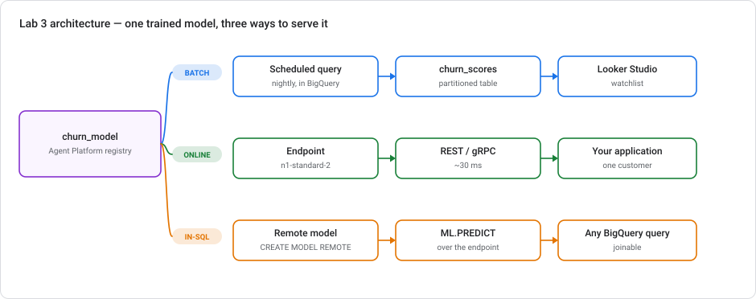
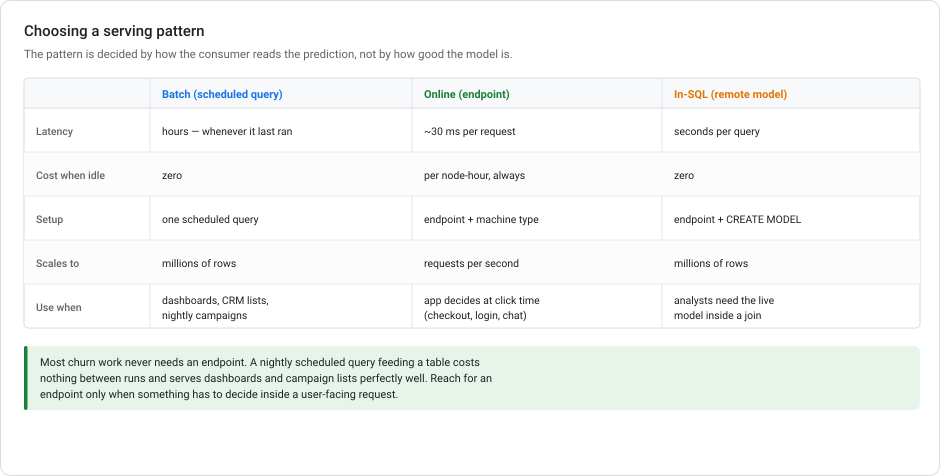
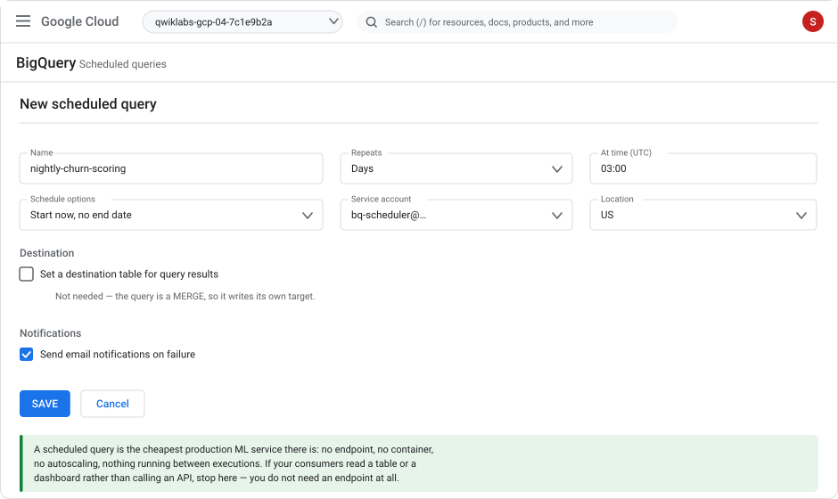
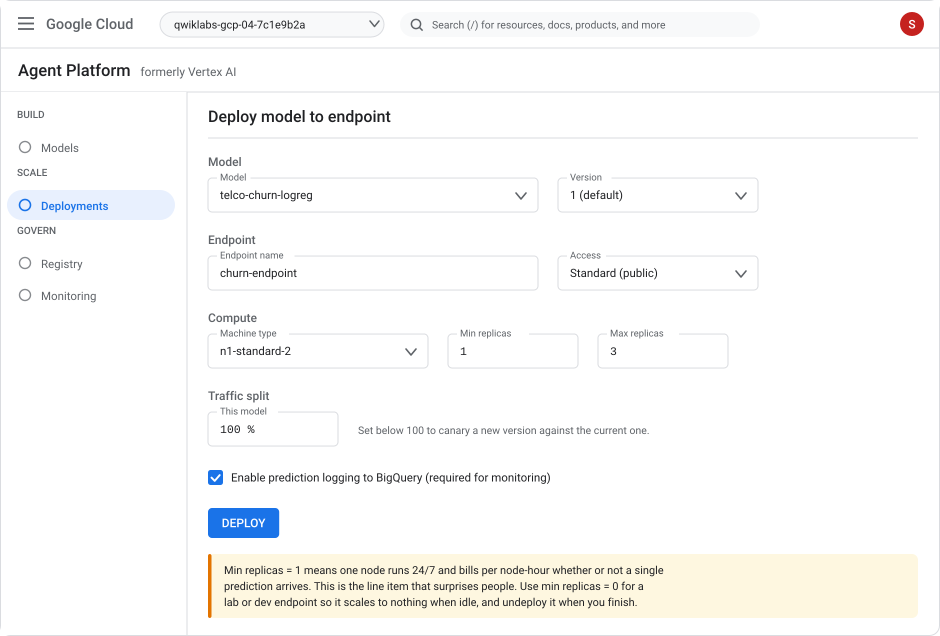
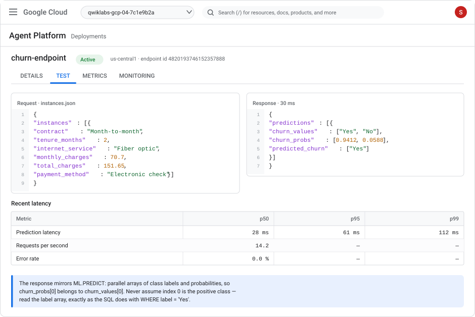
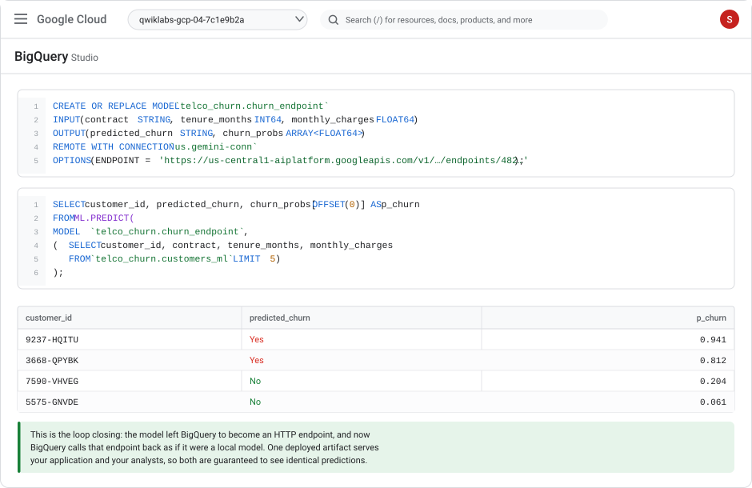
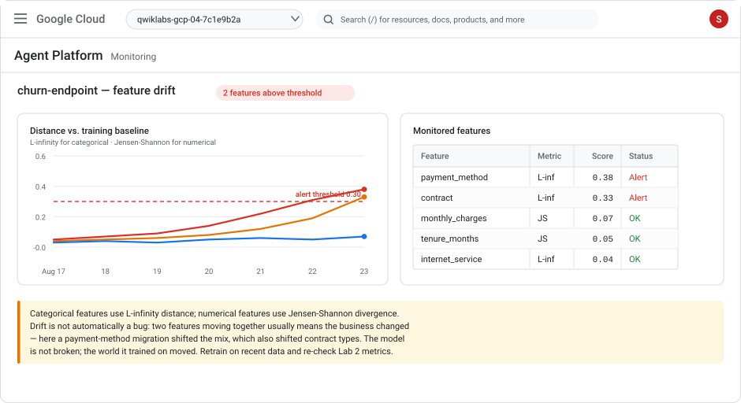

# Lab 3 — Serve a trained model: batch, online, and back inside SQL

> **Level** Intermediate  **Duration** 90–110 minutes  **Cost** an online endpoint bills **per node-hour while deployed, even with zero traffic** — budget a few dollars and do the cleanup in Task 12
> **Products** BigQuery ML · Gemini Enterprise Agent Platform (formerly Vertex AI) — Registry, Deployments, Monitoring · Cloud Scheduler · Looker Studio
> **Last updated** 23 August 2026

---

## Overview

Lab 2 ended with a trained model and a table of scores. That is where most ML tutorials stop, and it is roughly halfway to a working system. A model that nobody can call is a model that nobody uses.

This lab takes the churn model from Lab 2 and serves it three different ways — because "serving" is not one thing:

1. **Batch** — a scheduled query rescoring every customer nightly into a table. No endpoint, no container, no cost between runs.
2. **Online** — a real HTTP endpoint answering one customer in ~30 ms, for an application that has to decide during a user's request.
3. **In-SQL** — the deployed endpoint called *back* from BigQuery as a remote model, so analysts query the exact same artifact your application calls.

The most valuable thing you will take away is knowing which of these you actually need. Most churn work needs the first one, and teams routinely spend money on the second because it feels more like real ML.



### Objectives

In this lab, you learn how to:

- Choose a serving pattern from how the prediction is consumed, not from how the model was built
- Build hardened batch serving: a scheduled `MERGE` into a partitioned table, with score history and failure alerts
- Deploy a registered BigQuery ML model to an online endpoint from the console
- Understand why a logistic regression deploys in one click and a boosted tree needs a specific container
- Call the endpoint with `gcloud` and raw REST, and read the parallel-array response correctly
- Call the deployed endpoint back from BigQuery with `CREATE MODEL … REMOTE`
- Set up drift and training-serving skew monitoring, and interpret an alert
- Roll out a new model version safely with a traffic split
- Control endpoint cost with autoscaling — and shut everything down cleanly

### Prerequisites

- **[Lab 2](lab-02-customer-churn-lowcode-bqml.md) completed**, or run the 3-minute catch-up script in Task 0.
- **[Lab 1](lab-01-sentiment-analysis-bigquery-gemini.md) is optional.** If you did it, you already have the `us.gemini-conn` connection that Task 9 reuses.
- Intermediate SQL. A little familiarity with HTTP/JSON helps for Tasks 6–7 but is not required.

---

## What changed recently (read this first)

Serving is the area the 2026 reorganization touched most. Four things to know:

| Change | What it means for you |
|---|---|
| **Vertex AI → Gemini Enterprise Agent Platform** (announced 22 Apr 2026; Vertex AI left the console navigation 21 May 2026). | **Endpoints are now Deployments**, under **Scale**. **Model Registry is now Registry**, under **Govern**. Monitoring is under **Govern** too. The `gcloud ai endpoints …` commands and the `aiplatform.googleapis.com` API are **unchanged**. |
| **Feature Store optimized online serving is deprecated.** No new features since **17 May 2026**; APIs sunset **17 Feb 2027**. | Only **Bigtable online serving** is supported for new work. Task 10 covers this as an awareness topic — don't build anything new on optimized serving. |
| **Online prediction is not supported for AutoML classifier and regressor models.** | If you followed the optional AutoML path in Lab 2, that model can only be served in batch. Choose your model type with your serving pattern in mind. |
| **Boosted trees export as XGBoost Booster artifacts**, not TensorFlow SavedModels. | They serve through a Google-provided BigQuery ML XGBoost container rather than the prebuilt TF serving container. Task 8 walks it through. |

---

## Task 0. Prerequisites and catch-up

You need the `telco_churn` dataset with `customers_ml`, `churn_model`, and `churn_logreg` from Lab 2.

Check:

```sql
SELECT model_name, model_type, creation_time
FROM `telco_churn.INFORMATION_SCHEMA.MODELS`
ORDER BY creation_time;
```

You should see `churn_model` (`BOOSTED_TREE_CLASSIFIER`) and `churn_logreg` (`LOGISTIC_REG`).

<details markdown="1">
<summary><b>Didn't do Lab 2? Expand for the catch-up script.</b></summary>

Run Lab 2 Tasks 1–2 to load `customers_raw`, then run this. It reproduces the feature table and both models in about three minutes.

```sql
CREATE OR REPLACE TABLE `telco_churn.customers_ml` AS
SELECT
  customerID AS customer_id, gender,
  SeniorCitizen = 1 AS senior_citizen,
  Partner = 'Yes' AS has_partner,
  Dependents = 'Yes' AS has_dependents,
  tenure AS tenure_months,
  Contract AS contract,
  PaperlessBilling = 'Yes' AS paperless_billing,
  PaymentMethod AS payment_method,
  PhoneService = 'Yes' AS phone_service,
  MultipleLines AS multiple_lines,
  InternetService AS internet_service,
  OnlineSecurity AS online_security,
  OnlineBackup AS online_backup,
  DeviceProtection AS device_protection,
  TechSupport AS tech_support,
  StreamingTV AS streaming_tv,
  StreamingMovies AS streaming_movies,
  MonthlyCharges AS monthly_charges,
  COALESCE(SAFE_CAST(TRIM(TotalCharges) AS FLOAT64), 0.0) AS total_charges,
  SAFE_DIVIDE(COALESCE(SAFE_CAST(TRIM(TotalCharges) AS FLOAT64), 0.0),
              NULLIF(tenure, 0)) AS avg_monthly_spend,
  CASE WHEN tenure <= 6 THEN 'new'
       WHEN tenure <= 24 THEN 'growing'
       ELSE 'established' END AS tenure_band,
  (CAST(OnlineSecurity   = 'Yes' AS INT64) + CAST(OnlineBackup     = 'Yes' AS INT64) +
   CAST(DeviceProtection = 'Yes' AS INT64) + CAST(TechSupport      = 'Yes' AS INT64) +
   CAST(StreamingTV      = 'Yes' AS INT64) + CAST(StreamingMovies  = 'Yes' AS INT64)) AS addon_count,
  Churn AS churn
FROM `telco_churn.customers_raw`;

CREATE OR REPLACE MODEL `telco_churn.churn_model`
OPTIONS (MODEL_TYPE='BOOSTED_TREE_CLASSIFIER', INPUT_LABEL_COLS=['churn'],
         AUTO_CLASS_WEIGHTS=TRUE, ENABLE_GLOBAL_EXPLAIN=TRUE,
         MODEL_REGISTRY='VERTEX_AI', VERTEX_AI_MODEL_ID='telco-churn-model')
AS SELECT * EXCEPT (customer_id) FROM `telco_churn.customers_ml`;

CREATE OR REPLACE MODEL `telco_churn.churn_logreg`
OPTIONS (MODEL_TYPE='LOGISTIC_REG', INPUT_LABEL_COLS=['churn'],
         AUTO_CLASS_WEIGHTS=TRUE,
         MODEL_REGISTRY='VERTEX_AI', VERTEX_AI_MODEL_ID='telco-churn-logreg')
AS SELECT * EXCEPT (customer_id) FROM `telco_churn.customers_ml`;
```
</details>

Enable the APIs for this lab:

```bash
gcloud services enable \
  aiplatform.googleapis.com \
  bigquerydatatransfer.googleapis.com \
  bigqueryconnection.googleapis.com
```

Set a region variable — online endpoints are **regional**, not multi-region:

```bash
export PROJECT_ID=$(gcloud config get-value project)
export LOCATION=us-central1
```

---

## Task 1. Choose a serving pattern

Before you deploy anything, answer one question: **how does the consumer read the prediction?**



Work through it honestly for churn:

- A retention team pulls a call list each morning → **batch**. A prediction computed at 03:00 is exactly as useful as one computed at 09:00.
- A dashboard shows risk by segment → **batch**. Nobody is waiting 30 ms for a chart.
- A cancellation flow decides whether to show a retention offer while the customer is on the page → **online**. Nothing else works.
- An analyst wants to join live scores against a fresh cohort in an ad-hoc query → **in-SQL remote model**.

The trap is that only the third case genuinely needs an endpoint, but endpoints are what "deploying a model" is assumed to mean. An endpoint you provision for a nightly campaign is a node you rent 24 hours a day to do 20 minutes of work.

> **Rule of thumb:** if nothing is blocked waiting for the prediction, you want batch. Build the endpoint when a user-facing request depends on it, and not before.

---

## Task 2. Batch serving with a scheduled query

Start with the pattern you most likely need. The goal is a `churn_scores` table that refreshes itself nightly, keeps history, and tells you when it breaks.

### Make the scoring table partitioned and historical

Lab 2's `churn_scores` overwrote itself every run, so you could never answer "was this customer high-risk last month?" Fix that:

```sql
CREATE OR REPLACE TABLE `telco_churn.churn_scores_history` (
  score_date      DATE      NOT NULL,
  customer_id     STRING    NOT NULL,
  p_churn         FLOAT64,
  risk_tier       STRING,
  contract        STRING,
  tenure_months   INT64,
  monthly_charges FLOAT64,
  model_version   STRING,
  scored_at       TIMESTAMP
)
PARTITION BY score_date
CLUSTER BY risk_tier, customer_id
OPTIONS (
  partition_expiration_days = 400,
  description = 'Nightly churn scores. One partition per scoring run.'
);
```

Partitioning by `score_date` means a query for one day scans one day. `partition_expiration_days = 400` quietly deletes anything older than about 13 months, so the table cannot grow forever.

### Write the scoring statement

Idempotent by design — running it twice for the same day replaces that day rather than duplicating it (the concept is unpacked in [Event-driven ML automation](../modules/EVENT-DRIVEN-ML-AUTOMATION.md)):

```sql
MERGE `telco_churn.churn_scores_history` T
USING (
  SELECT
    CURRENT_DATE()  AS score_date,
    customer_id,
    (SELECT prob FROM UNNEST(predicted_churn_probs) WHERE label = 'Yes') AS p_churn,
    contract,
    tenure_months,
    monthly_charges,
    'churn_model@v1' AS model_version,
    CURRENT_TIMESTAMP() AS scored_at
  FROM ML.PREDICT(
    MODEL `telco_churn.churn_model`,
    (SELECT * FROM `telco_churn.customers_ml`)
  )
) S
ON  T.score_date  = S.score_date
AND T.customer_id = S.customer_id
WHEN MATCHED THEN UPDATE SET
  p_churn = S.p_churn,
  risk_tier = CASE WHEN S.p_churn >= 0.60 THEN 'High'
                   WHEN S.p_churn >= 0.35 THEN 'Medium' ELSE 'Low' END,
  contract = S.contract,
  tenure_months = S.tenure_months,
  monthly_charges = S.monthly_charges,
  model_version = S.model_version,
  scored_at = S.scored_at
WHEN NOT MATCHED THEN INSERT (
  score_date, customer_id, p_churn, risk_tier, contract,
  tenure_months, monthly_charges, model_version, scored_at
) VALUES (
  S.score_date, S.customer_id, S.p_churn,
  CASE WHEN S.p_churn >= 0.60 THEN 'High'
       WHEN S.p_churn >= 0.35 THEN 'Medium' ELSE 'Low' END,
  S.contract, S.tenure_months, S.monthly_charges, S.model_version, S.scored_at
);
```

Run it once manually and confirm it works before you schedule it. A scheduled query that has never succeeded is a silent failure waiting to happen.

### Schedule it

1. Paste the `MERGE` into the BigQuery editor.
2. Click **Schedule** → **Create new scheduled query**.
3. Configure:
   - **Name:** `nightly-churn-scoring`
   - **Repeats:** Days, **at 03:00 UTC**
   - **Location:** US (must match the dataset)
   - **Destination table:** leave unset — the `MERGE` writes its own target
   - **Notifications:** tick **Send email notifications on failure**



4. Click **Save**.

### Check your work

```sql
SELECT
  score_date,
  COUNT(*)                              AS customers_scored,
  COUNTIF(risk_tier = 'High')           AS high_risk,
  ROUND(AVG(p_churn), 4)                AS avg_score,
  MAX(scored_at)                        AS last_run
FROM `telco_churn.churn_scores_history`
GROUP BY score_date
ORDER BY score_date DESC;
```

Once a few days accumulate, this same query becomes your monitoring: a day missing from the output means the job did not run, and a sudden jump in `avg_score` means either the world changed or something upstream broke.

> **This is a complete production ML service.** It costs nothing between runs, needs no container, cannot fall over at 3 a.m. because a node died, and serves every dashboard and campaign list in the business. Be genuinely sure you need more before you build more.

---

## Task 3. Deploy the model to an online endpoint

Now the case where batch genuinely isn't enough: a cancellation flow that decides, while the customer is on the page, whether to show a retention offer.

Because Lab 2 set `MODEL_REGISTRY = 'VERTEX_AI'`, both models are already in the registry — there is nothing to export.

Start with the **logistic regression**. It is the clean path, and Task 4 explains why.

1. In the console, go to **Agent Platform** (searching "Vertex AI" redirects you).
2. **Govern → Registry**. Click `telco-churn-logreg`.
3. Click **Deploy & test** → **Deploy to endpoint**.
4. Configure:
   - **Endpoint name:** `churn-endpoint`
   - **Access:** Standard (public)
   - **Machine type:** `n1-standard-2`
   - **Minimum replicas:** `0` ← for this lab
   - **Maximum replicas:** `3`
   - **Traffic split:** 100%
   - Tick **Enable prediction logging to BigQuery** (Task 10 needs it)
5. Click **Deploy**. Provisioning takes **5–10 minutes**.



### Read this before you click Deploy

An endpoint bills **per node-hour for as long as a model is deployed to it**, regardless of whether it serves a single prediction. This is the most common surprise on a Google Cloud bill after someone's first ML project.

- **Minimum replicas = 0** lets the endpoint scale to nothing when idle. You pay near-zero for a quiet lab endpoint, at the cost of a cold start on the first request. Use this here.
- **Minimum replicas = 1** keeps one node warm permanently. That is the right production setting for a latency-sensitive path, and it bills 24/7 from the moment you deploy.
- Check the [current prediction pricing](https://cloud.google.com/vertex-ai/pricing) before deploying anything larger.

The equivalent in `gcloud`:

```bash
gcloud ai endpoints create \
  --region=$LOCATION \
  --display-name=churn-endpoint

export ENDPOINT_ID=$(gcloud ai endpoints list --region=$LOCATION \
  --filter="displayName=churn-endpoint" --format="value(name)" | head -1)

export MODEL_ID=$(gcloud ai models list --region=$LOCATION \
  --filter="displayName=telco-churn-logreg" --format="value(name)" | head -1)

gcloud ai endpoints deploy-model $ENDPOINT_ID \
  --region=$LOCATION \
  --model=$MODEL_ID \
  --display-name=churn-logreg-v1 \
  --machine-type=n1-standard-2 \
  --min-replica-count=0 \
  --max-replica-count=3 \
  --traffic-split=0=100
```

---

## Task 4. Why the model type decided your deployment path

You deployed the logistic regression first for a concrete reason: **the model type determines the serving artifact**, and the serving artifact determines how much work deployment is.

| BigQuery ML model type | Exports as | Serving |
|---|---|---|
| `LOGISTIC_REG`, `LINEAR_REG`, `DNN_*`, `KMEANS`, `MATRIX_FACTORIZATION` | TensorFlow SavedModel | Prebuilt TF serving container — deploys with no configuration |
| `BOOSTED_TREE_*`, `RANDOM_FOREST_*` | XGBoost Booster | Google-provided BigQuery ML XGBoost container |
| `AUTOML_CLASSIFIER`, `AUTOML_REGRESSOR` | — | **Online prediction not supported.** Batch only. |

Two consequences worth carrying into every project:

1. **Choose the model type with the serving pattern in mind.** If you know you will need a low-latency endpoint, a logistic regression that is 0.01 AUC behind may be the better engineering decision — it deploys trivially, serves faster, and is easier to explain to a risk reviewer.
2. **`TRANSFORM` travels with the model.** If you trained with a `TRANSFORM` clause (Lab 2, Task 8), that preprocessing is included in the deployed endpoint. Your application sends raw fields and the endpoint applies the same scaling and bucketizing used in training. This is the single most effective defence against training-serving skew, and it is one clause.

---

## Task 5. Call the endpoint

### With gcloud

Create a request file. The field names must match the model's input columns exactly:

```bash
cat > instances.json <<'JSON'
{"instances": [{
  "gender": "Female",
  "senior_citizen": false,
  "has_partner": false,
  "has_dependents": false,
  "tenure_months": 2,
  "contract": "Month-to-month",
  "paperless_billing": true,
  "payment_method": "Electronic check",
  "phone_service": true,
  "multiple_lines": "No",
  "internet_service": "Fiber optic",
  "online_security": "No",
  "online_backup": "No",
  "device_protection": "No",
  "tech_support": "No",
  "streaming_tv": "No",
  "streaming_movies": "No",
  "monthly_charges": 70.7,
  "total_charges": 151.65,
  "avg_monthly_spend": 75.8,
  "tenure_band": "new",
  "addon_count": 0
}]}
JSON

gcloud ai endpoints predict $ENDPOINT_ID \
  --region=$LOCATION \
  --json-request=instances.json
```

### With raw REST

```bash
curl -X POST \
  -H "Authorization: Bearer $(gcloud auth print-access-token)" \
  -H "Content-Type: application/json" \
  "https://${LOCATION}-aiplatform.googleapis.com/v1/projects/${PROJECT_ID}/locations/${LOCATION}/endpoints/${ENDPOINT_ID}:predict" \
  -d @instances.json
```



### Reading the response correctly

The response mirrors `ML.PREDICT`: **parallel arrays**.

```json
{"predictions": [{
  "churn_values": ["Yes", "No"],
  "churn_probs":  [0.9412, 0.0588],
  "predicted_churn": ["Yes"]
}]}
```

`churn_probs[0]` corresponds to `churn_values[0]`. **Never hardcode index 0 as the positive class.** Class ordering is not contractual, and a retrain can reorder it — at which point your application silently starts offering retention discounts to your happiest customers. Look up the index of `"Yes"` in `churn_values`, exactly as the SQL does with `WHERE label = 'Yes'`.

> **First request after idle will be slow.** With `min-replica-count=0` the endpoint scales to zero, so the first call pays a cold start of several seconds. That is the trade you accepted for a near-free lab endpoint; production latency paths use `min-replica-count=1`.

---

## Task 6. Deploy the boosted tree

Now deploy the stronger model and see the difference.

**Try the registry path first** — registered BigQuery ML models carry their own container specification, so this usually just works:

1. **Govern → Registry** → `telco-churn-model` → **Deploy to endpoint**.
2. Deploy to the **same** `churn-endpoint`, with **traffic split 0%** for now (Task 8 shifts traffic to it deliberately).

If the console will not deploy it, the model needs to be uploaded with the BigQuery ML XGBoost container explicitly. Export and upload it:

```bash
# 1. Export the model as an XGBoost Booster artifact
bq extract --destination_format ML_XGBOOST_BOOSTER \
  -m telco_churn.churn_model \
  gs://$PROJECT_ID-models/churn_model/

# 2. Upload it with the Google-provided BigQuery ML XGBoost container
gcloud ai models upload \
  --region=$LOCATION \
  --display-name=telco-churn-xgb \
  --artifact-uri=gs://$PROJECT_ID-models/churn_model/ \
  --container-image-uri=us-docker.pkg.dev/vertex-ai/bigquery-ml/xgboost-cpu.1-0:latest
```

Use the container URI matching your region — `europe-docker.pkg.dev/...` or `asia-docker.pkg.dev/...` for the other multi-regions.

> The exported artifact includes a `main.py` and `xgboost_predictor.py` alongside the booster file. That is the custom prediction routine the container runs — the reason a boosted tree cannot use the plain prebuilt TF serving image.

---

## Task 7. Call the endpoint back from BigQuery

Here is the part that makes the whole architecture click. You just moved the model *out* of BigQuery to serve an application. Now bring it back — so analysts query the identical deployed artifact rather than a separate copy that may have drifted.

You need a `CLOUD_RESOURCE` connection. If you did Lab 1 you already have `us.gemini-conn`; otherwise create one and grant it **Agent Platform User** (`roles/aiplatform.user`) exactly as in Lab 1, Tasks 4–5.

```sql
CREATE OR REPLACE MODEL `telco_churn.churn_endpoint`
INPUT (
  contract         STRING,
  tenure_months    INT64,
  monthly_charges  FLOAT64
)
OUTPUT (
  predicted_churn  STRING,
  churn_probs      ARRAY<FLOAT64>
)
REMOTE WITH CONNECTION `us.gemini-conn`
OPTIONS (
  ENDPOINT = 'https://us-central1-aiplatform.googleapis.com/v1/projects/PROJECT_ID/locations/us-central1/endpoints/ENDPOINT_ID'
);
```

Replace `PROJECT_ID` and `ENDPOINT_ID`. Then query it like any other model:

```sql
SELECT
  customer_id,
  predicted_churn,
  churn_probs[OFFSET(0)] AS p_churn
FROM ML.PREDICT(
  MODEL `telco_churn.churn_endpoint`,
  (
    SELECT customer_id, contract, tenure_months, monthly_charges
    FROM `telco_churn.customers_ml`
    LIMIT 5
  )
);
```



Points that matter:

- **`INPUT` and `OUTPUT` are a contract you declare.** BigQuery has no way to introspect an arbitrary endpoint, so you describe its shape. Get a type wrong and you get a runtime error, not a helpful one.
- **Input column names must match the `INPUT` declaration**, which must match what the endpoint expects. Rename with `AS` in the subquery if needed.
- **This is not free and not fast.** Every row is an HTTP request to your endpoint. Use it for interactive analysis over hundreds or thousands of rows — for millions, use in-BigQuery `ML.PREDICT` against the local model as in Task 2.

> **Why bother, when BigQuery already has the model locally?** Because after a few retrains they are no longer the same model. Pointing both consumers at one deployed artifact means your dashboard and your application cannot disagree — and "why does the dashboard say 0.62 and the app say 0.41 for the same customer?" is a genuinely miserable afternoon.

---

## Task 8. Roll out a new version safely

Endpoints support **traffic splitting**, which is how you ship a new model without betting the whole customer base on it.

Both models are on `churn-endpoint`: the logistic regression at 100%, the boosted tree at 0%. Send 10% to the new model:

```bash
gcloud ai endpoints update $ENDPOINT_ID \
  --region=$LOCATION \
  --traffic-split=DEPLOYED_LOGREG_ID=90,DEPLOYED_XGB_ID=10
```

Get the deployed-model IDs (these are **not** the model IDs) with:

```bash
gcloud ai endpoints describe $ENDPOINT_ID --region=$LOCATION \
  --format="table(deployedModels.id, deployedModels.displayName)"
```

Because you enabled prediction logging to BigQuery, you can compare the two live:

```sql
SELECT
  deployed_model_id,
  COUNT(*)                                   AS requests,
  ROUND(AVG(latency_ms), 1)                  AS avg_latency_ms,
  ROUND(AVG(predicted_p_churn), 4)           AS avg_score
FROM `telco_churn.prediction_logs`
WHERE DATE(request_timestamp) = CURRENT_DATE()
GROUP BY deployed_model_id;
```

(Adjust column names to match your logging table's schema — it is created for you when logging is enabled.)

Promote when you are satisfied, or roll back instantly by setting the split back to `100,0`. Nothing redeploys; traffic just moves.

> **What you are watching for is not accuracy** — you cannot measure churn accuracy in real time, because the outcome takes months. You are watching latency, error rate, and **score distribution**. A new model whose average score jumps from 0.26 to 0.51 is not more accurate; it is miscalibrated, and it will flood your retention team with false positives.

---

## Task 9. Monitor for drift and skew

A deployed model degrades silently. Nothing errors; the predictions just stop being right.

1. Go to **Agent Platform → Govern → Monitoring** (or the **Monitoring** tab on your endpoint).
2. Create a monitoring job:
   - **Endpoint:** `churn-endpoint`
   - **Baseline:** BigQuery table → `telco_churn.customers_ml` (the training data)
   - **Monitoring frequency:** every 24 hours
   - **Alert threshold:** `0.30` to start
   - **Features to monitor:** `contract`, `tenure_months`, `monthly_charges`, `internet_service`, `payment_method`
   - **Notification email:** yours



Two distinct things get measured, and the difference matters:

- **Training-serving skew** — production inputs vs. the **training data**. Catches "the app sends `Month-to-Month` but the model was trained on `Month-to-month`", the kind of bug that produces confidently wrong answers with no error anywhere.
- **Drift** — recent production inputs vs. **earlier production inputs**. Catches the world changing after you deployed.

### Interpreting an alert

The figure shows `payment_method` and `contract` both crossing the threshold together. Before touching the model, ask what happened in the business — correlated drift across related features almost always means a real change (a migration campaign, a pricing change, a new market), not a broken pipeline. A *single* feature drifting alone is more often an upstream data bug.

Either way the response is the same: **retrain on recent data and re-run the Lab 2 evaluation.** Drift tells you to look; it does not tell you the model is wrong.

> Set the threshold from a period you believe was healthy, rather than accepting `0.30` because it is the default. Too tight and the team learns to ignore the alerts, which is worse than having none.

---

## Task 10. Online features (optional, read before building)

If your application must score a customer using features it does not already have to hand — "how many support tickets in the last 7 days?" — something has to serve those features with low latency. That is Feature Store: BigQuery as the offline source, an online store synced from it, joined at request time.

**Check the deprecation status before building anything here.** As of **17 May 2026** Feature Store **optimized online serving** receives no new features and only critical patches, and its APIs **sunset on 17 Feb 2027**. Only **Bigtable online serving** is supported for new work.

The shape, if you do need it:

1. **Feature group** over a BigQuery table (your source of truth).
2. **Feature view** — the subset of columns to sync, with a sync schedule.
3. **Online store** (Bigtable) — serves the synced values at low latency.
4. Application fetches features by entity ID, then calls the endpoint.

For this lab's model, you do not need any of it: every feature comes from the request or from `customers_ml`, which BigQuery already serves. Feature Store earns its complexity when features are **computed** (rolling aggregates, recent-behaviour windows) and shared across several models.

---

## Task 11. Control the cost

The single most important operational task in this lab.

### Right-size the endpoint

```bash
gcloud ai endpoints describe $ENDPOINT_ID --region=$LOCATION \
  --format="yaml(deployedModels.dedicatedResources)"
```

- **`minReplicaCount: 0`** — scales to zero when idle. Correct for dev, lab, and low-traffic internal endpoints. Costs a cold start.
- **`minReplicaCount: 1`** — one node always warm. Correct for user-facing latency paths. Bills 24/7.
- **`maxReplicaCount`** — your blast radius. A traffic spike (or a retry loop in a client) scales you up to this number and bills for it.
- **Machine type** — `n1-standard-2` handles a churn model comfortably. GPUs do nothing for a boosted tree or logistic regression; do not attach one.

### Watch what it costs

Set a budget alert before you forget the endpoint exists:

```bash
gcloud billing budgets create \
  --billing-account=$(gcloud billing projects describe $PROJECT_ID \
     --format="value(billingAccountName)" | sed 's|.*/||') \
  --display-name="ml-serving-guard" \
  --budget-amount=25USD \
  --threshold-rule=percent=0.5 \
  --threshold-rule=percent=0.9
```

### The comparison to remember

Scoring 7,043 customers nightly:

- **Batch** — one BigQuery job, a few seconds of slot time, comfortably inside the free tier. Effectively **zero** between runs.
- **Online endpoint** — one `n1-standard-2` node-hour × 24 × 30 whether you send 7,000 requests or none.

The endpoint is not worse; it does something batch cannot. But if you are only rescoring a table on a schedule, it is pure cost for no capability.

---

## Task 12. Cleanup — do not skip this

**Deleting the BigQuery dataset does not stop endpoint charges.** Undeploy first.

```bash
# 1. Undeploy every model from the endpoint (this is what stops the billing)
for DM in $(gcloud ai endpoints describe $ENDPOINT_ID --region=$LOCATION \
            --format="value(deployedModels.id)"); do
  gcloud ai endpoints undeploy-model $ENDPOINT_ID \
    --region=$LOCATION --deployed-model-id=$DM --quiet
done

# 2. Delete the endpoint
gcloud ai endpoints delete $ENDPOINT_ID --region=$LOCATION --quiet

# 3. Delete the registered models
gcloud ai models delete $MODEL_ID --region=$LOCATION --quiet

# 4. Remove the scheduled query
bq ls --transfer_config --transfer_location=US
bq rm --transfer_config <CONFIG_ID>

# 5. Drop the dataset and any exported artifacts
bq rm -r -f -d $PROJECT_ID:telco_churn
gsutil -m rm -r gs://$PROJECT_ID-models/ 2>/dev/null
```

Verify nothing is left running:

```bash
gcloud ai endpoints list --region=$LOCATION
```

An empty result is what you want. If you disable monitoring but leave a model deployed, you keep paying.

---

## Test your understanding

<details markdown="1">
<summary><b>1.</b> Your team wants "the churn model deployed" so the retention team gets a daily call list. What do you build?</summary>

A scheduled query, not an endpoint. Nothing is blocked waiting on the prediction — a list produced at 03:00 is exactly as useful at 09:00. A batch job costs nothing between runs, has no cold starts, and cannot fail because a node died. Reserve endpoints for predictions that a user-facing request is waiting on.
</details>

<details markdown="1">
<summary><b>2.</b> You deploy an endpoint with <code>min-replica-count=1</code>, send no traffic for a month, and get a bill. Why?</summary>

Endpoints bill per node-hour for as long as a model is deployed, not per prediction. One replica held warm is one node rented 24/7. Use `min-replica-count=0` for anything that isn't latency-critical, and undeploy models you're finished with — deleting the BigQuery dataset does nothing to the endpoint.
</details>

<details markdown="1">
<summary><b>3.</b> Your boosted tree won't deploy the same way your logistic regression did. What's going on?</summary>

Model type determines the serving artifact. Logistic regression exports as a TensorFlow SavedModel and runs in the prebuilt TF serving container. Boosted trees export as an XGBoost Booster with a custom prediction routine, so they need the Google-provided BigQuery ML XGBoost container (`us-docker.pkg.dev/vertex-ai/bigquery-ml/xgboost-cpu.1-0:latest` in the US). AutoML classifiers can't be served online at all.
</details>

<details markdown="1">
<summary><b>4.</b> Your app reads <code>churn_probs[0]</code> as the churn probability. What will eventually break?</summary>

Class ordering isn't contractual. `churn_probs` is parallel to `churn_values`, and a retrain can reorder them. When it does, your app starts reading the probability of *not* churning as the probability of churning — with no error raised. Look up the index of `"Yes"` in `churn_values` on every response.
</details>

<details markdown="1">
<summary><b>5.</b> You're canarying a new model at 10% traffic. What do you actually watch, given churn outcomes take months to observe?</summary>

Latency, error rate, and score distribution. You cannot measure accuracy in real time. A new model whose mean score jumps from 0.26 to 0.51 isn't better — it's miscalibrated, and it will bury the retention team in false positives. Distribution shift against the old model is the signal available today.
</details>

<details markdown="1">
<summary><b>6.</b> Monitoring alerts that <code>payment_method</code> and <code>contract</code> have both drifted past threshold. First move?</summary>

Ask what changed in the business before touching the model. Correlated drift across related features usually reflects a real event — a payment-migration campaign, a pricing change — rather than a broken pipeline. A single feature drifting in isolation is more often an upstream data bug. In both cases you retrain on recent data and re-run the Lab 2 evaluation, but the diagnosis differs.
</details>

<details markdown="1">
<summary><b>7.</b> Why call the endpoint back from BigQuery when BigQuery already holds the model locally?</summary>

So there is one artifact rather than two. After a few retrains, the in-BigQuery model and the deployed endpoint are different models, and your dashboard and your application start disagreeing about the same customer. Pointing both at one deployed endpoint makes that impossible. The cost is speed — every row becomes an HTTP request, so this is for interactive analysis, not for scoring millions of rows.
</details>

---

## Congratulations!

You served one trained model three ways and — more importantly — can now say which one a given requirement actually needs.

Three things worth carrying forward:

1. **Serving pattern follows the consumer, not the model.** "Deploy the model" is not a requirement; "the cancellation page must decide in under 100 ms" is.
2. **The model type is a serving decision.** Choosing a boosted tree over a logistic regression for 0.01 AUC also chooses a container, a cold-start profile, and a deployment path. Decide that consciously.
3. **Deployment is the start of the maintenance, not the end of the project.** Drift monitoring, traffic splitting, and a cleanup runbook are the parts that keep it working in month six.

### Next steps

- Trigger retraining automatically when drift crosses threshold, with Cloud Scheduler and a `CREATE OR REPLACE MODEL` statement
- Put the endpoint behind API Gateway or Apigee for API keys, quotas, and rate limits
- Join Lab 1's sentiment scores to Lab 2's churn scores — customers who are both high-risk and writing negative reviews are your highest-priority contacts
- Read the root-level **[Scaling prototypes into ML models](../modules/SCALING-PROTOTYPES-TO-ML.md)** module for how this fits the wider path from notebook to production

### References

- [Export a BigQuery ML model for online prediction](https://docs.cloud.google.com/bigquery/docs/export-model-tutorial)
- [Make predictions with remote models on Vertex AI](https://docs.cloud.google.com/bigquery/docs/bigquery-ml-remote-model-tutorial)
- [Deploy a model to an endpoint](https://docs.cloud.google.com/gemini-enterprise-agent-platform/machine-learning/general/deployment)
- [`gcloud ai endpoints deploy-model`](https://docs.cloud.google.com/sdk/gcloud/reference/ai/endpoints/deploy-model)
- [Monitor feature skew and drift](https://docs.cloud.google.com/vertex-ai/docs/model-monitoring/using-model-monitoring)
- [About Feature Store](https://docs.cloud.google.com/vertex-ai/docs/featurestore/latest/overview) — check deprecation status first
- [Scheduling queries in BigQuery](https://docs.cloud.google.com/bigquery/docs/scheduling-queries)
