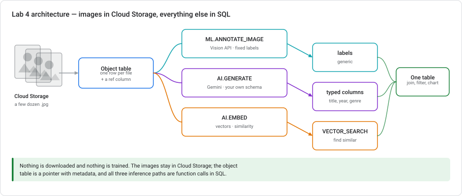
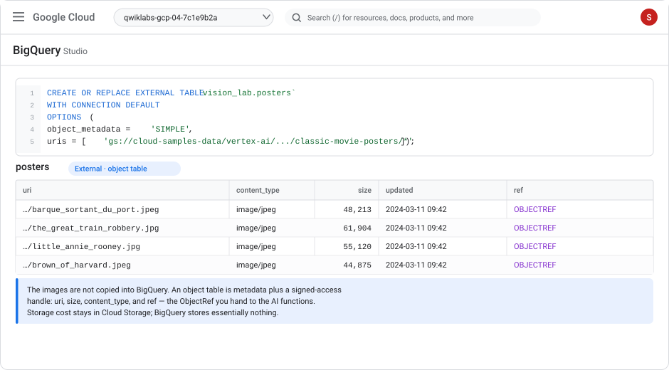
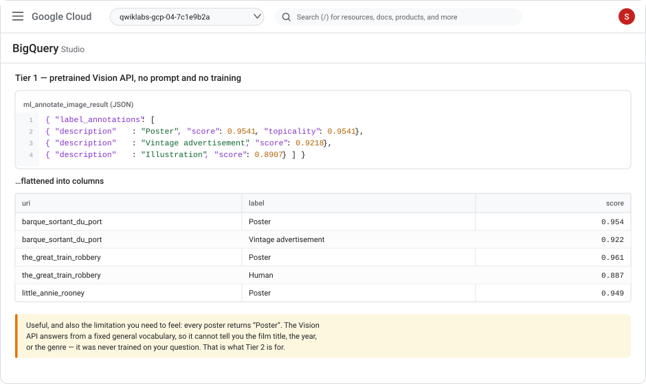
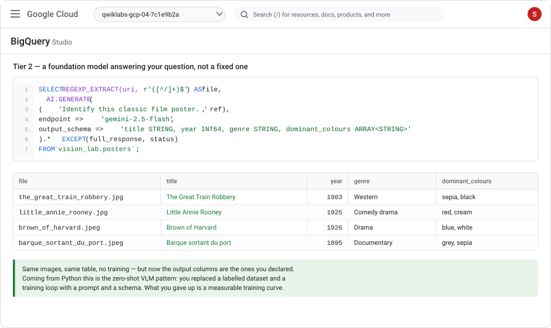
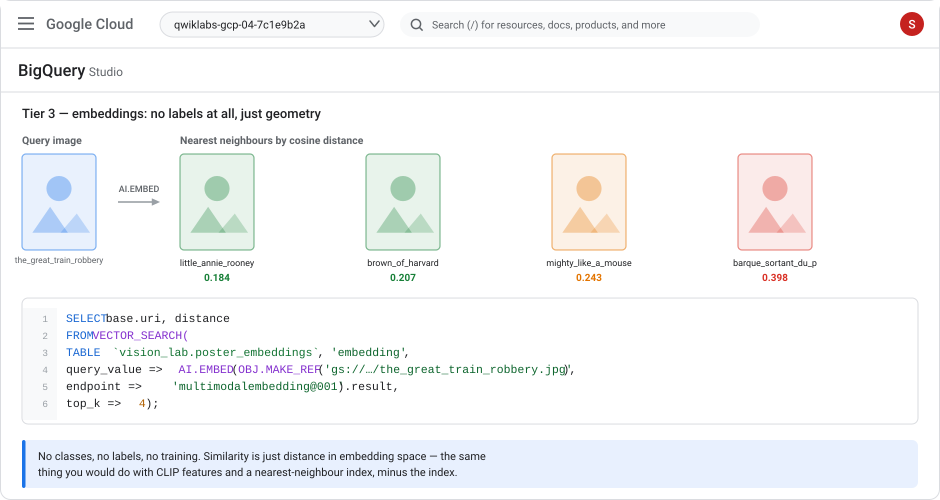
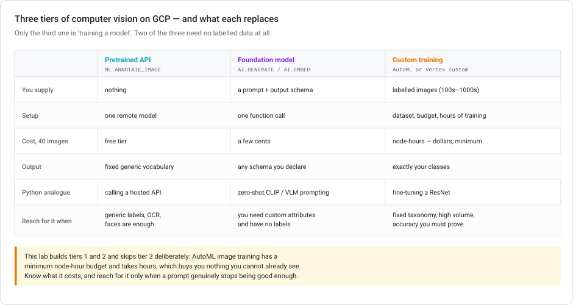

# Lab 4 — Computer vision without training anything

> **Level** Intermediate  **Duration** 60–75 minutes  **Cost** under **US$0.10** — Vision API's first 1,000 units/month are free, and the images are already in a public bucket
> **Products** BigQuery object tables · Cloud Vision API · Gemini via Agent Platform · `VECTOR_SEARCH`
> **Last updated** 23 August 2026

---

## Three Tiers of Vision, No Training

This is the deliberately minimal lab. A few dozen public-domain movie posters, already sitting in a Google-owned Cloud Storage bucket. Nothing to download, nothing to upload, no dataset to clean, no model to train. What you get in exchange is the complete end-to-end shape of image work on Google Cloud, in about an hour, for roughly the price of nothing.

You will run the same set of images through **three different kinds of vision**, and the point of the lab is feeling the difference between them:

1. **A pretrained API** that returns labels from a fixed vocabulary — no prompt, no training.
2. **A foundation model** that answers a question you write, returning columns you declare — no training either.
3. **Embeddings**, which have no labels at all and turn similarity into arithmetic.

Then you look honestly at the fourth option — actually training a custom image model — and decide when it earns its cost.



### If you already know ML in Python

This lab is written for you. You will not be told what precision is. What you will get instead is the mapping, because the concepts are all familiar and only the surface is new:

| What you'd do in Python | What it is here | Where it differs |
|---|---|---|
| `PIL.Image.open()` over a directory | An **object table** — one row per file | The bytes never move. The table holds metadata plus a reference. |
| Calling a hosted vision API | `ML.ANNOTATE_IMAGE` | It's a table function; results come back as JSON columns. |
| Zero-shot CLIP or a VLM prompt | `AI.GENERATE` with `output_schema` | The schema is enforced at the call, so you get typed columns, not text to parse. |
| `model.encode(img)` → CLIP vectors | `AI.EMBED(ref, endpoint => 'multimodalembedding@001')` | Embeddings land in a table column. |
| FAISS / Annoy index | `VECTOR_SEARCH` | No index to build for small tables; brute force is fine. |
| Fine-tuning a ResNet | AutoML image or Vertex custom training | Discussed in Task 7 and deliberately **not** built — see why there. |

The genuinely new idea is the object table. Everything else is a rename.

### Vision Techniques Covered

- Create an object table over images in Cloud Storage and understand what it does and does not store
- Run Cloud Vision label detection from SQL and parse the JSON result
- Extract typed, custom attributes from images with a Gemini multimodal prompt
- Validate model output against a ground-truth signal you get for free
- Generate multimodal embeddings and run similarity search with `VECTOR_SEARCH`
- Judge when a custom-trained image model is actually worth the money

### Prerequisites

- A Google Cloud project with billing enabled
- **[Lab 1](lab-01-sentiment-analysis-bigquery-gemini.md) is helpful but not required** — if you did it you already have a connection and the IAM grant, and Task 1 takes two minutes instead of ten
- No Kaggle account, no downloads, no local storage

---

## Naming and API Changes to Know

| Change | Effect |
|---|---|
| **Vertex AI → Gemini Enterprise Agent Platform** (console entry removed 21 May 2026). | The IAM role shows as **Agent Platform User**; the role ID `roles/aiplatform.user` and the API `aiplatform.googleapis.com` are unchanged. |
| **Object tables now expose a `ref` column** holding an `ObjectRef`. | You can pass `ref` straight into `AI.GENERATE` and `AI.EMBED`. Older tutorials pass a `uri` string or wrap it in `OBJ.GET_ACCESS_URL(ref, 'r')` — both still work. |
| **`WITH CONNECTION DEFAULT` is supported.** | BigQuery auto-provisions a default connection, so a minimal object table needs no explicit connection at all. This lab uses it. |

---

## Task 1. Setup

```bash
export PROJECT_ID=$(gcloud config get-value project)

gcloud services enable \
  bigquery.googleapis.com \
  bigqueryconnection.googleapis.com \
  aiplatform.googleapis.com \
  vision.googleapis.com
```

Create the dataset in the **US multi-region** — the sample bucket is US, and an object table's connection must be location-compatible with the data:

```bash
bq --location=US mk -d vision_lab
```

### The connection

This lab uses `WITH CONNECTION DEFAULT`, which auto-provisions `__default_cloudresource_connection__` on first use. You still have to grant its service account access, exactly as in Lab 1:

1. Run the object table creation in Task 2 (this triggers provisioning).
2. **BigQuery Studio → Explorer → External connections** → click the default connection → copy the **Service account id**.
3. **IAM & Admin → IAM → Grant access**, paste it, and add **two** roles:
   - **Agent Platform User** (`roles/aiplatform.user`) — for Gemini and embeddings
   - **Storage Object Viewer** (`roles/storage.objectViewer`) — for reading the images

> The Storage role is the one people forget. Without it the object table is created successfully and every query against it returns a permission error on the *objects*, which reads like a BigQuery problem and isn't. If you did Lab 1, you already have the Agent Platform grant but probably not this one.

Wait ~60 seconds after granting before your first query.

---

## Task 2. Create an object table

This is the one genuinely new concept in the lab.

```sql
CREATE OR REPLACE EXTERNAL TABLE `vision_lab.posters`
WITH CONNECTION DEFAULT
OPTIONS (
  object_metadata = 'SIMPLE',
  uris = ['gs://cloud-samples-data/vertex-ai/dataset-management/datasets/classic-movie-posters/*']
);
```

That's the whole ingest step. Look at what you got:

```sql
SELECT uri, content_type, size, updated
FROM `vision_lab.posters`
ORDER BY uri;
```



### What an object table is

**It is not a copy of your images.** It is a read-only external table with one row per object, holding metadata (`uri`, `size`, `content_type`, `updated`, `generation`, `md5_hash`) plus a `ref` column containing an `ObjectRef` — a handle that lets BigQuery's AI functions fetch the bytes on your behalf, using the connection's identity.

Consequences worth internalizing:

- **Storage cost stays in Cloud Storage.** BigQuery stores essentially nothing. A billion images cost you nothing in BigQuery storage.
- **The bucket is the source of truth.** Add files to the bucket and they appear (subject to metadata caching); the table never drifts from the bucket.
- **Permissions are two-layer.** BigQuery permissions get you to the table; the *connection's* Storage permission gets you to the bytes.
- **It is read-only.** You cannot `INSERT` into an object table. You derive new tables from it.

### Check your work

```sql
SELECT
  COUNT(*)                                  AS images,
  COUNT(DISTINCT content_type)              AS content_types,
  ROUND(SUM(size) / 1024 / 1024, 2)         AS total_mb
FROM `vision_lab.posters`;
```

You should see a few dozen images, a couple of MIME types (`image/jpeg` and `image/png`), and a total measured in single-digit megabytes. Note the count — it is the denominator for every cost estimate below.

---

## Task 3. Tier 1 — a pretrained API

The Cloud Vision API is a fixed, pretrained model. You do not prompt it and you cannot change what it knows. You pick a feature and it answers.

Create the remote model — note `REMOTE_SERVICE_TYPE`, which is what makes this a Cloud AI service rather than a Gemini endpoint:

```sql
CREATE OR REPLACE MODEL `vision_lab.vision_api`
REMOTE WITH CONNECTION DEFAULT
OPTIONS (REMOTE_SERVICE_TYPE = 'CLOUD_AI_VISION_V1');
```

Annotate the images:

```sql
CREATE OR REPLACE TABLE `vision_lab.poster_labels_raw` AS
SELECT *
FROM ML.ANNOTATE_IMAGE(
  MODEL `vision_lab.vision_api`,
  TABLE `vision_lab.posters`,
  STRUCT(['LABEL_DETECTION'] AS vision_features)
);
```

The output adds two columns to the input table: `ml_annotate_image_result` (JSON) and `ml_annotate_image_status` (empty string on success).

Always check the status column before trusting a batch — the same discipline as Lab 1:

```sql
SELECT COUNTIF(ml_annotate_image_status != '') AS failed
FROM `vision_lab.poster_labels_raw`;
```

Now flatten the JSON into columns:

```sql
CREATE OR REPLACE TABLE `vision_lab.poster_labels` AS
SELECT
  REGEXP_EXTRACT(uri, r'([^/]+)$')                     AS file_name,
  JSON_VALUE(label, '$.description')                   AS label,
  CAST(JSON_VALUE(label, '$.score') AS FLOAT64)        AS score
FROM `vision_lab.poster_labels_raw`,
     UNNEST(JSON_QUERY_ARRAY(ml_annotate_image_result, '$.label_annotations')) AS label
WHERE ml_annotate_image_status = '';

SELECT * FROM `vision_lab.poster_labels`
ORDER BY file_name, score DESC;
```



### Now look at what you got

```sql
SELECT label, COUNT(*) AS images, ROUND(AVG(score), 3) AS avg_score
FROM `vision_lab.poster_labels`
GROUP BY label
ORDER BY images DESC
LIMIT 15;
```

Almost every image comes back as **"Poster"**, plus generic terms like *Illustration*, *Vintage advertisement*, *Font*. All correct. All useless for anything you would actually want to know.

**This is the lesson of Tier 1, and it is worth feeling rather than reading.** The Vision API answers from a general vocabulary fixed at training time. It cannot tell you the film's title, its year, or its genre — not because it is weak, but because nobody trained it on your question. When your question happens to match what it knows (is there text in this image? a face? a logo? is it explicit?), it is excellent, instant, and free at this volume. When it doesn't, no amount of retrying helps.

> **Other features worth knowing:** `TEXT_DETECTION` (OCR — genuinely strong), `OBJECT_LOCALIZATION` (bounding boxes), `FACE_DETECTION`, `LOGO_DETECTION`, `SAFE_SEARCH_DETECTION` (content moderation). **Each feature applied to each image is a separate billable unit** — asking for three features on 40 images is 120 units, not 40.

---

## Task 4. Tier 2 — a foundation model answering your question

Same images, same table. This time you write the question and declare the answer's shape.

```sql
SELECT
  REGEXP_EXTRACT(uri, r'([^/]+)$') AS file_name,
  AI.GENERATE(
    (
      'This is a poster for a classic film. Identify it. ',
      'If you cannot determine a field with reasonable confidence, return NULL for it. ',
      ref
    ),
    endpoint => 'gemini-2.5-flash',
    model_params => JSON '{"generation_config": {"temperature": 0}}',
    output_schema => 'title STRING, year INT64, genre STRING, dominant_colours ARRAY<STRING>, has_text BOOL'
  ).* EXCEPT (full_response, status)
FROM `vision_lab.posters`
ORDER BY file_name
LIMIT 5;
```



Three things to notice:

- **`ref` goes straight into the prompt tuple.** The `ObjectRef` from the object table is passed as a prompt element alongside your text. If your project errors here, wrap it explicitly: `OBJ.GET_ACCESS_URL(ref, 'r')`.
- **`output_schema` is the same mechanism as Lab 1.** Text or images, the contract works identically — which is exactly why multimodal fits the warehouse so well. The model's output becomes columns.
- **Explicitly permitting NULL matters.** Without that instruction the model will confidently invent a year for a poster it cannot identify. Giving it a licence to abstain is one sentence and materially improves what you get.

Materialize the full run:

```sql
CREATE OR REPLACE TABLE `vision_lab.poster_attributes` AS
SELECT
  uri,
  REGEXP_EXTRACT(uri, r'([^/]+)$') AS file_name,
  AI.GENERATE(
    (
      'This is a poster for a classic film. Identify it. ',
      'If you cannot determine a field with reasonable confidence, return NULL for it. ',
      ref
    ),
    endpoint => 'gemini-2.5-flash',
    model_params => JSON '{"generation_config": {"temperature": 0}}',
    output_schema => 'title STRING, year INT64, genre STRING, dominant_colours ARRAY<STRING>, has_text BOOL'
  ).* EXCEPT (full_response)
FROM `vision_lab.posters`;
```

### Check your work

```sql
SELECT
  COUNT(*)                        AS images,
  COUNTIF(status != '')           AS failed,
  COUNTIF(title IS NULL)          AS no_title,
  COUNTIF(year IS NULL)           AS no_year,
  COUNT(DISTINCT genre)           AS genres
FROM `vision_lab.poster_attributes`;
```

Some NULLs here are a **good** sign — it means the abstain instruction is working rather than the model bluffing.

---

## Task 5. Validate against ground truth

This dataset has a quiet gift: **the filenames are the film titles.** `the_great_train_robbery.jpg`, `little_annie_rooney.jpg`. That is a free ground-truth label the model never saw — it only ever received image bytes.

```sql
WITH compared AS (
  SELECT
    file_name,
    title AS predicted_title,
    -- filename -> comparable form: strip extension, underscores to spaces
    LOWER(REGEXP_REPLACE(REGEXP_REPLACE(file_name, r'\.[a-z]+$', ''), r'_', ' ')) AS truth_title,
    LOWER(TRIM(COALESCE(title, ''))) AS pred_norm,
    year, genre
  FROM `vision_lab.poster_attributes`
)
SELECT
  file_name,
  truth_title,
  predicted_title,
  year,
  CASE
    WHEN pred_norm = ''                              THEN 'abstained'
    WHEN pred_norm = truth_title                     THEN 'exact'
    WHEN STRPOS(truth_title, pred_norm) > 0
      OR STRPOS(pred_norm, truth_title) > 0          THEN 'partial'
    ELSE                                                  'mismatch'
  END AS verdict
FROM compared
ORDER BY verdict, file_name;
```

And the headline:

```sql
WITH compared AS (
  SELECT
    LOWER(REGEXP_REPLACE(REGEXP_REPLACE(file_name, r'\.[a-z]+$', ''), r'_', ' ')) AS truth_title,
    LOWER(TRIM(COALESCE(title, ''))) AS pred_norm
  FROM `vision_lab.poster_attributes`
)
SELECT
  COUNT(*)                                                        AS images,
  COUNTIF(pred_norm = truth_title)                                AS exact,
  COUNTIF(pred_norm != '' AND pred_norm != truth_title
          AND (STRPOS(truth_title, pred_norm) > 0
            OR STRPOS(pred_norm, truth_title) > 0))               AS partial,
  COUNTIF(pred_norm = '')                                         AS abstained,
  ROUND(100 * COUNTIF(pred_norm = truth_title) / COUNT(*), 1)     AS exact_pct
FROM compared;
```

### Reading the Match Rate

Do not expect a high exact-match rate, and do not treat that as failure. Three separate things are being measured at once, and only one of them is model error:

1. **String matching is brutal.** `the great train robbery` vs `The Great Train Robbery (1903)` is a correct identification scored as a mismatch. This is why the `partial` bucket exists.
2. **Filenames are a proxy, not a label.** Nobody curated them as ground truth.
3. **Genuine misidentification** — obscure silent films the model has legitimately never seen.

Read the mismatches directly before concluding anything:

```sql
SELECT file_name, title, year, genre
FROM `vision_lab.poster_attributes`
WHERE title IS NOT NULL
ORDER BY file_name;
```

> **The transferable habit:** find a signal the model didn't see and check against it. In Lab 1 it was the star rating. Here it's the filename. Both are imperfect proxies, and both are enormously better than eyeballing ten rows and declaring success. If you have no ground truth at all, that is itself a finding — it means you cannot yet tell whether this works.

---

## Task 6. Tier 3 — embeddings and similarity

Neither of the last two tasks required labelled data, but both required you to know what to *ask*. Embeddings require neither. They turn each image into a vector, and similarity becomes distance.

```sql
CREATE OR REPLACE TABLE `vision_lab.poster_embeddings` AS
SELECT
  uri,
  REGEXP_EXTRACT(uri, r'([^/]+)$') AS file_name,
  AI.EMBED(ref, endpoint => 'multimodalembedding@001').result AS embedding
FROM `vision_lab.posters`;
```

Check the vector dimensionality:

```sql
SELECT file_name, ARRAY_LENGTH(embedding) AS dims
FROM `vision_lab.poster_embeddings`
LIMIT 3;
```

### Find visually similar posters

Pick any `uri` from your table and search for its neighbours:

```sql
SELECT
  base.file_name,
  ROUND(distance, 4) AS distance
FROM VECTOR_SEARCH(
  TABLE `vision_lab.poster_embeddings`,
  'embedding',
  (
    SELECT embedding
    FROM `vision_lab.poster_embeddings`
    WHERE file_name = 'the_great_train_robbery.jpg'
  ),
  'embedding',
  top_k => 5
)
ORDER BY distance;
```



### Search images with words

`multimodalembedding@001` puts text and images in the **same** vector space, so a text query can retrieve images without any labels, captions, or OCR:

```sql
SELECT
  base.file_name,
  ROUND(distance, 4) AS distance
FROM VECTOR_SEARCH(
  TABLE `vision_lab.poster_embeddings`,
  'embedding',
  (SELECT AI.EMBED('a black and white poster showing a train',
                   endpoint => 'multimodalembedding@001').result AS embedding),
  'embedding',
  top_k => 5
)
ORDER BY distance;
```

This is the thing that surprises people, and it is worth sitting with. You built a semantic image search over an unlabelled folder in two statements. In Python this is CLIP plus an index plus a service; here it is a table and a function.

> **When to build a vector index:** for a few dozen rows, `VECTOR_SEARCH` brute-forces and it's instant. Past roughly a million rows, create a `VECTOR INDEX` on the embedding column — it trades exact results for a large speedup, the same trade as an approximate FAISS index.

---

## Task 7. The fourth option — and why this lab skips it

The tier you have not used is actually training a custom image model: **AutoML image classification** (Vertex-managed, no code) or **custom training** (your own container).



This lab deliberately does not build one, and the reason is cost and honesty rather than difficulty:

- AutoML image training has a **minimum node-hour budget** and takes **hours**, not minutes. It is the single most expensive thing in this entire lab series — comfortably more than Labs 1–3 combined.
- You would need **hundreds of labelled images per class**. You have a few dozen, unlabelled.
- On this task it would lose. Identifying a specific film from a poster is exactly what a large pretrained multimodal model is good at and what a small custom classifier is bad at.

### When custom training wins

Reach for it when all of these hold:

- **Your taxonomy is fixed, specific, and not general knowledge** — "which of our 40 SKUs is this?", "which of six defect types is this weld?"
- **You have labelled examples** — hundreds per class, and a way to keep getting more
- **Volume is high enough that per-call cost matters** — a custom model deployed on your own node can be cheaper per image at scale than per-request foundation-model calls
- **You must prove accuracy** — a regulator or a customer contract needs a confusion matrix on a held-out set, which a prompt cannot give you

### The order to try things in

1. **Prompt a foundation model first.** It takes ten minutes. If it works, you are done, and you have a baseline for everything after.
2. **Measure it against ground truth** — as in Task 5. Now you know what "good enough" means numerically.
3. **Only then consider training**, and only if step 2 said the prompt isn't sufficient.

That order is the single most useful thing in this lab, and it inverts the instinct most people bring from a Python background, where step 1 is "collect a dataset".

---

## Task 8. What this cost

Run it for real:

```sql
SELECT
  (SELECT COUNT(*) FROM `vision_lab.posters`)                AS images,
  (SELECT COUNT(*) FROM `vision_lab.poster_labels_raw`)      AS vision_api_units,
  (SELECT COUNT(*) FROM `vision_lab.poster_attributes`)      AS gemini_calls,
  (SELECT COUNT(*) FROM `vision_lab.poster_embeddings`)      AS embedding_calls;
```

Rough shape at these volumes — verify against [Vision pricing](https://cloud.google.com/vision/pricing) and [Agent Platform pricing](https://cloud.google.com/vertex-ai/pricing), which move:

| Component | Volume | Cost |
|---|---|---|
| Cloud Vision `LABEL_DETECTION` | ~40 units | **free** — first 1,000 units/month |
| Gemini 2.5 Flash multimodal | ~40 images | a few cents |
| `multimodalembedding@001` | ~40 images | fractions of a cent |
| BigQuery storage & compute | negligible | free tier |
| Cloud Storage | **zero** — public bucket, you store nothing |
| **Total** | | **well under $0.10** |

Two cost rules that generalize far beyond this lab:

1. **Each Vision feature per image is a separate billable unit.** Three features on 10,000 images is 30,000 units, not 10,000. Ask only for what you'll use.
2. **Materialize once.** Every table here was created with `CREATE TABLE AS` rather than left as a live query. A dashboard on a live `AI.GENERATE` re-invokes the model on every refresh — your bill then scales with your dashboard's popularity, not your data.

### Cleanup

```bash
bq rm -r -f -d $PROJECT_ID:vision_lab
```

Nothing else to remove: no endpoint, no bucket, no deployed model. **This lab cannot leave anything running that bills you** — which is a real architectural property, not just a convenience.

---

## Bringing your own images

The public bucket keeps the lab free, but the ingest path is worth doing once:

```bash
gsutil mb -l US gs://$PROJECT_ID-vision-lab
gsutil -m cp ./my-images/*.jpg gs://$PROJECT_ID-vision-lab/images/
```

Then point the object table at it and change nothing else:

```sql
CREATE OR REPLACE EXTERNAL TABLE `vision_lab.my_images`
WITH CONNECTION DEFAULT
OPTIONS (
  object_metadata = 'SIMPLE',
  uris = ['gs://PROJECT_ID-vision-lab/images/*']
);
```

Keep it to **20–50 images** while learning. If you want a labelled set to validate against, [Fashion Product Images (Small)](https://www.kaggle.com/datasets/paramaggarwal/fashion-product-images-small) on Kaggle ships a `styles.csv` with `articleType`, `baseColour`, `gender`, and `season` per image — real ground truth for exactly the Task 5 validation pattern. It's a ~280 MB download, so grab a subset and upload only that.

Remember to grant the connection's service account **Storage Object Viewer** on *your* bucket.

---

## Test your understanding

<details markdown="1">
<summary><b>1.</b> You create an object table over 500 GB of images. What does BigQuery store, and what do you pay for?</summary>

BigQuery stores metadata only — one row per object with `uri`, `size`, `content_type`, `updated`, and a `ref` handle. The image bytes stay in Cloud Storage and you keep paying Cloud Storage rates for them. BigQuery storage cost is effectively nil regardless of how large the objects are. You pay per *inference call* when you run AI functions over the rows, not for holding the table.
</details>

<details markdown="1">
<summary><b>2.</b> Every poster comes back labelled "Poster" from the Vision API. Is something misconfigured?</summary>

No — that's correct output and the point of Task 3. The Vision API answers from a general vocabulary fixed at its own training time. It has no concept of your question. When your question matches what it knows (OCR, faces, logos, safe-search) it's excellent and free at low volume; when it doesn't, retrying or tuning won't help. That's the boundary that sends you to Tier 2.
</details>

<details markdown="1">
<summary><b>3.</b> Your object table is created without error, but every query returns a permission error. Why?</summary>

Permissions are two-layer. Your own BigQuery permissions let you create and query the table; the *connection's* service account is what actually reads the bytes from Cloud Storage, and it needs **Storage Object Viewer** on the bucket. Creating the table doesn't read any objects, so it succeeds while every subsequent query fails.
</details>

<details markdown="1">
<summary><b>4.</b> Why does the Task 4 prompt explicitly tell the model it may return NULL?</summary>

Because without it, a model asked for a `year INT64` will supply one whether or not it recognizes the poster. Giving explicit permission to abstain converts silent fabrication into an honest NULL you can count — and Task 4's check query counts them deliberately. Some NULLs is a healthy result, not a failure.
</details>

<details markdown="1">
<summary><b>5.</b> Text-to-image search worked with no captions, labels, or OCR anywhere. How?</summary>

`multimodalembedding@001` embeds text and images into a *shared* vector space, so the vector for "a black and white poster showing a train" is genuinely near the vectors of matching images. Retrieval is just distance. This is the same idea as CLIP — the difference is that the embeddings live in a table column and the search is a SQL function, with no index or service to build.
</details>

<details markdown="1">
<summary><b>6.</b> A stakeholder wants a model that sorts product photos into your 40 internal SKU categories, at 50,000 images a day. Prompt or train?</summary>

This is one of the cases where training genuinely wins: the taxonomy is fixed, specific, and not general knowledge; volume is high enough that per-call cost dominates; and you'll likely need a provable confusion matrix. But still prompt first — it takes ten minutes and gives you the baseline that tells you how much accuracy training actually needs to buy. Skipping that step is how teams spend weeks matching a result they could have had on day one.
</details>

---

## Three Vision Tiers, Tried and Measured

You ran three fundamentally different kinds of computer vision over the same images, validated one of them against real ground truth, and built semantic image search — for under ten cents and without training anything.

The three ideas worth keeping:

1. **The object table is the whole trick.** Once unstructured files have rows, every tool you already have — joins, filters, aggregates, dashboards — applies to them.
2. **Prompt before you train.** It is minutes versus hours, cents versus dollars, and it hands you the baseline that tells you whether training is even needed.
3. **Find a signal the model didn't see.** Star ratings in Lab 1, filenames here. Without one you cannot distinguish a working system from a confident one.

### Taking Vision Further

- Swap `LABEL_DETECTION` for `TEXT_DETECTION` and build OCR search over scanned documents — the strongest use of Tier 1
- Join `poster_attributes` to `poster_embeddings` and cluster the images with `KMEANS` on the embedding column — unsupervised grouping, still no labels
- Use `AI.GENERATE_BOOL` over `ref` for content moderation flags
- Read **[Scaling prototypes into ML models](../modules/SCALING-PROTOTYPES-TO-ML.md)** for where this sits on the wider path

### Vision API Docs and Sources

- [Analyze multimodal data in BigQuery](https://docs.cloud.google.com/bigquery/docs/analyze-multimodal-data)
- [Create object tables](https://cloud.google.com/bigquery/docs/object-tables)
- [The `ML.ANNOTATE_IMAGE` function](https://docs.cloud.google.com/bigquery/docs/reference/standard-sql/bigqueryml-syntax-annotate-image)
- [Analyze images with a Gemini model](https://docs.cloud.google.com/bigquery/docs/image-analysis)
- [Generate and search multimodal embeddings](https://docs.cloud.google.com/bigquery/docs/generate-multimodal-embeddings)
- [Work with ObjectRef values](https://docs.cloud.google.com/bigquery/docs/work-with-objectref)
- [Cloud Vision pricing](https://cloud.google.com/vision/pricing)
