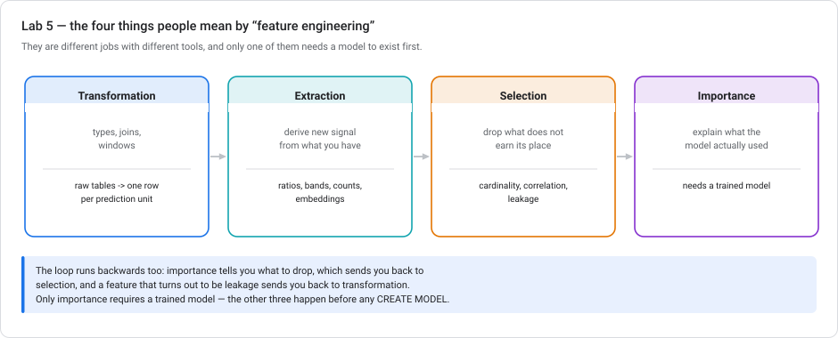
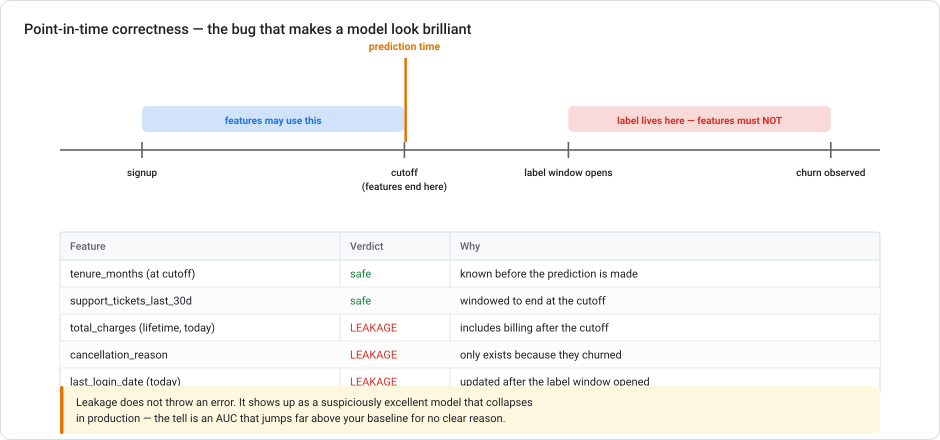
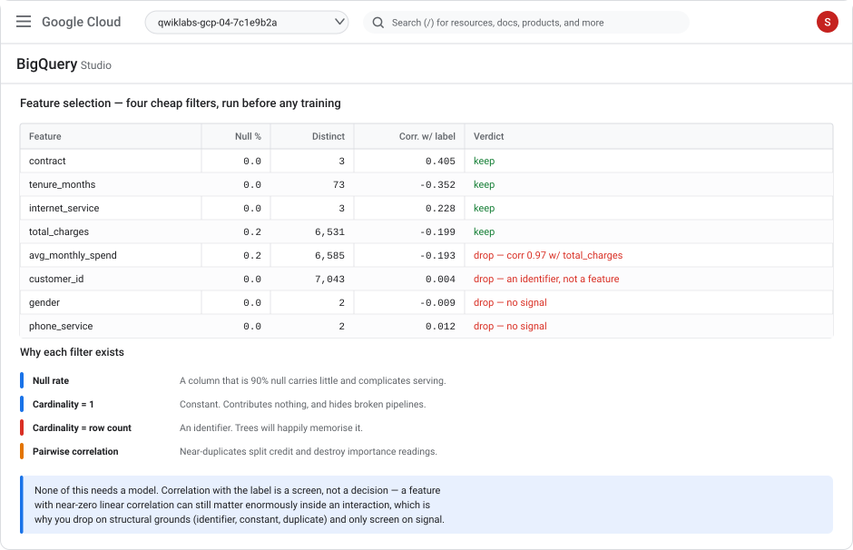
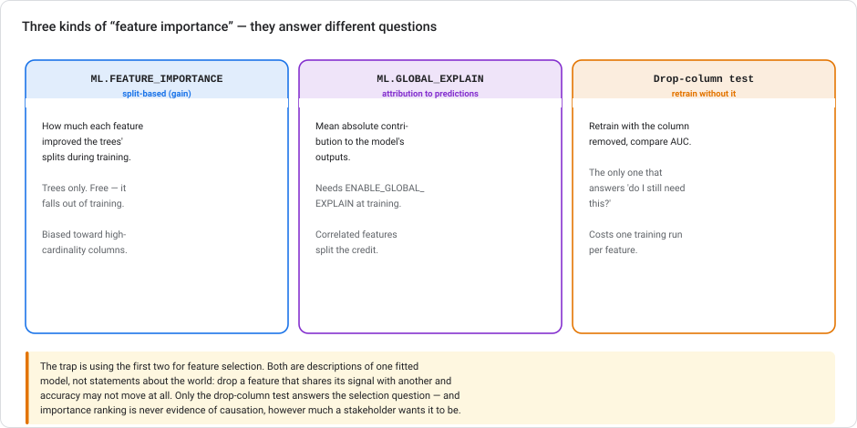
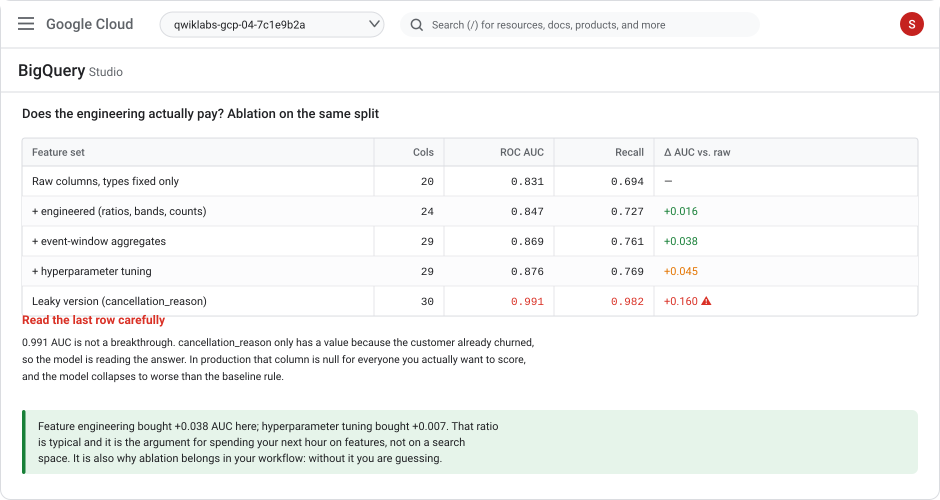

# Lab 5 — Feature engineering for tabular data

> **Level** Intermediate–Advanced  **Duration** 90–110 minutes  **Cost** low — all BigQuery compute, comfortably inside the free tier for most learners
> **Products** BigQuery · BigQuery ML (`TRANSFORM`, `ML.FEATURE_INFO`, `ML.FEATURE_IMPORTANCE`, `ML.GLOBAL_EXPLAIN`) · Dataform
> **Last updated** 23 August 2026

---

## Overview

Lab 2 fixed some types and derived four columns, then moved on to training. That is the honest minimum, and it is not feature engineering. This lab is the part that was skipped — and if you have trained models in Python, it is the part where the low-code surface is least different from what you already do, and where the differences that *do* exist matter most.

"Feature engineering" is four separate jobs that get collapsed into one phrase:



**Transformation** reshapes many tables into one row per prediction unit. **Extraction** derives new signal from what you already have. **Selection** removes what doesn't earn its place. **Importance** explains what the trained model actually used — and it is the only one of the four that requires a model to exist first.

The centrepiece is **leakage**, which none of the previous labs covered and which is the failure mode most likely to bite you: it produces a model that looks superb and is worthless, with no error message anywhere.

### If you come from Python

| What you'd do | Here | The difference that matters |
|---|---|---|
| `pd.merge` / `groupby().agg()` | `JOIN` + `GROUP BY` | Same semantics, runs over billions of rows without leaving the warehouse |
| Rolling windows in pandas | `OVER (PARTITION BY … RANGE BETWEEN …)` | SQL windows are exact and declarative; no index alignment bugs |
| `sklearn.preprocessing` in a `Pipeline` | BigQuery ML `TRANSFORM` clause | Same purpose — bind preprocessing to the model so serving can't diverge |
| `df.corr()`, `VarianceThreshold` | `CORR()`, `ML.FEATURE_INFO` | Nothing new conceptually |
| `feature_importances_` | `ML.FEATURE_IMPORTANCE` | Same gain-based measure, same high-cardinality bias |
| SHAP | `ML.GLOBAL_EXPLAIN` / `ML.EXPLAIN_PREDICT` | Built in; must be enabled **at training time** |
| `TimeSeriesSplit`, manual as-of joins | You write the cutoff yourself | **No framework protects you here** — see Task 4 |

The one genuinely new discipline is that your feature store *is* your warehouse, so features are views and tables that other people can see, reuse, and accidentally depend on.

### Objectives

- Build an event table and aggregate it into windowed features with correct boundaries
- Assemble a feature table from multiple sources at one row per prediction unit
- Detect and prevent **target leakage** and **point-in-time violations**
- Select features with cheap structural filters before training anything
- Distinguish three kinds of feature importance and know which answers which question
- Run an ablation study to prove the engineering paid for itself
- Bind preprocessing to the model with `TRANSFORM`, and manage feature SQL with Dataform

### Prerequisites

- **[Lab 2](lab-02-customer-churn-lowcode-bqml.md)** completed — you need `telco_churn.customers_raw` and `customers_ml`
- Comfortable with SQL joins, `GROUP BY`, and ideally window functions

---

## Task 1. The problem with Lab 2's feature table

Look at what Lab 2 actually produced:

```sql
SELECT column_name, data_type
FROM `telco_churn.INFORMATION_SCHEMA.COLUMNS`
WHERE table_name = 'customers_ml'
ORDER BY ordinal_position;
```

It is a **single flat snapshot**. Every column describes the customer as of one unspecified moment, and there is no time dimension anywhere. That is fine for a teaching dataset and wrong for almost every real churn problem, because it cannot express the things that actually predict churn:

- Has their usage been *falling*?
- Did they contact support three times last month when they normally never do?
- Did a payment fail recently?

All three are **behaviour over a window**, and none can be represented in a snapshot. Worse, the snapshot silently hides the question *"as of when?"* — which is where leakage comes from.

### Build an event stream

The Telco dataset ships no events, so generate a deterministic synthetic one. This is a lab convenience — the shape is what matters, and it is the shape your real event table will have.

```sql
CREATE OR REPLACE TABLE `telco_churn.support_events` AS
WITH base AS (
  SELECT
    customerID AS customer_id,
    tenure,
    Churn,
    -- deterministic pseudo-random from the id, so this table is reproducible
    ABS(MOD(FARM_FINGERPRINT(customerID), 1000)) / 1000.0 AS r
  FROM `telco_churn.customers_raw`
  WHERE tenure > 0
),
expanded AS (
  SELECT
    customer_id,
    Churn,
    r,
    n
  FROM base, UNNEST(GENERATE_ARRAY(1, GREATEST(1, CAST(ROUND(r * 12) AS INT64)))) AS n
)
SELECT
  customer_id,
  -- events spread over the 180 days before the observation date
  DATE_SUB(DATE '2026-08-01',
           INTERVAL CAST(ROUND(180 * ABS(MOD(FARM_FINGERPRINT(
             CONCAT(customer_id, CAST(n AS STRING))), 1000)) / 1000.0) AS INT64) DAY) AS event_date,
  CASE MOD(ABS(FARM_FINGERPRINT(CONCAT(customer_id, CAST(n AS STRING)))), 4)
    WHEN 0 THEN 'billing_query'
    WHEN 1 THEN 'technical_fault'
    WHEN 2 THEN 'plan_change_request'
    ELSE        'complaint'
  END AS event_type
FROM expanded;
```

### ✅ Check your work

```sql
SELECT
  COUNT(*)                                   AS events,
  COUNT(DISTINCT customer_id)                AS customers_with_events,
  MIN(event_date)                            AS earliest,
  MAX(event_date)                            AS latest,
  COUNT(DISTINCT event_type)                 AS event_types
FROM `telco_churn.support_events`;
```

You should get tens of thousands of events across four types, spanning roughly 1 Feb – 1 Aug 2026.

---

## Task 2. Transformation — many rows into one row per prediction unit

This is the shape change that defines tabular ML: an event table has **many rows per customer**; a training table needs **exactly one**.

```sql
CREATE OR REPLACE TABLE `telco_churn.customer_event_features` AS
WITH cutoff AS (SELECT DATE '2026-08-01' AS as_of),
windowed AS (
  SELECT
    e.customer_id,
    -- three nested windows, all ending at the cutoff
    COUNTIF(e.event_date >  DATE_SUB(c.as_of, INTERVAL 30 DAY))   AS events_30d,
    COUNTIF(e.event_date >  DATE_SUB(c.as_of, INTERVAL 90 DAY))   AS events_90d,
    COUNT(*)                                                       AS events_180d,
    COUNTIF(e.event_type = 'complaint'
            AND e.event_date > DATE_SUB(c.as_of, INTERVAL 90 DAY)) AS complaints_90d,
    COUNTIF(e.event_type = 'technical_fault'
            AND e.event_date > DATE_SUB(c.as_of, INTERVAL 90 DAY)) AS faults_90d,
    MAX(e.event_date)                                              AS last_event_date
  FROM `telco_churn.support_events` e
  CROSS JOIN cutoff c
  WHERE e.event_date <= c.as_of          -- the line that enforces point-in-time
  GROUP BY e.customer_id
)
SELECT
  w.*,
  DATE_DIFF((SELECT as_of FROM cutoff), w.last_event_date, DAY) AS days_since_last_event,
  -- trend: recent activity relative to the longer baseline
  SAFE_DIVIDE(w.events_30d, NULLIF(w.events_180d / 6.0, 0))     AS activity_ratio_30d_vs_avg
FROM windowed w;
```

Three patterns here that transfer to every event-based feature table:

1. **Nested windows (30/90/180)** let the model see both level and trend. One window can only express level.
2. **Recency** (`days_since_last_event`) is almost always predictive and almost always forgotten.
3. **Ratios beat raw counts** for trend. `activity_ratio_30d_vs_avg` above 1 means activity is accelerating — a signal no single count expresses.

### Assemble the full feature table

```sql
CREATE OR REPLACE TABLE `telco_churn.features_v2` AS
SELECT
  m.* EXCEPT (churn),
  COALESCE(f.events_30d, 0)                    AS events_30d,
  COALESCE(f.events_90d, 0)                    AS events_90d,
  COALESCE(f.events_180d, 0)                   AS events_180d,
  COALESCE(f.complaints_90d, 0)                AS complaints_90d,
  COALESCE(f.faults_90d, 0)                    AS faults_90d,
  COALESCE(f.days_since_last_event, 999)       AS days_since_last_event,
  COALESCE(f.activity_ratio_30d_vs_avg, 0.0)   AS activity_ratio_30d_vs_avg,
  m.churn
FROM `telco_churn.customers_ml` m
LEFT JOIN `telco_churn.customer_event_features` f
  ON m.customer_id = f.customer_id;
```

> **`LEFT JOIN` and explicit `COALESCE`, always.** An `INNER JOIN` here would silently drop every customer with no support events — a large, non-random slice of your population, and disproportionately the happy ones. Your model would then be trained only on customers who contacted support. This is one of the most common quiet disasters in feature pipelines.
>
> Note the two different defaults: `0` for counts (they genuinely had zero) but `999` for `days_since_last_event` (they never had one — "0 days since last event" would mean the opposite of the truth).

### ✅ Check your work

```sql
SELECT
  COUNT(*)                                  AS rows,
  COUNT(DISTINCT customer_id)               AS unique_customers,
  COUNTIF(events_180d = 0)                  AS customers_no_events,
  ROUND(AVG(events_90d), 2)                 AS avg_events_90d,
  COUNTIF(days_since_last_event = 999)      AS never_contacted
FROM `telco_churn.features_v2`;
```

`rows` must equal `unique_customers` must equal 7,043. **If a join fanned out, this is where you find out** — and it is worth checking every single time you build a feature table.

---

## Task 3. Extraction — deriving signal you don't have

Extraction is where domain knowledge enters. A model can find interactions, but it cannot invent a ratio you never gave it.

```sql
CREATE OR REPLACE TABLE `telco_churn.features_v3` AS
SELECT
  * EXCEPT (churn),

  -- 1. RATIOS: relationships, not levels
  SAFE_DIVIDE(monthly_charges, NULLIF(addon_count + 1, 0))      AS charge_per_service,
  SAFE_DIVIDE(total_charges, NULLIF(tenure_months, 0))          AS lifetime_avg_charge,
  SAFE_DIVIDE(monthly_charges,
              NULLIF(SAFE_DIVIDE(total_charges, NULLIF(tenure_months, 0)), 0))
                                                                 AS charge_drift,

  -- 2. FLAGS: encode a threshold the business already believes in
  monthly_charges > 80                                           AS is_high_value,
  tenure_months <= 3                                             AS is_new_customer,
  complaints_90d >= 2                                            AS is_repeat_complainer,

  -- 3. INTERACTIONS: combinations a tree would need many splits to reach
  CONCAT(contract, ' | ', internet_service)                      AS contract_internet,

  -- 4. RELATIVE POSITION: how this customer compares to their peers
  PERCENT_RANK() OVER (PARTITION BY contract ORDER BY monthly_charges)
                                                                 AS charge_pctile_in_contract,

  churn
FROM `telco_churn.features_v2`;
```

What each family is for:

- **`charge_drift`** — current monthly charge divided by lifetime average. Above 1 means their bill went *up*, which is a classic churn trigger. Neither input column expresses this alone.
- **Flags** encode thresholds the business already uses. They give a tree the split for free and make the model easier to explain to a stakeholder who thinks in those terms.
- **`contract_internet`** is manual interaction encoding. Boosted trees find interactions on their own, so this matters far more for `LOGISTIC_REG` than for trees — include it, then test whether it earned its place in Task 7.
- **`PERCENT_RANK`** turns an absolute into a relative. "Expensive *for a month-to-month customer*" is a different statement from "expensive".

> **The trap in the last one:** `PERCENT_RANK() OVER (...)` is computed across your whole training table, which means each row's feature depends on every other row. At serving time, scoring one customer, that peer group doesn't exist. Either compute the percentile boundaries once and store them as a lookup, or accept that this feature only works in batch scoring. Ranking features are the most common source of train/serve mismatch that isn't strictly leakage.

---

## Task 4. Leakage — the failure that looks like success

This is the most important task in the lab.



**Target leakage** is any feature that carries information which would not exist at prediction time. It does not throw an error. It produces a model with startling metrics that fails completely in production.

### Build a leaky feature deliberately

```sql
CREATE OR REPLACE TABLE `telco_churn.features_leaky` AS
SELECT
  * EXCEPT (churn),
  -- a column that only has a value BECAUSE the customer churned
  CASE
    WHEN churn = 'Yes' THEN
      CASE MOD(ABS(FARM_FINGERPRINT(customer_id)), 3)
        WHEN 0 THEN 'price'
        WHEN 1 THEN 'service_quality'
        ELSE        'moving_home'
      END
    ELSE NULL
  END AS cancellation_reason,
  churn
FROM `telco_churn.features_v3`;
```

Train on it:

```sql
CREATE OR REPLACE MODEL `telco_churn.model_leaky`
OPTIONS (MODEL_TYPE = 'BOOSTED_TREE_CLASSIFIER', INPUT_LABEL_COLS = ['churn'],
         AUTO_CLASS_WEIGHTS = TRUE, ENABLE_GLOBAL_EXPLAIN = TRUE)
AS SELECT * EXCEPT (customer_id) FROM `telco_churn.features_leaky`;

SELECT roc_auc, accuracy, recall, precision
FROM ML.EVALUATE(MODEL `telco_churn.model_leaky`,
     (SELECT * EXCEPT (customer_id) FROM `telco_churn.features_leaky`));
```

You will see an ROC AUC around **0.99**. Lab 2's honest model reached 0.847.

**Nothing errored. The evaluation is arithmetically correct. The model is worthless.** `cancellation_reason` is populated only for customers who already cancelled, so the model learned "if this column is not null, they churned." In production it is null for every customer you actually want to score, and the model degrades to worse than the month-to-month rule.

### The four detection habits

**1. Be suspicious of a large unexplained jump.**

```sql
SELECT 'v3 (honest)' AS feature_set, roc_auc FROM ML.EVALUATE(
  MODEL `telco_churn.model_v3`,
  (SELECT * EXCEPT (customer_id) FROM `telco_churn.features_v3`))
UNION ALL
SELECT 'leaky', roc_auc FROM ML.EVALUATE(
  MODEL `telco_churn.model_leaky`,
  (SELECT * EXCEPT (customer_id) FROM `telco_churn.features_leaky`));
```

(Create `model_v3` first with the same options against `features_v3`.) A jump from 0.85 to 0.99 from adding one column is not good news. It is a bug report.

**2. Check whether a feature's null-ness predicts the label.**

```sql
SELECT
  churn,
  COUNT(*)                                  AS rows,
  COUNTIF(cancellation_reason IS NULL)      AS nulls,
  ROUND(100 * COUNTIF(cancellation_reason IS NULL) / COUNT(*), 1) AS null_pct
FROM `telco_churn.features_leaky`
GROUP BY churn;
```

100% null for one class and 0% for the other is a smoking gun. **A feature's missingness pattern should never align with the label.**

**3. Check global explain for a single dominant feature.**

```sql
SELECT * FROM ML.GLOBAL_EXPLAIN(MODEL `telco_churn.model_leaky`)
ORDER BY attribution DESC;
```

One feature carrying most of the attribution while everything else collapses is the signature of leakage.

**4. Interrogate every column's provenance.** For each feature ask: *when is this value written, and by what process?* Anything written by, or updated after, the event you are predicting is leakage. `cancellation_reason` is written by the cancellation workflow. `last_login_date` refreshed to today reflects behaviour after your cutoff. `total_charges` as a live lifetime total includes billing after the cutoff — which means **Lab 2's own feature table has a mild point-in-time problem**, and on a real time-stamped dataset you would window it to the cutoff.

### Point-in-time correctness

Leakage's subtler sibling. Even a legitimate feature leaks if you compute it **as of the wrong moment**. The rule:

> Every feature must be computable using only data that existed **strictly before** the prediction timestamp, and the label must be observed **after** it.

That is why Task 2's `WHERE e.event_date <= c.as_of` matters, and why real feature pipelines are built around an explicit `as_of` cutoff rather than `CURRENT_DATE()`.

```sql
-- The gap between cutoff and label window is deliberate: if you predict churn
-- "in the next 30 days", features must stop 30 days before the label is observed.
DECLARE as_of DATE DEFAULT DATE '2026-08-01';
DECLARE label_window_days INT64 DEFAULT 30;

SELECT
  as_of                                                      AS features_computed_up_to,
  DATE_ADD(as_of, INTERVAL label_window_days DAY)            AS label_observed_by,
  'features must use event_date <= as_of, no exceptions'     AS the_rule;
```

> **No framework will catch this for you** — not BigQuery ML, not scikit-learn, not a Feature Store. It is a property of how you wrote the query. The only reliable defence is the explicit `as_of` variable plus a review habit of asking "when is this column written?" for every single feature.

---

## Task 5. Selection — dropping what doesn't earn its place

Selection happens **before** training and needs no model.



### Profile every column

```sql
SELECT
  COUNT(*)                                             AS rows,
  COUNT(DISTINCT customer_id)                          AS distinct_customer_id,
  COUNT(DISTINCT gender)                               AS distinct_gender,
  COUNT(DISTINCT contract)                             AS distinct_contract,
  COUNTIF(total_charges IS NULL)                       AS null_total_charges,
  COUNTIF(activity_ratio_30d_vs_avg IS NULL)           AS null_activity_ratio
FROM `telco_churn.features_v3`;
```

### Correlation with the label

```sql
WITH numeric_features AS (
  SELECT
    IF(churn = 'Yes', 1, 0) AS y,
    tenure_months, monthly_charges, total_charges, addon_count,
    events_90d, complaints_90d, days_since_last_event,
    activity_ratio_30d_vs_avg, charge_drift
  FROM `telco_churn.features_v3`
)
SELECT 'tenure_months' AS feature, ROUND(CORR(tenure_months, y), 4) AS corr_with_churn FROM numeric_features
UNION ALL SELECT 'monthly_charges',  ROUND(CORR(monthly_charges, y), 4)  FROM numeric_features
UNION ALL SELECT 'total_charges',    ROUND(CORR(total_charges, y), 4)    FROM numeric_features
UNION ALL SELECT 'addon_count',      ROUND(CORR(addon_count, y), 4)      FROM numeric_features
UNION ALL SELECT 'events_90d',       ROUND(CORR(events_90d, y), 4)       FROM numeric_features
UNION ALL SELECT 'complaints_90d',   ROUND(CORR(complaints_90d, y), 4)   FROM numeric_features
UNION ALL SELECT 'days_since_last_event', ROUND(CORR(days_since_last_event, y), 4) FROM numeric_features
UNION ALL SELECT 'activity_ratio_30d_vs_avg', ROUND(CORR(activity_ratio_30d_vs_avg, y), 4) FROM numeric_features
UNION ALL SELECT 'charge_drift',     ROUND(CORR(charge_drift, y), 4)     FROM numeric_features
ORDER BY ABS(corr_with_churn) DESC;
```

### Redundancy between features

```sql
SELECT
  ROUND(CORR(total_charges, lifetime_avg_charge), 4)  AS total_vs_lifetime_avg,
  ROUND(CORR(total_charges, tenure_months), 4)        AS total_vs_tenure,
  ROUND(CORR(events_90d, events_180d), 4)             AS events_90_vs_180,
  ROUND(CORR(monthly_charges, charge_per_service), 4) AS monthly_vs_per_service
FROM `telco_churn.features_v3`;
```

Anything above ~0.95 is effectively a duplicate. Keep one.

### The rules, and one exception

**Drop on structural grounds — these are safe and mechanical:**

- **Identifiers** (`customer_id`) — cardinality equals row count. A tree will memorize them.
- **Constants** — cardinality of 1. Contributes nothing, and often signals a broken upstream join.
- **Near-duplicates** — pairwise correlation above ~0.95. They split importance credit between themselves and make Task 6 unreadable.
- **Anything that fails the provenance test in Task 4.**

**Do not drop on low label-correlation alone.** `CORR` measures a *linear pairwise* relationship. A feature with near-zero correlation can be highly predictive inside an interaction — which is exactly what tree models exploit. Use correlation as a screen that raises questions, never as an automatic delete.

> **`ML.FEATURE_INFO`** gives you a profile of what the model actually saw after training — min, max, mean, stddev, cardinality, null count per input column. It is the fastest way to spot a column that arrived in an unexpected shape:
> ```sql
> SELECT * FROM ML.FEATURE_INFO(MODEL `telco_churn.model_v3`);
> ```

---

## Task 6. Importance — three different questions



Train the honest model first if you haven't:

```sql
CREATE OR REPLACE MODEL `telco_churn.model_v3`
OPTIONS (MODEL_TYPE = 'BOOSTED_TREE_CLASSIFIER', INPUT_LABEL_COLS = ['churn'],
         AUTO_CLASS_WEIGHTS = TRUE, ENABLE_GLOBAL_EXPLAIN = TRUE)
AS SELECT * EXCEPT (customer_id) FROM `telco_churn.features_v3`;
```

### Split-based importance

```sql
SELECT feature, importance_gain, importance_weight, importance_cover
FROM ML.FEATURE_IMPORTANCE(MODEL `telco_churn.model_v3`)
ORDER BY importance_gain DESC
LIMIT 15;
```

This is XGBoost's native measure — the same thing as `feature_importances_` in scikit-learn, with the same well-known bias toward high-cardinality continuous columns, which get more opportunities to split.

### Attribution to predictions

```sql
SELECT feature, attribution
FROM ML.GLOBAL_EXPLAIN(MODEL `telco_churn.model_v3`)
ORDER BY attribution DESC
LIMIT 15;
```

Mean absolute contribution to the model's outputs — conceptually SHAP-like. Requires `ENABLE_GLOBAL_EXPLAIN = TRUE` **at training time**; it cannot be added afterwards.

### Compare them

```sql
WITH gain AS (
  SELECT feature, importance_gain,
         RANK() OVER (ORDER BY importance_gain DESC) AS gain_rank
  FROM ML.FEATURE_IMPORTANCE(MODEL `telco_churn.model_v3`)
),
attr AS (
  SELECT feature, attribution,
         RANK() OVER (ORDER BY attribution DESC) AS attr_rank
  FROM ML.GLOBAL_EXPLAIN(MODEL `telco_churn.model_v3`)
)
SELECT
  COALESCE(g.feature, a.feature)        AS feature,
  g.gain_rank,
  a.attr_rank,
  g.gain_rank - a.attr_rank             AS rank_gap
FROM gain g
FULL OUTER JOIN attr a ON g.feature = a.feature
ORDER BY ABS(COALESCE(g.gain_rank - a.attr_rank, 0)) DESC
LIMIT 15;
```

Large `rank_gap` values usually mean correlated features sharing credit — the two methods split that credit differently. It is a signal to revisit Task 5's redundancy check.

### Which method answers the selection question

Neither of the above tells you whether you can *remove* a feature. Both describe one fitted model; if two features carry the same signal, dropping either may cost nothing while both show as important. Only retraining answers it:

```sql
-- drop-column test for the event features as a block
CREATE OR REPLACE MODEL `telco_churn.model_no_events`
OPTIONS (MODEL_TYPE = 'BOOSTED_TREE_CLASSIFIER', INPUT_LABEL_COLS = ['churn'],
         AUTO_CLASS_WEIGHTS = TRUE)
AS SELECT * EXCEPT (customer_id, events_30d, events_90d, events_180d,
                    complaints_90d, faults_90d, days_since_last_event,
                    activity_ratio_30d_vs_avg)
FROM `telco_churn.features_v3`;

SELECT 'with events' AS variant, roc_auc FROM ML.EVALUATE(
  MODEL `telco_churn.model_v3`,
  (SELECT * EXCEPT (customer_id) FROM `telco_churn.features_v3`))
UNION ALL
SELECT 'without events', roc_auc FROM ML.EVALUATE(
  MODEL `telco_churn.model_no_events`,
  (SELECT * EXCEPT (customer_id) FROM `telco_churn.features_v3`));
```

> **Importance is not causation**, and a stakeholder will hear it as causation every time. "Contract type is the top feature" does not mean moving people to annual contracts *causes* retention — customers who choose annual contracts are already more committed. The model reports association. Only an experiment establishes cause. Say this out loud when you present the chart, because otherwise your feature-importance bar chart becomes next quarter's strategy.

---

## Task 7. Ablation — did any of this pay?



The honest way to justify feature work: hold everything else constant and measure.

```sql
-- v1: Lab 2's original features
CREATE OR REPLACE MODEL `telco_churn.abl_v1`
OPTIONS (MODEL_TYPE='BOOSTED_TREE_CLASSIFIER', INPUT_LABEL_COLS=['churn'],
         AUTO_CLASS_WEIGHTS=TRUE, DATA_SPLIT_METHOD='AUTO_SPLIT')
AS SELECT * EXCEPT (customer_id) FROM `telco_churn.customers_ml`;

-- v2: + event-window features
CREATE OR REPLACE MODEL `telco_churn.abl_v2`
OPTIONS (MODEL_TYPE='BOOSTED_TREE_CLASSIFIER', INPUT_LABEL_COLS=['churn'],
         AUTO_CLASS_WEIGHTS=TRUE, DATA_SPLIT_METHOD='AUTO_SPLIT')
AS SELECT * EXCEPT (customer_id) FROM `telco_churn.features_v2`;

-- v3: + extracted ratios, flags, interactions
CREATE OR REPLACE MODEL `telco_churn.abl_v3`
OPTIONS (MODEL_TYPE='BOOSTED_TREE_CLASSIFIER', INPUT_LABEL_COLS=['churn'],
         AUTO_CLASS_WEIGHTS=TRUE, DATA_SPLIT_METHOD='AUTO_SPLIT')
AS SELECT * EXCEPT (customer_id) FROM `telco_churn.features_v3`;
```

```sql
SELECT 'v1 raw'            AS feature_set, ROUND(roc_auc, 4) AS roc_auc, ROUND(recall, 4) AS recall
FROM ML.EVALUATE(MODEL `telco_churn.abl_v1`)
UNION ALL
SELECT 'v2 + events',      ROUND(roc_auc, 4), ROUND(recall, 4)
FROM ML.EVALUATE(MODEL `telco_churn.abl_v2`)
UNION ALL
SELECT 'v3 + extraction',  ROUND(roc_auc, 4), ROUND(recall, 4)
FROM ML.EVALUATE(MODEL `telco_churn.abl_v3`)
ORDER BY roc_auc;
```

Calling `ML.EVALUATE` with no data argument evaluates on the model's own held-out split — which is what you want for a fair comparison across variants trained the same way.

**Interpretation.** Feature engineering typically buys more than hyperparameter tuning bought in Lab 2 (+0.007 AUC there). That ratio is the entire argument for this lab. But note the synthetic caveat: our event features are generated from a deterministic hash of the customer ID, so the lift you see is partly an artefact of the generator. On real event data the gain is usually larger; the *method* is what transfers, not the number.

> **Also measure the cost.** Every feature is a pipeline dependency that can break, drift, or be unavailable at serving time. A feature that adds 0.002 AUC and requires joining a flaky upstream system is a net negative. Ablation gives you the numerator; you have to supply the denominator.

---

## Task 8. Binding preprocessing to the model, and managing the SQL

### `TRANSFORM` — the anti-skew mechanism

```sql
CREATE OR REPLACE MODEL `telco_churn.model_transform`
TRANSFORM (
  churn,
  contract, internet_service, payment_method, tenure_band, contract_internet,
  is_high_value, is_new_customer, is_repeat_complainer,
  ML.STANDARD_SCALER(monthly_charges)        OVER () AS monthly_charges_z,
  ML.STANDARD_SCALER(charge_drift)           OVER () AS charge_drift_z,
  ML.QUANTILE_BUCKETIZE(tenure_months, 5)    OVER () AS tenure_bucket,
  ML.QUANTILE_BUCKETIZE(events_90d, 4)       OVER () AS events_bucket,
  ML.FEATURE_CROSS(STRUCT(contract, tenure_band))    AS contract_x_tenure
)
OPTIONS (
  MODEL_TYPE = 'BOOSTED_TREE_CLASSIFIER',
  INPUT_LABEL_COLS = ['churn'],
  AUTO_CLASS_WEIGHTS = TRUE
)
AS SELECT * EXCEPT (customer_id) FROM `telco_churn.features_v3`;
```

This is BigQuery ML's equivalent of an sklearn `Pipeline`, and it exists for the same reason: **the transformation travels with the model**. `ML.PREDICT` now takes raw rows and applies the identical scaling and bucketizing used in training. You cannot preprocess differently at serving time because you no longer preprocess at serving time.

The scaler statistics are computed **once at training** and frozen into the model. That is correct — recomputing them at serving time would be a subtle form of leakage.

Useful `TRANSFORM` functions: `ML.STANDARD_SCALER`, `ML.MIN_MAX_SCALER`, `ML.QUANTILE_BUCKETIZE`, `ML.BUCKETIZE` (fixed boundaries), `ML.FEATURE_CROSS`, `ML.NGRAMS`, `ML.HASH_BUCKETIZE`, `ML.IMPUTER`.

### What belongs where

| Put it in the SQL that builds the feature table | Put it in `TRANSFORM` |
|---|---|
| Joins and aggregations | Scaling and normalization |
| Window functions over events | Bucketizing / discretization |
| Business logic and thresholds | Feature crosses |
| Anything needing other tables | Imputation of missing values |
| The `as_of` cutoff | Anything purely row-local |

Rule of thumb: **if it needs another row or another table, it goes in the feature SQL. If it's a row-local mapping, it goes in `TRANSFORM`.**

### Managing feature SQL with Dataform

Three feature tables and a chain of dependencies is already enough to lose track of. Dataform manages that declaratively inside BigQuery — a dependency graph, assertions, and environments, without a separate orchestrator.

A Dataform definition for `features_v2` looks like:

```sql
config {
  type: "table",
  schema: "telco_churn",
  name: "features_v2",
  description: "One row per customer, features as of the 2026-08-01 cutoff",
  assertions: {
    uniqueKey: ["customer_id"],
    nonNull: ["customer_id", "churn"]
  }
}

SELECT
  m.* EXCEPT (churn),
  COALESCE(f.events_90d, 0) AS events_90d,
  -- …
  m.churn
FROM ${ref("customers_ml")} m
LEFT JOIN ${ref("customer_event_features")} f USING (customer_id)
```

Two things earn their keep immediately: `${ref()}` builds the dependency graph so tables rebuild in the right order, and `uniqueKey` **fails the build** if a join ever fans out — turning Task 2's manual check into an automated guarantee.

---

## Cleanup

```bash
bq rm -r -f -d $PROJECT_ID:telco_churn
```

Or drop just this lab's objects and keep Lab 2's:

```sql
DROP TABLE IF EXISTS `telco_churn.support_events`;
DROP TABLE IF EXISTS `telco_churn.customer_event_features`;
DROP TABLE IF EXISTS `telco_churn.features_v2`;
DROP TABLE IF EXISTS `telco_churn.features_v3`;
DROP TABLE IF EXISTS `telco_churn.features_leaky`;
DROP MODEL IF EXISTS `telco_churn.model_v3`;
DROP MODEL IF EXISTS `telco_churn.model_leaky`;
DROP MODEL IF EXISTS `telco_churn.model_no_events`;
DROP MODEL IF EXISTS `telco_churn.model_transform`;
DROP MODEL IF EXISTS `telco_churn.abl_v1`;
DROP MODEL IF EXISTS `telco_churn.abl_v2`;
DROP MODEL IF EXISTS `telco_churn.abl_v3`;
```

---

## Test your understanding

<details markdown="1">
<summary><b>1.</b> Adding one column takes your AUC from 0.85 to 0.99. What's your first move?</summary>

Assume leakage and go looking for it, rather than celebrating. Check whether that column's missingness aligns with the label, check whether it dominates `ML.GLOBAL_EXPLAIN`, and above all ask when the value is written and by what process. Anything written by — or updated after — the event you're predicting is leakage. Genuine feature improvements move AUC by hundredths.
</details>

<details markdown="1">
<summary><b>2.</b> You <code>INNER JOIN</code> customers to a support-events table. What did you just break?</summary>

You silently dropped every customer who never contacted support — a large, non-random slice, and disproportionately the satisfied ones. Your model is now trained only on customers with support history, and will be applied to a population that includes many without it. Always `LEFT JOIN` and `COALESCE` explicitly, choosing defaults that mean the right thing (`0` events is true; `0` days since last event is a lie — use a sentinel).
</details>

<details markdown="1">
<summary><b>3.</b> <code>ML.FEATURE_IMPORTANCE</code> ranks a feature 2nd. You drop it and AUC doesn't move. Contradiction?</summary>

No — this is expected when features are correlated. Both importance measures describe how one fitted model distributed credit among the features it was given. If two columns carry the same underlying signal, removing either lets the other absorb its role. Importance answers "what did this model use?"; only a drop-column retrain answers "do I still need this?"
</details>

<details markdown="1">
<summary><b>4.</b> Why compute scaler statistics at training time and freeze them, rather than recomputing at serving?</summary>

Recomputing at serving means the transformation depends on the serving batch's distribution, so the same customer gets different scaled values depending on who else is scored alongside them — and the model sees inputs distributed differently from training. Freezing the statistics into the model via `TRANSFORM` is what makes training and serving provably identical. It's the same reason you `fit` a scaler on train and only `transform` on test.
</details>

<details markdown="1">
<summary><b>5.</b> <code>PERCENT_RANK() OVER (PARTITION BY contract ORDER BY monthly_charges)</code> — what breaks at serving time?</summary>

The feature is defined relative to all other rows in the table. Scoring a single customer in an online request, there is no peer group to rank against, so the value is undefined or wrong. Either precompute the percentile boundaries and store them as a lookup the serving path can join to, or restrict the feature to batch scoring. Ranking and other whole-table-relative features are a classic train/serve mismatch.
</details>

<details markdown="1">
<summary><b>6.</b> Your feature adds +0.002 AUC and comes from a flaky upstream system. Ship it?</summary>

No. Ablation gives you the benefit; you supply the cost. Every feature is a permanent pipeline dependency that can break, drift, or go missing at serving time — and when it does, it takes the model with it. A 0.002 gain does not pay for an on-call incident. Feature count is a liability as well as an asset.
</details>

<details markdown="1">
<summary><b>7.</b> You present feature importance and the VP says "so let's move everyone to annual contracts." What do you say?</summary>

That importance is association, not causation. Customers who choose annual contracts are already more committed — the contract type is partly a *symptom* of retention, not only a cause of it. Forcing the change on people who didn't choose it may not transfer the effect at all. The only way to know the size of the causal effect is an experiment: offer the upgrade to a random subset and measure the difference.
</details>

---

## Congratulations! 🎉

You built a feature pipeline with correct time boundaries, deliberately created leakage and then detected it four different ways, selected features on structural grounds, distinguished three kinds of importance, and proved with an ablation that the work paid.

Three things worth keeping:

1. **`as_of` is not optional.** Every feature table needs an explicit cutoff variable, and every feature must be computable strictly before it. No tool enforces this — it is a property of your SQL and your review habits.
2. **Features beat hyperparameters.** Lab 2's 10-trial tuning search bought +0.007 AUC. Engineering the feature set moves the number considerably more. Spend the hour accordingly.
3. **Importance describes a model, not the world.** Use it to explain and to debug. Use ablation to select. Use an experiment to claim causation.

### Next steps

- Rebuild the pipeline with several `as_of` dates and train on the stacked result — that's how you get multiple observations per customer and a genuinely time-aware model
- Add `ML.GENERATE_EMBEDDING` over a text column and use the vector as a feature — feature extraction from unstructured data, joining Lab 1 to this one
- Move the feature SQL into Dataform with `uniqueKey` assertions on every table
- Continue to **[Lab 3 — Serving](lab-03-serving-ml-models-lowcode.md)**, where the `PERCENT_RANK` warning above becomes a real constraint

### References

- [The `TRANSFORM` clause](https://docs.cloud.google.com/bigquery/docs/reference/standard-sql/bigqueryml-syntax-create#transform)
- [Feature preprocessing overview](https://docs.cloud.google.com/bigquery/docs/preprocess-overview)
- [`ML.FEATURE_IMPORTANCE`](https://docs.cloud.google.com/bigquery/docs/reference/standard-sql/bigqueryml-syntax-feature-importance)
- [`ML.GLOBAL_EXPLAIN`](https://docs.cloud.google.com/bigquery/docs/reference/standard-sql/bigqueryml-syntax-global-explain)
- [`ML.FEATURE_INFO`](https://docs.cloud.google.com/bigquery/docs/reference/standard-sql/bigqueryml-syntax-feature)
- [Dataform overview](https://docs.cloud.google.com/dataform/docs/overview)
- [Window function syntax](https://docs.cloud.google.com/bigquery/docs/reference/standard-sql/window-function-calls)
