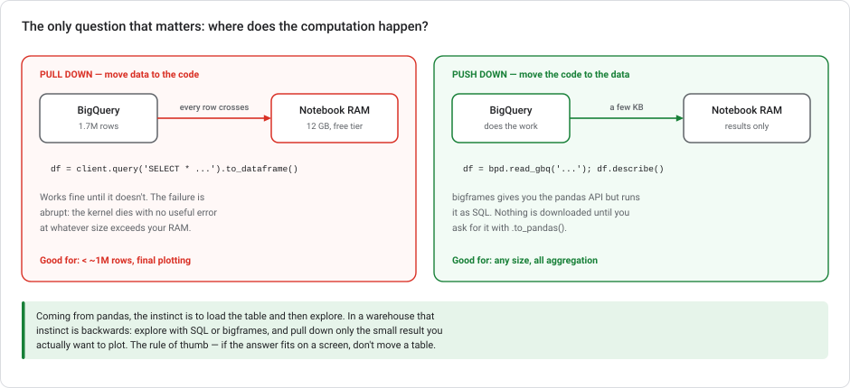
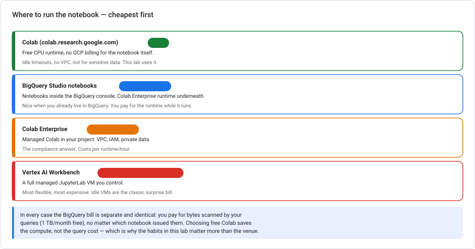
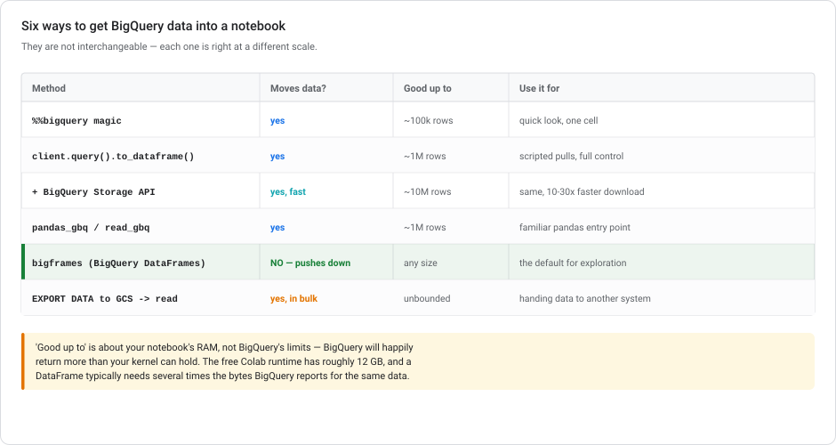

# Lab 6 — Exploring BigQuery data from a notebook

> **Level** Beginner–Intermediate  **Duration** 45–60 minutes  **Cost** effectively **free** — free Colab runtime, public dataset, well inside BigQuery's 1 TB/month free query tier
> **Products** BigQuery · Google Colab · BigQuery DataFrames (`bigframes`) · BigQuery Storage Read API
> **Last updated** 23 August 2026

---

## Overview

The data is in BigQuery. You want to explore it in Python. There are six different ways to bridge that gap, they are **not** interchangeable, and picking the wrong one is how people crash a kernel or run up a query bill on their first afternoon.

This lab is deliberately small. One public dataset, one free notebook, and one idea worth actually internalizing:



**Where does the computation happen?** Coming from pandas, the instinct is to load the table and then explore it. In a warehouse that instinct is backwards — and unlearning it is most of what this lab is for.

### Objectives

- Connect a free Colab notebook to BigQuery and authenticate
- Use all six import paths and know which one belongs at which scale
- Estimate query cost **before** running anything — the single most useful habit here
- Explore with push-down (`bigframes`) rather than downloading
- Sample correctly, and understand why `LIMIT` is not a sample
- Pull down only the small result you actually plot
- Profile a wide table automatically with a Dataplex data profile scan, published into the BigQuery console

### Prerequisites

- A Google account and a Google Cloud project with billing enabled (queries stay inside the free tier, but BigQuery requires a billing-enabled project)
- Basic pandas
- No prior labs required — this one uses a public dataset and stands alone

---

## Task 0. Choosing where to run — cheapest first

You asked for the cheapest, so here is the actual comparison rather than just the answer:



| Environment | Notebook cost | When it's right |
|---|---|---|
| **[Colab](https://colab.research.google.com)** free tier | **free** | Learning, exploration, anything non-sensitive. **This lab.** |
| **BigQuery Studio notebooks** | runtime billed | You already live in the BigQuery console |
| **Colab Enterprise** | runtime billed | Sensitive data, VPC, IAM-governed access |
| **Vertex AI Workbench** | VM billed while it exists | Full JupyterLab control, custom images, GPUs |

**Use free Colab.** The runtime costs nothing, and the notebook environment is not where your money goes anyway.

> **The BigQuery bill is identical in all four.** You pay for **bytes scanned** by your queries — first 1 TB/month free — regardless of which notebook issued them. Choosing free Colab saves the compute, not the query cost. That's exactly why the habits in Task 3 matter more than the venue.
>
> The one real caveat: free Colab runs outside your VPC and times out when idle. Fine for public data and learning; not for regulated data.

---

## Task 1. Connect Colab to BigQuery

Open [colab.research.google.com](https://colab.research.google.com) → **New notebook**.

```python
from google.colab import auth
auth.authenticate_user()

PROJECT_ID = "your-project-id"   # <- billing-enabled project

import google.auth
creds, _ = google.auth.default()
print("Authenticated.")
```

`auth.authenticate_user()` opens a consent popup and gives the notebook your own credentials. Everything you run is billed to `PROJECT_ID` and limited to what *you* can see.

Install the libraries — Colab ships some already, but pin what matters:

```python
!pip install --quiet --upgrade \
    google-cloud-bigquery \
    google-cloud-bigquery-storage \
    bigframes \
    pandas-gbq
```

Restart the runtime if prompted (**Runtime → Restart session**), then re-run the auth cell.

### The dataset

[`bigquery-public-data.austin_bikeshare.bikeshare_trips`](https://console.cloud.google.com/marketplace/product/austin/austin-bikeshare) — around 1.7 million bike trips with start/end stations, timestamps, duration, and subscriber type. Small enough to be free, big enough that a careless `SELECT *` is a real mistake.

```python
from google.cloud import bigquery
client = bigquery.Client(project=PROJECT_ID)

TABLE = "bigquery-public-data.austin_bikeshare.bikeshare_trips"
t = client.get_table(TABLE)

print(f"{t.num_rows:,} rows   {t.num_bytes/1e6:.1f} MB   {len(t.schema)} columns")
for f in t.schema:
    print(f"  {f.name:24s} {f.field_type:12s} {f.mode}")
```

**Read the schema before you query.** It is free, it is instant, and it tells you which columns are large — which is the same as telling you which columns are expensive.

---

## Task 2. Estimate cost before you run

BigQuery bills on **bytes scanned**, and it scans **whole columns**. A dry run tells you the price before you pay it.

```python
def estimate(sql, client=client):
    """Return the bytes a query would scan, without running it."""
    cfg = bigquery.QueryJobConfig(dry_run=True, use_query_cache=False)
    job = client.query(sql, job_config=cfg)
    gb = job.total_bytes_processed / 1e9
    # on-demand pricing is per TiB scanned; check current rates
    print(f"{job.total_bytes_processed:,} bytes  ({gb:.4f} GB)  ~${gb/1000*6.25:.5f}")
    return job.total_bytes_processed


estimate(f"SELECT * FROM `{TABLE}`")
estimate(f"SELECT start_station_name, duration_minutes FROM `{TABLE}`")
estimate(f"SELECT COUNT(*) FROM `{TABLE}`")
```

Three results worth pausing on:

1. `SELECT *` scans **every column** — the whole table.
2. Selecting two columns scans a small fraction of that. **Columnar storage means column selection is your main cost lever**, which is the opposite of a row-store where `SELECT *` is nearly free once you've found the row.
3. `COUNT(*)` scans **zero bytes** — it's answered from metadata.

> **`LIMIT` does not reduce cost.** `SELECT * FROM big_table LIMIT 10` scans the entire table and then throws away all but ten rows. Try it with `estimate()` — this surprises nearly everyone coming from a row-store background, and it is the most expensive misconception in this lab.

Set a hard ceiling so a mistake cannot become an incident:

```python
SAFE = bigquery.QueryJobConfig(maximum_bytes_billed=100 * 1024**3)  # 100 GB
# client.query(sql, job_config=SAFE)
```

---

## Task 3. Six ways to get data out



### 1. The `%%bigquery` magic — quickest look

```python
%load_ext google.cloud.bigquery
```

```python
%%bigquery trips_by_year --project $PROJECT_ID
SELECT
  EXTRACT(YEAR FROM start_time) AS yr,
  COUNT(*)                      AS trips,
  ROUND(AVG(duration_minutes),1) AS avg_minutes
FROM `bigquery-public-data.austin_bikeshare.bikeshare_trips`
WHERE start_time IS NOT NULL
GROUP BY yr
ORDER BY yr
```

```python
trips_by_year.head()
```

The result lands in a DataFrame named by the argument. Perfect for a quick look; awkward inside functions or loops because the SQL can't be parameterized easily.

> **The magic is faster than it looks.** Since `google-cloud-bigquery` 1.26.0 the magic uses the **BigQuery Storage Read API by default** whenever the supporting packages are installed — you get the 15–30× download speed-up in §3 with no arguments at all. So "fastest download, least code" is this cell, not a hand-configured client. The same default applies to `to_dataframe()` in current versions.

> **Which means the flags to be careful with are the ones that turn it *off*.** `create_bqstorage_client=False` on `to_dataframe()`, or `use_bqstorage_api=False` on `read_gbq()`, disable the fast path. They exist for constrained environments — no `bigquerystorage` permission, or a network that blocks it — not as a simplification.

### 2. `client.query().to_dataframe()` — the workhorse

```python
sql = f"""
SELECT
  subscriber_type,
  COUNT(*)                        AS trips,
  ROUND(AVG(duration_minutes), 1) AS avg_minutes
FROM `{TABLE}`
WHERE duration_minutes BETWEEN 1 AND 600
GROUP BY subscriber_type
ORDER BY trips DESC
"""
estimate(sql)
df = client.query(sql).to_dataframe()
df.head(10)
```

Full control: parameters, job config, cost ceilings. This is what you use in scripts.

### 3. Add the BigQuery Storage Read API — same thing, much faster

```python
sql_big = f"""
SELECT start_station_name, end_station_name, duration_minutes, subscriber_type
FROM `{TABLE}`
WHERE duration_minutes BETWEEN 1 AND 600
"""
%time df_big = client.query(sql_big).to_dataframe(create_bqstorage_client=True)   # default in current versions; explicit here to make the mechanism visible
print(f"{len(df_big):,} rows, {df_big.memory_usage(deep=True).sum()/1e6:.1f} MB in RAM")
```

The default REST download is fine for thousands of rows and slow for millions. The Storage Read API streams Arrow and is typically **10–30× faster**. It does not change the query cost — only the download speed.

> Note the RAM figure it prints. Compare it to the bytes BigQuery reported for the same columns: a pandas DataFrame usually needs **several times** the storage size, mostly because Python strings are expensive. That multiplier is why "it's only a 200 MB table" still kills a 12 GB kernel.

### 4. `pandas_gbq` — the familiar entry point

```python
import pandas_gbq
df2 = pandas_gbq.read_gbq(sql, project_id=PROJECT_ID)
```

Same behaviour as #2, a shape pandas users already know. No advantage beyond familiarity.

### 5. `bigframes` — push down instead of pulling

This is the one to default to.

```python
import bigframes.pandas as bpd

bpd.options.bigquery.project  = PROJECT_ID
bpd.options.bigquery.location = "US"

trips = bpd.read_gbq(TABLE)
print(type(trips), trips.shape)
```

`trips` looks like a DataFrame with 1.7M rows, but **nothing was downloaded**. Operations compile to SQL and execute in BigQuery:

```python
summary = (
    trips[trips["duration_minutes"].between(1, 600)]
    .groupby("subscriber_type")["duration_minutes"]
    .agg(["count", "mean", "median"])
)
summary_local = summary.to_pandas()      # <- only NOW does data move
summary_local
```

The pandas API you already know, on data too big to download, with the cost characteristics of SQL. `.to_pandas()` is the explicit boundary where bytes actually cross — everything before it is a query plan.

> **This is the answer to "how do I explore a 500 GB table in a notebook?"** You don't download it. You describe what you want in pandas syntax, BigQuery computes it, and you retrieve the small result. `bigframes` also exposes `bigframes.ml` with a scikit-learn-shaped API over BigQuery ML, if you'd rather write Python than the SQL from Lab 2.

### 6. `EXPORT DATA` to Cloud Storage — bulk handoff

```python
export_sql = f"""
EXPORT DATA OPTIONS (
  uri = 'gs://YOUR_BUCKET/bikeshare/*.parquet',
  format = 'PARQUET',
  overwrite = true
) AS
SELECT * FROM `{TABLE}` WHERE duration_minutes BETWEEN 1 AND 600
"""
# client.query(export_sql).result()
```

For handing data to another system — a training job, a partner, a different cloud. Not for exploration; you've just made a second copy that will drift from the first.

---

## Task 4. Explore, without moving the table

Now actually look at the data — all of it computed in BigQuery.

### Profile: nulls and cardinality

```python
profile_sql = f"""
SELECT
  COUNT(*)                                          AS rows,
  COUNTIF(start_station_name IS NULL)               AS null_start_station,
  COUNTIF(duration_minutes IS NULL)                 AS null_duration,
  COUNTIF(subscriber_type IS NULL)                  AS null_subscriber,
  COUNT(DISTINCT start_station_name)                AS distinct_start_stations,
  COUNT(DISTINCT subscriber_type)                   AS distinct_subscriber_types,
  MIN(start_time)                                   AS earliest,
  MAX(start_time)                                   AS latest
FROM `{TABLE}`
"""
estimate(profile_sql)
client.query(profile_sql).to_dataframe().T
```

### Distribution, without downloading 1.7M values

```python
dist_sql = f"""
SELECT
  APPROX_QUANTILES(duration_minutes, 100)[OFFSET(5)]  AS p5,
  APPROX_QUANTILES(duration_minutes, 100)[OFFSET(25)] AS p25,
  APPROX_QUANTILES(duration_minutes, 100)[OFFSET(50)] AS median,
  APPROX_QUANTILES(duration_minutes, 100)[OFFSET(75)] AS p75,
  APPROX_QUANTILES(duration_minutes, 100)[OFFSET(95)] AS p95,
  APPROX_QUANTILES(duration_minutes, 100)[OFFSET(99)] AS p99,
  MAX(duration_minutes)                                AS max_minutes,
  COUNTIF(duration_minutes > 1440)                     AS over_24_hours
FROM `{TABLE}`
WHERE duration_minutes IS NOT NULL
"""
client.query(dist_sql).to_dataframe().T
```

`APPROX_QUANTILES` is the warehouse answer to `df.describe()`. Note `over_24_hours` — a bike trip longer than a day is almost certainly a data-quality artefact (unreturned bike, broken sensor), and finding it costs one line.

> **This hand-written approach stops scaling at about 20 columns.** For a wide table you do not write 200 of these — you run a managed profile scan instead. That is Task 7.

### A histogram, computed server-side

```python
hist_sql = f"""
SELECT
  CAST(FLOOR(duration_minutes / 5) * 5 AS INT64) AS bucket_start,
  COUNT(*)                                        AS trips
FROM `{TABLE}`
WHERE duration_minutes BETWEEN 0 AND 120
GROUP BY bucket_start
ORDER BY bucket_start
"""
hist = client.query(hist_sql).to_dataframe()   # 25 rows come back, not 1.7M

import matplotlib.pyplot as plt
plt.figure(figsize=(10, 4))
plt.bar(hist["bucket_start"], hist["trips"], width=4.5)
plt.xlabel("Trip duration (minutes)"); plt.ylabel("Trips")
plt.title("Austin bikeshare — trip duration distribution")
plt.tight_layout(); plt.show()
```

**This is the pattern the whole lab is teaching.** The histogram has 25 bars. You moved 25 rows, not 1.7 million. BigQuery did the binning; matplotlib drew the result.

### The same thing in `bigframes`

```python
top_stations = (
    trips.groupby("start_station_name")
         .size()
         .sort_values(ascending=False)
         .head(15)
         .to_pandas()
)
top_stations.plot.barh(figsize=(9, 6)).invert_yaxis()
```

---

## Task 5. Sampling — and why `LIMIT` isn't one

You will sometimes genuinely want rows in local memory. Do it correctly.

```python
# WRONG: not a sample. LIMIT returns whatever BigQuery produces first,
# which is correlated with storage order — often by time or ingestion batch.
bad = client.query(f"SELECT * FROM `{TABLE}` LIMIT 1000").to_dataframe()

# RIGHT (1): TABLESAMPLE — cheap, scans only the sampled blocks
sample_sql = f"SELECT * FROM `{TABLE}` TABLESAMPLE SYSTEM (1 PERCENT)"
estimate(sample_sql)
sample = client.query(sample_sql).to_dataframe(create_bqstorage_client=True)

# RIGHT (2): deterministic hash sample — reproducible, and stable as data grows
repro_sql = f"""
SELECT *
FROM `{TABLE}`
WHERE MOD(ABS(FARM_FINGERPRINT(CAST(trip_id AS STRING))), 100) < 1
"""
repro = client.query(repro_sql).to_dataframe(create_bqstorage_client=True)
print(len(sample), len(repro))
```

The trade-off:

- **`TABLESAMPLE SYSTEM`** samples *storage blocks*, so it's cheap (it scans less) but block-correlated — rows written together tend to be sampled together. Fine for a rough look.
- **`FARM_FINGERPRINT` on a key** is a true per-row hash sample: reproducible across runs, stable as new rows arrive, and unbiased. It scans the whole column, so it costs more. This is what to use when the sample feeds anything you'll make a decision on.

> The second one is the same trick Lab 1 used to stratify its review sample, and Lab 5 used to generate deterministic events. A hash of a stable key is the reproducibility workhorse in a warehouse.

---

## Task 6. Save your findings back to BigQuery

Exploration that lives only in a notebook is lost the moment the runtime times out.

```python
job_config = bigquery.QueryJobConfig(
    destination=f"{PROJECT_ID}.exploration.bikeshare_daily",
    write_disposition="WRITE_TRUNCATE",
)
daily_sql = f"""
SELECT
  DATE(start_time)                AS trip_date,
  COUNT(*)                        AS trips,
  ROUND(AVG(duration_minutes), 2) AS avg_minutes,
  COUNT(DISTINCT start_station_name) AS active_stations
FROM `{TABLE}`
WHERE start_time IS NOT NULL
GROUP BY trip_date
"""
client.create_dataset(f"{PROJECT_ID}.exploration", exists_ok=True)
client.query(daily_sql, job_config=job_config).result()
print("Saved.")
```

Or with `bigframes`:

```python
summary.to_gbq(f"{PROJECT_ID}.exploration.duration_by_subscriber",
               if_exists="replace")
```

Now it's queryable by others, chartable in Looker Studio, and joinable — which is the point of having a warehouse.

---

## Task 7. When the table is wide — Dataplex data profile scans

Everything so far was hand-written, which is the right way to *learn* what profiling means and the wrong way to profile a 200-column table. Writing `COUNT`, `AVG`, `MIN`, `MAX`, and `APPROX_COUNT_DISTINCT` for 200 columns is slow, error-prone, and produces a result only you can see.

**Dataplex data profile scans** are the managed answer: point one at a BigQuery table and it profiles every column automatically — null ratios, distinct counts, min/max/mean/stddev, quartiles, and the most frequent values — then publishes the results **into the BigQuery console itself**, where your team sees them without running anything.

### Create the scan

1. In the BigQuery console, open the table you want to profile.
2. Click the **Data profile** tab → **Create data profile scan**.
3. Configure:
   - **Scan name** and ID
   - **Scope:** entire table, or an incremental scan keyed on a timestamp column
   - **Sampling size:** 100% for a small table; 10% or lower for a big one — profiling scans data and therefore costs
   - **Filters:** restrict rows or exclude columns you don't care about
   - **Schedule:** on-demand, or repeating
4. Tick **Publish results to the BigQuery and Dataplex Catalog UI** — this is the option the whole exercise turns on.
5. **Run scan.**

Or from the CLI:

```bash
gcloud dataplex datascans create data-profile bikeshare-profile   --location=us-central1   --data-source-resource="//bigquery.googleapis.com/projects/PROJECT_ID/datasets/exploration/tables/bikeshare_daily"

gcloud dataplex datascans run bikeshare-profile --location=us-central1
```

### View the results

Once the scan completes, results appear in two places:

- **BigQuery → the table → Data profile tab** — per-column statistics, in the console, next to the schema
- **BigQuery → Metadata curation → Data profiling & quality tab** — the cross-table view

Anyone with **BigQuery Data Viewer** on the table can see them. Nobody has to run a query, open a notebook, or be sent an HTML file.

> **Two caveats worth knowing before you promise a colleague a link.** Published results are not visible until the **first scan has finished**, and the publish checkbox can be greyed out — either because you lack the permission, or because another data quality scan on that table is already publishing.

### Why this beats the alternatives on a wide table

| Approach | Why it falls short at 200 columns |
|---|---|
| Hand-written SQL aggregates (Tasks 2–4) | 200 columns × 5 statistics is a query nobody wants to write or maintain, and the output lives in whatever table you happened to write it to |
| `pandas-profiling` in a notebook | Requires pulling the data down — memory limits, cost, and it produces an HTML file you then have to host or email |
| BigQuery data insights (Gemini) | Generates *questions and queries* from table metadata. Genuinely useful for discovery, but it is not systematic statistical profiling of every column |
| **Dataplex profile scan** | Automatic across all columns, scheduled, and published where the data already lives |

### Where this approach stops

Profile scans and manual exploration are not competitors — they answer different questions:

- **Profile scan** answers *"what does this table look like?"* — the systematic, per-column, shareable baseline. Run it first on any table you've just met.
- **Manual SQL / `bigframes`** answers *"why?"* — the follow-up questions a profile can't anticipate, like the `over_24_hours` check in Task 4 or the duration histogram. No scan would have thought to ask those.

Start with the scan to orient yourself, then write SQL for the questions it raises.

> **Related: data *quality* scans.** The sibling feature, `gcloud dataplex datascans create data-quality`, checks rules you assert (`customer_id` is never null, `rating` is between 1 and 5) and fails when they break. Profiling describes; quality scans enforce. If you built the feature pipeline in [Lab 5](lab-05-feature-engineering-tabular.md), a quality scan is where that lab's `uniqueKey` assertion idea lives outside Dataform.

---

## Cleanup

```python
client.delete_dataset(f"{PROJECT_ID}.exploration",
                      delete_contents=True, not_found_ok=True)
```

Nothing else to clean up. Free Colab has no persistent resource, and the public dataset isn't yours. **This lab cannot leave anything running that bills you.**

---

## Test your understanding

<details markdown="1">
<summary><b>1.</b> Does <code>SELECT * FROM big_table LIMIT 10</code> cost less than <code>SELECT *</code>?</summary>

No — it costs exactly the same. BigQuery bills on bytes **scanned**, and `LIMIT` is applied after scanning; it truncates the result, not the work. The only reliable ways to reduce cost are selecting fewer columns, filtering on a partition or cluster key, or `TABLESAMPLE`. Verify any query with a dry run before you assume.
</details>

<details markdown="1">
<summary><b>2.</b> Why does <code>COUNT(*)</code> scan zero bytes while <code>COUNT(some_column)</code> doesn't?</summary>

`COUNT(*)` is answered from table metadata — BigQuery already knows the row count. `COUNT(some_column)` must skip nulls, so it has to read that column's values. It's a small illustration of the general rule: cost follows the columns you touch, because storage is columnar.
</details>

<details markdown="1">
<summary><b>3.</b> Your table is 200 MB in BigQuery. Why did loading it kill a 12 GB Colab kernel?</summary>

A pandas DataFrame is typically several times larger than BigQuery's reported storage for the same data — string columns especially, since Python objects carry heavy per-value overhead, and BigQuery's figure reflects compressed columnar storage. Always check `df.memory_usage(deep=True).sum()` on a sample before scaling up, or avoid the question entirely by aggregating server-side.
</details>

<details markdown="1">
<summary><b>4.</b> When would you use <code>bigframes</code> over <code>client.query().to_dataframe()</code>?</summary>

Whenever the result you'd download is large, or you don't yet know how large it is — which covers most exploration. `bigframes` gives you the pandas API while executing in BigQuery, so nothing moves until you call `.to_pandas()`. Use the plain client when you already know the result is small and you want explicit control over the SQL and job config.
</details>

<details markdown="1">
<summary><b>5.</b> You need a 1% sample for a model you'll actually ship. <code>TABLESAMPLE</code> or <code>FARM_FINGERPRINT</code>?</summary>

`FARM_FINGERPRINT`. `TABLESAMPLE SYSTEM` samples storage blocks, so rows written together get selected together — correlated with ingestion order, and it changes between runs. A hash of a stable key gives an unbiased per-row sample that's reproducible and stays stable as new data arrives. `TABLESAMPLE` is for a cheap first look, not for anything downstream.
</details>

<details markdown="1">
<summary><b>6.</b> You picked free Colab to save money. How much does that save on a 5 TB query?</summary>

Nothing. The notebook environment and the query bill are separate: free Colab saves the *compute for the notebook*, while the query is billed on bytes scanned by BigQuery, identically from any client. Free Colab makes the venue free; only dry runs, column selection, partition filters, and `maximum_bytes_billed` make the *queries* cheap.
</details>

---

## Congratulations!

You connected a free notebook to BigQuery, used all six import paths, and explored 1.7 million rows while moving only kilobytes.

The three habits worth keeping:

1. **Dry-run before you run.** It's free, instant, and it turns cost from a surprise into a number you chose.
2. **Push computation down; pull results up.** Aggregate in BigQuery, plot in Python. If the answer fits on a screen, don't move a table.
3. **`LIMIT` is not a sample and not a discount.** Use `TABLESAMPLE` for a look, `FARM_FINGERPRINT` for anything that matters.

### Next steps

- Explore your own Lab 2 table: `SELECT * FROM telco_churn.customers_ml` — then do it properly with `bigframes`
- Try `bigframes.ml`, which wraps BigQuery ML in a scikit-learn-shaped API — Lab 2's model in Python syntax, still trained in BigQuery
- Continue to **[Lab 5 — Feature engineering](lab-05-feature-engineering-tabular.md)**, which is where exploration turns into features
- Read **[Scaling prototypes into ML models](../modules/SCALING-PROTOTYPES-TO-ML.md)** — this lab is Stage 0→1

### References

- [BigQuery DataFrames (`bigframes`)](https://docs.cloud.google.com/bigquery/docs/dataframes-quickstart)
- [Use the BigQuery Storage Read API](https://docs.cloud.google.com/bigquery/docs/reference/storage)
- [Estimate and control query costs](https://docs.cloud.google.com/bigquery/docs/best-practices-costs)
- [`TABLESAMPLE` operator](https://docs.cloud.google.com/bigquery/docs/table-sampling)
- [Colab notebooks with BigQuery](https://docs.cloud.google.com/bigquery/docs/colab-notebooks)
- [Profile your data — Dataplex data profile scans](https://docs.cloud.google.com/bigquery/docs/data-profile-scan)
- [Scan for data quality issues](https://docs.cloud.google.com/bigquery/docs/data-quality-scan)
- [Austin Bikeshare public dataset](https://console.cloud.google.com/marketplace/product/austin/austin-bikeshare)
