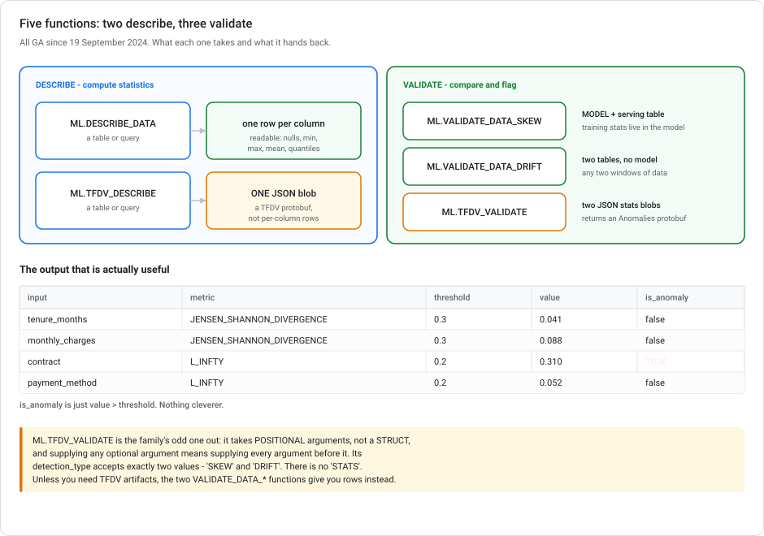
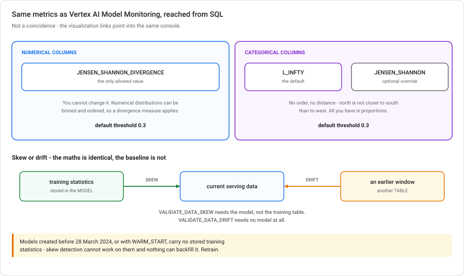

# Data validation in BigQuery ML

**Skew and drift detection in SQL** — five functions, the same Jensen-Shannon and L-infinity maths as Vertex AI Model Monitoring, and no endpoint required. Plus (§8a) the two *other* data-quality tools that get confused with them: Knowledge Catalog scans and Dataform assertions. If your data lives in BigQuery, this is where validation belongs.

> **Module, not a lab.** The Vertex-side counterpart is [Vertex AI Model Monitoring](VERTEX-MODEL-MONITORING.md) — same statistics, different place to run them. Read §1 there first if "skew versus drift" isn't yet automatic.

---

## Launch history

| When | What |
|---|---|
| **4 Apr 2024** | All five functions enter preview together. |
| **19 Sep 2024** | **All five reach GA together.** No preview caveats apply today. |
| **24 Sep 2025** | Metric **visualization links** reach GA for `ML.VALIDATE_DATA_SKEW` and `ML.VALIDATE_DATA_DRIFT` — output rows can carry a link into the model-monitoring console. |
| **22 Apr – 21 May 2026** | The Vertex AI → Gemini Enterprise Agent Platform rebrand renamed things mid-sentence in these docs while the URLs still read `vertex-ai`. "Agent Platform model monitoring" means Vertex AI Model Monitoring. |

---

## 1. Why this exists

[Vertex AI Model Monitoring](VERTEX-MODEL-MONITORING.md) watches a **deployed endpoint**. That is the right tool when you have one. But it assumes a model is serving, prediction logging is on, and a monitoring job is configured.

A lot of real ML work does not look like that:

- The model is **BigQuery ML** and scores with `ML.PREDICT` on a schedule. There is no endpoint to attach monitoring to.
- You want to check the training data **before** you train, not the serving data after you deploy.
- The check should be a **step in a pipeline** that fails the run, not an alert someone reads later.

For all three, the validation functions do the same statistics inside BigQuery, as SQL, over tables.

---

## 2. The five functions

They split cleanly into **describe** (compute statistics) and **validate** (compare two sets of statistics and flag anomalies).



| Function | Takes | Returns | Reach for it when |
|---|---|---|---|
| **`ML.DESCRIBE_DATA`** | a table or query | **one row per column** — nulls, zeros, min, max, mean, stdev, quantiles, top values | You want to *look at* your data |
| **`ML.TFDV_DESCRIBE`** | a table or query | **one JSON blob** — a TFDV `DatasetFeatureStatisticsList` protobuf | You need statistics to feed into `ML.TFDV_VALIDATE`, or to hand to TFDV tooling |
| **`ML.TFDV_VALIDATE`** | **two JSON stats blobs** | **one JSON blob** — a TFDV `Anomalies` protobuf | You have stats from elsewhere, or want TFDV-compatible output |
| **`ML.VALIDATE_DATA_SKEW`** | a **model** + a serving table | **one row per column** with `is_anomaly` | Training-vs-serving skew on a BQML model |
| **`ML.VALIDATE_DATA_DRIFT`** | **two tables** | **one row per column** with `is_anomaly` | Drift between two data windows — no model needed |

> **The two describes are not interchangeable.** `ML.DESCRIBE_DATA` gives you a readable table; `ML.TFDV_DESCRIBE` gives you a protobuf. Blog posts often say `TFDV_DESCRIBE` returns per-column rows. It does not. It returns a **single column, `dataset_feature_statistics_list`**, holding JSON.

---

## 3. `ML.DESCRIBE_DATA` — look before you model

```sql
SELECT *
FROM ML.DESCRIBE_DATA(
  TABLE `myproject.mlops.training_data`,
  STRUCT(5 AS num_quantiles, 3 AS top_k)
);
```

One row per column, roughly 21 fields: `name`, `num_rows`, `num_nulls`, `num_zeros`, `min`, `max`, `mean`, `stdev`, `median`, `quantiles`, `unique`, `avg_string_length`, `top_values`, and array-specific fields. Numerical-only fields are `NULL` for categorical columns and vice versa.

| Option | Range | Default |
|---|---|---|
| `num_quantiles` | 1 – 100,000 | **2** |
| `num_array_length_quantiles` | 1 – 100,000 | 10 |
| `top_k` | 1 – 10,000 | **1** |

**Both defaults are lower than you want.** `num_quantiles = 2` gives you the median and nothing else; `top_k = 1` gives you the single most common value. Set them.

This is `pandas.describe()` for a table that would never fit in a notebook. It is the [Lab 6](../labs/lab-06-data-exploration-bigquery-colab.md) argument in a single function.

---

## 4. `ML.VALIDATE_DATA_SKEW` — the one you'll use most

Compares your serving data against **the training statistics stored inside the model** when it was created. You do not supply the training table. It does not even need to still exist.

```sql
SELECT *
FROM ML.VALIDATE_DATA_SKEW(
  MODEL `myproject.mlops.churn_xgb`,
  TABLE `myproject.mlops.serving_batch_2026_08`,
  STRUCT(0.2 AS categorical_default_threshold)
);
```

**Output — one row per column:**

| `input` | `metric` | `threshold` | `value` | `is_anomaly` |
|---|---|---|---|---|
| `tenure_months` | `JENSEN_SHANNON_DIVERGENCE` | 0.3 | 0.041 | `false` |
| `monthly_charges` | `JENSEN_SHANNON_DIVERGENCE` | 0.3 | 0.088 | `false` |
| `contract` | `L_INFTY` | 0.2 | 0.310 | **`true`** |
| `payment_method` | `L_INFTY` | 0.2 | 0.052 | `false` |

`is_anomaly` is `value > threshold`. Nothing more than that.

Only columns matching the model's feature columns are computed. Extra columns in the serving table are ignored rather than causing an error.

> **For `TRANSFORM` models, statistics are on the raw, pre-`TRANSFORM` data.** That is what you want. Skew is a property of the data that arrives, not of what your feature engineering turns it into. See [Lab 5](../labs/lab-05-feature-engineering-tabular.md) for `TRANSFORM` itself.

### What it doesn't support

Not every model carries training statistics:

- **AutoML**, **matrix factorization**, **ARIMA_PLUS**
- **Remote models** — LLM endpoints, Cloud AI services, custom endpoints
- **Imported models** — ONNX, TensorFlow, TF Lite, XGBoost
- **Models created before 28 March 2024**, or created with `WARM_START`

The last one causes real trouble. An older model has no stored statistics and must be **retrained** before skew detection works. There is no way to backfill it.

---

## 5. `ML.VALIDATE_DATA_DRIFT` — two windows, no model

```sql
SELECT *
FROM ML.VALIDATE_DATA_DRIFT(
  TABLE `myproject.mlops.serving_2026_07`,   -- baseline window
  TABLE `myproject.mlops.serving_2026_08`,   -- current window
  STRUCT(0.2 AS categorical_default_threshold)
);
```

Same output schema. The only difference from skew is **what you compare against**: a previous production window instead of the training data. The [monitoring module](VERTEX-MODEL-MONITORING.md) makes the same point: *the maths is identical, the baseline is the whole difference.*

Because it computes both sides' statistics fresh, it also accepts the histogram-bucket options that `ML.VALIDATE_DATA_SKEW` doesn't need (`num_histogram_buckets`, `num_quantiles_histogram_buckets`, and so on).

> **Two small asymmetries to note.** They look like inconsistencies, and they are. `VALIDATE_DATA_SKEW` turns on console links with an `enable_visualization_link` flag *inside* the `STRUCT`. `VALIDATE_DATA_DRIFT` does it with a **trailing optional `MODEL` argument** after the struct. And drift takes histogram-bucket arguments that skew has no use for.

---

## 6. The metrics — and yes, they match Vertex



| Column type | Options | Default |
|---|---|---|
| **Numerical** | `JENSEN_SHANNON_DIVERGENCE` — **the only allowed value** | JSD |
| **Categorical** | `L_INFTY` or `JENSEN_SHANNON_DIVERGENCE` | **`L_INFTY`** |

Default threshold is **0.3** for both, and the valid range is **[0, 1)**.

**This is the same split as [Vertex AI Model Monitoring](VERTEX-MODEL-MONITORING.md#the-short-answer)**: Jensen-Shannon for numerical, L-infinity for categorical. The reason is the same. Categorical features have no order and no distance, so all you have is the proportion of each category, and L-infinity takes the largest single gap. BigQuery's one addition is *letting* you opt categoricals into JSD.

This is not a matter of taste. The `visualization_link` column points into the model-monitoring console's feature-drift view. It is the same monitoring substrate, reached from SQL.

### Per-column thresholds

One global threshold is rarely right. A feature you know is seasonal can tolerate more movement than a feature that should never change:

```sql
SELECT *
FROM ML.VALIDATE_DATA_SKEW(
  MODEL `myproject.mlops.churn_xgb`,
  TABLE `myproject.mlops.serving_batch`,
  STRUCT(
    0.3 AS categorical_default_threshold,
    0.3 AS numerical_default_threshold,
    [('monthly_charges', 0.5),      -- pricing changes; expect movement
     ('contract',        0.1)       -- should be near-static; alert early
    ] AS thresholds
  )
);
```

Same discipline as [setting monitoring thresholds](VERTEX-MODEL-MONITORING.md#4-setting-the-threshold): defaults get you started, and per-feature values stop the alert fatigue.

---

## 7. The TFDV pair — and the syntax trap

`ML.TFDV_DESCRIBE` and `ML.TFDV_VALIDATE` are the lower-level pair, producing TensorFlow Data Validation protobufs. Use them when you need TFDV-compatible artifacts, or when your statistics come from somewhere other than a BigQuery table.

```sql
DECLARE stats_train JSON;
DECLARE stats_serve JSON;

SET stats_train = (SELECT * FROM ML.TFDV_DESCRIBE(TABLE `myproject.mlops.training_data`));
SET stats_serve = (SELECT * FROM ML.TFDV_DESCRIBE(TABLE `myproject.mlops.serving_batch`));

SELECT ML.TFDV_VALIDATE(
  stats_train,
  stats_serve,
  'SKEW',
  0.3,
  'L_INFTY',
  0.3,
  'JENSEN_SHANNON_DIVERGENCE',
  [('monthly_charges', 0.5), ('contract', 0.1)]
);
```

> ### `ML.TFDV_VALIDATE` takes **positional arguments, not a `STRUCT`**.
>
> It is the only function in this family that does, and this often goes wrong. Every other function uses the `STRUCT(value AS name)` pattern, so writing one here is an easy mistake. Worse: **if you supply any optional argument, you must supply every argument before it.** For custom thresholds, you spell out all seven preceding arguments, defaults included.

The order is: `base_statistics`, `study_statistics`, `detection_type`, `categorical_default_threshold`, `categorical_metric_type`, `numerical_default_threshold`, `numerical_metric_type`, `thresholds`.

**`detection_type` has exactly two valid values: `'SKEW'` and `'DRIFT'`.** There is no `'STATS'`, despite it appearing in circulating examples.

Output is a TFDV **`Anomalies` protobuf as JSON**, a single scalar value rather than a row per column. That is the downside of this pair. You get a blob to parse instead of a table to filter. Unless you need TFDV artifacts, `ML.VALIDATE_DATA_SKEW` and `ML.VALIDATE_DATA_DRIFT` give you the same statistics as **rows**, which is far more useful in a pipeline.

**One limitation:** `ML.TFDV_VALIDATE` does **not** do schema validation. On a type mismatch between the two sides, `JENSEN_SHANNON_DIVERGENCE` silently drops the feature from the anomaly report, while `L_INFTY` still emits a computed distance. A feature vanishing from your output is a signal, not a pass.

---

## 8. Making it a gate

The point of validation in SQL is that it becomes a **step that fails**, not a dashboard nobody opens:

```sql
-- In a scheduled query or a pipeline component. Errors if anything drifted.
ASSERT (
  SELECT COUNT(*) = 0
  FROM ML.VALIDATE_DATA_SKEW(
    MODEL `myproject.mlops.churn_xgb`,
    TABLE `myproject.mlops.serving_batch`,
    STRUCT(0.3 AS categorical_default_threshold)
  )
  WHERE is_anomaly
) AS 'Input skew detected — scoring halted, check ML.VALIDATE_DATA_SKEW output';
```

Or write the rows to a table and gate on them in a pipeline with `dsl.If` — the same gate pattern as [fairness checks](VERTEX-FAIRNESS-AND-BIAS.md) and the [quality gate in KFP](KUBEFLOW-PIPELINES-ON-GCP.md).

> **Gate on inputs *before* scoring, not after.** A skew check that runs after you've written 2 million predictions tells you the predictions are suspect and does nothing about it. Run it first; refuse to score.

---

## 8a. The other two data-quality tools

The functions above answer *"has the distribution moved?"* That is one of three data-quality questions, and Google has a different tool for each. Picking the wrong one is a common mistake, often by building in Composer what a managed scan already does.

### Knowledge Catalog data quality scans

> **This product has been renamed four times, and you will meet all of the names.**
>
> | When | Called |
> |---|---|
> | originally | **Data Catalog** — the metadata service, now in phased shutdown from 1 June 2026 |
> | Dec 2024 | **Dataplex Catalog** — Data Catalog content transitions into Dataplex |
> | Apr 2025 | **BigQuery universal catalog** — announced, then superseded within weeks |
> | mid 2025 | **Dataplex Universal Catalog** — the docs shift to this between May and June 2025; there is no release note announcing it |
> | **10 Apr 2026** | **Knowledge Catalog** — the current name |
>
> Through all of it: *"The API, client library, CLI, and Identity and Access Management (IAM) names remain unchanged."* The URLs are still `/dataplex/docs/`, the API host is still `dataplex.googleapis.com`, the CLI is still `gcloud dataplex datascans`, the roles are still `roles/dataplex.*`, the log names still carry the `dataplex.googleapis.com/` prefix, and even the **billing SKUs stay named Dataplex**. So whichever version of the documentation you land on, it describes the same product.


A **data quality scan** *"validates your data against a set of built-in rules"*, runs **on demand or on a schedule** (hourly, daily, weekly, monthly, or a cron expression), and produces **scores** rather than just pass/fail.

**The built-in rule types**, by API field name:

| Field | Checks |
|---|---|
| `nonNullExpectation` | Not null |
| `rangeExpectation` | Value between bounds |
| `setExpectation` | Value in a set |
| **`regexExpectation`** | Value matches a regular expression |
| `uniquenessExpectation` | No duplicates |
| `statisticRangeExpectation` | An aggregate (MEAN, MIN, MAX) in range |
| **`rowConditionExpectation`** | **A custom SQL boolean expression, per row** |
| `tableConditionExpectation` | A custom SQL boolean expression, per table |
| `sqlAssertion` | A query returning offending rows — *"If the query returns any rows, the rule fails"* |
| `templateReference` | Reuse a rule template, including Google's system templates |

So *"price must be non-negative and email must look like an email"* is two built-in rules and no code: a **`rowConditionExpectation`** of `price >= 0`, and a **`regexExpectation`** on the email column.

Every rule also carries `column`, `dimension`, `threshold` (0.0–1.0, the fraction that must pass), and **`ignoreNull`**, which matters more than it looks: *"Rows with `null` values will automatically fail a rule, unless `ignoreNull` is `true`."*

**Scores at three levels.** *"The scores are reported at the overall job level, the column level (if the rule is evaluated against a column), and the dimension level."* Scores run 0–100.

**Seven dimensions**. The one that is easy to forget is `VOLUME`:

`FRESHNESS` · `VOLUME` · `COMPLETENESS` · `VALIDITY` · `CONSISTENCY` · `ACCURACY` · `UNIQUENESS`

Custom dimension names are allowed — uppercase, up to 30 characters.

**Results go where you need them:**

- **BigQuery** — set `resultsTable` and the scan writes there, creating the table if it doesn't exist and partitioning daily on `job_start_time`. The row carries `rule_passed`, `rule_rows_evaluated`, `rule_rows_passed_percent`, `rule_dimension`, and the most useful one, **`rule_failed_records_query`**, a generated SQL query that retrieves the offending rows.
- **Cloud Logging** — two logs: `dataplex.googleapis.com/data_scan` for job state, and **`dataplex.googleapis.com/data_quality_scan_rule_result`** for per-rule results. Build a filter in Logs Explorer and turn it into a log-based alert.
- **Email** — a built-in post-scan action that can fire *"when a job succeeds with a data quality score that is lower than the specified target score."*

**Cost:** metered in Data Compute Units. Auto data quality falls under **premium** processing, which has **no free tier** (data lineage and profiling are in the same bucket). Cost scales with rows, columns, bytes scanned and scan frequency — so partition and cluster the source table and scan incrementally, rather than rescanning all of history nightly.

### Data profile scans — the other scan type

A `DataScan` comes in more than one flavour, and the two that matter here are **`DATA_QUALITY`** and **`DATA_PROFILE`**. They are easy to conflate and do opposite jobs:

| | **Data profile scan** | **Data quality scan** |
|---|---|---|
| Nature | **Descriptive** — tells you what's there | **Prescriptive** — validates against rules you wrote |
| Input | a table | a table **plus `rules[]`** |
| Output | per-column statistics | pass/fail per rule, plus scores |
| Console tab | **Data profile** | **Data quality** |
| Spec field | `dataProfileSpec` | `dataQualitySpec` |

**Reach for a profile scan when you don't yet know what the rules should be.** With two hundred columns of unfamiliar data, the question is not which rules to write. The question is what is in there at all, and profiling answers that without a query per column.

**What you get per column:**

| Field | Meaning |
|---|---|
| `nullRatio` | Fraction of rows null |
| `distinctRatio` | Fraction distinct — this is the UI's "approximate unique" |
| `topNValues[]` | Top 10 non-null values with count and ratio |
| `stringProfile` | `minLength`, `maxLength`, `averageLength` |
| `integerProfile` / `doubleProfile` | `average`, `standardDeviation`, `min`, `max`, `quartiles[]` |

`quartiles` is Q1, **median**, Q3. The median is not a separate field. And *"approximate values might differ from the actual values by 1-2% for performance improvement"*. That is a fair trade at this scale.

Coverage thins for complex types: nested `RECORD`, `ARRAY`, `JSON`, and anything `REPEATED` get **`nullRatio` only**. `BIGNUMERIC` isn't supported at all. Up to 10,000 columns per table.

**Publishing is what makes it collaborative.** Set **`dataProfileSpec.catalogPublishingEnabled`** (console checkbox *"Publish results to Knowledge Catalog"*) and:

> *"If the data profile scan results are published to the BigQuery and Knowledge Catalog pages in the Google Cloud console, then you can see the latest scan results on the source table's **Data profile** tab."*

So the whole team reads the profile where they already are, in the BigQuery console on the table itself. No notebook to share, no HTML report to email, no memory limit to hit exporting 200 columns into pandas.

> **Only one publishing scan per table.** A second scan configured to publish is refused with "Another data profile scan is set to publish results", and enabling publishing on a scan that already exists means editing and re-enabling it.

Separately, `postScanActions.bigqueryExport.resultsTable` writes results to a BigQuery table — independent of catalog publishing, and useful for trending.

**Scan scope**, all optional: `samplingPercent` (0–100, needs ≥100 sampled rows to return anything), `rowFilter` (a SQL `WHERE` expression), and `includeFields` / `excludeFields`, where **exclude wins** over include, and only top-level names work for nested fields. Setting `executionSpec.field` to a date or timestamp column turns the scan **incremental**, so it does not rescan history every time. This is the main cost lever.

> **`mode: LIGHTWEIGHT`** (preview since April 2026) is *"optimized for low-latency, low-fidelity profiling"*. It's mutually exclusive with the scope controls: `samplingPercent`, `rowFilter`, `includeFields` and `excludeFields` must all be unset.

### The flow that connects the two scans

Profiling is more than a report. It **generates the rules for you**:

1. Run a **data profile scan**.
2. Call `generateDataQualityRules` on it (or, in the console, **Data quality rules → Add rules → Profile based recommendations**).
3. Get suggested rules, adjust them, and create a **data quality scan** from them.

That is the intended path from "unfamiliar table" to "monitored table", and it means you rarely start rule-writing from a blank page. One limitation: *"Rule recommendations aren't supported in the gcloud CLI"* — console and API only.

### And what data insights is instead

**BigQuery data insights** is a **Gemini** feature, not a profiler. It *"analyzes your metadata"* to generate natural-language descriptions, suggested questions with their SQL, and relationship graphs across a dataset. Useful, and a different tool: profiling is deterministic SQL aggregation over the **data**; insights is generative inference over the **metadata**.

They work together rather than compete. Gemini *"uses profile scan output (if available) to ground the generated descriptions."* Without a profile scan, its generated queries are more likely to be wrong and its column descriptions are based on nothing but the column name. So profile first, then let insights build on it.

### Dataform assertions

An assertion is *"a data quality test query that finds rows that violate one or more conditions specified in the query."* Built-in types: `nonNull`, `rowConditions`, `uniqueKey`, `uniqueKeys`. They live in SQLX next to the model, run automatically **every time Dataform updates the workflow**, and materialise as views in a `dataform_assertions` schema.

They are **transformation-time gates**, not monitoring. [Lab 5](../labs/lab-05-feature-engineering-tabular.md) uses them for exactly that.

> **The two now feed the same scorecard.** Dataform assertion results are published into Knowledge Catalog and populate its data quality scorecard with a pass or fail. Each Dataform run overwrites scorecards from previous Dataform runs and **does not** touch scorecards produced by catalog scans. So they coexist rather than compete.

### Picking between the three

| Question | Tool |
|---|---|
| *"Did this build produce valid output?"* | **Dataform assertions** — in-pipeline, blocks the workflow |
| *"Is this table trustworthy right now, and how has that trended?"* | **Knowledge Catalog scans** — scheduled, scored, dimensioned, catalog-visible |
| *"Has the distribution moved since training?"* | **The `ML.VALIDATE_*` functions above** — statistical, model-aware |

**And what not to build.** A Composer DAG running `COUNTIF` queries and writing custom Cloud Monitoring metrics reproduces the scan's scoring, storage and alerting by hand, on top of Composer's [always-on cost](../../data-eng-gcp/modules/CLOUD-COMPOSER-AND-DAGS.md#5-what-composer-costs). A BigQuery scheduled query using `ASSERT` works too, but `ASSERT` **raises an error**. It is a gate rather than a report, so you get a failed job instead of a score you can trend. If you want quality *monitoring* with little operational overhead, the managed scan is the answer. If you want a *gate*, `ASSERT` and Dataform assertions are the right shape.

---

## 9. Choosing between this and Vertex Model Monitoring

| | **BigQuery ML validation** | **Vertex AI Model Monitoring** |
|---|---|---|
| Needs an endpoint | **no** | yes |
| Needs prediction logging | no | **yes**, and it doesn't backfill |
| Runs | when you run the query | continuously, on a schedule |
| Output | rows you can gate on | alerts and console charts |
| Works with | BQML models, or any two tables | deployed Vertex models |
| Cost | a query scan | sampled prediction volume |

**They aren't competitors.** If you serve from an endpoint, use Model Monitoring — continuous, no queries to schedule. If you score in BigQuery, or want a gate rather than an alert, use these. Plenty of teams run both: monitoring on the endpoint, and a validation step in the retraining pipeline.

---

## 10. Anti-patterns

**Reaching for `ML.TFDV_VALIDATE` first.** It's the low-level pair. `ML.VALIDATE_DATA_SKEW` gives you rows instead of a protobuf and needs no `ML.TFDV_DESCRIBE` step.

**Passing a `STRUCT` to `ML.TFDV_VALIDATE`.** Positional only, and every preceding argument is required.

**Leaving `num_quantiles = 2` and `top_k = 1`** in `ML.DESCRIBE_DATA` and concluding your data has no interesting distribution.

**Validating after scoring.** The gate belongs before.

**One global threshold across every column.** 0.3 everywhere means either noise on your volatile features or silence on your stable ones. Use `thresholds`.

**Assuming an old model supports skew detection.** Anything created before 28 March 2024, or with `WARM_START`, has no stored statistics. Retrain.

**Copying `L_INTFY` from the docs.** Google's own sample-output tables misspell it. The correct enum, given in the same pages' argument sections, is **`L_INFTY`**.

---

## 11. Test your understanding

<details markdown="1">
<summary><b>1.</b> You want to check whether this month's scoring data has drifted from last month's. No endpoint, BQML model. What do you run?</summary>

**`ML.VALIDATE_DATA_DRIFT`** with the two tables. It takes two data sets and no model at all. The model argument is optional and only enables a console visualization link.

If you instead wanted *training*-vs-serving skew, that's `ML.VALIDATE_DATA_SKEW`, which takes the **model** rather than the training table, because the training statistics are stored inside it.
</details>

<details markdown="1">
<summary><b>2.</b> Which metric applies to a categorical column, and can you change it?</summary>

**`L_INFTY` by default, and yes** — categorical columns may use `JENSEN_SHANNON_DIVERGENCE` instead. Numerical columns are JSD only, with no alternative.

That's the same assignment as Vertex AI Model Monitoring, for the same reason: categories have no order or distance, so all you can compare is proportions, and L-infinity takes the largest gap.
</details>

<details markdown="1">
<summary><b>3.</b> Why does <code>ML.TFDV_VALIDATE</code> keep raising syntax errors?</summary>

Almost certainly a `STRUCT`. It's the one function here that takes **positional arguments**, and supplying any optional one means supplying every argument before it. Custom thresholds require spelling out all seven preceding arguments.

Also check `detection_type` — the only valid values are `'SKEW'` and `'DRIFT'`.
</details>

<details markdown="1">
<summary><b>4.</b> Skew detection fails on your 2023 model. Why?</summary>

Models created **before 28 March 2024**, or with `WARM_START`, don't carry the stored training statistics the function reads. Nothing can backfill them — retrain the model.

Same story for AutoML, ARIMA_PLUS, matrix factorization, remote models, and imported ONNX/TF/XGBoost models, which never store them.
</details>

---

## Summary

BigQuery ML has **five GA data-validation functions**, split into describe and validate. **`ML.DESCRIBE_DATA`** gives readable per-column statistics (raise `num_quantiles` and `top_k` from their useless defaults of 2 and 1). **`ML.VALIDATE_DATA_SKEW`** compares serving data against the training statistics **stored inside the model**. You don't need the training table, but models predating 28 March 2024 or using `WARM_START` have none and must be retrained. **`ML.VALIDATE_DATA_DRIFT`** compares **two tables** and needs no model. Both return **one row per column** with `is_anomaly`, which is just `value > threshold`. The metrics are **Jensen-Shannon for numerical (the only option) and L-infinity for categorical (the default, overridable to JSD)**, threshold 0.3. This is the same split as Vertex AI Model Monitoring, reaching the same console. The lower-level **`ML.TFDV_DESCRIBE`/`ML.TFDV_VALIDATE`** pair produces TFDV protobufs instead of rows, and `ML.TFDV_VALIDATE` is the family's odd one out: **positional arguments, not a `STRUCT`**, with `detection_type` limited to `'SKEW'` or `'DRIFT'`. Use all of it as a **gate before scoring**, not a report after. Alongside it sit two other tools that answer different questions: **Knowledge Catalog** (renamed four times, still `dataplex` in every API and URL) offers **data profile scans** for statistics over unfamiliar tables (published to the source table's **Data profile** tab via `catalogPublishingEnabled`, and able to *generate* quality rules from what they find), and **data quality scans** for scheduled, scored rule validation. **Dataform assertions** are the in-pipeline gate, and now publish into the same scorecard.

---

## References

- [BigQuery ML model monitoring overview](https://cloud.google.com/bigquery/docs/model-monitoring-overview)
- [`ML.DESCRIBE_DATA`](https://cloud.google.com/bigquery/docs/reference/standard-sql/bigqueryml-syntax-describe-data)
- [`ML.TFDV_DESCRIBE`](https://cloud.google.com/bigquery/docs/reference/standard-sql/bigqueryml-syntax-tfdv-describe)
- [`ML.TFDV_VALIDATE`](https://cloud.google.com/bigquery/docs/reference/standard-sql/bigqueryml-syntax-tfdv-validate)
- [`ML.VALIDATE_DATA_SKEW`](https://cloud.google.com/bigquery/docs/reference/standard-sql/bigqueryml-syntax-validate-data-skew)
- [`ML.VALIDATE_DATA_DRIFT`](https://cloud.google.com/bigquery/docs/reference/standard-sql/bigqueryml-syntax-validate-data-drift)
- Related: [Vertex AI Model Monitoring](VERTEX-MODEL-MONITORING.md) · [Low-code AI on Google Cloud](LOW-CODE-AI-ON-GCP.md) · [Lab 5](../labs/lab-05-feature-engineering-tabular.md)
