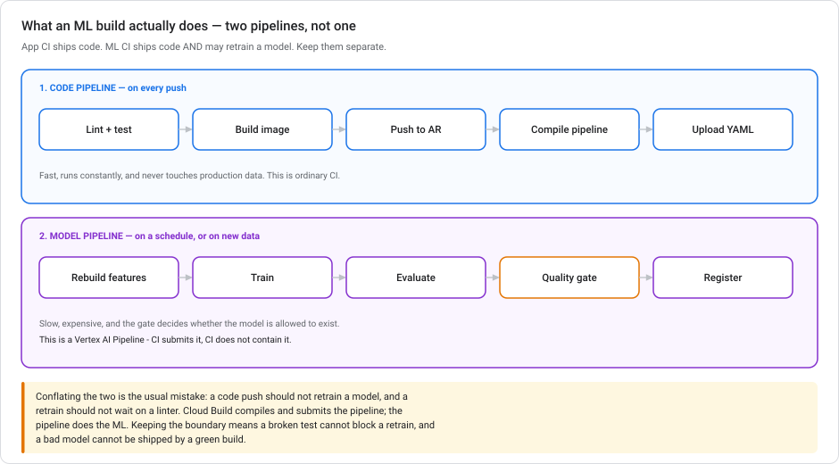
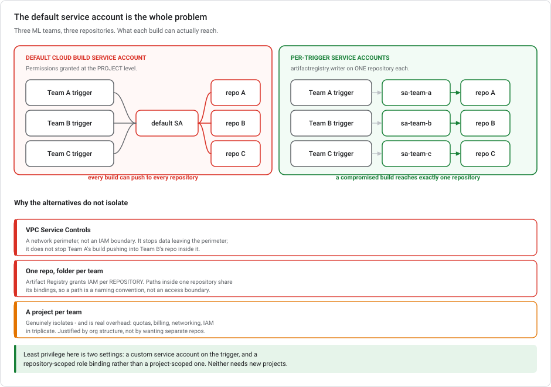

# CI/CD for ML on Google Cloud

> **Type** Explanation module (theory, no console steps)  **Reading time** 25–35 minutes
> **Related** [Git and version control](GIT-FOR-ML-ON-GCP.md) · [Kubeflow Pipelines](KUBEFLOW-PIPELINES-ON-GCP.md) · [Where training runs](VERTEX-TRAINING-COMPUTE.md) · [ML Metadata](VERTEX-ML-METADATA.md)
> **Last updated** 23 August 2026

---

## Closing the gap between code and pipelines

[Git](GIT-FOR-ML-ON-GCP.md) gets your code into version control. [Kubeflow Pipelines](KUBEFLOW-PIPELINES-ON-GCP.md) orchestrates the ML steps. Between them sits the part neither covers: **how a commit becomes a container becomes a running pipeline**, and who is allowed to do what along the way.

Two ideas do most of the work here:

1. **ML has two pipelines, not one**, and conflating them causes real pain.
2. **The default Cloud Build service account is a project-wide key**, which is fine with one team and a problem with several.

---

## 1. Two pipelines, not one



Application CI ships code. ML CI ships code **and** may retrain a model. Those are different activities with different costs and different failure modes, and they belong in separate pipelines.

### The code pipeline — on every push

Lint → test → build image → push to Artifact Registry → compile the pipeline definition → upload the YAML.

Fast, runs constantly, touches no production data. This is ordinary CI, and the ML-specific part is small: you're producing a **container** and a **compiled pipeline spec** ([the KFP IR](KUBEFLOW-PIPELINES-ON-GCP.md)) as build artifacts.

### The model pipeline — on a schedule, or on new data

Rebuild features → train → evaluate → **quality gate** → register.

Slow, expensive, and gated. This is a Vertex AI Pipeline. **Cloud Build submits it; Cloud Build does not contain it.**

### The cost of merging the two pipelines

> A code push should not retrain a model, and a retrain should not wait on a linter.

Conflate them and you get both failure modes: a broken test blocks an urgent retrain, and a green build ships a model nobody evaluated. Keeping them separate means the [quality gate](KUBEFLOW-PIPELINES-ON-GCP.md) lives where it belongs: inside the pipeline, as a `dsl.If`, rather than as a CI step.

**What triggers which:**

| Trigger | Pipeline |
|---|---|
| Push / PR | Code pipeline |
| Merge to `main` | Code pipeline, then optionally submit the model pipeline |
| Schedule | Model pipeline |
| New data lands | Model pipeline — [idempotently](EVENT-DRIVEN-ML-AUTOMATION.md) |
| [Drift alert](VERTEX-MODEL-MONITORING.md) | Model pipeline |

---

## 2. Least privilege — how it is tested in practice



### The problem

**The default Cloud Build service account has Artifact Registry permissions at the project level.** With one team that is invisible. With several ML teams sharing a project, every team's build can push to (and overwrite) every other team's images.

This is not a theoretical concern. A mistyped repository name in one team's `cloudbuild.yaml` silently overwrites another team's production training image.

### The fix, in two settings

**1. A custom service account per trigger.** Cloud Build triggers can run as a service account you specify instead of the default. One per team.

**2. A repository-scoped role binding.** Artifact Registry supports IAM **per repository**, so you grant `roles/artifactregistry.writer` on *that repository* rather than on the project.

```bash
# one repository per team
gcloud artifacts repositories create team-a-images \
  --repository-format=docker --location=us-central1

# a dedicated identity for team A's builds
gcloud iam service-accounts create sa-team-a-build

# writer on ONE repository — not on the project
gcloud artifacts repositories add-iam-policy-binding team-a-images \
  --location=us-central1 \
  --member="serviceAccount:sa-team-a-build@PROJECT.iam.gserviceaccount.com" \
  --role="roles/artifactregistry.writer"

# point the trigger at that identity
gcloud builds triggers create github \
  --name=team-a-training \
  --service-account="projects/PROJECT/serviceAccounts/sa-team-a-build@PROJECT.iam.gserviceaccount.com" \
  --repo-name=team-a --branch-pattern="^main$" --build-config=cloudbuild.yaml
```

That is the answer: **per-trigger identity, per-repository grant.** No new projects.

### Alternatives that fail to isolate teams

**VPC Service Controls.** A *network perimeter*, not an IAM boundary. It stops data leaving the perimeter; it does nothing to stop Team A's build pushing into Team B's repository *inside* that perimeter. Right tool, wrong axis. The [networking module](GCP-NETWORKING-FOR-ML-SERVING.md) draws the same distinction between reachability and permission.

**One repository, a folder per team.** Artifact Registry grants IAM **per repository**. Paths inside a repository inherit its bindings, so `team-a/` is a naming convention, not an access boundary. And granting `artifactregistry.admin` at the project level to make it work is the opposite of least privilege.

**A project per team.** This *does* isolate. It also costs quotas, billing, networking and IAM in triplicate, plus cross-project bindings to manage. Justified when teams are separate business units. Not justified by wanting separate repositories, which repository-level IAM already gives you.

> **The general shape:** reach for the smallest scope that expresses the boundary. Resource-level IAM before project-level, project-level before a new project.

---

## 3. What the build should do

A reasonable `cloudbuild.yaml` for the code pipeline:

```yaml
steps:
  # 1. fail fast on the cheap checks
  - name: python:3.11
    entrypoint: bash
    args: ['-c', 'pip install -q ruff pytest && ruff check . && pytest -q']

  # 2. build the training container
  - name: gcr.io/cloud-builders/docker
    args: ['build', '-t',
           'us-central1-docker.pkg.dev/$PROJECT_ID/team-a-images/trainer:$SHORT_SHA',
           '.']

  # 3. push it — this is the step the repository-scoped SA authorises
  - name: gcr.io/cloud-builders/docker
    args: ['push',
           'us-central1-docker.pkg.dev/$PROJECT_ID/team-a-images/trainer:$SHORT_SHA']

  # 4. compile the pipeline — catches DSL errors before anyone runs it
  - name: python:3.11
    entrypoint: bash
    args: ['-c', 'pip install -q kfp && python pipelines/training.py']

options:
  logging: CLOUD_LOGGING_ONLY
```

Three things to do deliberately:

- **Tag with `$SHORT_SHA`, never only `latest`.** A model trained from `trainer:latest` has no reproducible provenance. Provenance is what [ML Metadata](VERTEX-ML-METADATA.md) is there to give you. Immutable tags are the code half of that lineage.
- **Compile the pipeline in CI.** `compiler.Compiler().compile(...)` catches DSL errors at build time rather than at submit time, which is the cheapest place to find them.
- **Set `logging`** explicitly when using a custom service account, or builds can fail on log-writing permissions. The error message does not mention logging.

---

## 4. Where this connects

| Concern | Module |
|---|---|
| Getting code into Git at all | [Git and version control](GIT-FOR-ML-ON-GCP.md) |
| What the compiled pipeline *is* | [Kubeflow Pipelines](KUBEFLOW-PIPELINES-ON-GCP.md) |
| The container the build produces | [Where training runs](VERTEX-TRAINING-COMPUTE.md) |
| Triggering on data arrival, safely | [Event-driven ML automation](EVENT-DRIVEN-ML-AUTOMATION.md) |
| Linking image → model → data | [ML Metadata](VERTEX-ML-METADATA.md) |
| When CI/CD is even worth it | [Scaling prototypes](SCALING-PROTOTYPES-TO-ML.md) — Stage 2+ |

> **On whether you need this yet:** if your ML work is a nightly scheduled query ([Lab 3](../labs/lab-03-serving-ml-models-lowcode.md), Task 2), you don't. CI/CD earns its place once you have containers to build and a pipeline to keep compiling. That is Stage 2 or 3 on the [scaling ladder](SCALING-PROTOTYPES-TO-ML.md), not before.

---

## 5. Common isolation mistakes

**Using the default Cloud Build service account with multiple teams.** Project-level Artifact Registry permissions mean no isolation at all.

**Granting `artifactregistry.admin` at project level to "keep it simple".** It is simple, and it hands every build the ability to delete every image.

**Reaching for VPC Service Controls to separate teams.** Perimeter, not permission.

**Creating a project per team to get separate repositories.** Repository-level IAM already does it, without triplicating your infrastructure.

**One pipeline that lints and retrains.** A broken test blocks an urgent retrain; a green build ships an unevaluated model.

**Tagging images `latest` only.** Destroys the provenance chain the rest of your MLOps is trying to build.

**Building CI/CD at Stage 1.** If there's no container and no pipeline yet, you're automating the wrong thing.

---

## 6. Check your grasp of the isolation rules

<details markdown="1">
<summary><b>1.</b> Multiple ML teams, one project. Each team's Cloud Build should reach only its own Artifact Registry repository. How?</summary>

Separate repositories per team, plus **a custom service account on each trigger** granted `roles/artifactregistry.writer` **at the repository level** rather than the project level. Artifact Registry supports per-repository IAM, so that binding is a real boundary. A compromised or mistyped build reaches only one repository.
</details>

<details markdown="1">
<summary><b>2.</b> Why doesn't the default Cloud Build service account work here?</summary>

It has Artifact Registry permissions **at the project level**, so every trigger using it can push to every repository. That is invisible with one team and a real blast radius with several. A mistyped repository name silently overwrites another team's image.
</details>

<details markdown="1">
<summary><b>3.</b> Would VPC Service Controls solve it?</summary>

No. It is the wrong axis. VPC-SC is a **network perimeter** that stops data leaving; it doesn't govern which identity may write to which resource **inside** the perimeter. Team A's build could still push to Team B's repository. Isolation between teams is an IAM question.
</details>

<details markdown="1">
<summary><b>4.</b> Could you use one repository with a folder per team?</summary>

Not for isolation. Artifact Registry grants IAM **per repository**, so paths within one repository share its bindings — `team-a/` is a naming convention, not an access boundary. Making it "work" usually means granting broad project-level roles, which is the opposite of what you were trying to achieve.
</details>

<details markdown="1">
<summary><b>5.</b> Separate projects per team — wrong?</summary>

Not wrong, but disproportionate. It does isolate, and it costs quotas, billing, networking and IAM in triplicate plus cross-project bindings. When the requirement is "each build reaches only its own repository", repository-level IAM meets it inside one project. Separate projects are justified by org structure, not by repository separation.
</details>

<details markdown="1">
<summary><b>6.</b> Why keep the code pipeline and the model pipeline separate?</summary>

Because they have different triggers, costs and failure modes. A code push shouldn't retrain a model (slow, expensive), and a retrain shouldn't wait on a linter. Combined, a broken test blocks an urgent retrain and a green build can ship an unevaluated model. Cloud Build compiles and submits the pipeline; the pipeline does the ML, with the quality gate inside it.
</details>

<details markdown="1">
<summary><b>7.</b> Why tag images with the commit SHA rather than <code>latest</code>?</summary>

Because `latest` is mutable. A model trained from it has no reproducible provenance, so you can't answer "which code produced this model?" Immutable tags like `$SHORT_SHA` are the code-side half of the lineage that [ML Metadata](VERTEX-ML-METADATA.md) tracks on the data side.
</details>

---

## Recap: two pipelines, least privilege

ML CI/CD is **two pipelines**: a fast code pipeline that lints, tests, builds a container, pushes it and compiles the pipeline spec; and a slow, gated model pipeline that rebuilds features, trains, evaluates and registers. Cloud Build submits the second, it doesn't contain it. For isolation between teams, the answer is **a custom service account per trigger plus a repository-scoped `roles/artifactregistry.writer` binding**. VPC Service Controls is a network perimeter rather than an IAM boundary, folders inside one repository share that repository's bindings, and a project per team is real isolation at disproportionate cost. Tag images by commit SHA so the provenance chain survives.

---

## Further reading on Cloud Build IAM

- [Practicing the principle of least privilege with Cloud Build and Artifact Registry](https://cloud.google.com/blog/topics/developers-practitioners/practicing-principle-least-privilege-cloud-build-and-artifact-registry)
- [Artifact Registry access control with IAM](https://docs.cloud.google.com/artifact-registry/docs/access-control)
- [Default Cloud Build service account](https://cloud.google.com/build/docs/cloud-build-service-account)
- [Cloud Build — user-specified service accounts](https://cloud.google.com/build/docs/securing-builds/configure-user-specified-service-accounts)
- [MLOps: continuous delivery and automation pipelines in ML](https://cloud.google.com/architecture/mlops-continuous-delivery-and-automation-pipelines-in-machine-learning)
