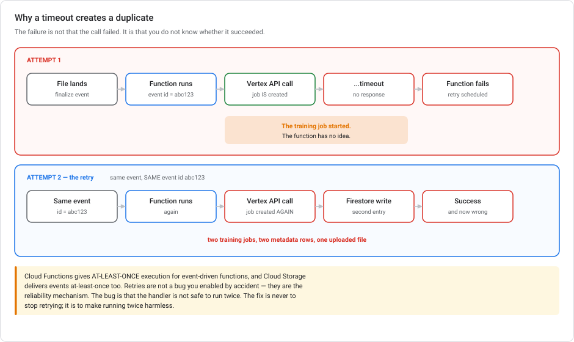
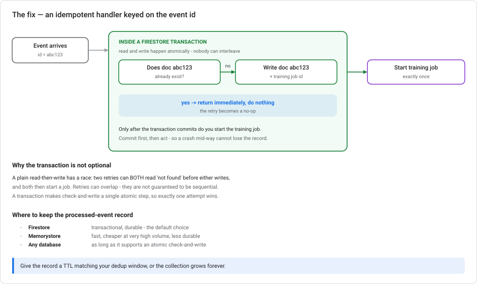
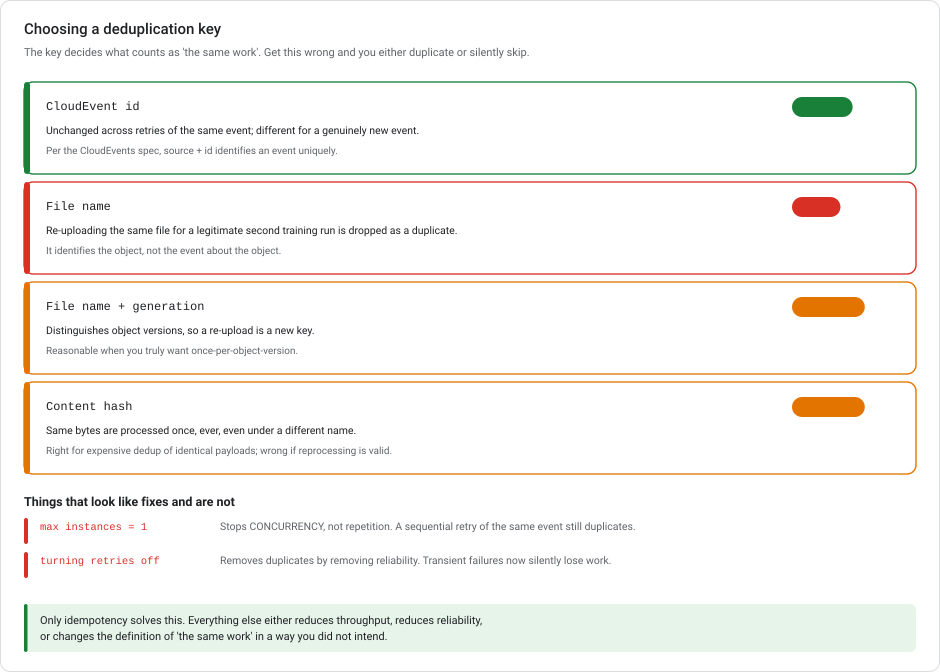

# Event-driven ML automation — retries, duplicates, and idempotency

> **Type** Explanation module (theory, no console steps)  **Reading time** 30–40 minutes
> **Related** [Kubeflow Pipelines](KUBEFLOW-PIPELINES-ON-GCP.md) · [Lab 3 — Serving](../labs/lab-03-serving-ml-models-lowcode.md) · [Scaling prototypes into ML models](SCALING-PROTOTYPES-TO-ML.md) · [API versions and launch stages](GCP-API-VERSIONS-AND-LAUNCH-STAGES.md)
> **Last updated** 23 August 2026

---

## The idempotency gap this module fills

Three other places in this series tell you a pipeline must be **idempotent**: [Scaling](SCALING-PROTOTYPES-TO-ML.md) makes it a Stage-2 requirement, its readiness checklist has a tick-box for it, and [Lab 3](../labs/lab-03-serving-ml-models-lowcode.md)'s nightly `MERGE` is built that way on purpose.

None of them explain *why*, or what to do when the work isn't a single SQL statement.

This module fills that in. The setting is where it causes the most trouble: **an event-driven retraining trigger**. A file lands in Cloud Storage, a function fires, a training job starts. It works in testing, then produces two training jobs from one upload.

---

## 1. The scenario, and why it's not what it looks like



A Cloud Function is triggered by a Cloud Storage finalize event. It calls the Vertex AI API to start a training job, then writes a row to Firestore. Retry-on-failure is enabled. The Vertex API **times out**, the function fails, the event is retried. You get **two training jobs and two metadata rows**.

The instinct is that the retry setting is the problem. It isn't.

> **The problem is not that the call failed. The problem is that you do not know whether it succeeded.**

A timeout is not a rejection. The request may have reached Vertex AI and started a job. Only the response never came back. So attempt 1 leaves a training job running that the function knows nothing about, and attempt 2 starts another.

This is the general shape of every distributed-systems duplicate: **an operation whose outcome is unknown, retried.**

### At-least-once is the contract, not the bug

Cloud Functions provides **at-least-once** execution of an event-driven function for each event, and Cloud Storage delivers events with at-least-once semantics too. Duplicates are not an edge case you can configure away. They are the documented behaviour.

Retries are the *reliability mechanism*. Without them, a transient failure silently loses a retraining run. So the fix is not to stop retrying. **The fix is to make running twice harmless.**

---

## 2. Idempotency

An operation is **idempotent** if performing it twice has the same effect as performing it once.

Some things are naturally idempotent. `SET x = 5` is. `INCREMENT x` isn't. Lab 3's `MERGE … WHEN MATCHED THEN UPDATE` is too. This is why that lab describes it as "idempotent by design: running it twice for the same day replaces that day rather than duplicating it."

"Start a training job" is **not** naturally idempotent. So you make it idempotent by wrapping it in a check.



The pattern:

1. Take the **CloudEvent id** from the incoming event.
2. **Inside a transaction**, check whether a record for that id already exists. If it does, return immediately, and the retry becomes a no-op. If not, write the record.
3. Only after the transaction commits, start the training job.

```python
# sketch, not runnable
def on_file_finalized(cloud_event):
    event_id = cloud_event["id"]          # stable across retries of this event
    doc = db.collection("processed_events").document(event_id)

    @firestore.transactional
    def claim(tx):
        snap = doc.get(transaction=tx)
        if snap.exists:
            return False                   # already handled — do nothing
        tx.set(doc, {"claimed_at": firestore.SERVER_TIMESTAMP,
                     "bucket": cloud_event.data["bucket"],
                     "name":   cloud_event.data["name"]})
        return True

    if not claim(db.transaction()):
        return                             # idempotent exit

    job = start_vertex_training_job(...)
    doc.update({"training_job_id": job.resource_name})
```

### The transaction's role

A plain read-then-write has a race. Two retries can **both** read "not found" before either writes, and both then start a job. Retries are not guaranteed to be sequential. They can overlap.

A transaction makes check-and-write a **single atomic step**, so exactly one attempt wins and the other sees the record. This is the step that often gets skipped, and it fails only under load, which is the worst way to fail.

### Record storage location

| Store | Rationale |
|---|---|
| **Firestore** | Transactional, durable. The default choice. |
| **Memorystore** | Faster and cheaper at very high volume; less durable. |
| Any database | Fine, provided it supports an atomic check-and-write. |

Give the record a **TTL matching your deduplication window**, or the collection grows forever.

---

## 3. Choosing the deduplication key



The key defines what counts as "the same work". This is where the subtle mistakes live.

| Key | Verdict | Why |
|---|---|---|
| **CloudEvent `id`** | **Correct** | Unchanged across retries of the same event, different for a truly new event |
| **File name** | **Wrong** | Identifies the *object*, not the *event*. A legitimate re-upload for a second training run is silently dropped as a duplicate |
| File name + generation | Sometimes | Distinguishes object versions; reasonable if you want once-per-object-version |
| Content hash | Sometimes | Same bytes processed once ever; wrong if reprocessing identical data is valid |

**Why the event id:** per the CloudEvents specification, the combination of `source` and `id` uniquely identifies an event. Any two events sharing that combination are duplicates. And **the id stays the same across function retries for the same event**, which is the property deduplication needs.

The file-name trap deserves a closer look, because it looks reasonable. "One training run per file" sounds like the requirement. Then someone re-uploads yesterday's export to trigger a fresh run and nothing happens. You did not prevent a duplicate. You dropped real work.

---

## 4. Things that look like fixes and aren't

**Setting max instances to 1.** This limits *concurrency*, not *repetition*. A sequential retry of the same event still duplicates, because the second attempt happens after the first finished. It also creates a throughput bottleneck the moment several files arrive together. The handler still needs to be idempotent, and you have only made it slower.

**Turning retries off.** This removes duplicates by removing reliability. Transient failures now silently lose retraining runs, and you've traded a visible problem for an invisible one.

**Cloud Tasks with deduplication.** A real feature, and it can help. But it only moves the question, because you still have to choose a dedup key. Keyed on the file name, it has the same flaw as above. And it adds a component to a problem you can solve inside the function you already have.

> Only idempotency solves this. Everything else either reduces throughput, reduces reliability, or quietly redefines "the same work".

---

## 5. The retry trap nobody mentions

Enabling retries on a function that fails *persistently* (a bad config, a permissions error, a poison payload) means it keeps retrying. The **default Pub/Sub retry window is 7 days**, though a subscription's retry policy can shorten it to as little as 10 minutes.

Seven days of exponential-backoff retries on a broken function is a lot of invocations, and if each one starts a training job before failing, it's a lot of *training jobs*.

Google's guidance is to **protect against continuous looping**, and the standard technique is an **end condition**: discard events older than a threshold.

```python
MAX_AGE = timedelta(hours=1)

if datetime.now(timezone.utc) - cloud_event.time > MAX_AGE:
    log.warning("Dropping stale event %s", cloud_event["id"])
    return                                 # give up, do not retry forever
```

Two settings to decide deliberately rather than inherit:

- **The retry window** on the subscription. 7 days is rarely what you want for ML retraining.
- **An age-based end condition** in the handler, so a persistent failure stops rather than grinding.

Pair this with a dead-letter topic if losing the event entirely is unacceptable.

---

## 6. Trigger placement

Idempotency is a property you need regardless of the trigger. But the trigger choice affects how much code you own.

| Trigger | Good for | Note |
|---|---|---|
| **Cloud Scheduler → scheduled query** | Time-based work. [Lab 3](../labs/lab-03-serving-ml-models-lowcode.md), Task 2 | No event, no dedup problem — the `MERGE` is naturally idempotent |
| **Eventarc → Cloud Run / Functions** | React to a file, a Pub/Sub message, an audit log | The scenario in this module. **You** own idempotency |
| **Eventarc → Workflows** | A few API calls with retries and conditionals | Less code than a function; same idempotency requirement |
| **Eventarc → Vertex AI Pipelines** | Event-triggered retraining with lineage | Heavier, but you inherit [pipeline caching and metadata](KUBEFLOW-PIPELINES-ON-GCP.md) |

Two connections to make explicit:

**Scheduled beats event-driven when time-based is honest.** If retraining should happen nightly, a scheduled query needs no deduplication at all. The `MERGE` handles repetition by construction. Event-driven is for when the *arrival of data* is the real signal.

**Pipeline caching is not deduplication.** [KFP's step caching](KUBEFLOW-PIPELINES-ON-GCP.md) skips a step whose inputs are unchanged, which looks similar but keys on declared inputs, not on event identity. Two runs triggered by two deliveries of the same event are two distinct pipeline runs. If you trigger pipelines from events, the dedup check belongs *before* the pipeline is submitted.

---

## 7. Mistakes that reintroduce duplicates

**Assuming a timeout means it didn't happen.** The core error. Unknown ≠ failed.

**Read-then-write without a transaction.** Works in testing, races under load. The worst failure profile there is.

**Deduplicating on the file name.** Silently drops legitimate reprocessing.

**Acting before recording.** Start the job first and crash before writing the record, and the retry has no idea a job exists. Claim the event *then* act.

**Disabling retries to stop duplicates.** Trading a visible problem for an invisible one.

**No end condition.** A persistently failing function retries for up to 7 days by default.

**No TTL on the dedup records.** The collection grows forever and eventually costs more than the problem it solved.

---

## 8. Idempotency questions worth working through

<details markdown="1">
<summary><b>1.</b> The Vertex API times out and the retry creates a duplicate training job. What's the fix?</summary>

Make the function **idempotent**, keyed on the **CloudEvent id**, which is unchanged across retries of the same event. Before starting a job, check in a **Firestore transaction** whether a record for that id exists. If it does, return. If not, write it atomically and then start the job. Keep retries enabled: they are the reliability mechanism, and idempotency is what makes them safe.
</details>

<details markdown="1">
<summary><b>2.</b> Why is the file name a poor deduplication key?</summary>

It identifies the *object*, not the *event about* the object. Uploading the same file again for a legitimate second training run produces a new event that your dedup logic would drop as a duplicate. So you would prevent real work rather than duplicate work. The CloudEvent id identifies a specific event instance, which is the thing you are deduplicating.
</details>

<details markdown="1">
<summary><b>3.</b> Would setting max instances to 1 fix it?</summary>

No. That limits **concurrency**, not **repetition**. A sequential retry of the same event happens after the first attempt finished, so the duplicate still occurs. It also throttles you badly when several files arrive at once. The handler still needs to be idempotent; you've only made it slower.
</details>

<details markdown="1">
<summary><b>4.</b> Why a transaction rather than a plain read-then-write?</summary>

Because retries can overlap. Without a transaction, two attempts can both read "not found" before either writes, and both then start a training job. A transaction makes check-and-write a single atomic operation so exactly one attempt wins. The plain version passes testing and fails under load.
</details>

<details markdown="1">
<summary><b>5.</b> Is disabling "Retry on failure" a reasonable trade?</summary>

No. It removes duplicates by removing reliability. Transient failures now silently lose retraining runs, which is worse because nothing tells you it happened. The right shape is idempotent handler **plus** retries enabled, so transient failures recover and repeated delivery is harmless.
</details>

<details markdown="1">
<summary><b>6.</b> Your function has a permissions bug and fails every time. What happens with retries on?</summary>

It retries for up to **7 days** by default (the Pub/Sub retry window, shortenable to 10 minutes via the subscription's retry policy). If each attempt starts a training job before failing, that's a lot of jobs. Guard with an **end condition** that discards events older than a threshold, and consider a dead-letter topic so the event isn't lost.
</details>

<details markdown="1">
<summary><b>7.</b> Does KFP step caching solve this?</summary>

No. It is a different mechanism keyed on different things. Caching skips a step whose declared inputs, code and image are unchanged; it says nothing about event identity, and two deliveries of the same event produce two distinct pipeline runs. If you trigger pipelines from events, the deduplication check has to happen **before** the pipeline is submitted.
</details>

---

## The idempotent-handler recap

Cloud Functions gives **at-least-once** execution and Cloud Storage delivers events at-least-once, so duplicate invocations are the contract rather than a misconfiguration. A timeout is the sharpest case, because the outcome is *unknown* rather than failed. The training job may have started. The fix is an **idempotent handler**: use the **CloudEvent id** (stable across retries, unique per event) as the deduplication key, do the check-and-write **inside a transaction** so overlapping retries can't both win, and record the claim *before* starting the job. Keep retries enabled, because they make the system reliable, and add an **age-based end condition** so a persistently failing function doesn't retry for seven days.

---

## Where these idempotency claims come from

- [Retry event-driven functions](https://docs.cloud.google.com/functions/docs/bestpractices/retries)
- [Cloud Functions pro tips: building idempotent functions](https://cloud.google.com/blog/products/serverless/cloud-functions-pro-tips-building-idempotent-functions)
- [Retry events — Eventarc](https://docs.cloud.google.com/eventarc/docs/retry-events)
- [CloudEvents specification](https://github.com/cloudevents/spec)
- [Firestore transactions](https://cloud.google.com/firestore/docs/manage-data/transactions)
- [Cloud Storage event notifications](https://cloud.google.com/storage/docs/pubsub-notifications)
