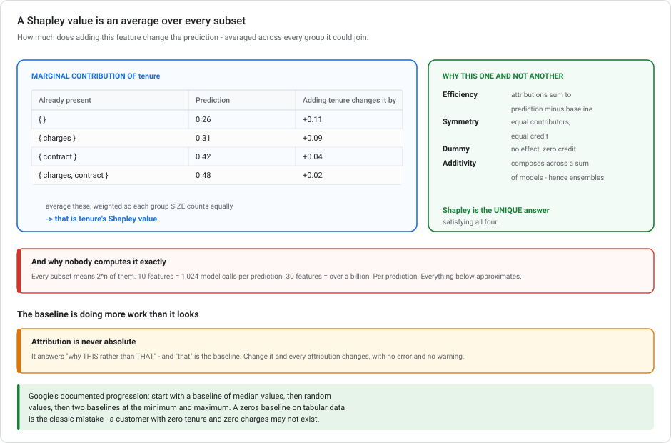
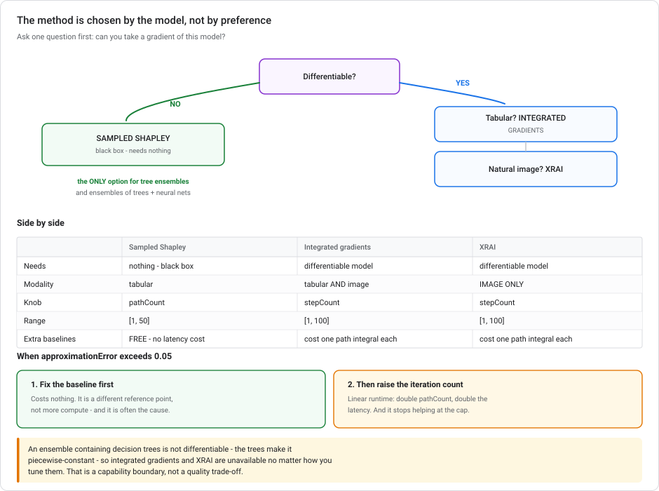
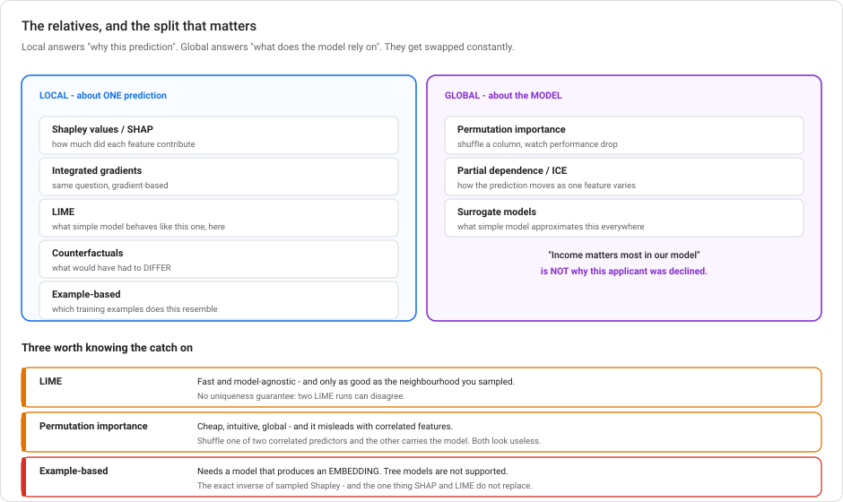

# Explainability and feature attribution

**What a Shapley value actually is, what its relatives are, and which one your model type can even use.** The techniques outlive the products that implement them. This matters here, because the Google product is on its way out.

> **Module, not a lab.** [Fairness and bias detection](VERTEX-FAIRNESS-AND-BIAS.md) argues that attribution is the **wrong** instrument for fairness. This module is about what it's the *right* instrument for.

---

## Read this first

| When | What |
|---|---|
| **16 Mar 2026** | **Vertex Explainable AI is deprecated.** No new features from this date, and unusually, **no critical-patch grace period**. |
| **16 Mar 2027** | **Fully sunset** — *"the capability will be fully sunset and APIs will no longer be available."* |
| Replacement | **None from Google.** The stated alternatives are the open-source libraries **SHAP** and **LIME**. Those substitute for *feature-based* explanations; **nothing** is offered for example-based ones. |

**This module still matters.** The *methods* are not Google's, and they are not going anywhere. Sampled Shapley, integrated gradients and XRAI are published techniques with open-source implementations, and SHAP is the same idea. Understanding them makes the migration a library swap rather than a rethink.

What *is* time-limited: the `ExplanationSpec` field names, the specific limits, and the managed integration. Those are marked below.

> **One practical trap:** none of `ExplanationSpec`, `endpoints.explain` or `DeployedModel.explanationSpec` is flagged deprecated in the API surface. You get **no programmatic warning**. The deprecation lives only in the docs, and code will keep working right up until it stops.

---

## 1. What a Shapley value is

Shapley values come from **cooperative game theory** (Lloyd Shapley, 1953), and the original question had nothing to do with machine learning: *a group of players cooperate and produce some payout — how much of it does each player deserve?*

Swap the words and you have the ML question exactly: the **players are features**, the **payout is the prediction**, and you want each feature's fair share of it.

### The definition, without the notation

Take one feature. Ask: **how much does adding it to a group of features change the prediction?** That depends on the group. A feature can matter a great deal on its own and add nothing once a correlated feature is present.

So the Shapley value takes **the average of that change across every possible group** the feature could join.

Concretely, for a churn model with features `tenure`, `charges`, `contract`:

| Group already present | Prediction | Adding `tenure` changes it by |
|---|---|---|
| {} | 0.26 | +0.11 |
| {charges} | 0.31 | +0.09 |
| {contract} | 0.42 | +0.04 |
| {charges, contract} | 0.48 | +0.02 |

Average those marginal contributions, weighted so each *size* of group counts equally, and that average is `tenure`'s Shapley value.

### Why it's the principled answer

Shapley values are the **unique** attribution satisfying four properties you'd want:

| Property | Means |
|---|---|
| **Efficiency** | The attributions sum exactly to the difference between the prediction and the baseline |
| **Symmetry** | Two features that always contribute identically get identical credit |
| **Dummy** | A feature that never changes the prediction gets zero |
| **Additivity** | Attributions compose across a sum of models, so they work on ensembles |

That uniqueness is why Shapley values dominate the field. It is not one heuristic among many. Given those four requirements, it is the only answer.

### And why you can't compute it exactly

Every possible subset means **2ⁿ subsets**. Ten features is 1,024 evaluations per prediction. Thirty features is over a billion. **Per prediction.**

So every practical implementation approximates. *How* it approximates is what distinguishes the methods below.

---

## 2. The baseline, and why it matters

Attribution is never absolute. It answers *"why this prediction **rather than** that one?"*, and "that one" is the **baseline**.

Efficiency (above) says exactly this: **attributions sum to `prediction(input) − prediction(baseline)`.** Change the baseline and every attribution changes, because you changed the question.

Common baselines for tabular data:

| Baseline | Question it answers |
|---|---|
| **Median** of each feature | "Why this customer rather than a typical one?" |
| **Zeros** | Often meaningless — a customer with zero tenure and zero charges may be off-distribution |
| **Minimum / maximum** | "Why this rather than the extreme case?" |
| **Random values** | A distributional reference rather than a single point |

Google's documented progression: *"Start with one baseline representing median values. Change this baseline to one representing random values. Try two baselines, representing the minimum and maximum values. Add another baseline representing random values."*

> **A wrong baseline produces confident, sensible-looking, meaningless attributions.** It's the most common way explanation work goes quietly wrong, and unlike a bug it never errors.

---

## 3. The three implementations, and which your model can use

This is the part that decides the answer in practice, because **the method is constrained by the model, not by preference.**

| | **Sampled Shapley** | **Integrated gradients** | **XRAI** |
|---|---|---|---|
| Field | `sampledShapleyAttribution` | `integratedGradientsAttribution` | `xraiAttribution` |
| Needs | nothing — treats the model as a **black box** | a **fully differentiable** model | a fully differentiable model |
| Model types | **Non-differentiable** — tree ensembles, *"ensembles of trees and neural networks"* | Neural networks; *"recommended especially for models with large feature spaces"* | Image models |
| Modality | Tabular | Tabular **and** image | **Image only** |
| Knob | `pathCount`, range **[1, 50]** | `stepCount`, range **[1, 100]** | `stepCount`, range **[1, 100]** |

**Sampled Shapley** approximates the definition in §1 directly: instead of all 2ⁿ subsets, sample `pathCount` random feature permutations and average. It needs nothing but the ability to call the model. This is why it is the only option for models you can't differentiate.

**Integrated gradients** computes *Aumann-Shapley* values, the continuous cousin. Instead of sampling subsets, it walks a straight path from baseline to input and integrates the gradient along it, approximated as `stepCount` discrete steps. Far more efficient when it applies, and it only applies when gradients exist.

**XRAI** takes integrated gradients and **redistributes the attribution onto segmented image regions**. Per-pixel attribution on a photograph is noise to a human; per-region is a picture you can read. It is for *"natural images, which are any real-world scenes"*. Plain integrated gradients is *"recommended for low-contrast images, such as X-rays"*, where segmentation has little to work with.

> ### The decision, in one line
>
> **Can you take a gradient of this model?** No → sampled Shapley, whatever the modality. Yes and it's tabular → integrated gradients. Yes and it's a natural image → XRAI.
>
> An **ensemble of decision trees and neural networks is not differentiable**, because the trees make it piecewise-constant. So integrated gradients and XRAI are both unavailable, however you tune them. That is a hard capability boundary rather than a quality trade-off.

---

## 4. Approximation error, and what to do about it

Because every method approximates, Vertex returns an **`approximationError`** with each attribution: how far the attributions are from summing to `prediction(input) − prediction(baseline)`. That is the efficiency property used as a self-check.

> *"If your approximation error exceeds 0.05, consider adjusting your Vertex Explainable AI configuration."*

**Two levers, and they cost differently:**

| Lever | Effect | Cost |
|---|---|---|
| **Raise the iteration count** — `pathCount` for sampled Shapley, `stepCount` for IG/XRAI | More samples, less sampling noise | **Linear runtime.** Doubling `pathCount` roughly doubles explanation latency. |
| **Choose a better baseline** | Often a large reduction | **Free** — it's a different reference point, not more compute |

Try the baseline first. It costs nothing, and a badly-chosen baseline is a common cause of high error.

**And know where the ceiling is.** `pathCount` caps at **50**; `stepCount` caps at **100**. "Increase the step count" silently stops helping there, and the improving-explanations guidance doesn't restate the maxima at the point it gives that advice. The limits live in the API reference. If you're at the cap and still above 0.05, more iterations is no longer the answer.

> **One asymmetry to note:** *"Using additional baselines with the sampled Shapley method does not increase latency."* Integrated gradients and XRAI **do** pay per baseline, because each one needs its own path integral. So with sampled Shapley, multiple baselines are close to free. With IG, they are a multiplier.

---

## 5. The relatives

Attribution is one family among several. They get used interchangeably, even though they answer different questions. This is the map.

| Technique | Scope | Answers |
|---|---|---|
| **Shapley values** (SHAP, sampled Shapley) | **Local** | How much did each feature contribute to **this** prediction? |
| **Integrated gradients** | **Local** | Same question, gradient-based |
| **LIME** | **Local** | What simple model behaves like this one *near this point*? |
| **Counterfactuals** | **Local** | What would have had to **differ** for the answer to change? |
| **Example-based explanations** | **Local** | Which **training examples** does this input resemble? |
| **Permutation importance** | **Global** | Which features does the model rely on **overall**? |
| **Partial dependence / ICE** | **Global** | How does the prediction **move** as one feature varies? |
| **Surrogate models** | **Global** | What simple model approximates this one everywhere? |

**The split that matters is local versus global.** "Which features matter to my model" is a global question; "why did this loan get refused" is a local one, and a global answer is not an acceptable response to a customer or a regulator.

Three of these need more detail:

**LIME** (Local Interpretable Model-agnostic Explanations) perturbs the input, watches the predictions, and fits a simple linear model to that local neighbourhood. Faster than Shapley and model-agnostic. But the explanation is only as good as the neighbourhood you sampled, and it lacks Shapley's uniqueness guarantee. Two LIME runs can disagree.

**Permutation importance** shuffles one feature's column and measures how much performance drops. Cheap, intuitive and global. It also **misleads with correlated features**: shuffle one of two correlated predictors and the other carries the model, so both look unimportant.

**Example-based explanations** don't score features at all. They use nearest-neighbour search in an embedding space to return training examples resembling the input: *"here are the twelve most similar applications we've seen, and what happened to them"*, which for a human is often more convincing than a bar chart. The requirements are the **exact inverse** of sampled Shapley's: it needs a model that can produce an embedding, and *"tree-based models are not supported."* Whichever model type you have, one of the two families is closed to you.

> **When Vertex Explainable AI sunsets, feature attribution ports cleanly.** `shap.KernelExplainer` is sampled Shapley, `shap.TreeExplainer` is exact and fast for trees, `captum` covers integrated gradients. **Example-based explanations do not port.** There is no offered replacement. The nearest technical substitute is building it yourself on [Vector Search](LOW-CODE-AI-ON-GCP.md) over your own embeddings, but Google does not say so and it is not a drop-in.

---

## 6. What explanations are not

**Not causation.** Attribution describes **the model**, not the world. "Tenure drove this prediction down" means the model used tenure that way, not that changing a customer's tenure would change their behaviour.

**Not a fairness check.** High attribution on a protected attribute isn't bias, and near-zero attribution isn't fairness. A model can discriminate perfectly well through proxies. This is important enough that [Fairness and bias detection](VERTEX-FAIRNESS-AND-BIAS.md) is built around it.

**Not a correctness check.** A confidently wrong prediction gets a confident, coherent explanation. Explanations tell you *how* the model decided, never *whether* it was right.

**Not stable under correlation.** When two features carry the same information, the credit split between them is somewhat arbitrary. Shapley's symmetry property means they share it, which is fair and can read as "neither matters much."

---

## 7. In BigQuery ML — a separate surface, and unaffected

BigQuery ML has its own explainability that is **not** Vertex Explainable AI and carries **no deprecation**:

| Function | Scope | Gives |
|---|---|---|
| `ML.EXPLAIN_PREDICT` | **local** | Per-row attributions alongside each prediction |
| `ML.GLOBAL_EXPLAIN` | **global** | Overall feature attributions for the model |
| `ML.FEATURE_IMPORTANCE` | **global** | Tree-model importance (gain, cover, weight) |

Same ideas, own implementation, inside the warehouse. [Lab 5](../labs/lab-05-feature-engineering-tabular.md) uses them. If your model is BigQuery ML, nothing about the Vertex sunset touches it.

---

## 8. Anti-patterns

**Picking a method by preference rather than by model type.** Integrated gradients on a tree ensemble does not underperform. It does not apply at all.

**Leaving the baseline at its default and trusting the numbers.** You've answered a question you didn't ask.

**Raising `pathCount` past 50 or `stepCount` past 100.** Those are the caps. Fix the baseline instead.

**Treating attribution as a fairness or correctness check.** Different questions entirely.

**Reading global importance as an answer to a local question.** "Income matters most in our model" is not why *this* applicant was declined.

**Using permutation importance on correlated features** and concluding neither matters.

**Building new work on Vertex Explainable AI in 2026.** It sunsets in March 2027 and gives no programmatic warning. Use SHAP directly and skip the migration.

---

## 9. Test your understanding

<b>1.</b> A tabular classifier that's an ensemble of decision trees <em>and</em> neural networks shows approximation errors above 0.05. What do you configure?

**Sampled Shapley, with a higher `pathCount`.**

The method is forced by the model: an ensemble containing trees is **non-differentiable**, so integrated gradients and XRAI are both unavailable. XRAI doubly so, being image-only. `pathCount` reduces sampling error, up to its cap of 50.

Adjusting baselines is worth trying too, and it is free. On its own, though, it does not address sampling error, and only one method applies here anyway.

<b>2.</b> In one sentence, what is a Shapley value?

A feature's **average marginal contribution to the prediction, across every possible subset of the other features**, borrowed from cooperative game theory, where it is the unique fair division of a payout satisfying efficiency, symmetry, dummy and additivity.

The reason it's approximated rather than computed: every subset means 2ⁿ of them.

<b>3.</b> Your attributions look sensible but are subtly wrong. What do you suspect first?

**The baseline.** Attributions explain the prediction *relative to* it, so the wrong baseline answers a different question, with no error and no warning. A zeros baseline on tabular data is the classic case: a customer with zero tenure and zero charges is often not a point your model has ever seen.

<b>4.</b> Attribution says <code>region</code> contributed nothing. Is the model fair with respect to region?

No, and this doesn't bear on it. A model can discriminate heavily by region while attributing near-zero to it, through **proxies** such as postcode, branch or income band. Attribution describes what the model computed with; fairness is about outcome differences between groups. Measure the outcomes.

<b>5.</b> Your model is a gradient-boosted tree and you want example-based explanations. Can you?

No. Example-based explanations need a model that produces an **embedding**, and *"tree-based models are not supported."* That is the exact inverse of sampled Shapley, which is *for* trees. Whichever model type you have, one of the two families is closed. Check this before you promise stakeholders a particular style of explanation.

---

## Summary

A **Shapley value** is a feature's **average marginal contribution across every subset of the other features**, from cooperative game theory, where it is the *unique* fair division satisfying efficiency, symmetry, dummy and additivity. That uniqueness is why it dominates; the 2ⁿ subsets are why everything approximates it. Attribution is always **relative to a baseline**, and the wrong baseline yields confident, meaningless numbers with no error. The method is chosen by the **model, not by preference**: **sampled Shapley** is black-box and the only option for **non-differentiable** models like tree ensembles; **integrated gradients** needs differentiability and covers tabular and image; **XRAI** redistributes IG onto image segments and is **image-only**. **`approximationError` above 0.05** means fix it. Try the baseline first because it is free, then raise `pathCount` (max **50**) or `stepCount` (max **100**), and note that extra baselines are free for sampled Shapley but a multiplier for IG. Around all this sit the relatives, split by scope: **LIME, counterfactuals and example-based** are local; **permutation importance and partial dependence** are global, and a global answer never answers "why *this* decision". Explanations are **not causation, not fairness, and not correctness**. Vertex Explainable AI **sunsets 16 March 2027 with no replacement**. Feature attribution ports to SHAP and captum, but **example-based explanations don't port at all**. **BigQuery ML's explain functions are a separate surface and unaffected**.

---

## References

- [Vertex Explainable AI overview](https://cloud.google.com/vertex-ai/docs/explainable-ai/overview) · [Improving explanations](https://cloud.google.com/vertex-ai/docs/explainable-ai/improving-explanations)
- [Vertex AI deprecations](https://cloud.google.com/vertex-ai/docs/deprecations)
- [`ML.EXPLAIN_PREDICT`](https://cloud.google.com/bigquery/docs/reference/standard-sql/bigqueryml-syntax-explain-predict) · [`ML.GLOBAL_EXPLAIN`](https://cloud.google.com/bigquery/docs/reference/standard-sql/bigqueryml-syntax-global-explain)
- Shapley, L. S. (1953), *A Value for n-Person Games* — the original
- [SHAP](https://github.com/shap/shap) · [LIME](https://github.com/marcotcr/lime) · [Captum](https://captum.ai/)
- Related: [Fairness and bias detection](VERTEX-FAIRNESS-AND-BIAS.md) · [Vertex AI Model Monitoring](VERTEX-MODEL-MONITORING.md) · [Lab 5](../labs/lab-05-feature-engineering-tabular.md)
