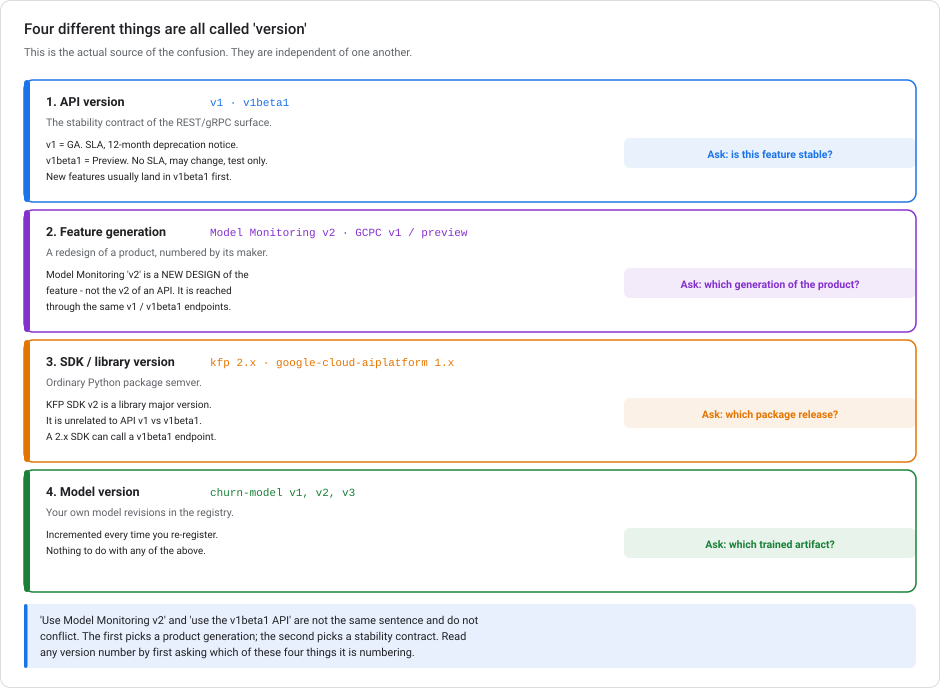
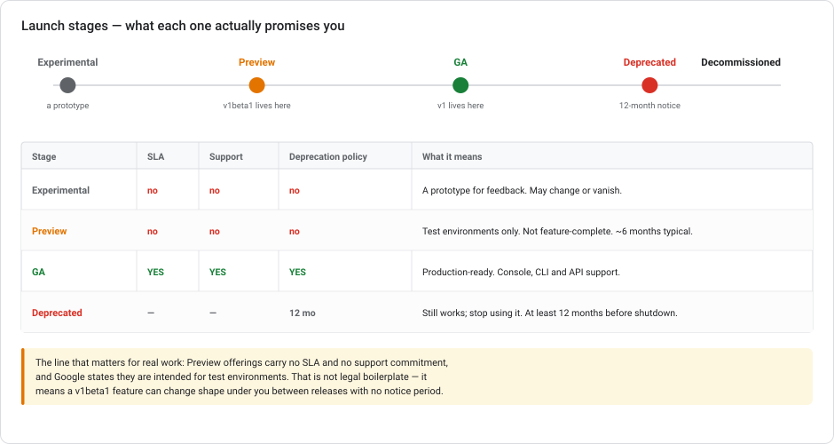
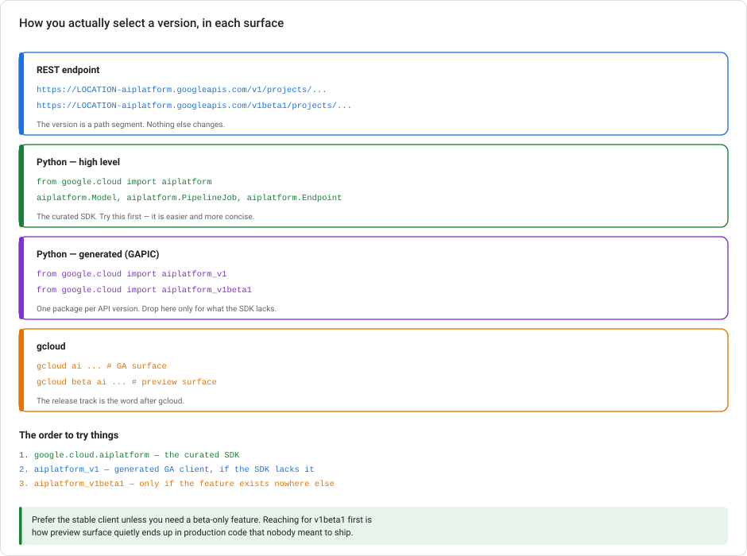

# `v1` vs `v1beta1` — API versions and launch stages on Google Cloud

> **Type** Explanation module (theory, no console steps)  **Reading time** 25–35 minutes
> **Related** every other module — each carries a tailored *API version note* pointing back here
> **Last updated** 23 August 2026

---

## Why this module exists

You will meet `v1beta1` while looking for a feature that isn't in `v1`, and the question *"is it safe to use this?"* has a real answer with real consequences.

But before that answer is useful, a bigger source of confusion has to go: **at least four different things in this stack are called "version", and they mean completely different things.** If you've been reading "KFP SDK v2", "Model Monitoring v2", and "v1beta1 API" as points on one scale, nothing will line up.

---

## 1. Four things called "version"



| # | Kind | Examples | What it numbers |
|---|---|---|---|
| 1 | **API version** | `v1`, `v1beta1` | The **stability contract** of the REST/gRPC surface |
| 2 | **Feature generation** | Model Monitoring **v2**, GCPC `v1` / `preview` | A **redesign** of a product, numbered by its maker |
| 3 | **SDK / library version** | `kfp` 2.x, `google-cloud-aiplatform` 1.x | Ordinary **package semver** |
| 4 | **Model version** | `churn-model` v1, v2, v3 | **Your own** trained artifacts in the registry |

These are independent. Concretely:

- **"Model Monitoring v2" and "the v1beta1 API" are not competing choices.** v2 is the product generation, and (as §5 shows) it is reached *through* `v1beta1`. Both statements are true at once.
- **KFP SDK v2 is a Python package major version.** It has nothing to do with API `v1`. A `kfp` 2.x pipeline is submitted via `aiplatform.PipelineJob`, which is on the **GA `v1`** surface.
- **Model version 3 of your churn model** is your third retrain. It is numbered by you.

> **The reading habit:** when you meet a version number, first ask *which of these four is it numbering?* Most of the confusion dissolves there.

The rest of this module is about **kind 1 only**.

---

## 2. Launch stages — what each promises



Google Cloud products move through defined stages, and the API version you're calling tells you which stage you're standing in:

| Stage | SLA | Support | Deprecation policy | Meaning |
|---|---|---|---|---|
| **Experimental** | no | no | no | A prototype for feedback. May change or vanish. |
| **Preview** ← `v1beta1` | no | no | no | Ready for testing before GA adoption. Not necessarily feature-complete. **Intended for test environments.** ~6 months typical. |
| **GA** ← `v1` | **yes** | **yes** | **yes** | Production-ready, covered by an SLA where applicable. |
| **Deprecated** | — | — | **≥12 months' notice** | Still works; stop using it. |

**The sentence that matters:** Preview offerings carry no SLA and no support commitment, and Google states they are intended for test environments. That is not boilerplate. A `v1beta1` shape can change between releases with **no notice period**. There is no 12-month clock on preview.

---

## 3. How you select a version



**REST** — the version is a path segment, and nothing else changes:

```text
https://LOCATION-aiplatform.googleapis.com/v1/projects/…
https://LOCATION-aiplatform.googleapis.com/v1beta1/projects/…
```

**Python, high-level SDK** — the curated surface, mostly GA:

```python
from google.cloud import aiplatform
aiplatform.Model, aiplatform.Endpoint, aiplatform.PipelineJob
```

**Python, generated (GAPIC) clients** — one package per API version:

```python
from google.cloud import aiplatform_v1        # GA surface
from google.cloud import aiplatform_v1beta1   # preview surface
```

**gcloud** — the release track is the word after `gcloud`:

```bash
gcloud ai endpoints list          # GA
gcloud beta ai endpoints list     # preview
```

### The order to try things

1. **`google.cloud.aiplatform`** — the curated SDK. Easier and more concise; start here.
2. **`aiplatform_v1`** — the generated GA client, if the SDK doesn't expose what you need.
3. **`aiplatform_v1beta1`** — only if the feature exists nowhere else.

> Prefer the stable client unless you specifically need a beta-only feature. Reaching for `v1beta1` first is how preview surface quietly ends up in production code nobody meant to ship.

---

## 4. Deciding whether to use `v1beta1`

It's a legitimate choice, not a forbidden one. The question is whether you can absorb the risk.

**Reasonable:**
- Prototyping, experiments, internal tools
- A preview feature is the *only* way to do the thing, and you've said so out loud
- You can pin versions and re-test on upgrade

**Not reasonable:**
- Production paths with an availability commitment
- Anything where a silent shape change becomes a customer-visible incident
- "It was in the tutorial" — plenty of tutorials use preview without saying so

**If you do ship preview:** pin the client library version exactly, isolate the call behind your own interface so a change touches one file, write down which preview features you depend on, and re-test on every library upgrade rather than assuming semver protects you.

---

## 5. What this means in each module

This is the practical part. The `v1` / `v1beta1` split lands **differently in each area**, and in several places the difference changes what you can do.

### [Autoscaling](VERTEX-AUTOSCALING.md) — the difference is your floor cost

| | `v1` | `v1beta1` |
|---|---|---|
| Minimum replicas | **1** — a node always runs | **0** — scale-to-zero |
| `ScaleToZeroSpec` | not available | available, with `min_scaleup_period` |

On `v1`, `minReplicaCount` cannot be 0, so your endpoint has a permanent floor cost: one node billing 24/7 whether or not anyone calls it. **Scale-to-zero is the single most consequential v1beta1-only feature in this series**, because it is the difference between a dev endpoint costing a few dollars a month and costing nothing. Everything else in that module (the OR/AND rule, the metrics, `autoscalingMetricSpecs`) is GA on `v1`.

### [Model Monitoring](VERTEX-MODEL-MONITORING.md) — the difference is which generation you get

| | `v1` | `v1beta1` |
|---|---|---|
| Resource | `ModelDeploymentMonitoringJob`, attached to an endpoint | `ModelMonitor` + `ModelMonitoringJob` |
| Generation | the original design | **Model Monitoring v2** |
| Config reuse | per-endpoint | a reusable `ModelMonitor` holding baseline + objectives |

Model Monitoring v2, the reusable `ModelMonitor` resource, is reached through **`v1beta1`** (`projects.locations.modelMonitors`), and in Python through the preview namespace (`vertexai.resources.preview.ml_monitoring`). If you pin to `v1`, you get the older endpoint-attached monitoring job instead. **This is the cleanest example of kinds 1 and 2 stacking:** a v2 *feature generation* living on a v1beta1 *API surface*. The distance metrics themselves (Jensen-Shannon and L-infinity) are unchanged either way.

### [Kubeflow Pipelines](KUBEFLOW-PIPELINES-ON-GCP.md) — three version axes at once

| Thing | Version axis | Where it sits |
|---|---|---|
| `kfp` SDK 2.x | library semver | your `pip install` |
| `aiplatform.PipelineJob` | API version | **GA, `v1`** |
| Google Cloud Pipeline Components | feature namespace | `v1` = stable; `preview` = early access |

Nothing about running a KFP pipeline requires `v1beta1`. Submission is GA. What *does* vary is **GCPC namespaces**. Components imported from `google_cloud_pipeline_components.v1.*` are stable and production-ready, while `…preview.*` are early access with the same caveats as `v1beta1`. So `from …v1.custom_job import create_custom_training_job_from_component` is the stable path, and a `preview` import is the thing to flag in review. And remember: **KFP SDK v2 is kind 3, not kind 1**. Upgrading your SDK does not move you onto a beta API.

### [ML Metadata](VERTEX-ML-METADATA.md) — nothing here needs beta

Artifacts, executions, contexts, events, the lineage subgraph, and the whole `metadata.<field>.number_value` filter grammar are **GA on `v1`**. This is the calmest module in the series from a versioning standpoint. If you find yourself in `aiplatform_v1beta1` for metadata work, you have probably taken a wrong turn.

### [Where training runs](VERTEX-TRAINING-COMPUTE.md) — GA core, preview edges

**Concretely:** `CustomJob`, worker pools, prebuilt containers and the Workbench executor are the GA path. Newer scheduling and resource options tend to appear in preview first. The practical rule: if a training feature you found isn't in `gcloud ai`, check whether it is in `gcloud beta ai`. That tells you it is preview, so it needs a decision rather than a copy-paste.

### [Low-code AI](LOW-CODE-AI-ON-GCP.md) — a different axis entirely

AutoML training, the `CLOUD*` / `MOBILE_TF_*` model types, and edge export are GA. But a **model** can carry its own launch stage, separate from the API version. BigQuery ML's SQL surface is GA, while individual Gemini models inside it sit at GA or preview independently. Gemini 3.5, 3.6 and 3.7 Flash are GA; `gemini-3-flash-preview` and Gemini 3.1 Pro are preview. Same underlying idea (a preview surface with no stability promise) reached through a completely different mechanism. Preview status here changes the stability promise, not the syntax: BigQuery accepts short names for GA and preview models alike. And note the third state, which is not a launch stage at all: **AutoML Edge object detection is in *maintenance mode***, so it is GA, stable, and quietly winding down. GA does not mean "actively invested in".

### [Networking](GCP-NETWORKING-FOR-ML-SERVING.md) — per-feature stages, not per-API

Load balancing here is largely GA, and the version question shows up per *feature* rather than per API version. For example, **outlier detection** (the serverless alternative to health checks) is available on the global external ALB and cross-region internal ALB but **not** the classic ALB. That is a capability matrix rather than a stability one. When a networking feature seems missing, check the load-balancer type before you check the API version.

### [Scaling prototypes](SCALING-PROTOTYPES-TO-ML.md) — a Stage-4 concern

This is a governance question, and it belongs at Stage 4 of that module's ladder. Preview dependencies are fine at Stage 0–1 and become a liability once something has an availability commitment. Add *"do we depend on any preview APIs, and have we written that down?"* to the readiness checklist.

---

## 5a. Models retire on a clock, APIs mostly do not

A GA API version can sit unchanged for years. A GA **model** cannot. Gemini models carry published
retirement dates, and after retirement the endpoint is switched off: calls to that model ID fail.
This is the difference that catches people who assume "GA" means "safe to forget about".

Google runs two tiers:

| Tier | Promise |
|---|---|
| Standard | *"Models available for at least 12 months after release"* |
| Short availability | *"retire 45 days after a replacement model is released"* |

The second tier deserves attention. A short-availability model can have **no retirement date published
at all**, which reads as reassuring but means the opposite: a 45-day clock can start the moment a
replacement ships. Do not pin production to one without a migration plan.

One reassurance is in writing: *"While retirement timelines may be extended, they won't be moved to an
earlier date than what is listed."* A published date can slip later, never earlier. So a date you read
today is a floor, and planning against it is safe.

Two habits follow:

- **Pin the model version** in anything you keep, so a moving default cannot silently change your results.
- **Diarise the retirement date** at the same time. Pinning trades one failure mode for another: an
  unpinned model drifts under you, a pinned model eventually stops answering.

Check the model-versions page rather than trusting any list written into a document, including this one.

---

## 6. Anti-patterns

**Reading all version numbers as one scale.** §1. The root cause of most of this confusion.

**Copying `v1beta1` from a tutorial without noticing.** Tutorials reach for preview because that's where the interesting feature is. They rarely say so.

**Assuming semver protects you.** A preview feature can change shape inside a patch release of the client library. The library follows semver; the *preview surface it wraps* does not.

**Assuming GA means actively developed.** AutoML Edge is GA *and* in maintenance mode. Stability and investment are different properties.

**Waiting for GA when you're prototyping.** Preview exists to be tried. The mistake is using it without deciding to.

---

## 7. Test your understanding

<details markdown="1">
<summary><b>1.</b> "Use Model Monitoring v2" and "use the v1beta1 API" — do these conflict?</summary>

No, and they're not even the same kind of statement. **v2** is a *feature generation*: the redesigned `ModelMonitor` resource with reusable baseline and objective config. **v1beta1** is an *API stability contract*. In this case they stack: Model Monitoring v2 is reached through the `v1beta1` surface. Pin to `v1` and you get the older endpoint-attached `ModelDeploymentMonitoringJob` instead.
</details>

<details markdown="1">
<summary><b>2.</b> Practically, what do you lose by staying on <code>v1</code> for Vertex endpoints?</summary>

Most notably **scale-to-zero**. `minReplicaCount = 0` and `ScaleToZeroSpec` are v1beta1-only, so on `v1` your floor is one replica billing 24/7 regardless of traffic. For a dev or demo endpoint that's the difference between near-zero cost and a permanent line item. The rest of autoscaling (the OR/AND rule, both metrics, `autoscalingMetricSpecs`) is GA.
</details>

<details markdown="1">
<summary><b>3.</b> You upgraded <code>kfp</code> from 1.x to 2.x. Are you now on a beta API?</summary>

No. That's a **library major version** (kind 3), entirely separate from the API version (kind 1). Pipelines are submitted via `aiplatform.PipelineJob`, which is GA on `v1`. What *is* worth checking in a KFP project is your **GCPC imports**: `google_cloud_pipeline_components.v1.*` is stable, while `…preview.*` carries the same no-SLA caveats as a beta API.
</details>

<details markdown="1">
<summary><b>4.</b> What exactly are you giving up by shipping a <code>v1beta1</code> dependency to production?</summary>

The SLA, the support commitment, and most importantly **the deprecation notice period**. GA carries at least 12 months' warning before decommissioning. Preview carries none: the shape can change between releases with no notice, and Google states it's intended for test environments. If you ship it anyway, pin the client version exactly, isolate the call behind your own interface, and write down the dependency.
</details>

<details markdown="1">
<summary><b>5.</b> A feature is GA. Does that mean it's actively developed?</summary>

No. Those are different properties. **AutoML Edge object detection is GA and in maintenance mode**: stable, supported, covered by the deprecation policy, and receiving only severe-failure fixes while Google recommends alternatives. GA tells you about *stability guarantees*, not about investment. Check the product page, not just the launch stage.
</details>

<details markdown="1">
<summary><b>6.</b> You need a feature and can't find it in the SDK. What's your search order?</summary>

`google.cloud.aiplatform` (curated SDK) → `aiplatform_v1` (generated GA client) → `aiplatform_v1beta1` (preview). Stop at the first that has it. Going straight to `v1beta1` is how preview surface ends up in production unintentionally. The equivalent check in gcloud is whether you needed `gcloud beta` rather than plain `gcloud`.
</details>

---

## Summary

Four different things in this stack are called "version", and only one of them, **`v1` vs `v1beta1`**, is about API stability. `v1` means **GA**: an SLA, support, and at least 12 months' notice before anything is decommissioned. `v1beta1` means **Preview**: no SLA, no support commitment, intended for test environments, and free to change shape without notice. New features usually land in `v1beta1` first. This is why you will meet it while hunting for something `v1` lacks, with **scale-to-zero** and **Model Monitoring v2** being the two that matter most in this series. Search in the order SDK → `v1` → `v1beta1`, and when you do take a preview dependency, make it a decision you wrote down rather than one you inherited from a tutorial.

---

## References

- [Google Cloud product launch stages](https://cloud.google.com/products#product-launch-stages)
- [Terms for pre-GA offerings](https://cloud.google.com/healthcare-api/docs/pre-ga-terms)
- [`google.cloud.aiplatform.v1beta1` reference](https://docs.cloud.google.com/gemini-enterprise-agent-platform/reference/rpc/google.cloud.aiplatform.v1beta1)
- [`projects.locations.modelMonitors` (v1beta1)](https://cloud.google.com/vertex-ai/docs/reference/rest/v1beta1/projects.locations.modelMonitors)
- [Google Cloud Pipeline Components list](https://docs.cloud.google.com/vertex-ai/docs/pipelines/gcpc-list)
- [`google-cloud-aiplatform` on PyPI](https://pypi.org/project/google-cloud-aiplatform/)
