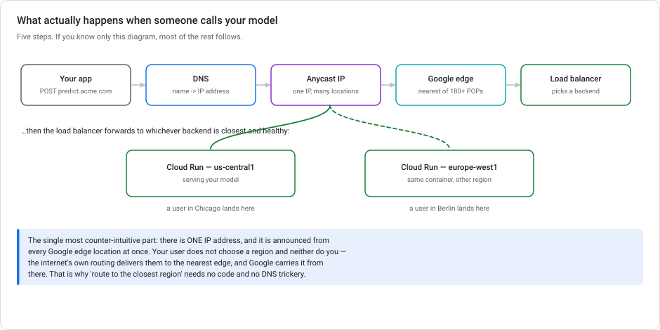
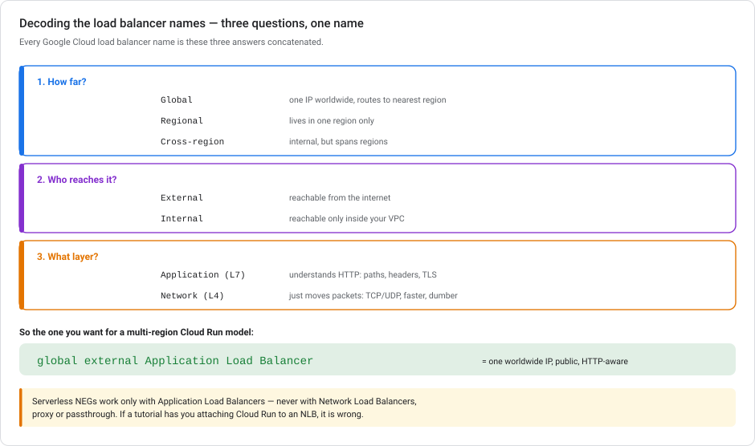
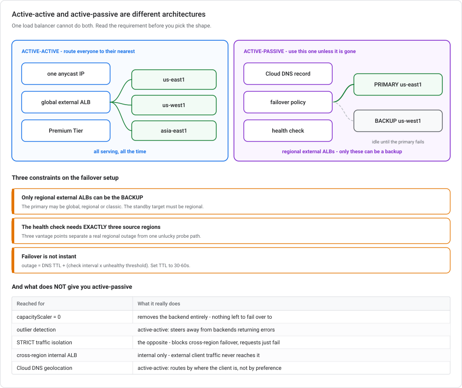
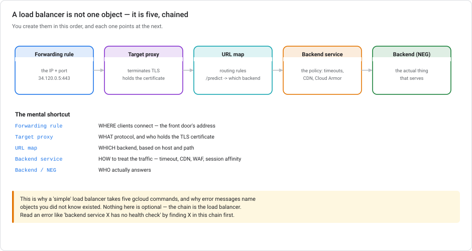
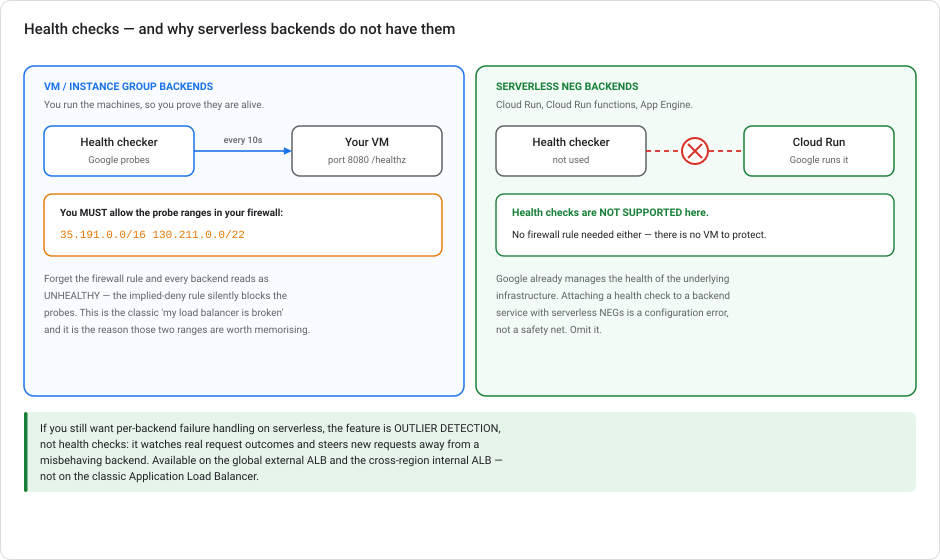

# Networking for ML serving on Google Cloud — from zero

> **Type** Explanation module (theory, no console steps)  **Reading time** 40–50 minutes
> **Assumes** no networking background at all. If you know what a load balancer is, skim §1–2.
> **Related** [Lab 3 — Serving](../labs/lab-03-serving-ml-models-lowcode.md) · [Vertex AI Autoscaling](VERTEX-AUTOSCALING.md) · [Scaling prototypes into ML models](SCALING-PROTOTYPES-TO-ML.md)
> **Last updated** 23 August 2026

---

## Who this module is for

You can build, train, evaluate and deploy a model without knowing any networking. That changes when someone says *"put it behind a load balancer"* or *"make it low-latency for European users"*. Suddenly you are reading error messages about forwarding rules, NEGs, and health check probes from `130.211.0.0/22`.

This module builds that vocabulary from nothing. It is deliberately narrow: only the networking an ML engineer meets when serving a model. No routing protocols, no subnetting arithmetic, no CCNA.

The payoff is specific. By the end you should be able to read this sentence and know why it is true:

> *Backend services with serverless NEG backends do not support health checks, and health-check errors in the logs are expected behaviour when using Cloud Run as a backend.*

---

## 1. The ninety-second primer

Six words. That is the whole prerequisite.

| Word | What it is | A useful analogy |
|---|---|---|
| **IP address** | A number identifying a machine on a network, e.g. `34.120.0.5` | A street address |
| **DNS** | The system that turns a name into an IP, e.g. `predict.acme.com` → `34.120.0.5` | The phone book |
| **Port** | A number picking *which program* on that machine, e.g. `443` | The apartment number |
| **HTTP / HTTPS** | The language web requests are written in. HTTPS is HTTP inside encryption | The language of the letter |
| **TLS** | The encryption. A **certificate** proves you own the name | The tamper-proof envelope, and the ID that proves it's really you |
| **Latency** | How long a round trip takes, mostly determined by physical distance | How long the postman takes |

Two facts that drive almost every design decision:

- **Latency is dominated by distance.** Light in fibre covers roughly 200 km per millisecond, and real routes are not straight. A request from Berlin to Iowa costs ~100 ms round trip *before your model does anything*. If your model takes 30 ms, geography is 3× your compute.
- **A region is a physical place.** `us-central1` is Iowa. `europe-west1` is Belgium. When you deploy "to a region", you are choosing a building.

That's it. Everything below is built from those six words.

---

## 2. The path of a prediction request



1. **Your app** sends `POST https://predict.acme.com/predict`
2. **DNS** turns `predict.acme.com` into an IP address
3. That IP is **anycast** — one address announced from every Google edge location simultaneously
4. The internet's own routing delivers the request to the **nearest Google edge** (a point of presence, of which there are 180+)
5. Google's network carries it internally to a **load balancer**, which picks a backend

### One surprising detail

**There is one IP address, and it exists in many places at once.**

Normally an IP belongs to one machine in one building. An **anycast** IP is announced from hundreds of locations, and the internet routes each user to whichever is nearest. A user in Chicago and a user in Berlin type the same hostname, get the same IP, and reach different continents.

This is why *"route users to the closest region"* requires no code, no DNS tricks, and no geo-detection on your part. You get it by using a **global** load balancer. So when a design says "routes user requests to the closest Cloud Run service" with no further explanation, it can be stated that casually because it is free.

> **The other benefit is less obvious and bigger.** Once traffic hits the nearest edge, it travels the rest of the way over **Google's private backbone** rather than the public internet. That path is usually faster and more consistent. So a global load balancer improves latency even for users who end up served from a distant region.

---

## 3. Load balancer responsibilities

Two jobs. The second one is less obvious:

**Job 1 — distribute traffic.** Many backends, one address. Spread requests across them, skip the broken ones.

**Job 2 — be the boundary.** It terminates TLS (holds your certificate), applies the WAF, caches, logs, and enforces timeouts. In practice this is why you want one even with a *single* backend: it is the place all the cross-cutting concerns live.

It is easy to assume otherwise, so state it plainly:

> **A load balancer is not primarily about load.** With one Cloud Run service you may still want one — for a custom domain, a managed certificate, Cloud Armor, or Cloud CDN. "Balancing" is one feature among several.

---

## 4. Decoding the names

Google Cloud has about a dozen load balancers with names like *"global external Application Load Balancer"*. The names look bureaucratic, but they are precise. Each one joins three answers together.



**1. How far does it reach?**
- **Global** — one anycast IP worldwide, routes to the nearest healthy backend. What you want for multi-region.
- **Regional** — lives in one region. Cheaper, simpler, no cross-region routing.
- **Cross-region** — internal, but spans regions.

**2. Who can reach it?**
- **External** — reachable from the public internet.
- **Internal** — reachable only from inside your VPC (your private network).

**3. Which layer does it understand?**
- **Application (L7)** — speaks HTTP. Can route on path and hostname, terminate TLS, cache, apply a WAF.
- **Network (L4)** — moves TCP/UDP packets without reading them. Faster, dumber, protocol-agnostic.

So **global external Application Load Balancer** = one worldwide public IP, HTTP-aware. That's the one for a multi-region Cloud Run model.

> **A hard constraint to memorise:** serverless NEGs (§6) work **only** with Application Load Balancers. Never with Network Load Balancers, proxy or passthrough. If a tutorial attaches Cloud Run to an NLB, it is wrong.

---

## 4a. Network Service Tiers — the fourth answer in the name

One more choice is missing from the load balancer's name, and it changes what the load balancer can do: **Premium** or **Standard** tier.

The difference is **where your traffic enters Google's network.**

| | **Premium Tier** | **Standard Tier** |
|---|---|---|
| Traffic enters Google at | the **point of presence nearest the user** — 200+ worldwide | a peering point near **the region your backend is in** |
| Then travels over | Google's **private backbone** | the public internet, to the edge of the region |
| Load balancer scope | **Global** — one IP, all regions on one backend service | **Regional** — backends in a single region |
| Costs | more per GB | less per GB |

**A user in Jakarta hitting a backend in `us-central1`:**

- **Premium** — enters Google's network in Jakarta, then crosses the Pacific on Google's own backbone. One hop onto Google, then a managed private network.
- **Standard** — crosses the Pacific over the ordinary internet, through whatever chain of ISPs the route takes that day, and only enters Google's network on arrival in the US.

Same distance, very different latency and variance. This is the argument for Premium.

### The multi-region decision

**Global load balancing requires Premium Tier.** In Standard Tier a load balancer's backends must live in **one region**. So "one IP, three regional backends, routed to the nearest" is not a configuration Standard can express.

So for a model served from `us-central1`, `europe-west1` and `asia-east1` with one worldwide entry point:

> **Global external Application Load Balancer, Premium Tier, all three regional managed instance groups in a single backend service, one anycast IP.**

The anycast IP (§2) is what makes nearest-region routing automatic: every user resolves the same address, the internet routes each to the nearest Google POP, and the load balancer forwards to the closest **healthy** backend from there. You write no geolocation logic.

### The alternatives, and where they lose

| Approach | Problem |
|---|---|
| Three regional load balancers + **Cloud DNS geolocation routing** | It works, but it is worse *for this requirement* (see §4b: the same building blocks are the right answer for active-passive failover). Standard Tier means traffic rides the public internet to each region rather than entering Google's backbone near the user. You also now operate three load balancers, three IPs and three certificates. DNS failover is slow too, because clients cache records. |
| **Classic** Application Load Balancer in Standard Tier | Standard Tier restricts backends to a single region. It cannot span three. |
| Global external **proxy Network** Load Balancer with **weighted round-robin** | Premium and multi-region, but weighted round-robin distributes by **weight**, not by proximity. Equal weights send a third of Jakarta's traffic to Europe. Application Load Balancers route to the closest healthy backend by network proximity automatically. |
| Adding **Cloud CDN** | Caching is for responses that repeat. Real-time inference returns a different answer per request, so the cache hit rate is zero and you have added a hop. |

> **The trap in that last row:** CDN and caching *sound* like latency answers. For inference they are not, because there is nothing to cache. Latency for unique-per-request responses is a **routing** problem. Premium Tier and anycast solve routing.

**When Standard Tier is the right choice:** a single-region service whose users are also in that region, or a dev environment where egress cost matters more than tail latency. It is a real option, not a trap. It is just not the answer here.

---

## 4b. Active-passive failover — a different question entirely

§4a answered *"route everyone to their nearest region"*. This section answers a different requirement. It sounds similar, but the architecture is almost the opposite:

> **"Traffic goes to `us-east1`. It goes to `us-west1` only if `us-east1` is completely unavailable."**



That is **active-passive**: one region serves, the other stands by. A global external Application Load Balancer **cannot express it**. A global load balancer exists to route everyone to their nearest healthy backend, and that is active-active by design. There is no "prefer this region" knob on a backend service.

### The mechanism: Cloud DNS failover routing policy

Failover for external Application Load Balancers happens at the **DNS layer**, not inside one load balancer:

1. Deploy the primary and a **backup** load balancer, each with its own forwarding rule and IP.
2. Create a **Cloud DNS health check** against the primary.
3. Create a **failover routing policy** on the DNS record: primary target while healthy, backup target when not.

Clients resolve the hostname; Cloud DNS hands back the primary's IP while the primary is healthy, and the backup's IP once it isn't.

### Three constraints to remember

**Only a *regional* external Application Load Balancer can be the backup.** The primary may be global, regional, or classic. The standby target must be regional. So the supported pairings are:

| Primary | Backup |
|---|---|
| Global external ALB | Regional external ALB |
| Regional external ALB | Regional external ALB |
| Classic ALB | Regional external ALB |

**The health check needs exactly three source regions.** Not one, not five. Cloud DNS requires you to name three, and probes come from points of presence near each. Three independent vantage points separate "the region is down" from "one probe path is having a bad minute". A single-region check would trigger a false failover.

**Failover is not instant.** Use this formula:

```
outage duration  ≈  DNS TTL  +  (health check interval × unhealthy threshold)
```

DNS is a cache, and you cannot make clients forget faster than their TTL. Set the record's **TTL to 30–60 seconds** if failover speed matters. High TTLs are the usual reason a "working" failover takes ten minutes to take effect.

> **Two things regional external ALBs don't support:** Cloud CDN, and Cloud Storage buckets as backends. If your primary uses either, the backup cannot be a like-for-like copy.

### Approaches that don't achieve failover

| Approach | Why not |
|---|---|
| **`capacityScaler = 0`** on the standby backend | It does not make the backend a standby. It removes it from the pool entirely, so there is nothing left to fail over *to*. |
| **Outlier detection** | Real, and active-*active*. It steers new requests away from backends returning errors, distributing across whatever remains healthy. It never designates one region as preferred. |
| **`STRICT` traffic isolation** in a service load balancing policy | The opposite of failover: STRICT *prevents* traffic crossing to another region even when local backends are unhealthy. Requests fail rather than move. |
| **Cross-region internal ALB** | *Internal.* It serves clients inside your VPC. External client traffic never reaches it. |
| **Cloud DNS *geolocation* routing** | Also real, also active-active. It routes by where the client is. That is a latency answer, not a preference answer. §4a is where it belongs. |

### The short version

> **Geolocation routing** and **outlier detection** answer *"spread the traffic well."* **Failover routing** answers *"use this one, and only fall back if it's gone."* Read the requirement for **active-active versus active-passive** to pick between them. A global load balancer can only do the first.

---

## 5. A load balancer is five objects, not one

This part is easy to get lost in, usually because nobody has drawn it for you.



You create five resources, chained:

| Object | The question it answers |
|---|---|
| **Forwarding rule** | **WHERE** clients connect — the IP address and port |
| **Target proxy** | **WHAT** protocol, and who holds the TLS certificate |
| **URL map** | **WHICH** backend, based on hostname and path |
| **Backend service** | **HOW** to treat the traffic — timeouts, CDN, Cloud Armor, session affinity |
| **Backend (NEG or instance group)** | **WHO** answers the request |

Reading it backwards is often more natural: *something has to serve (backend), grouped under a policy (backend service), selected by a rule (URL map), spoken to over a protocol (target proxy), at an address (forwarding rule).*

This structure is why a "simple" load balancer takes five `gcloud` commands, and why errors name objects you did not know existed. **When you hit an error, find the named object in this chain first.** It tells you which of the five questions is being answered wrongly.

---

## 6. NEGs — the word you'll keep meeting

A **Network Endpoint Group** is exactly what it says: a named group of things that can receive traffic. It exists because "backend" means very different things depending on what you run.

| NEG type | Points at | Notes |
|---|---|---|
| **Serverless NEG** | Cloud Run, Cloud Run functions, App Engine | **Must be in the same region as the service it points at** |
| **Zonal NEG** | IPs and ports inside a VPC — VMs, GKE pods | The classic backend |
| **Hybrid connectivity NEG** | On-prem or another cloud | For migrations and hybrid setups |
| **Internet NEG** | A public hostname or IP outside Google Cloud | Front an external API |

For serving a model on Cloud Run, you want a **serverless NEG** — one per region. Two regions means two NEGs, both attached to the same backend service. That single backend service is what makes it one logical service with global routing.

> **The same-region rule is absolute.** A serverless NEG in `us-central1` cannot point at a Cloud Run service in `europe-west1`. Get this wrong and creation fails. This matters for the question in the intro: a region mismatch produces a **deployment error**, not health-check errors in the logs.

---

## 7. Health checks — and the serverless surprise



### The health check mechanism

Google periodically sends a small request to each backend, say `GET /healthz` on port 8080, and marks it healthy or unhealthy based on the reply. Unhealthy backends stop receiving traffic. It exists because **Google has no idea whether your VM is working.** You installed the software; you have to prove it's alive.

### The firewall ranges

Those probes come from Google-owned IP ranges, and your VM firewall must allow them:

```
35.191.0.0/16
130.211.0.0/22
```

(External passthrough Network Load Balancers also use `209.85.152.0/22` and `209.85.204.0/22`.)

Google Cloud has an **implied deny** rule on inbound traffic: anything not explicitly allowed is dropped. Forget this firewall rule and every backend reads UNHEALTHY, your load balancer serves 502s, and nothing in the error mentions firewalls. This is the most common load balancer failure, so memorise the two ranges.

### Serverless backends and health checks

**Backend services with serverless NEG backends cannot be configured with health checks. Health checks are not supported for serverless backends.**

The reason follows from what "serverless" means. With Cloud Run, **Google runs the infrastructure**. Google already knows the health of the underlying instances, monitors them, restarts them, and routes around failures. An external probe would be Google asking Google whether Google's service is up.

Because there are no probes, **you don't need a firewall rule either.** There is no VM whose firewall could block anything.

### Resolving the opening scenario

> You deploy Cloud Run in two regions behind a global external ALB, and see health check errors in Cloud Logging.

The cause is that **health checks aren't supported for serverless NEG backends at all.** Whatever health check was attached should not be there. The configuration should omit it.

Work through the near-misses too:

- **"NEGs in the wrong region"** — a real constraint (§6), but breaking it fails at *creation* time. You would never reach the point of seeing health check errors.
- **"Wrong protocol, HTTP vs HTTPS"** — this assumes health checks work here and only need tuning. They do not work here at all.
- **"Missing firewall rules for the probe ranges"** — those ranges are real, and that rule is required *for VM backends*. Cloud Run is fully managed, so there is no firewall of yours in the path.

Notice that three of the four are true statements about networking, applied to the wrong backend type. **The discriminating question is always: who runs the machine?** If you do, you prove it's healthy. If Google does, Google already knows.

### Outlier detection for serverless backends

The serverless equivalent is **outlier detection**. Instead of probing, it watches real request outcomes and steers new requests away from a backend that is returning errors. It is available on the **global external ALB** and the **cross-region internal ALB**, but *not* on the classic Application Load Balancer.

---

## 8. Networking by serving surface

| You're serving on | Networking you need |
|---|---|
| **Vertex AI endpoint** (public) | Almost none — you get an HTTPS endpoint, authenticated with IAM. This is [Lab 3](../labs/lab-03-serving-ml-models-lowcode.md). |
| **Cloud Run** | Fine on its own URL. Add a load balancer for a custom domain, multi-region routing, Cloud Armor, or CDN, via serverless NEGs. For the container side (cold starts and where model weights live) see [Serving models on Cloud Run](SERVING-MODELS-ON-CLOUD-RUN.md). |
| **GKE** | The most networking. Zonal NEGs, Ingress/Gateway, service meshes. |
| **Vertex AI endpoint** (private / PSC) | VPC-level work: Private Service Connect, and often VPC Service Controls. |

**Most ML serving needs far less networking than expected.** A Vertex endpoint is already a TLS-terminated, authenticated, autoscaled HTTPS service. Reach for a load balancer when you need a custom domain, multi-region routing, a WAF, or CDN. Not by default.

### Private connectivity, briefly

Three terms you will meet. You do not need to master them:

- **VPC** — your private network in Google Cloud. Resources inside it can talk without touching the internet.
- **Private Service Connect (PSC)** — lets you reach a Google service (including a Vertex endpoint) from a private IP inside your VPC, so traffic never traverses the public internet.
- **VPC Service Controls** — a perimeter around services, so data can't be read from outside it even with valid credentials. The usual answer to "prevent exfiltration".

If a requirement says *"predictions must not traverse the public internet"*, the answer is PSC. If it says *"data must not leave our perimeter even if credentials leak"*, the answer is VPC Service Controls.

---

## 9. A debugging checklist

When a load-balanced endpoint misbehaves, in order:

1. **Does the backend work directly?** Call the Cloud Run URL or VM IP straight. If that is broken, the load balancer is not the cause.
2. **What backend type is it?** Serverless vs VM decides whether health checks and firewall rules are even in play.
3. **VM backends: is the firewall rule there?** `35.191.0.0/16` and `130.211.0.0/22`. Overwhelmingly the most common cause.
4. **Serverless backends: is a health check attached that shouldn't be?** Remove it.
5. **Same region?** Serverless NEG and its service must match.
6. **DNS and certificate.** A managed certificate needs DNS pointing at the LB IP *before* it can provision, and provisioning takes up to ~30 minutes. "It doesn't work yet" often means "it isn't ready yet".
7. **Give it time.** Global load balancer config can take several minutes to propagate worldwide. Changing something and retesting instantly produces confusing results.

---

## 9a. API version note — capability matrix, not stability

Networking is the module where the version question mostly **isn't** about `v1` vs `v1beta1`.

**Concretely:** load balancing is largely GA. What varies is which **load-balancer type** supports a given feature. That is a capability matrix, not a stability contract. The clearest example comes from §7:

| Feature | Global external ALB | Cross-region internal ALB | Classic ALB |
|---|---|---|---|
| **Outlier detection** | ✅ | ✅ | ❌ |
| Serverless NEG backends | ✅ | ✅ | ✅ |
| Health checks on serverless NEGs | ❌ (unsupported everywhere) | ❌ | ❌ |

So when a networking feature seems missing, **check the load-balancer type before you check the API version**. That is almost always the real constraint. "Not available" here usually means "not on this LB", not "still in preview".

See [API versions and launch stages](GCP-API-VERSIONS-AND-LAUNCH-STAGES.md) for the cases where stability really is the question.

---

## 10. Mistakes that break load-balanced serving

**Attaching a health check to a serverless NEG backend service.** The subject of this module. It is a configuration error, not a safety net.

**Reaching for a load balancer by default.** A Vertex endpoint or Cloud Run URL is already HTTPS and already scales. Add the LB when you need what it provides.

**Assuming multi-region means multi-region.** Deploying to two regions does nothing on its own. Without a *global* load balancer and NEGs in both, you have two unrelated services and two URLs.

**Debugging DNS/TLS in the first five minutes.** Certificate provisioning and config propagation take real time. Wait before you investigate.

**Copying firewall ranges into a serverless setup.** Harmless but reveals a misunderstanding, and it means you'd miss the actual cause.

**Ignoring latency.** Berlin → Iowa is ~100 ms round trip before your model runs. If your model takes 30 ms, region placement matters more than any optimization you make to the model.

---

## 11. Work through these networking scenarios

<details markdown="1">
<summary><b>1.</b> Cloud Run in two regions behind a global external ALB, health check errors in the logs. Cause?</summary>

Health checks aren't supported for backend services with serverless NEG backends. Google already manages the health of Cloud Run's underlying infrastructure, so a probe has nothing to establish. The fix is to omit the health check configuration entirely. If you want per-backend failure handling, the serverless feature is **outlier detection**, not health checks.
</details>

<details markdown="1">
<summary><b>2.</b> Would putting the serverless NEGs in the wrong region cause those health check errors?</summary>

No. A serverless NEG can only point at a serverless resource in its own region, and breaking that rule fails at *creation* time. You would get a deployment error and never reach a state where health check errors appear. It is a true constraint attached to the wrong symptom.
</details>

<details markdown="1">
<summary><b>3.</b> What are <code>35.191.0.0/16</code> and <code>130.211.0.0/22</code>, and when do you care?</summary>

Google's health check probe source ranges. You must allow them in your VPC firewall for **VM and instance group backends**. Google Cloud's implied-deny drops anything not explicitly permitted, so forgetting the rule makes every backend read UNHEALTHY with no mention of firewalls anywhere. They are irrelevant for serverless NEG backends, since no probes are sent and there is no firewall of yours in the path.
</details>

<details markdown="1">
<summary><b>4.</b> How does one IP address route users to the nearest region?</summary>

The IP is **anycast**. It is announced from every Google edge location at once, so the internet's own routing carries each user to the nearest one. From there Google's private backbone reaches the closest healthy backend. You write no geo-detection code; you get it by choosing a *global* load balancer.
</details>

<details markdown="1">
<summary><b>5.</b> You have one Cloud Run service in one region. Any reason to add a load balancer?</summary>

Yes, several, and none of them are about load. A custom domain with a managed certificate, Cloud Armor as a WAF, Cloud CDN, centralized logging, or IAP. "Balancing" is one feature among several; the load balancer is mostly *the boundary* where cross-cutting concerns live.
</details>

<details markdown="1">
<summary><b>6.</b> "Predictions must never traverse the public internet." What are you reaching for?</summary>

**Private Service Connect.** It exposes the service on a private IP inside your VPC, so traffic stays on Google's network. Do not confuse it with **VPC Service Controls**, which answers a different requirement: preventing data from leaving a perimeter even when credentials are valid.
</details>

---

## Recap: the load balancer anatomy

A global external Application Load Balancer is **five chained objects**: forwarding rule, target proxy, URL map, backend service, backend. In front of them sits an **anycast IP** that gives you nearest-region routing for free. Backends are grouped into **NEGs**, and the NEG type determines the rules. A **serverless NEG** must sit in the same region as its Cloud Run service, and it works only with Application Load Balancers. Google runs the infrastructure behind it, so it **supports no health checks and needs no firewall rules for probes**. Health checks and the `35.191.0.0/16` / `130.211.0.0/22` ranges belong to backends *you* run. The discriminating question, every time: **who runs the machine?**

---

## Glossary

| Term | Meaning |
|---|---|
| **Anycast** | One IP announced from many locations; routing picks the nearest |
| **Backend service** | The policy object grouping backends: timeouts, CDN, WAF, affinity |
| **Cloud Armor** | Google's WAF / DDoS protection, attached to a backend service |
| **Cloud CDN** | Edge caching, enabled on a backend service |
| **Forwarding rule** | The IP + port clients connect to |
| **GFE** | Google Front End — the edge servers that terminate your connection |
| **Health check** | Periodic probe proving a backend is alive. Not for serverless |
| **Implied deny** | VPC firewalls drop anything not explicitly allowed |
| **NEG** | Network Endpoint Group — a named set of things that receive traffic |
| **Outlier detection** | Serverless alternative to health checks; watches real request outcomes |
| **POP** | Point of presence — a Google edge location |
| **PSC** | Private Service Connect — reach a service from a private IP |
| **Target proxy** | Terminates the connection, holds the TLS certificate |
| **URL map** | Routes by hostname and path to a backend service |
| **VPC** | Your private network inside Google Cloud |
| **VPC Service Controls** | A data-exfiltration perimeter around services |

---

## Load balancing documentation used here

- [Set up a global external ALB with Cloud Run](https://docs.cloud.google.com/load-balancing/docs/https/setup-global-ext-https-serverless)
- [Serverless NEGs overview](https://docs.cloud.google.com/load-balancing/docs/negs/serverless-neg-concepts)
- [Backend services overview](https://docs.cloud.google.com/load-balancing/docs/backend-service)
- [Health checks overview](https://docs.cloud.google.com/load-balancing/docs/health-check-concepts)
- [Firewall rules for load balancing](https://docs.cloud.google.com/load-balancing/docs/firewall-rules)
- [Cloud Load Balancing overview](https://cloud.google.com/load-balancing/docs/load-balancing-overview)
- [Private Service Connect](https://cloud.google.com/vpc/docs/private-service-connect)
