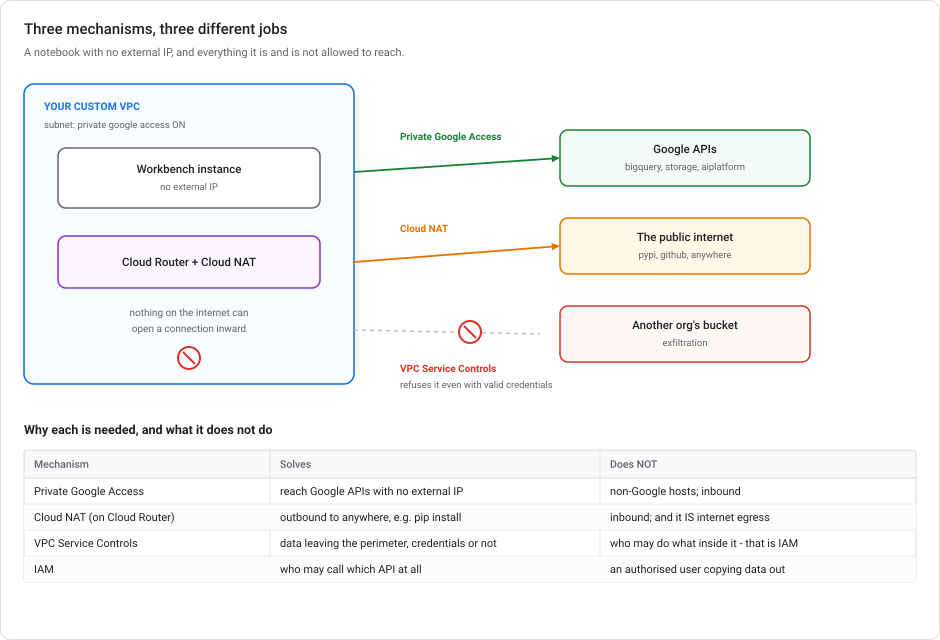
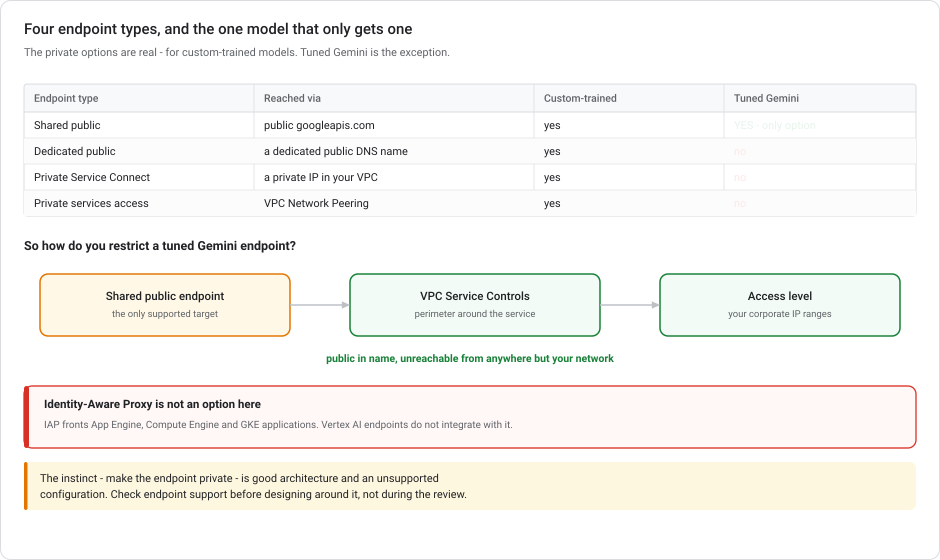

# Private networking for ML on Google Cloud

**How you build an ML environment with no route to the internet that can still reach Google's services.** Private Google Access, Cloud NAT, VPC Service Controls, and the four kinds of Vertex AI endpoint. This is the second half of the networking story.

> **This module assumes no networking background.** Its sibling, [Networking for ML serving](GCP-NETWORKING-FOR-ML-SERVING.md), covers **traffic coming in**: load balancers, anycast, NEGs, health checks. This one covers **traffic going out**, and how you stop it. Read that one first if "IP address" and "subnet" are new words. It starts from zero and this module builds on it.

---

## Recent shifts in the private-networking picture

| When | What |
|---|---|
| **22 Apr – 21 May 2026** | Vertex AI → **Gemini Enterprise Agent Platform**. VPC Service Controls still lists the service as `aiplatform.googleapis.com`; perimeter configs did not need editing. |
| **30 Mar 2026** | **Managed notebooks retired.** Workbench **instances** are the only Workbench form. This simplifies the networking story: one instance type, one set of VPC options. |
| **Ongoing** | Private Service Connect is now the recommended private-access mechanism over the older VPC Network Peering ("private services access") path for Vertex endpoints. |

---

## 1. The problem, stated plainly

A financial-services team wants notebooks. Security says:

- **No direct internet access.** A compromised notebook must not be able to POST customer data to an arbitrary host.
- **But it must still reach Google Cloud services** — BigQuery, Cloud Storage, the Vertex AI API. Otherwise the notebook is useless.

Those two requirements pull against each other. The answer needs **three separate mechanisms**, and they are easy to confuse:

| Mechanism | Answers | Layer |
|---|---|---|
| **Private Google Access** | "How do I reach Google APIs without a public IP?" | Routing |
| **Cloud NAT** (+ Cloud Router) | "How do I reach `pip install` without being reachable *from* the internet?" | Routing |
| **VPC Service Controls** | "How do I stop data leaving even when credentials are valid?" | Perimeter |



None of them replaces IAM. IAM decides *who may*; these decide *what is reachable* and *where data may go*. The requirement above needs all three, plus IAM.

---

## 2. Private Google Access

### Reaching Google APIs without a public IP

A VM with no external IP address cannot reach anything outside its VPC. That includes `bigquery.googleapis.com`, which is Google's own service but still lives at a **public IP address**. So removing the external IP for security also breaks every API call.

### A per-subnet setting

**Private Google Access is a per-subnet setting.** Turn it on, and VMs in that subnet with **no external IP** can still reach Google APIs and services. Traffic goes to Google's public API addresses but never traverses the public internet. It stays on Google's network.

```bash
gcloud compute networks subnets update ml-subnet \
  --region=us-central1 \
  --enable-private-ip-google-access
```

That is all the configuration you need. One flag on the subnet.

> **It is one-directional and API-only.** Private Google Access lets your VM *call out* to Google services. It does not make your VM reachable, and it does nothing for non-Google destinations. `pip install` from PyPI still fails.

---

## 3. Cloud NAT and Cloud Router

### Reaching the public internet outbound

Your notebook needs `pip install torch`. PyPI is not a Google service, so Private Google Access does not help. But giving the VM an external IP makes it **reachable from the internet**, and that is what you were avoiding.

### Managed NAT and its router prerequisite

**NAT (Network Address Translation) is one-way outbound.** Many private machines share a pool of public IPs for *outgoing* connections. Nothing on the internet can initiate a connection inward, because there is no address to aim at.

**Cloud NAT** is Google's managed version: no NAT gateway VM to run, no single point of failure, scales itself.

**Cloud Router** is its prerequisite. It is the component that holds and distributes routes for the VPC, and Cloud NAT is configured *on* a Cloud Router. Here it exists because Cloud NAT needs it, not because you are doing dynamic routing.

```bash
gcloud compute routers create ml-router \
  --network=ml-vpc --region=us-central1

gcloud compute routers nats create ml-nat \
  --router=ml-router --region=us-central1 \
  --nat-all-subnet-ip-ranges \
  --auto-allocate-nat-external-ips
```

> **Cloud NAT is controlled egress, not no egress.** Your notebook can now reach any host on the internet, outbound. That is a deliberate trade-off, because you need package installs. This is why **VPC Service Controls** is the next section rather than an optional extra. NAT gives your data a way out; the perimeter stops it being used that way.

### The three together

| Destination | Private Google Access | Cloud NAT |
|---|---|---|
| `bigquery.googleapis.com` | ✅ handles it | (would also work, less directly) |
| `pypi.org`, `github.com` | ❌ | ✅ handles it |
| Inbound from the internet | ❌ (correctly) | ❌ (correctly) |

---

## 4. VPC Service Controls

### Exfiltration through valid credentials

Everything above is about **reachability**. None of it stops an authorised user with valid credentials from running:

```sql
EXPORT DATA OPTIONS(uri='gs://some-other-org-bucket/*') AS SELECT * FROM customers
```

That request goes to `bigquery.googleapis.com`: an allowed destination, with valid credentials, over an allowed path. Routing controls cannot see the difference. Neither can a firewall rule. To the network it is the same TLS connection to the same host as every legitimate query.

### A perimeter around Google Cloud services

**VPC Service Controls draws a perimeter around Google Cloud *services*, and data cannot cross it.** Put your project's BigQuery, Cloud Storage and Vertex AI inside a perimeter, and a request that would move data out is refused **by the service**, regardless of IAM.

This is the control that turns "the notebook has no internet" into "the data cannot leave". It is also the one most often left out, because the first two feel like they already solved the problem.

| Control | Stops | Doesn't stop |
|---|---|---|
| **IAM** | Someone without permission reading the data | Someone *with* permission copying it out |
| **Firewall rules** | Traffic to a blocked IP or port | An allowed API call carrying data out |
| **VPC Service Controls** | Data crossing the perimeter, even with valid credentials | Someone inside misusing data inside |

### Access levels — the exception list

A perimeter blocks everything outside it, which would include your own staff. **Access levels** are the exception list, defined by attributes of the *request*:

- **IP ranges** — your corporate CIDR blocks
- **Device policy** — managed, encrypted, screen-locked
- **Identity** — specific users or service accounts
- **Geography** — request origin region

```
accessPolicies/123/accessLevels/corp_network
  ipSubnetworks:
    - 203.0.113.0/24     # HQ
    - 198.51.100.0/24    # branch office
```

This is how you make a **public** endpoint reachable only from the corporate network. It matters more than it sounds, because some Vertex AI resources have no private option at all (§5).

> **VPC-SC is a perimeter, not an IAM boundary.** It stops data leaving. It says nothing about which identity may write to which resource *inside*. [CI/CD for ML](CI-CD-FOR-ML-ON-GCP.md) draws the same distinction when it explains why VPC-SC does not separate teams. Perimeter and permission are different axes, and you usually need both.

---

## 5. The four kinds of Vertex AI endpoint

Two requirements get answered by the same table, and they pull in opposite directions: *"the model must not be reachable from the internet"* and *"the model needs consistent performance and gRPC."* The exceptions are where designs go wrong late.



| | **Dedicated public** | **Shared public** | **PSC private** | **Private services access** |
|---|---|---|---|---|
| Reached via | a dedicated public DNS name | `{region}-aiplatform.googleapis.com` | a private IP in your VPC | a peered private range |
| Traffic isolation | **isolated from other users' traffic** | shared plane | isolated | isolated |
| Network latency | optimized | unoptimized | optimized | optimized |
| **Protocol** | **HTTP or gRPC** | HTTP only | HTTP or gRPC | HTTP only |
| Streaming | **Yes (SSE)** | No | Yes (SSE) | No |
| Payload limit | **10 MB** | 1.5 MB | 10 MB | 10 MB |
| Request timeout | **up to 1 hour** | 60 seconds | up to 1 hour | 60 seconds |
| QPM quota | unlimited | 30,000 | unlimited | unlimited |
| Encryption in transit | TLS, CA-signed | TLS, CA-signed | optional TLS, **self-signed** | **none** |
| Traffic split | yes | yes | yes | **no** |
| VPC Service Controls | **not supported** | **supported** | supported | supported |
| Tuned Gemini | no | **yes — only option** | no | no |

**Dedicated public endpoints are the documented best practice** for serving online inference, and Model Garden now deploys to them **by default**. The API's opt-in field was replaced by a `dedicatedEndpointDisabled` opt-*out*, which shows which way the default runs.

### Dedicated public — the performance answer

When the requirement is *"resource isolation from other tenants for consistent performance"* plus *"HTTP and gRPC"*, this is the endpoint type. No other one satisfies both.

- **Isolation:** *"When you send an inference request to a dedicated public endpoint, it is isolated from other users' traffic."* That is the consistent-performance argument. A shared endpoint puts you on infrastructure other tenants also use.
- **gRPC:** dedicated public and PSC are the only two types that speak it. Shared public and private services access are HTTP only.
- **Generative-AI shaped:** 10 MB payloads, SSE streaming, and timeouts configurable to an hour rather than 60 seconds. Long generations need that.

Its DNS name comes back on the endpoint as `dedicatedEndpointDns`, in the form:

```
https://{endpoint_id}.{region}-{project_number}.prediction.vertexai.goog
```

```bash
curl -X POST \
  -H "Authorization: Bearer $(gcloud auth print-access-token)" \
  -H "Content-Type: application/json" \
  https://${ENDPOINT_ID}.${REGION}-${PROJECT_NUMBER}.prediction.vertexai.goog/v1/projects/${PROJECT_NUMBER}/locations/${REGION}/endpoints/${ENDPOINT_ID}:rawPredict \
  -d '{"prompt": "...", "max_tokens": 50, "stream": false}'
```

```python
endpoint = aiplatform.Endpoint.create(
    display_name="llm-serving",
    dedicated_endpoint_enabled=True,
    inference_timeout=1800,               # seconds; default 600, max 3600
)
endpoint.predict(instances=instances, use_dedicated_endpoint=True)
```

> **For gRPC, the `x-vertex-ai-endpoint-id` header is mandatory.** The reason is mechanical: gRPC does not carry endpoint information in the request path the way REST does, so the header is how the service knows which endpoint you mean. HTTP requests do not need it, because the path carries it.

> **Enabling a dedicated endpoint takes the shared one away.** Once enabled, requests to the shared `{region}-aiplatform.googleapis.com` DNS stop working for that endpoint. Google notes the limitation is expected to be removed; plan for it today.

### An unexpected trade-off: VPC Service Controls

**Dedicated public endpoints do not support VPC Service Controls. Shared public endpoints do.**

That inverts the usual intuition. The faster, isolated option is the one your perimeter cannot cover. If you need VPC-SC around your serving, the documented answer is *"use a dedicated private endpoint instead"*. That means PSC, which gives you the same 10 MB / 1-hour / gRPC characteristics **and** perimeter support.

So the decision is three-way, not "dedicated is better":

| You need | Use |
|---|---|
| Isolation, gRPC, big payloads, long timeouts | **dedicated public** |
| All of that **and** VPC Service Controls, or no public exposure | **PSC private** |
| VPC-SC, tuned Gemini, AutoML, or full client libraries | **shared public** |

### Private Service Connect versus private services access

**PSC is the recommended private path.** Avoid the older peering-based one for new work, for two reasons that are easy to miss:

- **Private services access has no TLS at all.** The docs state it flatly: *"Private endpoints don't support SSL/TLS."* The comparison table's encryption-in-transit row reads "None".
- **Private services access supports one model per endpoint.** The docs say: *"This is different from a public Vertex AI endpoint where you can split traffic across multiple models deployed to one endpoint"*. There is no traffic splitting, so no canary rollouts.

> **Careful with the blanket claim.** "Private endpoints only support one model" is true for **private services access** and **false for PSC**, which supports traffic splitting normally. PSC does use a self-signed certificate on port 443 (SAN `*.prediction.p.vertexai.goog`, not endpoint-unique) with port 80 available unencrypted. Note the `.p.` that separates its DNS from the dedicated *public* `prediction.vertexai.goog`.

### The exception that catches people: tuned Gemini models

**A tuned Gemini model can only be deployed to a shared public endpoint.** Not dedicated public. Not Private Service Connect. Not private services access.

So for "our fine-tuned support chatbot must only be reachable from the corporate VPC", the private-endpoint answers are all wrong. The architecture is fine. **The platform refuses them for this model type.** What is left is:

1. Deploy to the **shared public endpoint** (the only option), and
2. Restrict access with **VPC Service Controls plus an access level** for your corporate IP ranges.

This works *because* of the inversion above: shared public is the type VPC-SC supports. The endpoint stays technically public, but the perimeter makes it unusable from anywhere else. See [Gemini tuning on Vertex AI](GEMINI-TUNING-ON-VERTEX.md) for how the tuned model gets there.

> **One more constraint:** Vertex AI endpoints do **not** integrate with Identity-Aware Proxy. IAP fronts App Engine, Compute Engine and GKE applications. It is not a control you can put in front of a Vertex endpoint. If a design proposes IAP as the way to restrict a Vertex endpoint, it will not build.

> **And the GKE route.** "Deploy to GKE with a GPU node pool and an Ingress supporting HTTP and gRPC" does work. But you take on GPU drivers, node pools, autoscaling and a metrics pipeline to get what a dedicated endpoint provides managed. That is a real choice when you already run Kubernetes; see [Serving LLMs on GKE](SERVING-LLMS-ON-GKE.md). It is not the low-overhead answer.

---

## 6. Putting it together — the Workbench scenario

The full configuration for "notebooks handling sensitive data, no direct internet, still reaches Google Cloud":

1. **A custom VPC**, not the default. The default network comes with permissive pre-populated firewall rules and auto-created subnets in every region. Start from nothing and add what you need.
2. **Private Google Access on the subnet**, so no-external-IP instances still reach BigQuery, Cloud Storage and the Vertex AI API.
3. **Cloud Router + Cloud NAT**, so package installs work outbound without anything being reachable inbound.
4. **VPC Service Controls perimeter** around the projects, so data can't be exported even by an authorised user.
5. **Access levels** for the corporate IP ranges, so your own people can still work.
6. **Workbench instances created with no external IP**, in that subnet.

**And why the alternatives fail:**

| Approach | Why it isn't enough |
|---|---|
| Default VPC + IAM + audit logs | Audit logs are **detective**, not preventive. They tell you afterwards. No network isolation, no exfiltration control. |
| Colab Enterprise "because it handles VPC for you" | Colab Enterprise provisions runtimes *for* you, which is the opposite of the control this scenario needs. When the requirement is customisability inside a VPC, Workbench instances are the documented choice. |
| Default network + firewall rules blocking egress | Firewall rules act on IPs and ports. An `EXPORT DATA` to another org's bucket is a valid call to an allowed Google endpoint, and the firewall cannot see the difference. |

> **Workbench and VPC-SC have one sharp edge:** the [notebook executor](VERTEX-TRAINING-COMPUTE.md#3-the-notebook-executor) is **not supported** on Workbench instances using VPC Service Controls. In a locked-down environment you submit a custom training job directly instead. Same destination, without the notebook-shaped front door.

---

## 7. Common private-networking mistakes

**Treating VPC Service Controls as an IAM replacement.** It is a perimeter. Inside it, IAM still decides everything.

**Treating firewall rules as exfiltration control.** They filter by address and port. Data leaving via a legitimate API call is invisible to them.

**Enabling Cloud NAT and calling it "no internet access".** NAT is *outbound* internet access. It is the right trade-off for package installs. This is why you also need the perimeter.

**Using the default VPC in a regulated environment.** Auto-created subnets in every region and permissive default rules are a convenience feature. Convenience is not the requirement here.

**Assuming every model type supports private endpoints.** Tuned Gemini models do not. Check the constraint before you design around it.

**Building the perimeter without access levels and locking yourself out.** Configure the access level in the same change, and dry-run the perimeter first. VPC-SC supports a dry-run mode that logs what *would* have been blocked.

---

## 8. Private-networking questions to work through

<details markdown="1">
<summary><b>1.</b> Workbench notebooks, sensitive financial data, no direct internet, must still reach Google Cloud services. What do you build?</summary>

**A custom VPC with Private Google Access, Cloud Router + Cloud NAT, and a VPC Service Controls perimeter around the resources.**

Each piece has a distinct job: Private Google Access gets you to Google APIs without an external IP; Cloud NAT gets you controlled outbound access for things like `pip`; VPC-SC stops data leaving even with valid credentials. IAM and audit logs are necessary but neither is network isolation, and audit logs are detective rather than preventive.
</details>

<details markdown="1">
<summary><b>2.</b> A tuned Gemini chatbot must be reachable only from the corporate network. What's the deployment?</summary>

**Shared public endpoint, plus VPC Service Controls with an access level for the corporate IP ranges.**

Tuned Gemini models cannot go on dedicated public endpoints, Private Service Connect endpoints, or private services access endpoints. Shared public is the only supported target. So you cannot make the endpoint private. Instead you make it unusable from outside the perimeter. IAP is not an option either; it does not front Vertex endpoints.
</details>

<details markdown="1">
<summary><b>2a.</b> A Model Garden LLM needs GPUs, resource isolation from other tenants, and both HTTP and gRPC. Which endpoint type?</summary>

**A dedicated public endpoint**, with a GPU-accelerated machine type, called via its `dedicatedEndpointDns`.

It is the only type that satisfies both halves. Requests are *"isolated from other users' traffic"* (the consistent-performance requirement), and dedicated public and PSC are the only two types that speak **gRPC**. Shared public and private services access are HTTP only. For gRPC, include the **`x-vertex-ai-endpoint-id`** header, because gRPC does not carry endpoint information in the request path.

Private services access would be worse on both counts: HTTP only, no TLS at all, and one model per endpoint. GKE with a GPU node pool works, but it hands you drivers, node pools, autoscaling and a metrics pipeline to manage.
</details>

<details markdown="1">
<summary><b>2b.</b> You need a dedicated endpoint's isolation <em>and</em> VPC Service Controls. What do you deploy to?</summary>

**A Private Service Connect endpoint.** Dedicated *public* endpoints are the one type VPC-SC does **not** support. The docs' own advice when you need both is *"use a dedicated private endpoint instead"*. PSC gives you the same 10 MB payloads, hour-long timeouts and gRPC, plus perimeter support and traffic splitting.

This inversion is also why the tuned-Gemini answer works: shared public is a type VPC-SC *does* support.
</details>

<details markdown="1">
<summary><b>3.</b> Private Google Access is on. Why does <code>pip install</code> still fail?</summary>

Because PyPI is not a Google service. Private Google Access only covers Google APIs and services. Non-Google destinations need Cloud NAT (or a private mirror — Artifact Registry can proxy PyPI, which keeps the dependency inside Google's network and is often the better answer in a locked-down environment).
</details>

<details markdown="1">
<summary><b>4.</b> Someone with valid BigQuery permissions runs <code>EXPORT DATA</code> to an external bucket. Which control stops it?</summary>

**VPC Service Controls.** IAM permitted it, because they have the role. A firewall did not see it, because it is an ordinary HTTPS call to an allowed Google endpoint. The perimeter is the only one of the three that checks *where the data is going* rather than who is asking or what address they are calling.
</details>

<details markdown="1">
<summary><b>5.</b> Cloud Router — what's it actually for here?</summary>

It is Cloud NAT's prerequisite: NAT configurations are attached to a Cloud Router. Here it is not doing dynamic routing (that is its role with Cloud VPN and Interconnect). It exists because Cloud NAT is configured on it.
</details>

---

## Recap: three mechanisms, four endpoint types

Private networking for ML is **three mechanisms with three different jobs**. **Private Google Access** is a per-subnet flag letting VMs with no external IP reach Google APIs without touching the public internet. **Cloud NAT**, configured on a **Cloud Router**, gives controlled *outbound* access to everything else (`pip`, `apt`) while nothing on the internet can reach in. **VPC Service Controls** is the only one that stops data leaving with **valid credentials**, because it checks the destination rather than the identity or the address. **Access levels** are its exception list, typically corporate IP ranges. IAM, firewall rules and VPC-SC are three different axes, and a regulated environment needs all three. For endpoints, there are **four types and no single best one**. **Dedicated public** is the documented best practice and Model Garden's default: isolated from other tenants' traffic, **gRPC**, SSE streaming, 10 MB payloads, hour-long timeouts. You reach it at its `dedicatedEndpointDns`, with the **`x-vertex-ai-endpoint-id`** header required for gRPC. But it is the one type **VPC Service Controls does not support**. If you need the perimeter too, the answer is **Private Service Connect**, which has the same characteristics privately. **Private services access** is the legacy path and best avoided: HTTP only, **no TLS at all**, one model per endpoint, no traffic splitting. And **tuned Gemini models can only be deployed to shared public endpoints**. That works out, because shared public is a type VPC-SC *does* cover. Vertex endpoints never integrate with IAP.

---

## Documentation on private connectivity and endpoints

- [VPC Service Controls with Vertex AI](https://cloud.google.com/vertex-ai/docs/general/vpc-service-controls)
- [Set up a VPC network for Vertex AI](https://cloud.google.com/vertex-ai/docs/general/vpc-standalone)
- [Private Google Access](https://cloud.google.com/vpc/docs/private-google-access)
- [Cloud NAT overview](https://cloud.google.com/nat/docs/overview)
- [Choose an endpoint type](https://cloud.google.com/vertex-ai/docs/predictions/choose-endpoint-type)
- Related: [Networking for ML serving](GCP-NETWORKING-FOR-ML-SERVING.md) · [Gemini tuning on Vertex AI](GEMINI-TUNING-ON-VERTEX.md) · [CI/CD for ML](CI-CD-FOR-ML-ON-GCP.md)
