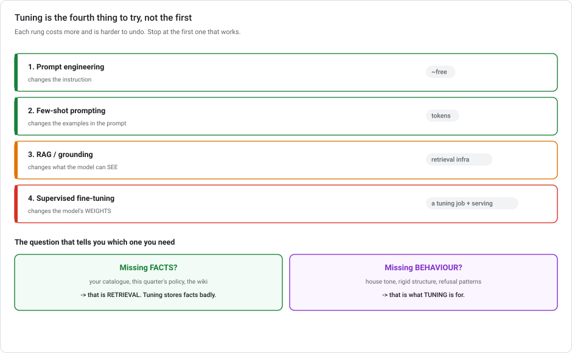
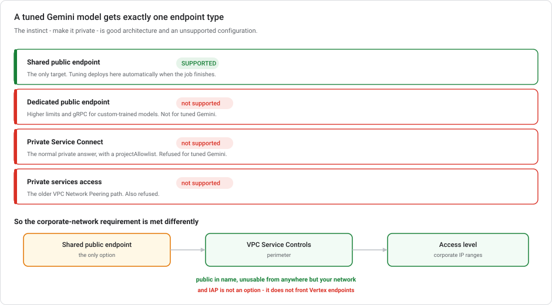

# Tuning Gemini on Vertex AI

**Supervised fine-tuning of a foundation model.** When it is the right move, what it changes, and one deployment constraint that is easy to miss: a tuned Gemini model can only go on a **shared public endpoint**.

> **Module, not a lab.** [Lab 1](../labs/lab-01-sentiment-analysis-bigquery-gemini.md) calls Gemini from BigQuery without tuning anything, which is the right default. This is what you do when prompting has run out of room.

---

## ⏱ What changed recently

| When | What |
|---|---|
| **22 Apr – 21 May 2026** | Vertex AI → **Gemini Enterprise Agent Platform**. Tuning moved in the console. The API surface and SDK are unchanged. |
| **24 Jun 2026** | The **generative modules were removed from `google-cloud-aiplatform`**. Generative work, including tuning, now goes through the **`google-genai`** SDK. `PipelineJob` and the classic ML surface are unaffected. |
| **Ongoing** | Supervised fine-tuning is the GA path for Gemini. RLHF and distillation offerings have shifted over time; check current availability before designing around them. |

---

## 1. Try these first

Fine-tuning is the fourth thing to reach for, not the first. In order of cost and reversibility:



| Approach | Changes | Cost | Use when |
|---|---|---|---|
| **Prompt engineering** | Nothing. The instruction. | ~free | Almost always the first try. |
| **Few-shot prompting** | The examples in the prompt | tokens | The task needs demonstration, not explanation. |
| **RAG / grounding** | What the model can *see* | retrieval infra | The gap is **knowledge**, not behaviour. |
| **Supervised fine-tuning** | The model's **weights** | a tuning job + tuned-model serving | The gap is **behaviour**, and prompting has plateaued. |

**The diagnostic question: is the model missing *facts* or missing *behaviour*?**

- Missing facts (your product catalogue, last quarter's policy, an internal wiki) is a **retrieval** problem. Fine-tuning is a bad way to store facts. It is expensive, it cannot be updated without retuning, and the model will still confidently invent things.
- Missing behaviour (a house tone, a rigid output structure, a domain's phrasing conventions, consistent refusal patterns) is what tuning is **for**.

A support chatbot usually needs both: RAG for what the docs say, tuning for how your company says it.

> **Fine-tuning does not add knowledge reliably.** It adjusts how the model responds. If the goal is "know our 40,000 SKUs", that is retrieval, and no amount of tuning replaces it.

---

## 2. What supervised fine-tuning does

**Supervised fine-tuning (SFT)** trains the model on **labelled input-output pairs** — your prompts, and the responses you wanted. Gradient descent nudges the weights toward producing your outputs for your kinds of input.

On Vertex this is **parameter-efficient tuning**: rather than updating all of the model's weights, it trains a small set of **adapter** weights layered on the frozen base model. This is why a tuning job costs hours rather than a data-centre-month, and why the tuned model stays cheap to serve.

### The dataset

JSONL, one example per line, in the chat format:

```json
{"contents":[{"role":"user","parts":[{"text":"My order hasn't arrived and it's been 12 days."}]},{"role":"model","parts":[{"text":"I'm sorry about the delay. Let me check that for you — could you share your order number? Most delays past 10 days are carrier-side, and we can reship at no cost."}]}]}
```

| Practicality | Guidance |
|---|---|
| **How many examples** | Hundreds beats thousands of bad ones. Start around 100–500 and measure. |
| **Quality over volume** | Every example teaches. Inconsistent examples teach inconsistency. |
| **Include a system instruction** if you will use one at serving time. Training and serving should match. |
| **Hold out a validation set** so you can see overfitting rather than guess. |
| **Storage** | Cloud Storage, and the region matters. Same rule as everything else. |

### Running it

```python
from google import genai
from google.genai.types import CreateTuningJobConfig

client = genai.Client(vertexai=True, project=PROJECT, location="us-central1")

job = client.tunings.tune(
    base_model="gemini-2.5-flash",
    training_dataset={"gcs_uri": "gs://my-bucket/support-sft-train.jsonl"},
    config=CreateTuningJobConfig(
        tuned_model_display_name="support-chatbot-v1",
        validation_dataset={"gcs_uri": "gs://my-bucket/support-sft-val.jsonl"},
        epoch_count=4,
    ),
)
```

> **Check the base model before you copy this.** `gemini-2.5-flash` retires on **20 October 2026**, along with
> `gemini-2.5-pro` and `gemini-2.5-flash-lite`. Google's replacement for it is **Gemini 3.5 Flash-Lite** or
> **Gemini 3.1 Flash-Lite**. Tuning is tied to specific base models, and the supported list moves faster than
> the tuning API itself, so confirm what your chosen method accepts before you build around it.

**The main knobs:**

| Parameter | What it does |
|---|---|
| `epoch_count` | Passes over the dataset. Too many overfits. The model parrots your examples and generalises worse. |
| `learning_rate_multiplier` | Scales the default rate. Leave it alone unless you have a measured reason. |
| `adapter_size` | The size of the trained adapter. Larger fits more behaviour and overfits more easily on small data. |

**Tune the smallest base model that could work.** Flash tuned on good data routinely beats Pro prompted badly, at a fraction of the serving cost.

---

## 3. Where the tuned model goes — the constraint

When tuning finishes, the model is **automatically uploaded to the Model Registry and deployed to a shared public endpoint.** You do not choose the endpoint.

> ### A tuned Gemini model can **only** be deployed to a **shared public endpoint**.
>
> Not a dedicated public endpoint. Not a Private Service Connect endpoint. Not a private services access (VPC Network Peering) endpoint.



This is easy to miss. For **custom-trained** models all four endpoint types are available. The sensible instinct is "make it private", which is good architecture but an unsupported configuration here.

| Endpoint type | Custom-trained model | **Tuned Gemini** |
|---|---|---|
| Shared public | ✅ | ✅ **only option** |
| Dedicated public | ✅ | ❌ |
| Private Service Connect | ✅ | ❌ |
| Private services access (peering) | ✅ | ❌ |

### So how do you restrict access?

Since you cannot make the endpoint private, you make it **unreachable from outside your perimeter**:

**Deploy to the shared public endpoint, and apply VPC Service Controls with an access level scoped to your corporate IP ranges.**

The endpoint remains technically public; requests from anywhere but your network are refused by the perimeter. See [Private networking for ML §4](GCP-PRIVATE-NETWORKING-FOR-ML.md#4-vpc-service-controls) for how access levels are defined.

**And two things that are not options:**

- **Identity-Aware Proxy.** IAP fronts App Engine, Compute Engine and GKE applications. Vertex AI endpoints do not integrate with it.
- **A private endpoint "with just a bit of config".** The platform refuses the deployment. This is not a permissions problem you can grant your way out of.

---

## 4. Evaluating a tuned model

Tuning has no `ML.EVALUATE`. You need a plan before you start, or you will have a model that *feels* better.

1. **A frozen evaluation set** the tuning job never saw, written before tuning.
2. **A baseline**: the same prompts against the *untuned* base model. Without it you cannot claim an improvement.
3. **A metric that matches the task.** Structured output → exact match or schema validity. Free text → a rubric scored by a judge model, or human review on a sample.
4. **A regression check.** Tuning for one behaviour can degrade others, so keep a small general-capability set and re-run it.

Gemini's tuning job emits loss curves per epoch. **Validation loss rising while training loss falls is overfitting.** Reduce `epoch_count` or add data.

> Once it is serving, the [continuous evaluation pattern](VERTEX-MODEL-MONITORING.md) applies: a scheduled pipeline scoring a labelled set and alerting through Cloud Monitoring. Feature-distribution monitoring does not transfer well to text, because there are no tabular features to compute Jensen-Shannon over.

---

## 5. Cost

| Phase | Billed on |
|---|---|
| **Tuning** | Tokens processed × epochs. A few hundred examples over four epochs is typically tens of dollars. |
| **Serving** | Per token, at the tuned model's rate. Adapter-based tuning keeps this close to the base model's price. |
| **Storage** | Negligible — an adapter, not a model copy. |

The real cost is **iteration**: dataset curation, tuning, evaluating, discovering the dataset was inconsistent, and doing it again. Budget the people time, not the GPU time.

---

## 6. Anti-patterns

**Tuning to add knowledge.** Use RAG. Tuned facts cannot be updated without retuning, and the model still hallucinates around them.

**Tuning before prompting has plateaued.** Measure the prompted baseline first. It is often good enough, and it is free to change.

**Tuning on inconsistent examples.** If two examples answer similar questions in different styles, you have taught it to be inconsistent. Curation *is* the work.

**No held-out baseline.** "It seems better" is not an evaluation, and you cannot roll back to an argument.

**Designing for a private endpoint before checking support.** Find out on day one that shared public is the only target, not during the security review.

**Tuning Pro when Flash would do.** You pay the difference on every request, forever.

---

## 7. Test your understanding

<details markdown="1">
<summary><b>1.</b> A tuned Gemini support chatbot must be reachable only from the corporate VPC. What do you do?</summary>

**Deploy to the shared public endpoint, the only supported target, and restrict access with VPC Service Controls using an access level for your corporate IP ranges.**

Private Service Connect, dedicated public endpoints, and private services access are all unsupported for tuned Gemini models. IAP does not front Vertex endpoints. The perimeter makes a public endpoint unusable from outside your network.
</details>

<details markdown="1">
<summary><b>2.</b> Your chatbot doesn't know your current return policy. Tune or retrieve?</summary>

**Retrieve.** That is missing knowledge, and knowledge changes. RAG lets you update a document instead of running a tuning job. Tuning is for missing *behaviour*: tone, structure, phrasing conventions.

Most real chatbots want both: RAG for what the policy says, tuning for how you say it.
</details>

<details markdown="1">
<summary><b>3.</b> Training loss is still falling but validation loss has started rising. What's happening?</summary>

Overfitting. The model is memorising your examples rather than learning the behaviour behind them, and it will generalise worse to real inputs than it did an epoch ago. Reduce `epoch_count`, add more varied data, or reduce `adapter_size`.
</details>

<details markdown="1">
<summary><b>4.</b> Why does tuning a Gemini model take hours rather than weeks?</summary>

It is **parameter-efficient**: the base model's weights are frozen and only a small **adapter** is trained. That is also why the tuned model stays cheap to serve and cheap to store. You have an adapter, not a second copy of Gemini.
</details>

---

## Summary

Supervised fine-tuning is the **fourth** thing to try, after prompting, few-shot, and RAG. The diagnostic is whether the model is missing **facts** (retrieval) or **behaviour** (tuning). On Vertex it is **parameter-efficient**: a small adapter trains over a frozen base, which is why it costs hours and serves near base-model rates. The dataset is **JSONL chat-format pairs**, where a few hundred consistent examples beat thousands of sloppy ones, and `epoch_count` is the knob that overfits. Memorise the constraint: a **tuned Gemini model can only be deployed to a shared public endpoint**. Dedicated public, Private Service Connect and private services access are all unsupported. So "restrict it to the corporate network" is answered with **VPC Service Controls plus an IP-range access level**, not with a private endpoint, and never with IAP. Evaluate against a **frozen set and an untuned baseline**, because without the baseline there is no claim to make.

---

## References

- [About supervised fine-tuning for Gemini models](https://cloud.google.com/vertex-ai/generative-ai/docs/models/gemini-supervised-tuning)
- [Tune Gemini models by using supervised fine-tuning](https://cloud.google.com/vertex-ai/generative-ai/docs/models/gemini-use-supervised-tuning)
- [Deploy generative AI models](https://cloud.google.com/vertex-ai/generative-ai/docs/deploy/overview)
- Related: [Private networking for ML](GCP-PRIVATE-NETWORKING-FOR-ML.md) · [Low-code AI on Google Cloud](LOW-CODE-AI-ON-GCP.md) · [Lab 1](../labs/lab-01-sentiment-analysis-bigquery-gemini.md)
