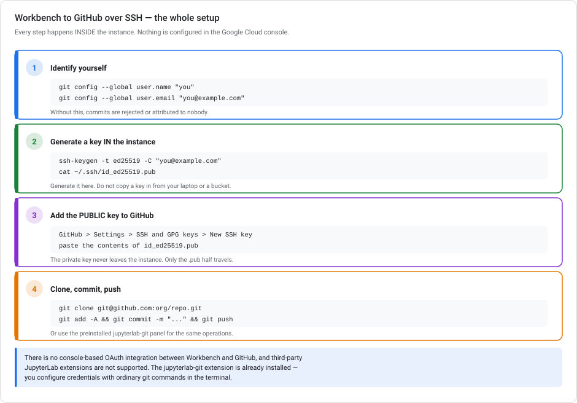
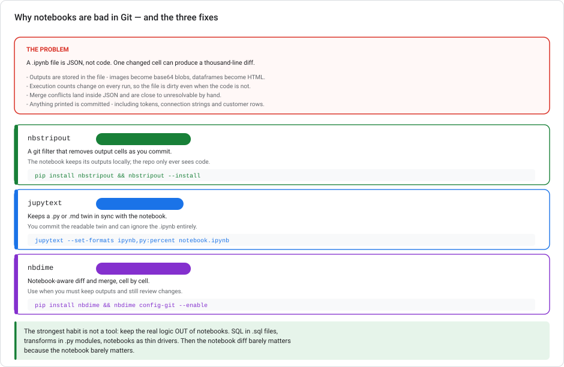

# Git and version control for ML work on Google Cloud

> **Type** Explanation module (theory + copy-pasteable setup)  **Reading time** 25–35 minutes
> **Related** [Where training runs](VERTEX-TRAINING-COMPUTE.md) · [Scaling prototypes into ML models](SCALING-PROTOTYPES-TO-ML.md) · [Kubeflow Pipelines](KUBEFLOW-PIPELINES-ON-GCP.md) · [Lab 6 — Exploration](../labs/lab-06-data-exploration-bigquery-colab.md)
> **Last updated** 23 August 2026

---

## Closing the gap Stage 1 leaves

[Scaling prototypes into ML models](SCALING-PROTOTYPES-TO-ML.md) calls Stage 1 **"Reproducible"** and defines it as *"the logic lives in version control"*. It then calls it "the single highest-leverage step in the entire ladder."

But it never shows you how. This module fills that gap, with two halves:

1. **Setup** — connecting a Vertex AI Workbench instance to GitHub, which has one non-obvious property.
2. **Notebooks in Git** — which are much worse than ordinary code, and what to do about it.

---

## 1. Workbench → GitHub, over SSH



Start with the non-obvious property. It is what most people look for and cannot find:

> **There is no console-based GitHub integration.** You do not enable a GitHub API, and there is no OAuth flow between Workbench and GitHub in the Google Cloud console. You configure Git **inside the instance**, with ordinary Git commands.

Workbench instances ship with the **`jupyterlab-git`** extension preinstalled, which gives you a Git panel in JupyterLab. Third-party JupyterLab extensions are not supported, so do not go looking in the extension marketplace. You already have what you need.

### The four steps

**1 — Identify yourself.** Git refuses to commit without this, and a commit attributed to nobody is worse than no commit.

```bash
git config --global user.name  "Your Name"
git config --global user.email "you@example.com"
```

**2 — Generate a key inside the instance.**

```bash
ssh-keygen -t ed25519 -C "you@example.com"
cat ~/.ssh/id_ed25519.pub
```

> **Generate it here. Do not bring one in.** Copying a private key from your laptop, or staging it through a Cloud Storage bucket, spreads a credential across places it does not need to be. It also leaves the key sitting in object storage. Keys are cheap: make one per instance, and revoke it in GitHub when the instance goes away.

**3 — Add the *public* key to GitHub.** **Settings → SSH and GPG keys → New SSH key**, and paste the contents of `id_ed25519.pub`. The private key never leaves the instance; only the `.pub` half travels.

**4 — Clone, commit, push.**

```bash
git clone git@github.com:org/repo.git
cd repo
git add -A
git commit -m "Add churn feature notebook"
git push
```

Or do the same through the `jupyterlab-git` panel: **Git → Clone a Repository**, right-click new files → **Track** (that's `git add`), enter a message in **Summary** → **Commit**, then **Git → Push to Remote**.

### If you use HTTPS instead of SSH

This is perfectly valid. Only the last step differs: pushing prompts for credentials, and with two-factor authentication enabled you supply your username plus a **personal access token** rather than your password. SSH avoids that prompt entirely. This is why it is the usual choice on a long-lived instance.

### Verify it works before you need it

```bash
ssh -T git@github.com     # expect: "Hi <user>! You've successfully authenticated..."
```

---

## 2. Notebooks are bad in Git



This catches most people once. A `.ipynb` is **JSON, not code**, and one changed cell can produce a thousand-line diff.

Four specific problems:

- **Outputs live in the file.** A plot becomes a base64 blob; a DataFrame becomes a wall of HTML.
- **Execution counts change on every run**, so the file is dirty even when the code has not changed.
- **Merge conflicts land inside JSON** and are close to unresolvable by hand.
- **Anything printed gets committed**, including tokens, connection strings, and customer rows. This is what turns an annoyance into an incident.

### Three fixes

**`nbstripout`** — a Git filter that strips output cells as you commit. Your local notebook keeps its outputs; the repo only ever sees code.

```bash
pip install nbstripout
nbstripout --install        # run inside the repo
```

Best default for most teams. One command, and the secret-leak problem largely goes away.

**`jupytext`** — keeps a `.py` or `.md` twin in sync with the notebook. You commit the readable twin and can `.gitignore` the `.ipynb` entirely.

```bash
pip install jupytext
jupytext --set-formats ipynb,py:percent notebook.ipynb
```

Best when you want reviewable diffs. A `py:percent` file reviews like normal code.

**`nbdime`** — notebook-aware diff and merge, cell by cell.

```bash
pip install nbdime
nbdime config-git --enable
```

For when you must keep outputs (a report notebook) and still review changes.

### The habit that beats all three

**Keep the real logic out of notebooks.**

SQL in `.sql` files. Transforms in `.py` modules. Notebooks as thin drivers that import and call. Then the notebook diff barely matters, because the notebook barely matters.

This series does the same: [`tools/build.py`](../../tools/build.py) extracts every SQL block from the labs into `sql/lab01…lab06/`, so the queries are reviewable files rather than fragments buried in prose.

---

## 3. What belongs in the repo

| Commit | Don't commit |
|---|---|
| SQL — feature queries, `CREATE MODEL` statements | Data. Even "small" CSVs |
| Pipeline definitions ([KFP](KUBEFLOW-PIPELINES-ON-GCP.md) `.py` and compiled YAML) | Model weights — they belong in the [registry](VERTEX-ML-METADATA.md) or Cloud Storage |
| Dockerfiles, `requirements.txt` with pinned versions | Credentials, keys, service-account JSON |
| Terraform / infrastructure config | Notebook outputs (see §2) |
| Notebooks — stripped or paired | `.ipynb_checkpoints/` |

A starting `.gitignore` for this kind of work:

```gitignore
.ipynb_checkpoints/
__pycache__/
*.pyc
.env
*.json                 # then un-ignore configs you DO want
!config/*.json
data/
*.csv
*.parquet
credentials/
*.pem
*.key
```

> **On secrets:** the rule is **never put them in the repo at all**. "Be careful" is not enough. Use Secret Manager, or the instance's service account identity, so there is no credential to leak. Git history is also forever. A key committed and then deleted is still in the history, and still compromised. Rotate it rather than trying to erase it.

---

## 4. GitHub or Cloud Source Repositories?

| | GitHub | Cloud Source Repositories |
|---|---|---|
| Ecosystem | PRs, Actions, the tooling everyone knows | Minimal |
| IAM | Its own accounts and teams | Google Cloud IAM |
| Cloud Build triggers | Supported | Native |

**Use GitHub** unless a specific policy requires code to stay inside your Google Cloud perimeter. For most teams the review workflow and ecosystem matter more than the IAM integration.

---

## 5. A workflow that fits ML work

This is the standard flow, with a few ML-specific notes:

1. **Branch per change.** `feature/add-tenure-band`, not commits straight to `main`.
2. **Commit the SQL and the config, not the result.** A `CREATE MODEL` statement is the artifact; the trained model belongs in the [registry](VERTEX-ML-METADATA.md), versioned there.
3. **Review the diff before you push.** With outputs stripped, this is possible.
4. **Tag what you ship.** When a model reaches production, tag the commit that produced it. This is the code half of the lineage that [ML Metadata](VERTEX-ML-METADATA.md) tracks on the data half.
5. **Let CI do the boring checks.** Cloud Build or GitHub Actions can lint, run tests, and validate that pipeline YAML still compiles.

> **This pays off** the day someone asks "what changed between the model that worked and the one that doesn't?" With the SQL and pipeline definitions in Git and the model versions in the registry, that is a diff. Without it, it is an afternoon of guessing.

---

## 6. Where git and notebooks go wrong

**Looking for a console GitHub integration.** It does not exist. Configure Git in the instance.

**Copying a private key in from your laptop or a bucket.** Generate one per instance; revoke it when the instance dies.

**Installing a third-party Git extension.** `jupyterlab-git` is preinstalled, and third-party extensions are not supported.

**Committing notebooks with outputs.** Unreviewable diffs, and a real secret-leak path.

**Committing data.** Repos are for code. Data belongs in Cloud Storage or BigQuery.

**Deleting a leaked secret and moving on.** History is forever. Rotate the credential.

**Logic that only exists in a notebook.** If the only copy of your feature SQL is cell 14, it is not really in version control.

---

## 7. Questions on the git workflow

<details markdown="1">
<summary><b>1.</b> You've cloned a repo onto a Workbench instance. What's needed before you can push over SSH?</summary>

Three things, all inside the instance: set your identity with `git config --global user.name` and `user.email`; generate an SSH key there with `ssh-keygen`; and add the **public** key to your GitHub account under Settings → SSH and GPG keys. The `jupyterlab-git` extension is already installed, so no extension setup is needed.
</details>

<details markdown="1">
<summary><b>2.</b> Why not upload an existing SSH key via a Cloud Storage bucket?</summary>

It spreads a private credential across places it does not need to exist, and it leaves the key in object storage where bucket permissions now govern your GitHub access. Generate a key per instance and revoke it in GitHub when the instance goes away. Keys are cheap, and the blast radius stays small.
</details>

<details markdown="1">
<summary><b>3.</b> Is there a console-based OAuth integration between Workbench and GitHub?</summary>

No. There is no GitHub API to enable in the project and no OAuth flow in the Google Cloud console. You configure credentials inside the JupyterLab environment with standard Git commands. This is also why the answer to most "how do I connect X to GitHub" questions here is "in the terminal".
</details>

<details markdown="1">
<summary><b>4.</b> Should you install a Git extension from the JupyterLab marketplace?</summary>

No. Workbench instances ship with `jupyterlab-git` preinstalled, and third-party JupyterLab extensions are not supported. Use the built-in panel or the terminal.
</details>

<details markdown="1">
<summary><b>5.</b> Your notebook diff is 2,000 lines and you changed one cell. What's happening?</summary>

`.ipynb` is JSON with outputs and execution counts stored inside it, so re-running the notebook changes the file even when the code is identical. Fix with **`nbstripout`** (strip outputs at commit, the best default), **`jupytext`** (commit a readable `.py` twin), or **`nbdime`** (cell-aware diffs when you must keep outputs). Better still, move the real logic into `.sql` and `.py` files so the notebook is thin.
</details>

<details markdown="1">
<summary><b>6.</b> You committed a service-account key, then deleted it in the next commit. Safe?</summary>

No. Git history is permanent. The key is still retrievable from the earlier commit, and anyone with repo access can read it. **Rotate the credential immediately.** Rewriting history is possible but unreliable once the branch has been pushed or forked. The real fix is upstream: never commit secrets, and use Secret Manager or the instance's service-account identity so there is nothing to leak.
</details>

---

## Git and notebooks, in short

Connecting a Vertex AI Workbench instance to GitHub happens **entirely inside the instance**. There is no console OAuth integration and no extension to install, because `jupyterlab-git` is already there. Set your identity with `git config --global`, **generate an SSH key in the instance** (never copy one in), add the public half to GitHub, then clone and push. The harder half is notebooks. `.ipynb` is JSON that stores outputs and execution counts, so diffs are unreadable and printed secrets get committed. Fix that with **`nbstripout`**, **`jupytext`**, or **`nbdime`**. Better still, keep the real logic in `.sql` and `.py` files where it can be reviewed. Commit code and config; never data, weights, or credentials.

---

## Docs for git and notebook setup

- [Save notebooks to GitHub from Workbench instances](https://cloud.google.com/vertex-ai/docs/workbench/instances/save-to-github)
- [GitHub — generating a new SSH key](https://docs.github.com/en/authentication/connecting-to-github-with-ssh/generating-a-new-ssh-key-and-adding-it-to-the-ssh-agent)
- [GitHub — adding an SSH key to your account](https://docs.github.com/en/authentication/connecting-to-github-with-ssh/adding-a-new-ssh-key-to-your-github-account)
- [`jupyterlab-git`](https://github.com/jupyterlab/jupyterlab-git) · [`nbstripout`](https://github.com/kynan/nbstripout) · [`jupytext`](https://jupytext.readthedocs.io/) · [`nbdime`](https://nbdime.readthedocs.io/)
- [Secret Manager](https://cloud.google.com/secret-manager/docs)
