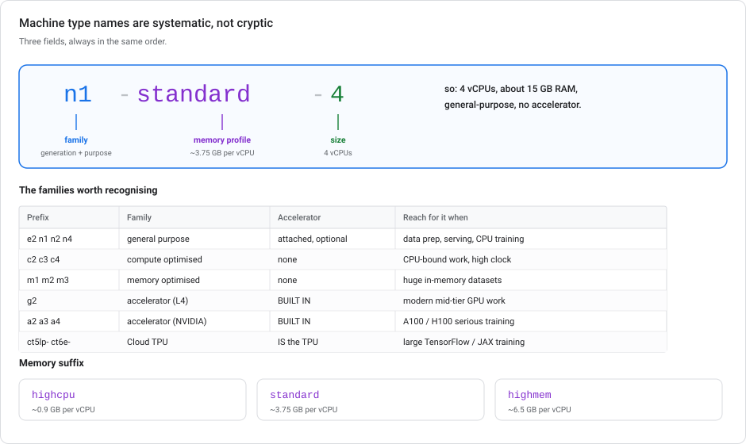
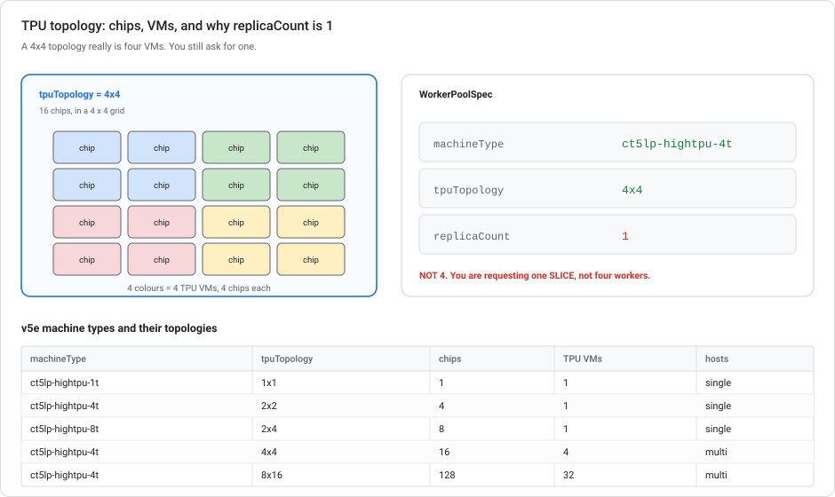
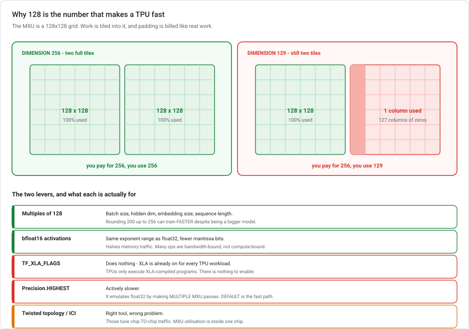

# GPUs and TPUs, from zero

**What the hardware is, how to read a machine type name, and why a tensor dimension of 128 makes your training faster.** Written for someone who has trained models without ever thinking about the silicon underneath.

> **Module, not a lab.** [Where model training actually runs](VERTEX-TRAINING-COMPUTE.md) covers *where* to submit a job; this covers *what to submit it to*.

---

## The 2026 hardware updates

| When | What |
|---|---|
| **2026** | **TPU v6e (Trillium)** is generally available. Its MXU is larger than the 128×128 of every generation up to v5e. This matters for the tiling rule in §6. v5e remains the cost-efficiency workhorse. |
| **22 Apr – 21 May 2026** | The rebrand to **Gemini Enterprise Agent Platform** changed console paths. Machine type names, accelerator names and `WorkerPoolSpec` fields are unchanged. |

---

## 1. Three kinds of processor

The only distinction that matters for ML:

| | **CPU** | **GPU** | **TPU** |
|---|---|---|---|
| Built for | Anything, one thing at a time, fast | Thousands of identical small operations at once | One operation (matrix multiply) enormously |
| Cores | 4–128 complex cores | thousands of simple cores | a handful of **MXUs** (see §6) |
| Good at | Data prep, tree models, serving small models | Deep learning, images, most PyTorch work | Very large deep learning, TensorFlow/JAX, transformer training |
| Bad at | Deep learning (100× slower) | Branchy sequential logic | Anything that is not dense linear algebra |

**Training a neural network is, arithmetically, an enormous pile of matrix multiplications.** That single fact explains the whole hierarchy: a CPU does them one at a time quickly, a GPU does thousands in parallel, and a TPU is a chip whose main feature *is* a matrix multiplier.

> **The first question is always "do I need an accelerator at all?"** Gradient-boosted trees, linear models, and anything on tabular data of ordinary size: **no**. A GPU does nothing for XGBoost on 7,000 rows except cost money. Accelerators are for deep learning on images, text, and audio.

### Why they're different, not just faster

The three architectures differ in *where the data goes*, and that single fact predicts which workloads each wins.

**The CPU pays a memory round-trip per operation.** Google names the cost directly: a CPU *"loads values from memory, performs a calculation on the values and stores the result back in memory for every calculation"* — **the Von Neumann bottleneck**. Enormous flexibility, and a hard ceiling on arithmetic throughput.

**The GPU parallelises that same pattern.** Thousands of ALUs (typically 2,500–5,000) run one instruction stream across many threads (SIMT). But Google is precise that a GPU is *"a general-purpose processor"* too: it still moves operands through memory for each calculation, just thousands at a time.

**The TPU changes where operands travel.** It is *"a matrix processor specialized for neural network workloads"*, built as a **systolic array**: *"thousands of multiply-accumulators that are directly connected to each other to form a large physical matrix."* Operands flow **laterally between ALUs** rather than back to memory, so one load is amortised across many operations. This is how it *"avoids memory bottlenecks during matrix operations."*

The core point: **the systolic array's efficiency scales with how dense and regular your matrix multiply is.**

### Practical implications by workload

| Workload | Wins on | Because |
|---|---|---|
| Gradient-boosted trees on 200k rows | **CPU** | Branchy, sequential, no matmul to exploit |
| Data prep, feature engineering, ETL | **CPU** | Control-heavy, I/O bound |
| Fine-tuning a mid-size vision model | **GPU** | Parallel, and the kernel mix is varied |
| Research with custom kernels | **GPU** | Mature arbitrary-kernel programming model |
| Pretraining a large transformer | **TPU** | Huge, regular, dense matmul at scale |
| Recommender with big embedding tables | **TPU with SparseCores** | See §4a — the matmul part is not the problem |
| One prediction, right now, low latency | **CPU** | A GPU's parallelism buys nothing on batch size 1 |

> **In summary:** TPU wins on large, regular, dense matrix work at scale. GPU wins where the kernels are heterogeneous or changing, and where the ecosystem matters. CPU wins on control-heavy serial work, which is most of what a data pipeline does.

### The main constraint: memory

An accelerator has its own memory (VRAM on a GPU, HBM on a TPU), separate from the machine's RAM. **The model's weights, its gradients, the optimizer state, and one batch of data must all fit in it simultaneously.** If they do not fit, the job does not run slowly. It crashes with an out-of-memory error.

Rough rule for training in 32-bit floats: **memory ≈ 16 bytes per parameter**, covering weights, gradients and Adam's two moment estimates. A 1-billion-parameter model needs roughly 16 GB before you have loaded a single training example. This is why memory, not clock speed, is the spec you check first.

---

## 2. Reading a machine type name

Google Cloud machine types look cryptic, but they are systematic.



```
n1-standard-4
│  │        └── 4 vCPUs
│  └── memory profile: standard (~3.75 GB per vCPU)
└── generation / family
```

| Prefix | Family | Typical use |
|---|---|---|
| `e2`, `n1`, `n2`, `n4` | General purpose | Data prep, serving, CPU training |
| `c2`, `c3`, `c4` | Compute optimised | High clock, CPU-bound work |
| `m1`, `m2`, `m3` | Memory optimised | Enormous in-memory datasets |
| `a2`, `a3`, `a4` | **Accelerator optimised (NVIDIA)** | GPUs are *built in*, not attached |
| `g2` | **Accelerator optimised (L4)** | Modern mid-tier GPU work |
| `ct5lp-*`, `ct6e-*` | **Cloud TPU** | TPU training and serving |

The memory profile suffix:

| Suffix | Memory per vCPU |
|---|---|
| `highcpu` | ~0.9 GB — lots of cores, little RAM |
| `standard` | ~3.75 GB |
| `highmem` | ~6.5 GB |

So `n1-highmem-16` is 16 vCPUs with about 104 GB of RAM, and `a2-highgpu-8g` is an accelerator-optimised machine with **8 GPUs built in**.

### Attached versus built-in

| Style | Example | How the GPU is specified |
|---|---|---|
| **Attached** | `n1-standard-8` + 2× `NVIDIA_TESLA_T4` | You choose machine type *and* accelerator type *and* count |
| **Built in** | `a2-highgpu-8g` | The machine type *is* the GPU configuration. No accelerator fields. |

This matters because Vertex AI's `WorkerPoolSpec` has fields for both patterns, and using the wrong pattern for your hardware is a configuration error rather than a performance problem. TPU v5e uses the built-in style (§5).

---

## 3. Picking a GPU model

| GPU | Memory | Roughly for |
|---|---|---|
| **T4** | 16 GB | Cheap inference, light training, notebooks. The default "I need *a* GPU". |
| **L4** (G2 family) | 24 GB | Modern mid-tier. Better price/performance than T4 for inference. |
| **V100** | 16/32 GB | Older serious training. Being displaced by A100. |
| **A100** (A2 family) | 40 or 80 GB | Serious training. Large models, large batches. |
| **H100** (A3 family) | 80 GB | Frontier-scale training. Expensive and often supply-constrained. |

**Pick by memory first, then by budget.** If your model plus batch fits in 16 GB, a T4 is a fraction of the price of an A100 and finishes the job.

> **The G2 boundary.** Workbench instances cannot be resized freely between G2 (L4) and non-G2 families — see [Where training runs §2](VERTEX-TRAINING-COMPUTE.md#2-workbench-and-the-2026-state-of-it). The family you pick at creation constrains what you can change it to later.

### Scale up before you scale out

One machine with 8 GPUs beats 8 machines with 1 GPU each, essentially always. Inside a machine, GPUs talk over **NVLink**, an interconnect an order of magnitude faster than Ethernet. Across machines you are on the network, and gradient synchronisation is network-bound.

Reach for `a2-highgpu-8g` before you reach for multiple worker pools. Multi-node is for models that do not fit on one box.

---

## 4. TPU generations

A **TPU** is Google's own chip, designed around matrix multiplication. It is exceptionally fast at large dense workloads and unhelpful for anything else.

| Generation | Positioned as | Notes |
|---|---|---|
| **v2 / v3** | Legacy | Configured with `acceleratorType` + `acceleratorCount`, the old pattern |
| **v4** | Large-scale training | Introduces the machine-type + topology pattern |
| **v5e** | **Cost-efficient workhorse** | `ct5lp-hightpu-*t` machine types. Training up to 256 chips. **No SparseCores** — see §4a. |
| **v5p** | Maximum performance | The large-scale training tier. **4 SparseCores per chip** — the embedding-heavy choice. |
| **v6e** (Trillium) | Transformers, text-to-image, CNNs | Larger MXU than 128×128 (§6). **2 SparseCores per chip**. |

**The configuration pattern changed at v4, and mixing the two generations' fields is the usual first error:**

| | **TPU v2 / v3** | **TPU v4 / v5e / v5p / v6e** |
|---|---|---|
| `machineType` | `cloud-tpu` | `ct5lp-hightpu-4t` etc. |
| `acceleratorType` | `TPU_V3` | *not used* |
| `acceleratorCount` | `8` | *not used* |
| `tpuTopology` | *not used* | `4x4` |

If you see `machineType: cloud-tpu` with `acceleratorType: TPU_V5E`, that mixes the two patterns and is wrong.

---

## 4a. SparseCores — why embeddings need different silicon

The systolic array is superb at dense matrix multiply and **bad at embedding lookups**, and a recommender is mostly embedding lookups.

An embedding lookup is a **gather**: take an ID, jump to an arbitrary row of a table that may be tens of gigabytes, fetch it. There is no matmul structure to exploit, the access pattern is irregular and scattered, and the operation is **memory-bound rather than compute-bound**. Feed that to a systolic array and it stalls. You are asking a machine designed to amortise loads across many operations to run a workload that is nothing but loads.

So Google put a second kind of processor on the chip:

> *"SparseCores are dataflow processors that accelerate models using sparse operations. A primary use case is accelerating recommendation models, which rely heavily on embeddings."*

They sit **alongside** the TensorCores. Dense layers run on the array; embedding lookups run on the SparseCores; both happen at once.

### SparseCore support by generation

| Generation | SparseCores per chip |
|---|---|
| **v4** | *not documented* — see the note below |
| **v5e** | **none** |
| **v5p** | **4** (second generation) |
| **v6e** (Trillium) | **2** |
| **TPU7x** (Ironwood) | **4** |

**So the embedding-heavy choice is v5p, and the trap is v5e.** v5e is the cost-efficiency part, and an excellent one for dense workloads. It has no SparseCores at all, so a recommender with large embedding tables runs its most expensive operation on hardware that was never meant for it.

Google's own comparison of v5p against v4: *"more than 2X greater FLOPS"*, *"3X more high-bandwidth memory"*, *"second-generation SparseCores"*. The number that matters here: it trains *"embedding-dense models 1.9X faster than TPU v4."*

> **Two caveats on those figures.** The *"more than 2X FLOPS"* claim does not match the per-chip specs Google publishes elsewhere. 459 BF16 TFLOPs for v5p against 275 for v4 is **1.67×**, and the claim only reaches 2× at lower precision. Also, **v4's SparseCores are not documented on Google Cloud** at all. The architecture page omits v4 from the SparseCore sentence, and the only support for "v4 has first-generation SparseCores" is the phrase *"second-generation"* in the v5p blog plus the v4 ISCA paper, subtitled *"…with Hardware Support for Embeddings."* Reasonable inference, not a documented fact.

> **And a common mix-up:** the *"optimized for transformer, text-to-image, and convolutional neural network training"* positioning belongs to **v6e**, not v5e. v5e is described as *"a combined training and inference (serving) product"* with a TCO ratio of 0.65×.

### Picking by workload type

> **Dense workload (transformers, LLMs, vision): pick on FLOPS, memory and cost.**
> **Embedding-heavy workload (recommenders, ranking): pick a generation with SparseCores first, then on everything else.**

Getting this wrong does not produce an error. It produces a training run that is slow for no obvious reason, on hardware that benchmarks well.

---

## 5. TPU topology, and the `replicaCount` rule

### Chips, VMs and slices

- A **chip** is one TPU.
- A **TPU VM** is a host with some chips attached. For `ct5lp-hightpu-4t`, that is **4 chips per VM**.
- A **slice** is a group of chips wired together with **ICI** (inter-chip interconnect), described by a **topology** like `2x2` or `4x4`.



The topology is a *grid of chips*, and it tells you both the chip count and the VM count:

**This is an explicit table, not a rule you can derive.** Every documented v5e combination:

| Machine type | Topology | Chips | TPU VMs |
|---|---|---|---|
| `ct5lp-hightpu-1t` | `1x1` | 1 | 1 |
| `ct5lp-hightpu-4t` | `2x2` | 4 | 1 |
| **`ct5lp-hightpu-8t`** | **`2x4`** | 8 | 1 |
| `ct5lp-hightpu-4t` | `2x4` | 8 | 2 |
| `ct5lp-hightpu-4t` | `4x4` | 16 | 4 |
| `ct5lp-hightpu-4t` | `4x8` | 32 | 8 |
| `ct5lp-hightpu-4t` | **`8x8`** | **64** | **16** |
| `ct5lp-hightpu-4t` | `8x16` | 128 | 32 |
| `ct5lp-hightpu-4t` | `16x16` | 256 | 64 |

> ### The counter-intuitive part
>
> **`ct5lp-hightpu-8t` supports exactly one topology: `2x4`.** It is not the "bigger jobs" machine type. It is the single-VM-with-8-chips option, and nothing else.
>
> **Every multi-VM topology uses `ct5lp-hightpu-4t`.** A 64-chip `8x8` slice is *sixteen* `ct5lp-hightpu-4t` VMs, not eight `ct5lp-hightpu-8t` ones. Reaching for the 8-chip machine type because the job is large is a common mistake, and it will not validate.
>
> `2x4` is the only topology offering a choice: 8 chips as **one** `-8t` VM, or as **two** `-4t` VMs. The `-8t` machine has two NUMA nodes and a **lower likelihood of preemption**, which is the reason to prefer it where it fits.

**Divisibility does not explain the table.** 16 chips is divisible by 8, yet `-8t` is not offered for `4x4`. Every chip count is divisible by 1, yet `-1t` is confined to `1x1`. The observable pattern is that single-VM configurations use the machine type whose chip count *equals* the topology, and everything multi-VM is `-4t`. Treat that as a regularity in the data, not a documented rule. Look the combination up.

**Maximum for Vertex custom training is 256 chips** (`16x16`), which is also a full v5e Pod.

**`4x4` means 16 chips arranged in a 4×4 grid**, and since each `ct5lp-hightpu-4t` VM holds 4 chips, that is **4 VMs**.

### A common mistake

> **`replicaCount` must be `1` when using TPU VMs.**

Not 4. Not 16. One.

This feels wrong, because there really are four VMs. But you are not asking Vertex AI for four replicas of a worker. You are asking for **one TPU slice**. The slice's internal multi-host structure is handled by the slice configuration, not by the replica count. Vertex provisions the VMs the topology implies.

### The configuration

```json
{
  "workerPoolSpecs": [{
    "machineSpec": {
      "machineType": "ct5lp-hightpu-4t",
      "tpuTopology": "4x4"
    },
    "replicaCount": 1,
    "containerSpec": {
      "imageUri": "us-docker.pkg.dev/my-project/tpu/pytorch-xla:2.1-pjrt"
    }
  }]
}
```

**Framework requirements for v5e**, stated together in one sentence in the docs:

> *"TPU v5e requires JAX 0.4.6+, TensorFlow 2.15+, or PyTorch 2.1+."*

- **PyTorch 2.1 or later.** 2.0 is not sufficient, because v5e support landed in 2.1.
- **PJRT runtime.** PJRT is the device-abstraction layer PyTorch/XLA uses to talk to TPUs. It replaced the older XRT runtime and is the default from PyTorch/XLA 2.1 onward. For TPU v5e it is required, not optional.
- **A custom container is not optional either.** *"Prebuilt containers for TPU v5e are not available"* — for **any** framework, not just PyTorch. You supply an image with a matching `libtpu.so` and the right runtime environment variables.

> **And a forward-looking note:** *"Starting with TPU v6e, TensorFlow is no longer supported."* If you are choosing a framework for TPU work with any lifespan, that means JAX or PyTorch.

---

## 6. Making a TPU fast

This is where "zero hardware knowledge" costs real money: a correctly-configured TPU running at 20% utilisation is worse value than a GPU.



### The MXU is a 128×128 grid

Inside each TPU chip sits one or more **MXUs — Matrix Multiply Units**. In every generation up to and including v5e, an MXU is a **128×128 systolic array** of multiply-accumulate units: 16,384 tiny arithmetic units arranged in a square, with data flowing through them in a wave.

The consequence is direct:

> **Matrix operations are tiled into 128×128 blocks. Dimensions that are not multiples of 128 get padded, and you pay for the padding as if it were real work.**

A matrix multiply with an inner dimension of **129** is tiled as **2 blocks of 128**, of which the second is 99% zeros. You pay for 256 columns of work and get 129 columns of value. Same for a batch size of 130, or a hidden dimension of 200.

**So: make batch sizes, hidden dimensions, embedding sizes, and sequence lengths multiples of 128** (or at least of 8, which helps somewhat). Rounding a hidden size from 200 up to 256 can make training *faster* despite being a bigger model, because 256 tiles perfectly and 200 does not.

### bfloat16

**bfloat16** is a 16-bit floating-point format with the same *exponent range* as float32 but fewer mantissa bits. It represents the same span of magnitudes with less precision. Neural network training tolerates this well, because gradients care about scale far more than about the seventh significant digit.

Halving the bit width halves the memory traffic. That matters because many operations are **memory-bandwidth-bound**, not compute-bound: the MXU sits idle waiting for numbers to arrive. Casting activations to bfloat16 feeds it twice as fast.

XLA already converts some operations automatically. **Explicitly casting activations to bfloat16 where appropriate goes further** and is the standard optimisation.

### What does *not* help

| Suggestion | Why not |
|---|---|
| "Enable XLA with `TF_XLA_FLAGS`" | **XLA is already on** for TPU workloads — TPUs only execute XLA-compiled programs. Setting the flag adds nothing. |
| "Just maximise batch size" | Helps utilisation, but does not fix tiling. A huge batch of 130 still wastes half of every second tile. |
| "Use `jax.lax.Precision.HIGHEST`" | **Slower.** HIGHEST emulates full float32 precision by making *multiple* MXU passes. `DEFAULT` uses bfloat16 and is the fast path. |
| "Use a twisted topology / ICI resiliency" | Those tune **inter-chip communication** for large distributed runs. They do not touch utilisation *within* a chip, which is what the MXU question is about. |

> **The mental split:** tiling and bfloat16 are about **one chip working efficiently**. Topology, ICI and twisting are about **many chips talking efficiently**. Diagnose which one you have before optimising.

---

## 7. Cost

| Lever | Effect |
|---|---|
| **Do you need an accelerator?** | The largest saving available. Tabular models do not. |
| **Right-size the GPU** | T4 vs A100 is a large multiple for work that fits in 16 GB. |
| **Spot VMs** | 60–91% off, and preemptible. Only usable if you [checkpoint](VERTEX-TRAINING-COMPUTE.md#where-the-model-goes). |
| **Flex-start (DWS)** | ~53% off, and **not** interrupted for capacity — you queue to start instead. Up to 7 days. See [how to ask for capacity](VERTEX-TRAINING-COMPUTE.md#4c-getting-the-hardware-at-all). |
| **Idle shutdown** | A Workbench instance with an A100 attached, left running overnight, is a real and common bill. |
| **MXU utilisation** | A TPU at 20% utilisation costs the same per hour as one at 80%. |

---

## 8. Hardware-picking exercises

<details markdown="1">
<summary><b>1.</b> PyTorch on TPU v5e, 4x4 topology. What's the WorkerPoolSpec?</summary>

**`machineType: ct5lp-hightpu-4t`, `tpuTopology: 4x4`, `replicaCount: 1`**, with a custom container running **PyTorch 2.1+ with the PJRT runtime**.

`4x4` is 16 chips = 4 VMs × 4 chips, but `replicaCount` is still **1**, because you are requesting one slice, not four workers. `machineType: cloud-tpu` with `acceleratorType`/`acceleratorCount` is the v2/v3 pattern and does not apply. And `2x8` is a different chip arrangement from `4x4` even though both total 16.

Note that `ct5lp-hightpu-8t` would be wrong here, for one reason: it supports **only** `2x4`.
</details>

<details markdown="1">
<summary><b>1a.</b> You need 64 v5e chips for a JAX training job. What machine type?</summary>

**`ct5lp-hightpu-4t` with `tpuTopology: 8x8` and `replicaCount: 1`**, which is 64 chips across **16 VMs**.

The instinct is that a bigger job wants the bigger machine type, and that is wrong here: **`ct5lp-hightpu-8t` supports only `2x4`.** Every multi-VM v5e topology is `ct5lp-hightpu-4t`. And `ct5lp-hightpu-1t` supports only `1x1`, so it cannot serve an `8x8` topology either.

JAX needs 0.4.6+, and there are no prebuilt v5e containers, so you supply your own image.
</details>

<details markdown="1">
<summary><b>2.</b> Your TPU v5e training is slower than expected on heavy matrix multiplication. What do you change?</summary>

**Make tensor dimensions multiples of 128, and cast activations to bfloat16.**

The MXU is a 128×128 systolic array, so operations tile into 128×128 blocks and anything not aligned gets padded. You pay for the padding. bfloat16 halves memory traffic for the operations that are bandwidth-bound.

Setting XLA flags does nothing (XLA is already on for TPUs), maximising batch size alone does not fix tiling, and `Precision.HIGHEST` is slower because it needs multiple MXU passes.
</details>

<details markdown="1">
<summary><b>3.</b> Your model has a hidden dimension of 200. Why might 256 train faster?</summary>

200 tiles into two 128-blocks, with the second only 72/128 used. You pay for 256 either way. Going to 256 uses what you are already paying for. Bigger model, same tile cost, better utilisation.
</details>

<details markdown="1">
<summary><b>4.</b> What does <code>a2-highgpu-8g</code> tell you?</summary>

Accelerator-optimised **A2** family, so **A100** GPUs; `highgpu-8g` means **8 of them built into the machine**. You do not attach accelerators to it. The machine type *is* the GPU configuration. It is also the shape to reach for before multi-node, because those 8 GPUs talk over NVLink rather than the network.
</details>

<details markdown="1">
<summary><b>5.</b> You need <em>a</em> GPU for a small PyTorch model. What do you pick?</summary>

`n1-standard-8` with one **T4** attached, or a `g2` machine for an **L4** if you want the newer generation. Check the model plus a batch fits in 16 GB (T4) or 24 GB (L4). Memory is the binding constraint, not speed. An A100 for a model that fits in a T4 is money set on fire.
</details>

---

## The hardware decisions that matter

Deep learning is matrix multiplication, which is why the hardware ladder exists: CPUs do them one at a time, GPUs do thousands in parallel, and a **TPU is a chip built around a matrix multiplier**. The spec that constrains you is **memory**, not speed: roughly 16 bytes per parameter to train in float32. Machine type names are systematic: family, memory profile, size, with `a2`/`a3`/`g2`/`ct*` meaning the accelerator is **built in** rather than attached. For **TPU v5e**, configuration is `machineType: ct5lp-hightpu-4t` plus **`tpuTopology`**. The `acceleratorType`/`acceleratorCount` pattern belongs to v2/v3. **`replicaCount` must be 1** even for a multi-host topology like `4x4` (16 chips across 4 VMs), because you are requesting one slice. PyTorch on v5e needs **2.1+ with PJRT** (JAX 0.4.6+, TensorFlow 2.15+), and there are **no prebuilt v5e containers** for any framework. The machine-type/topology pairing is an explicit table, and its trap is that **`ct5lp-hightpu-8t` supports only `2x4`**. Every multi-VM topology, including 64-chip `8x8`, uses `ct5lp-hightpu-4t`. One more utilisation rule costs the most when you do not know it: the MXU is a **128×128 systolic array**, so **tensor dimensions should be multiples of 128** or you pay for padding, and **bfloat16** halves memory traffic on the bandwidth-bound operations. XLA is already enabled on TPUs, and `Precision.HIGHEST` is slower, not better.

---

## Reference docs: machine types and TPUs

- [Configure compute resources for custom training](https://cloud.google.com/vertex-ai/docs/training/configure-compute)
- [Training with TPU accelerators](https://cloud.google.com/vertex-ai/docs/training/training-with-tpu-vm)
- [TPU v5e](https://cloud.google.com/tpu/docs/v5e)
- [Introduction to Cloud TPU](https://cloud.google.com/tpu/docs/intro-to-tpu)
- [bfloat16 on TPUs](https://cloud.google.com/tpu/docs/bfloat16)
- [Machine families resource guide](https://cloud.google.com/compute/docs/machine-resource)
- Related: [Where model training actually runs](VERTEX-TRAINING-COMPUTE.md) · [Kubeflow Pipelines](KUBEFLOW-PIPELINES-ON-GCP.md)
