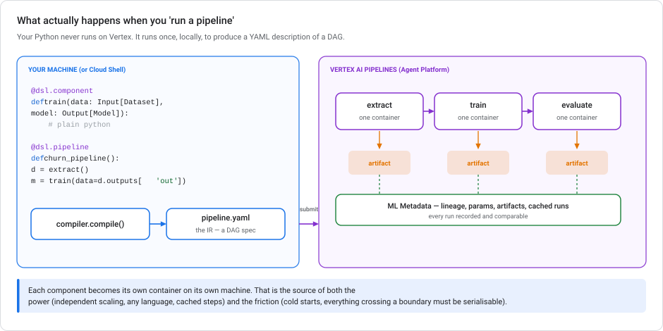
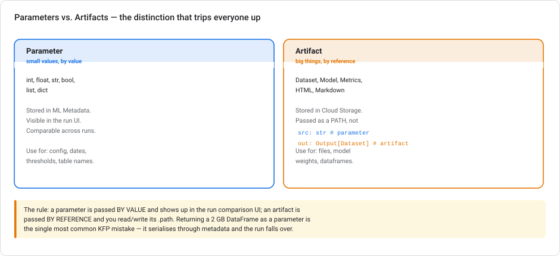
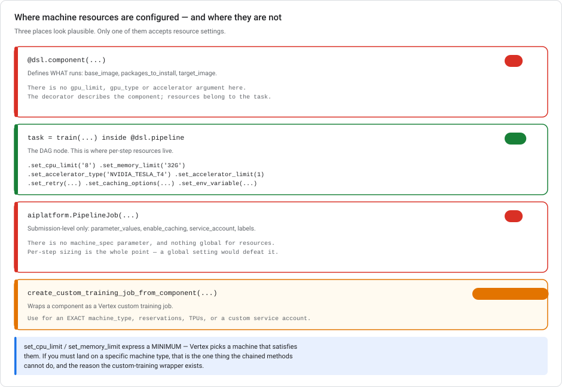
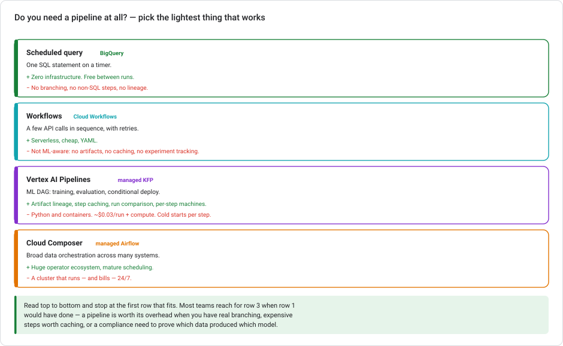

# Kubeflow Pipelines on Google Cloud

> **Type** Explanation module (concepts + runnable code, not a hands-on lab)  **Reading time** 40–50 minutes
> **Companion labs** [Lab 2 — Churn with BigQuery ML](../labs/lab-02-customer-churn-lowcode-bqml.md) · [Lab 3 — Serving](../labs/lab-03-serving-ml-models-lowcode.md) · [Lab 5 — Feature engineering](../labs/lab-05-feature-engineering-tabular.md)
> **Related** [Scaling prototypes into ML models](SCALING-PROTOTYPES-TO-ML.md)
> **Last updated** 23 August 2026

---

## Read this first

Every other module in this series is low-code. **This one is not**, and that is deliberate.

Kubeflow Pipelines is a Python SDK. You write Python, you compile it, and containers run. If you have been enjoying `CREATE MODEL` as a one-liner, KFP will feel like a large step backwards in convenience. So this module focuses on **when that trade is worth making**, and when a scheduled query would have done the job for a hundredth of the effort.

Use pipelines when you have real branching, expensive steps worth caching, or a compliance need to prove which data produced which model. Not before.

---

## 1. Terminology, cleared up

Four names get used interchangeably. They mean different things:

| Name | What it is |
|---|---|
| **Kubeflow** | A full open-source ML platform for Kubernetes. Large. You almost certainly do not want to run it. |
| **Kubeflow Pipelines (KFP)** | One component of Kubeflow: a way to define ML DAGs, plus an SDK to author them. |
| **KFP SDK** | The Python library (`kfp`) you actually write. Version 2 is current and is what this module uses. |
| **Vertex AI Pipelines** | Google's **serverless, managed** execution of KFP pipelines. No cluster, no Kubeflow install, no Kubernetes to operate. |

**On Google Cloud you use the KFP SDK to author, and Vertex AI Pipelines to run.** You never install Kubeflow. This is the most common point of confusion. It usually costs someone a wasted afternoon reading Kubernetes documentation they will never need.

Vertex AI Pipelines also supports TFX pipelines, but KFP is the general-purpose choice and the one to learn first.

---

## 2. What happens when you run a pipeline



This mental model makes the rest of the module easier to follow:

1. **Your Python defines the DAG — it does not execute the work.** The pipeline function body runs *once*, locally, at compile time. It does not train anything. It records "extract feeds train, train feeds evaluate."
2. **The compiler emits YAML.** That file (the "IR") is the actual artifact. It is portable, diffable, and belongs in version control.
3. **You submit the YAML.** Vertex AI Pipelines reads it and schedules the DAG.
4. **Each component runs as its own container, on its own machine.** They do not share memory, filesystem, or Python process.
5. **Everything crossing a boundary is recorded** in ML Metadata — parameters by value, artifacts by reference.

Two consequences follow from step 4. They explain most KFP surprises:

- A global variable set in one component is invisible in the next. There is no shared process.
- Every step pays container startup — **tens of seconds**. A ten-step pipeline of trivial steps is slower than one script doing all ten things.

> **The most common beginner error** is expecting the pipeline function to behave like a normal Python function — printing values, using `if` on a component's output, iterating over results. It cannot. When that code runs, nothing has executed yet, and the "outputs" are only placeholders in a graph. See §6 for how to express conditionals properly.

---

## 3. Hello, pipeline

```bash
pip install "kfp>=2.0" "google-cloud-aiplatform>=1.60"
```

```python
from kfp import dsl, compiler


@dsl.component(base_image="python:3.11")
def say_hello(name: str) -> str:
    return f"Hello, {name}"


@dsl.component(base_image="python:3.11")
def shout(text: str) -> str:
    return text.upper() + "!"


@dsl.pipeline(name="hello-pipeline", description="Smallest useful KFP example")
def hello_pipeline(name: str = "world"):
    greeting = say_hello(name=name)
    shout(text=greeting.output)


compiler.Compiler().compile(hello_pipeline, "hello_pipeline.yaml")
```

Open `hello_pipeline.yaml`. It is a declarative description of two containers and the dependency between them, not your Python. That is what Vertex runs.

Submit it:

```python
from google.cloud import aiplatform

aiplatform.init(project="PROJECT_ID", location="us-central1",
                staging_bucket="gs://YOUR_BUCKET")

job = aiplatform.PipelineJob(
    display_name="hello-pipeline",
    template_path="hello_pipeline.yaml",
    parameter_values={"name": "Vertex"},
    enable_caching=True,
)
job.submit()   # .run() blocks; .submit() returns immediately
```

> **⚠️ 2026 SDK note — read this, because the headlines are misleading.** The **generative** modules of `google-cloud-aiplatform` (`vertexai.generative_models`, `vertexai.language_models`, `vertexai.vision_models`, `vertexai.tuning`, `vertexai.caching`) were removed on **24 June 2026**, replaced by the `google-genai` package. **`aiplatform.PipelineJob` is *not* affected** and remains the supported way to submit pipelines. If you read "the Vertex AI SDK is deprecated" and concluded pipelines were dead, that conclusion is wrong. Only the GenAI surface moved.
>
> Separately: KFP SDK **v1** had an `AIPlatformClient` for submission. v2 removed it. Use `PipelineJob`.

---

## 4. Components — three flavours

### Lightweight Python component

```python
@dsl.component(
    base_image="python:3.11",
    packages_to_install=["pandas==2.2.2", "pyarrow"],
)
def summarize(data: dsl.Input[dsl.Dataset], stats: dsl.Output[dsl.Dataset]):
    import pandas as pd                      # imports go INSIDE the function
    df = pd.read_parquet(data.path)
    df.describe().to_parquet(stats.path)
```

Two rules that are not optional:

- **All imports go inside the function body.** The function source is extracted and shipped standalone; module-level imports in your file do not travel with it.
- **`packages_to_install` runs `pip install` on every execution.** Convenient for development, slow and fragile for production — pin exact versions, and move to a custom container once the dependency set stabilizes.

### Container component

Any image, any language:

```python
@dsl.container_component
def run_dbt(project: str):
    return dsl.ContainerSpec(
        image="ghcr.io/dbt-labs/dbt-bigquery:1.8.0",
        command=["dbt", "run"],
        args=["--project-dir", project],
    )
```

### Prebuilt Google Cloud Pipeline Components

Do not hand-write what Google already ships:

```bash
pip install google-cloud-pipeline-components
```

```python
from google_cloud_pipeline_components.v1.bigquery import (
    BigqueryCreateModelJobOp, BigqueryEvaluateModelJobOp)
from google_cloud_pipeline_components.v1.model import ModelUploadOp
from google_cloud_pipeline_components.v1.endpoint import (
    EndpointCreateOp, ModelDeployOp)
```

These wrap BigQuery ML, custom training, batch prediction, model upload, endpoint deployment, and more. They also handle the polling, error propagation, and artifact plumbing you would otherwise write yourself.

---

## 5. Parameters vs. artifacts



This distinction causes the most trouble:

| | Parameter | Artifact |
|---|---|---|
| Types | `int`, `float`, `str`, `bool`, `list`, `dict` | `Dataset`, `Model`, `Metrics`, `HTML`, `Markdown` |
| Passed | **by value** | **by reference** (a Cloud Storage path) |
| Stored in | ML Metadata | Cloud Storage |
| Shows in run-comparison UI | yes | as a link |
| Use for | config, dates, thresholds, table names | files, model weights, dataframes |

```python
@dsl.component
def train(
    dataset: dsl.Input[dsl.Dataset],      # artifact in  — read dataset.path
    learning_rate: float,                  # parameter in — a real value
    model: dsl.Output[dsl.Model],          # artifact out — write to model.path
    metrics: dsl.Output[dsl.Metrics],      # artifact out — .log_metric()
):
    import pandas as pd, joblib
    from sklearn.ensemble import GradientBoostingClassifier
    from sklearn.metrics import roc_auc_score

    df = pd.read_parquet(dataset.path)
    X, y = df.drop(columns=["churn"]), df["churn"]

    clf = GradientBoostingClassifier(learning_rate=learning_rate).fit(X, y)
    joblib.dump(clf, model.path)

    auc = roc_auc_score(y, clf.predict_proba(X)[:, 1])
    metrics.log_metric("roc_auc", auc)          # appears in the run UI
    model.metadata["framework"] = "sklearn"     # travels with the artifact
```

> **Never return a large object as a parameter.** `-> pd.DataFrame` or a giant dict serialises through ML Metadata and will fail or crawl. Anything bigger than a few kilobytes is an artifact. This is the single most common KFP mistake.

`Metrics` artifacts make the run-comparison UI useful. Log every number you would otherwise print, and you get a sortable comparison across every run for free.

---

## 6. Control flow

The pipeline body builds a graph, so ordinary Python control flow does not work on component outputs. KFP gives you graph-level equivalents:

```python
from kfp import dsl


@dsl.pipeline(name="churn-training")
def churn_pipeline(
    source_table: str,
    auc_threshold: float = 0.80,
    learning_rate: float = 0.10,
):
    prep = prepare_features(source_table=source_table)
    trained = train(dataset=prep.outputs["dataset"], learning_rate=learning_rate)
    evaluated = evaluate(model=trained.outputs["model"],
                         dataset=prep.outputs["dataset"])

    # conditional: deploy only if the model is good enough
    with dsl.If(evaluated.outputs["roc_auc"] >= auc_threshold, name="good-enough"):
        deploy(model=trained.outputs["model"])
    with dsl.Else():
        notify(message="Model below threshold — not deployed")

    # parallel fan-out with a concurrency cap
    with dsl.ParallelFor([0.01, 0.05, 0.1, 0.3], parallelism=2) as lr:
        train(dataset=prep.outputs["dataset"], learning_rate=lr)

    # explicit ordering when there is no data dependency
    cleanup_task = cleanup()
    cleanup_task.after(evaluated)
```

> **⚠️ `dsl.Condition` vs `dsl.If` — you will meet both.** `dsl.Condition` was the original name and is what most tutorials and older docs still use:
> ```python
> with dsl.Condition(evaluated.outputs["roc_auc"] >= auc_threshold, name="good-enough"):
>     deploy(model=trained.outputs["model"])
> ```
> **KFP 2.2.0 deprecated it in favour of the functionally identical `dsl.If`**, which pairs with `dsl.Elif` and `dsl.Else` — something `dsl.Condition` never supported. Both still compile. `dsl.If` is the current form and the only one that gives you an else branch. Same story as `add_node_selector_constraint` → `set_accelerator_type` in §7.

**The conditional-deploy pattern above is the reason many teams adopt pipelines at all.** "Retrain nightly, but only replace production if the new model beats the threshold" is awkward in a scheduled query and natural here.

Per-task resources and reliability:

```python
    trained = train(dataset=prep.outputs["dataset"], learning_rate=learning_rate)
    trained.set_cpu_limit("8").set_memory_limit("32G")
    trained.set_accelerator_type("NVIDIA_TESLA_T4").set_accelerator_limit(1)
    trained.set_retry(num_retries=3, backoff_duration="60s")
    trained.set_caching_options(enable_caching=False)   # always retrain
```

Sizing each step independently is a real advantage: your data-prep step gets 2 CPUs, your training step gets a GPU, and you pay for the GPU only while training runs.

---

---

## 7. Machine resources per step

One of the strongest reasons to use pipelines at all: **each step gets its own machine.** Data prep on 2 CPUs, training on a GPU, evaluation back on something small — and you pay for the GPU only while training runs.



### The rule

Resources are a property of the **task** (the node in the DAG), not of the component and not of the job. Configure them by chaining setters on the object a component call returns, inside the pipeline function:

```python
@dsl.component(base_image="python:3.11", packages_to_install=["xgboost==2.1.0"])
def train(dataset: dsl.Input[dsl.Dataset], model: dsl.Output[dsl.Model]):
    ...


@dsl.pipeline(name="gpu-training")
def gpu_pipeline():
    prep = prepare_features()
    prep.set_cpu_limit("2").set_memory_limit("8G")

    trained = train(dataset=prep.outputs["dataset"])
    (trained
        .set_cpu_limit("8")
        .set_memory_limit("32G")
        .set_accelerator_type("NVIDIA_TESLA_T4")   # which accelerator
        .set_accelerator_limit(1)                  # how many
        .set_retry(num_retries=2, backoff_duration="60s"))

    evaluate(model=trained.outputs["model"])       # no GPU, small machine
```

Every setter returns the task, so they chain. Each one applies to **that task only**.

### Why the other two places don't work

**`@dsl.component` cannot take GPU arguments.** The decorator describes *what the component is* — its base image, its packages, its interface. It has no `gpu_limit`, `gpu_type`, or `accelerator` parameter. That is deliberate: one component may be called several times in a pipeline, with different resources each time. Resources belong to the call site, not the definition.

**`PipelineJob` has no `machine_spec`.** The submission object takes `template_path`, `parameter_values`, `enable_caching`, `service_account`, `labels`, and similar — job-level concerns. There is no global machine configuration, because a single setting for every step would defeat the reason you split the work into steps.

### The full set of task setters

| Method | Purpose |
|---|---|
| `.set_cpu_limit("8")` | CPU cores |
| `.set_memory_limit("32G")` | Memory |
| `.set_accelerator_type("NVIDIA_TESLA_T4")` | Which GPU/TPU |
| `.set_accelerator_limit(1)` | How many |
| `.set_retry(num_retries=3, backoff_duration="60s")` | Retry policy |
| `.set_caching_options(enable_caching=False)` | Per-step caching |
| `.set_env_variable(name="K", value="V")` | Environment |
| `.set_display_name("Train churn model")` | Label in the run graph |

> **⚠️ `add_node_selector_constraint()` — know it, but prefer not to use it.** In KFP v1 you specified a GPU with
> `task.add_node_selector_constraint(label_name="cloud.google.com/gke-accelerator", value="NVIDIA_TESLA_A100")`.
> **KFP v2 deprecated it in favour of `.set_accelerator_type()`**, dropped the `label_name` parameter, and renamed `value` to `accelerator`. Both now do the same job, so calling them together is redundant. Google's Vertex machine-types page still lists all three methods. This is why `add_node_selector_constraint()` is still widely copied from older tutorials. It works, but `set_accelerator_type()` is the current form.
>
> Same story one level down: `.set_gpu_limit()` was superseded by `.set_accelerator_limit()`.

### The limitation, and when to reach for the wrapper

`set_cpu_limit` and `set_memory_limit` express a **minimum**. Vertex then picks a machine that satisfies them, so you do not choose the machine type. That is fine most of the time, but not always enough.

For an **exact** machine type, a reservation, a TPU, or a custom service account, wrap the component as a Vertex custom training job:

```python
from google_cloud_pipeline_components.v1.custom_job import     create_custom_training_job_from_component

train_on_gpu = create_custom_training_job_from_component(
    train,                                   # your @dsl.component
    machine_type="a2-highgpu-1g",            # an exact machine
    accelerator_type="NVIDIA_TESLA_A100",
    accelerator_count=1,
    service_account="trainer@PROJECT.iam.gserviceaccount.com",
)


@dsl.pipeline(name="gpu-training-custom")
def pipeline():
    prep = prepare_features()
    train_on_gpu(dataset=prep.outputs["dataset"], project="PROJECT", location="us-central1")
```

**Choose between them like this.** If you need *a* GPU, chain `set_accelerator_type` / `set_accelerator_limit`. That is one line and no extra dependency. If you need a *specific* machine, a reservation, a TPU, or a distinct identity, use `create_custom_training_job_from_component`. Both are fine choices. The wrapper is heavier and buys control you often do not need.

> **Cost reminder:** a GPU step bills at GPU rates for its whole lifetime, including the container cold start and any package installation you left in `packages_to_install`. Put the heavy dependencies in a prebuilt image before you attach an accelerator, or you are renting an A100 to run `pip install`.

## 8. Caching — the feature that pays for the complexity

Vertex AI Pipelines caches at the **step** level. If a component's inputs, code, and image are unchanged from a previous successful run, it is skipped and the prior artifact is reused.

Concretely: a 40-minute data-prep step followed by a 5-minute training step. Change a hyperparameter and rerun — prep is skipped and you get results in five minutes.

```python
job = aiplatform.PipelineJob(..., enable_caching=True)     # default
```

Turn it off for a specific step when the code is deterministic but the *world* is not — a step reading "yesterday's data" from a live table has identical inputs today and yesterday, so caching would silently reuse stale results:

```python
    ingest_task.set_caching_options(enable_caching=False)
```

> **Caching is not deduplication.** If you trigger pipelines from events, two deliveries of the same event are two distinct runs — see [Event-driven ML automation](EVENT-DRIVEN-ML-AUTOMATION.md), where the dedup check belongs before the pipeline is submitted.

> Remember this failure mode: **caching is keyed on declared inputs, not on the state of the world.** If a step's real input is a mutable table, and that table is not part of its declared parameters, caching will lie to you. To fix it, pass the partition date as an explicit parameter. The input is then honestly different each day.

---

## 8a. What happens when a task fails

Parallel branches raise a question that the DAG shape does not answer. **One branch fails. Do the others keep going?**

That is `failure_policy`, set on the **`PipelineJob`**, with exactly two values:

| Value | Behaviour |
|---|---|
| **`'slow'`** | Keep scheduling every task whose dependencies are still met. The run is marked failed **only after everything that could run has run.** *This is the default.* |
| **`'fast'`** | Stop scheduling new tasks the moment any task fails. Already-running tasks finish; nothing new starts. |

```python
job = aiplatform.PipelineJob(
    display_name="multi-architecture-search",
    template_path="search.yaml",
    failure_policy="slow",        # let the other branches finish
)
```

**Which you want depends on what the branches are.**

- Four architectures training in parallel for comparison: **`slow`.** One failure is no reason to abandon the other three. You still want their results, and one failure report beats rerunning everything.
- A linear pipeline where each step feeds the next: **`fast`.** Downstream steps will fail anyway, so stopping early saves the compute.

> **`slow` is already the default**, so "let the other branches finish" often needs no configuration at all. Setting it explicitly still helps. It documents that this pipeline *has* independent branches, for whoever reads it next.

### Three things that are not `failure_policy`

| | What it actually does |
|---|---|
| **`dsl.If`** (formerly `dsl.Condition`) | Conditional *execution* on a runtime value — "deploy only if AUC > 0.82". It branches on **data**, not on failure. |
| **`.set_retry(num_retries=...)`** | How many times **one task** retries before it counts as failed. It is a separate control: it changes *when* a failure happens, not what the pipeline does about it. `num_retries=0` does not make sibling branches continue. They already would. |
| **`dsl.ExitHandler`** | A task that runs *after* the pipeline finishes, whatever the outcome. This is where a notification belongs — one handler, not a custom component bolted onto every branch. |

"One branch fails, the rest finish, tell me at the end" is `failure_policy='slow'` plus a single `dsl.ExitHandler`.

---

## 9. A realistic pipeline — connecting this to Lab 2

Here is Lab 2's churn work as a pipeline. Notice how much of it is prebuilt components: the SQL you already wrote in Lab 2 is passed straight through.

```python
from kfp import dsl, compiler
from google_cloud_pipeline_components.v1.bigquery import (
    BigqueryQueryJobOp, BigqueryCreateModelJobOp, BigqueryEvaluateModelJobOp)

PROJECT = "PROJECT_ID"
LOCATION = "US"


@dsl.component(base_image="python:3.11",
               packages_to_install=["google-cloud-bigquery==3.25.0"])
def check_auc(project: str, model: str, threshold: float) -> bool:
    from google.cloud import bigquery
    client = bigquery.Client(project=project)
    row = list(client.query(
        f"SELECT roc_auc FROM ML.EVALUATE(MODEL `{model}`)"
    ).result())[0]
    print(f"roc_auc={row.roc_auc:.4f} threshold={threshold}")
    return row.roc_auc >= threshold


@dsl.pipeline(name="churn-retraining", description="Nightly churn retrain with a quality gate")
def churn_retraining(
    project: str = PROJECT,
    as_of: str = "2026-08-01",
    auc_threshold: float = 0.82,
):
    # 1. rebuild the feature table for an explicit cutoff (see Lab 5)
    features = BigqueryQueryJobOp(
        project=project,
        location=LOCATION,
        query=f"""
            CREATE OR REPLACE TABLE `telco_churn.features_v3` AS
            SELECT * FROM `telco_churn.build_features`('{{as_of}}')
        """.replace("{{as_of}}", "@as_of"),
        job_configuration_query={"queryParameters": [
            {"name": "as_of", "parameterType": {"type": "DATE"},
             "parameterValue": {"value": as_of}}]},
    )

    # 2. train — the same CREATE MODEL statement from Lab 2
    train = BigqueryCreateModelJobOp(
        project=project,
        location=LOCATION,
        query="""
            CREATE OR REPLACE MODEL `telco_churn.churn_model`
            OPTIONS (MODEL_TYPE='BOOSTED_TREE_CLASSIFIER',
                     INPUT_LABEL_COLS=['churn'],
                     AUTO_CLASS_WEIGHTS=TRUE,
                     ENABLE_GLOBAL_EXPLAIN=TRUE,
                     MODEL_REGISTRY='VERTEX_AI',
                     VERTEX_AI_MODEL_ID='telco-churn-model')
            AS SELECT * EXCEPT (customer_id) FROM `telco_churn.features_v3`
        """,
    ).after(features)

    # 3. evaluate
    evaluate = BigqueryEvaluateModelJobOp(
        project=project, location=LOCATION,
        model=train.outputs["model"],
    )

    # 4. quality gate — only score if the model is good enough
    gate = check_auc(project=project,
                     model="telco_churn.churn_model",
                     threshold=auc_threshold).after(evaluate)

    with dsl.If(gate.output == True, name="model-passed"):
        BigqueryQueryJobOp(
            project=project, location=LOCATION,
            query="""
                CREATE OR REPLACE TABLE `telco_churn.churn_scores` AS
                SELECT customer_id,
                       (SELECT prob FROM UNNEST(predicted_churn_probs)
                        WHERE label = 'Yes') AS p_churn
                FROM ML.PREDICT(MODEL `telco_churn.churn_model`,
                                (SELECT * FROM `telco_churn.features_v3`))
            """,
        )


compiler.Compiler().compile(churn_retraining, "churn_retraining.yaml")
```

**Be honest about what the pipeline added here.** The SQL is identical to Lab 2 and Lab 5. What you gained is: the quality gate (bad models don't reach production), lineage (which feature table produced which model version), caching, and a run history you can compare. What you paid is Python, a compile step, containers, and cold starts.

If you don't need the gate or the lineage, Lab 3's scheduled query does the same work for none of that cost.

---

## 10. Scheduling

```python
job = aiplatform.PipelineJob(
    display_name="churn-retraining",
    template_path="churn_retraining.yaml",
    parameter_values={"project": PROJECT, "auc_threshold": 0.82},
)

job.create_schedule(
    display_name="nightly-churn-retrain",
    cron="0 3 * * *",           # 03:00, in the timezone you specify
    timezone="Asia/Jakarta",
    max_concurrent_run_count=1, # never two runs at once
    max_run_count=52,           # optional: stop after 52 runs
    service_account="pipelines-runner@PROJECT_ID.iam.gserviceaccount.com",
)
```

### The four main parameters

| Parameter | What it controls |
|---|---|
| `cron` + `timezone` | When runs start. The timezone is separate — set it, or you inherit UTC and your "3am" retrain lands at 10am local. |
| `max_concurrent_run_count` | **How many runs may execute at the same time.** Set it to `1` and an overrunning run *delays* the next one instead of running alongside it. |
| `max_run_count` | **Total runs before the schedule stops.** After the last one the schedule state becomes `COMPLETED`. A weekly retrain capped for a year is `max_run_count=52`. |
| `start_time` / `end_time` | Wall-clock window the schedule is active in. A *timestamp*, not a count — don't reach for `end_time` when you mean "52 runs". |

`max_concurrent_run_count=1` matters more than it looks: without it, a run that overruns its schedule gets a second run starting alongside it, and two pipelines writing the same table is a bad afternoon.

**`allow_queueing` is a different question.** It decides what happens to a run that *can't* start right now — hold it in a queue, or drop it. It does not cap concurrency. Setting `allow_queueing=False` while leaving concurrency unbounded still permits overlapping runs. The two parameters address separate problems, and only `max_concurrent_run_count` addresses overlap.

**And `failure_policy` is a third thing again.** It is a `PipelineJob` argument, not a schedule one, and it governs what happens *inside* a run when a task fails: `'fast'` stops the pipeline at the first failure, `'slow'` lets independent branches finish. Nothing to do with scheduling.

> **Don't reimplement this with Cloud Scheduler.** You can. A Cloud Scheduler job hitting the Pipelines API works. But you would then build concurrency control and run counting yourself. `create_schedule()` is the native scheduler and already has both. Cloud Scheduler earns its place when the *trigger* is not a clock (see [Event-driven ML automation](EVENT-DRIVEN-ML-AUTOMATION.md)).

Pass the partition date as a parameter rather than computing `CURRENT_DATE()` inside a component — it makes runs reproducible, backfillable, and honest with the cache (see §8).

---

## 11. What it costs

| Item | Cost |
|---|---|
| Pipeline orchestration | **~$0.03 per pipeline run** |
| Component compute | standard Vertex training machine rates, per step, while it runs |
| Artifact storage | Cloud Storage rates |
| Anything a step calls | billed by that service (BigQuery, Dataflow, …) |

The orchestration fee is trivial. **The compute is not, and neither is the wasted time.** Two things dominate real bills:

1. **Cold starts.** Every step spins up a container. Ten trivial steps can spend more wall-clock on startup than on work — and you pay for that time.
2. **Oversized machines.** A step that defaults to a large machine to do a `SELECT COUNT(*)` bills at that rate for its whole life. Set per-step limits.

The mitigations: **merge trivial steps** (a "pipeline" is not better for having twenty boxes), size each step deliberately, and leave caching on so reruns skip unchanged work.

Verify current rates on the [Agent Platform pricing page](https://cloud.google.com/products/gemini-enterprise-agent-platform/pricing) before budgeting.

---

## 12. When to use pipelines — and when not to



Read the figure top to bottom and stop at the first row that fits your problem.

**Use Vertex AI Pipelines when at least one of these is true:**

- You need **conditional logic** — "deploy only if it beats the threshold"
- You have **expensive steps worth caching** across iterations
- You need **lineage for compliance** — proving which data produced which model version
- Steps need **different machines** — CPU prep, GPU training
- The work **isn't all SQL** — a Python transform, an external API, a custom container

**Do not use them when:**

- It is one SQL statement on a timer → **scheduled query** (Lab 3, Task 2)
- It is a few API calls in sequence → **Workflows**
- It is broad data orchestration across many non-ML systems → **Cloud Composer**
- You are prototyping → a notebook. Pipelines are for work that has stabilized.

> A note from the [scaling module](SCALING-PROTOTYPES-TO-ML.md): teams reach for pipelines at Stage 1 because it feels like the professional choice, and end up maintaining container builds for something a scheduled query did fine. Pipelines are a **Stage 3–4** tool. Earn your way there.

---

## 12a. API version note — three version axes at once

KFP is where version numbers pile up, and they're on **three separate axes**:

| Thing | Axis | Where it sits |
|---|---|---|
| `kfp` SDK **2.x** | library semver | your `pip install` |
| `aiplatform.PipelineJob` | API version | **GA, `v1`** |
| Google Cloud Pipeline Components | feature namespace | `v1` = stable · `preview` = early access |

**Concretely:** nothing about running a KFP pipeline requires `v1beta1`. Submission is GA.

What *does* vary is your **GCPC imports**:

```python
from google_cloud_pipeline_components.v1.custom_job import \
    create_custom_training_job_from_component      # stable, production-ready

from google_cloud_pipeline_components.preview...   # early access, no SLA
```

A `preview` import carries the same caveats as a `v1beta1` API. Flag it in code review, since it is easy to copy from a sample without noticing.

**And the one to keep straight:** **KFP SDK v2 is a library major version, not an API version.** Upgrading `kfp` from 1.x to 2.x does not move you onto a beta API. As §3 notes, it *removed* the old `AIPlatformClient` in favour of the GA `PipelineJob`.

See [API versions and launch stages](GCP-API-VERSIONS-AND-LAUNCH-STAGES.md).

---

## 12b. Portability — running the same pipeline on Vertex AI and on-prem Kubeflow

A real scenario if your organisation runs its own Kubeflow Pipelines installation alongside Google Cloud: **the same pipeline, both places, minimal divergence.**

This works, and it works because of the compile step from §2.

### Why it works

**KFP SDK v2 compiles to a YAML intermediate representation that both backends execute.** Vertex AI Pipelines is one conformant backend; an OSS Kubeflow Pipelines installation on your own Kubernetes cluster is another. The YAML describes containers and a DAG — nothing in it is inherently Google-specific.

So the portability question is about **what your components do**, not about the SDK.

### The two kinds of component

| | Portable? | Why |
|---|---|---|
| **`@dsl.component`** (your own) | ✅ Yes | It's a container plus a typed interface. Anything that runs in a container runs on either backend. |
| **`@dsl.container_component`** | ✅ Yes | Same reasoning — you supply the image. |
| **Google Cloud Pipeline Components** | ❌ **No** | They call Vertex AI services. `BigqueryCreateModelJobOp` needs BigQuery; `ModelDeployOp` needs a Vertex endpoint. There is no on-prem runtime for them and there cannot be — the services they wrap only exist on Google Cloud. |

### The strategy

**Write the portable logic as custom components, and use GCPC only for the Vertex-specific steps.**

```python
# portable — runs anywhere a container runs
@dsl.component(base_image="python:3.11", packages_to_install=["scikit-learn==1.5.1"])
def train(dataset: dsl.Input[dsl.Dataset], model: dsl.Output[dsl.Model]):
    ...

@dsl.pipeline(name="portable-training")
def pipeline(on_gcp: bool = True):
    prep    = prepare(...)                 # portable
    trained = train(dataset=prep.outputs["dataset"])   # portable

    # cloud-only tail, fenced off
    with dsl.If(on_gcp == True, name="gcp-only"):
        ModelUploadOp(...)                 # GCPC — Vertex only
```

Compile once, submit to whichever backend you're targeting:

```bash
# same YAML, two destinations
compiler.Compiler().compile(pipeline, "pipeline.yaml")
```

Three things that make this hold up in practice:

- **Keep the cloud-specific parts at the edges** — usually ingest and deploy. The middle (transform, train, evaluate) is almost always portable.
- **Parameterise the environment** rather than branching on hostnames. An `on_gcp` or `environment` pipeline parameter keeps the difference visible and testable.
- **Pin your images.** "Runs in a container" is only portable if the container is actually available to both clusters — mirror images into a registry both can reach.

### Why the alternatives are worse

- **Use GCPC for everything and "deploy a GCPC runtime on-prem."** Not possible. GCPC components are thin wrappers around Vertex AI APIs; there is nothing to install on-prem that would make `ModelDeployOp` create a Vertex endpoint from your datacentre.
- **Rewrite everything in TFX.** TFX does run on both backends, so the idea is not absurd. But it is recommended for **TensorFlow workflows over large structured datasets**, and it constrains you to that shape. For general ML work, KFP v2 is more flexible. You would also adopt a whole framework to solve a problem the compile step already solves.
- **Maintain two pipeline definitions with CI keeping them in sync.** This option always looks pragmatic in a meeting, and it always drifts. It also contradicts "minimal code changes". You have doubled the surface, not reduced it.

> **The general principle:** the compiled YAML is your portability boundary, and GCPC crosses it. Everything you write yourself is portable by construction. Everything Google wrote to call its own services is not.

---

## 13. Anti-patterns

**The mega-component.** One component that does everything defeats caching, per-step sizing, and lineage. If your pipeline has one box, you wrote a script with extra steps.

**The nano-component.** Twenty components each doing three lines. Every boundary costs a cold start and a serialisation round-trip. Merge them.

**Big data as parameters.** Covered in §5 and worth repeating: `-> pd.DataFrame` will hurt you.

**`packages_to_install` in production.** Fine while developing; in production it means every run pip-installs from the internet, so your pipeline breaks when a package yanks a version. Build a custom image once the dependencies settle.

**`CURRENT_DATE()` inside a component.** Makes runs non-reproducible, backfills impossible, and lies to the cache. Pass the date in as a parameter.

**No quality gate.** A pipeline that retrains and deploys unconditionally has automated the thing you most want a human check on. The `dsl.If` in §9 is the whole point.

**Faking conditionals with exceptions or `exit()`.** Raising in a component to stop a deployment marks the *run* as failed. But what really happened ("the model didn't clear the bar") is a successful run with a negative outcome. You lose the difference between "the pipeline broke" and "the pipeline worked and said no". On-call needs that difference at 3 a.m. Use `dsl.If`. Likewise, splitting training and deployment into two pipelines glued by a Cloud Function works, but it breaks lineage into two disconnected graphs. See [ML Metadata](VERTEX-ML-METADATA.md) for why that costs you.

**Ignoring the cache-staleness trap.** §8. Caching keys on declared inputs, not on the world.

---

## 14. Where to start

To learn this properly, work in this order:

1. **Run the hello pipeline in §3.** Compile it, read the YAML, submit it, watch the DAG in the console. Half an hour, a few cents. Do not skip reading the YAML. It is what makes the mental model click.
2. **Add an artifact** between two components and find it in Cloud Storage.
3. **Log a `Metrics` artifact** and compare two runs in the UI.
4. **Wrap Lab 2's SQL** with `BigqueryCreateModelJobOp` — you already have the SQL.
5. **Add the quality gate** from §9. That is the moment the pipeline earns its keep.
6. **Schedule it**, with the date as a parameter.

By step 5 you will know whether pipelines solve a problem you really have.

### Console location

**Agent Platform → Pipelines.** Since the [May 2026 rebrand](SCALING-PROTOTYPES-TO-ML.md#10-a-note-on-the-2026-platform), Vertex AI no longer appears in the console navigation; searching "Vertex AI" redirects you. The API (`aiplatform.googleapis.com`), the IAM roles, and the SDK are unchanged.

### Required IAM

The pipeline's service account needs `roles/aiplatform.user`, `roles/storage.objectAdmin` on the staging bucket, and whatever the steps themselves touch — for the §9 example, `roles/bigquery.dataEditor` and `roles/bigquery.jobUser`.

---

## Further reading

- [Vertex AI Pipelines introduction](https://docs.cloud.google.com/vertex-ai/docs/pipelines/introduction)
- [Interfaces for Vertex AI Pipelines](https://docs.cloud.google.com/vertex-ai/docs/pipelines/interfaces)
- [KFP SDK v2 documentation](https://www.kubeflow.org/docs/components/pipelines/)
- [Migrate to Kubeflow Pipelines v2](https://www.kubeflow.org/docs/components/pipelines/user-guides/migration/)
- [Google Cloud Pipeline Components reference](https://google-cloud-pipeline-components.readthedocs.io/)
- [Understand pipeline run costs](https://cloud.google.com/vertex-ai/docs/pipelines/understand-pipeline-cost-labels)
- [Official KFP samples](https://github.com/GoogleCloudPlatform/vertex-ai-samples/tree/main/notebooks/official/pipelines)
