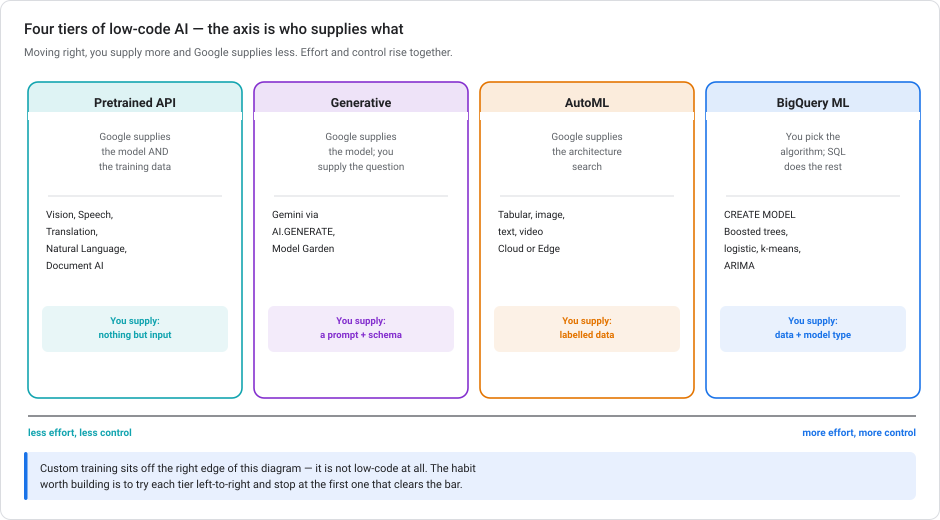
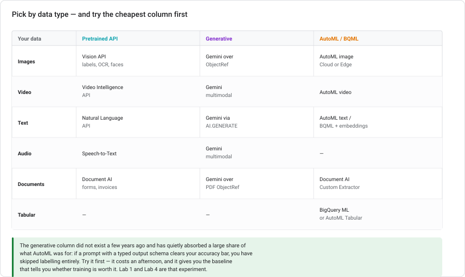
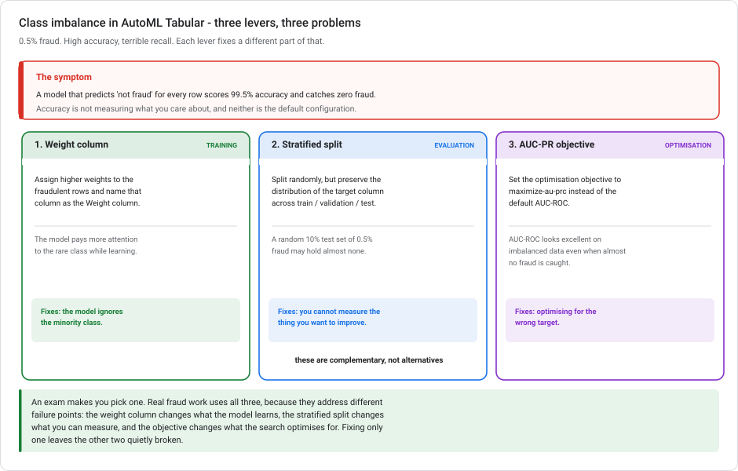
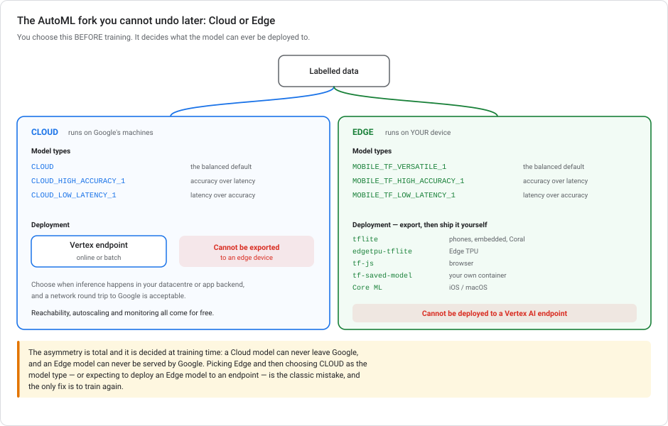

# Low-code AI solutions on Google Cloud

> **Type** Explanation module (theory, no console steps)  **Reading time** 35–45 minutes
> **Related** [Lab 1 — Sentiment with Gemini](../labs/lab-01-sentiment-analysis-bigquery-gemini.md) · [Lab 4 — Vision](../labs/lab-04-image-vision-lowcode-bigquery.md) · [Where training runs](VERTEX-TRAINING-COMPUTE.md) · [Scaling prototypes into ML models](SCALING-PROTOTYPES-TO-ML.md)
> **Last updated** 23 August 2026

---

## Four tiers, one irreversible choice

"Low-code AI" on Google Cloud covers four tiers of *how much you supply*, spread across a dozen services with overlapping names. It is not one product. The practical skill is picking the leftmost tier that clears your accuracy bar, rather than the most impressive one.

It also contains one decision you cannot undo without retraining: **when you train an AutoML model, you choose Cloud or Edge, and that choice permanently determines where the model can ever run.** That is §4, and it is the part to get right.

---

## 1. The four tiers



The axis is **who supplies what**. Moving right, you supply more and Google supplies less.

| Tier | Google supplies | You supply | Examples |
|---|---|---|---|
| **Pretrained API** | Model *and* training data | Nothing but input | Vision, Speech-to-Text, Translation, Natural Language, Video Intelligence, Document AI |
| **Generative** | The model | A prompt and an output schema | Gemini via `AI.GENERATE`, Model Garden |
| **AutoML** | The architecture search | Labelled data | AutoML tabular, image, text, video |
| **BigQuery ML** | The training infrastructure | Data *and* the algorithm choice | `CREATE MODEL … BOOSTED_TREE_CLASSIFIER` |

Custom training sits off the right edge. It is not low-code at all, and it is covered in [Where training runs](VERTEX-TRAINING-COMPUTE.md).

> **Build this habit:** try tiers left to right and stop at the first one that clears the bar. [Lab 4](../labs/lab-04-image-vision-lowcode-bigquery.md) does this deliberately with images (a pretrained API, then a foundation model, then embeddings) and shows why the answer is usually not the rightmost option.

---

## 1a. The Natural Language API, method by method

The pretrained tier is only useful if you know which call does what. The Natural Language API is where that matters most. Several of its methods sound interchangeable but return very different things.

| Method | Returns | Sentiment? | Salience? |
|---|---|---|---|
| `analyzeSentiment` | `score` and `magnitude`, per document **and per sentence** | ✅ document-level | ❌ |
| `analyzeEntities` | entities with **type, salience, mentions, metadata** | ❌ | ✅ |
| **`analyzeEntitySentiment`** | entities **plus sentiment per entity and per mention** | ✅ **per entity** | ✅ |
| `classifyText` | content categories with confidence | ❌ | ❌ |
| `analyzeSyntax` | tokens, part of speech, dependency trees | ❌ | ❌ |
| `moderateText` | 16 safety categories with confidence | ❌ | ❌ |
| `annotateText` | several of the above in one call | depends | depends |

### The two that get confused

**`analyzeSentiment` gives you *the document's* feeling, not feelings about things in it.** You get `score` (−1.0 to 1.0, the emotional leaning) and `magnitude` (0.0 to +∞ at document level, unnormalised so longer text scores higher; normalised 0.0–1.0 per sentence). A review saying *"the camera is superb but the battery is hopeless"* comes back near neutral. The docs warn about this directly: *"A document with a neutral score (around 0.0) may indicate a low-emotion document, or may indicate mixed emotions, with both high positive and negative values which cancel each out."*

**`analyzeEntitySentiment` gives you feeling *per entity*.** Same review, and you get `camera` positive and `battery` negative, each with its own score and magnitude, plus sentiment on every individual mention.

> **So "which products are viewed positively, and how central is each to the review" is one call, not two.** Running `analyzeSentiment` and `analyzeEntities` separately gives you a document score and a list of entities with **no link between them**. You know the review was mildly positive and that it mentioned three products, but you cannot say which one earned the sentiment. That correlation is what the single call gives you.

### Salience — the "how important is it" half

> *"The salience score for an entity provides information about the importance or centrality of that entity to the entire document text. Scores closer to 0 are less salient, while scores closer to 1.0 are highly salient."*

Range **[0, 1.0]**, and it measures **centrality, not frequency**. A product named once in the opening sentence can outrank one mentioned four times in an aside. That answers *"how important is each product relative to the overall review"*. It comes back from `analyzeEntities` and `analyzeEntitySentiment`, never from `classifyText`.

> **`classifyText` is a different axis entirely.** It assigns documents to a content taxonomy (1,091 categories in the V2 model, 621 in V1) with a confidence per category. Confidence is *"the classifier's confidence of the category"*, not an opinion about the subject. Reading a category confidence as sentiment reads a probability as an emotion.

### Three constraints before you build on this

**`analyzeEntitySentiment` supports three languages: English, Japanese, Spanish.** That is a gate on the whole approach, not a small caveat. Compare `analyzeSentiment` at 15 and `analyzeEntities` at 11. Japanese arrived in 2019, Spanish weeks later, and nothing since.

**It does not exist in v2 of the API.** The v2 surface is `analyzeSentiment`, `analyzeEntities`, `classifyText`, `moderateText`, `annotateText` — **`analyzeEntitySentiment` and `analyzeSyntax` were not carried over.** v2 has been in Public Preview since August 2023 with no GA.

**v2 also removed `salience` and `wikipedia_url`** from entities, replacing salience with a `probability` score. So if you need entity sentiment *or* salience, you are **pinned to v1** — and v1's release notes have been silent since August 2023.

> **What to make of that.** The API is **not deprecated** — there is no deprecation page, no banner, and the discovery documents are still being regenerated. But three years without a release note, plus a v2 that dropped the feature, describes a product that has stopped moving. It remains the lowest-effort answer for this task today. If you are building something with a five-year horizon, price in the alternative. **Gemini via `AI.GENERATE` with an `output_schema`** does per-entity sentiment in one SQL statement, in far more languages, and it is where Google's attention visibly is. See [Lab 1](../labs/lab-01-sentiment-analysis-bigquery-gemini.md), which does exactly that.

---

## 2. Pick by data type



| Data | Pretrained API | Generative | AutoML / BQML |
|---|---|---|---|
| **Images** | Vision API — labels, OCR, faces, logos, safe-search | Gemini over an `ObjectRef` | AutoML image — Cloud or Edge |
| **Video** | Video Intelligence API | Gemini multimodal | AutoML video |
| **Text** | Natural Language API | Gemini via `AI.GENERATE` | AutoML text, or BQML over embeddings |
| **Audio** | Speech-to-Text | Gemini multimodal | — |
| **Documents** | Document AI — forms, invoices, IDs | Gemini over a PDF `ObjectRef` | Document AI Custom Extractor |
| **Tabular** | — | — | BigQuery ML or AutoML Tabular |

**The generative column has quietly absorbed much of what AutoML was for.** If a prompt with a typed output schema clears your accuracy bar, you have skipped labelling entirely. That is an afternoon versus weeks. Even when it *does not* clear the bar, it gives you a baseline, and that baseline tells you how much accuracy training has to buy.

---

## 3. AutoML in one page

AutoML runs an architecture and hyperparameter search over *your labelled data*, and hands back a trained model. What you configure:

- **Data type and objective** — image classification, object detection, tabular classification, forecasting, and so on
- **Your labelled dataset**
- **Cloud or Edge** — §4
- **Model type** — the accuracy/latency trade within that choice
- **Node-hour budget** — the training compute cap. More budget means a wider search, usually better accuracy, diminishing returns, and a proportionally larger bill. Training stops early if the search converges.

Two constraints that are easy to miss:

- **AutoML needs real labels, at real volume.** Hundreds of examples per class, not dozens.
- **Online prediction is not supported for AutoML classifier and regressor (tabular) models** — batch only. Check that constraint against your serving requirement *before* you train. See [Lab 3](../labs/lab-03-serving-ml-models-lowcode.md).

---

## 3a. The "milli node hours" unit, explained

This unit confuses most people the first time, and that is understandable. It packs two unfamiliar ideas into one word.

### Unpack it in two steps

**A "node hour" is one compute node running for one hour.** It is a unit of *compute time*, not of wall-clock time. Ten nodes running for one hour is ten node hours, and it takes one hour. This is where it often goes wrong.

**"Milli" means one thousandth.** So the parameter is expressed in thousandths of a node hour:

| `budget_milli_node_hours` | Node hours |
|---|---|
| `1000` | 1 |
| `2000` | 2 |
| `8000` | 8 |
| `72000` | 72 |

Divide by 1,000. That is all there is to it. The unit exists so you can express fractions (`1500` is an hour and a half) without floating point in the API.

### Turning it into money

```text
cost  =  (budget_milli_node_hours / 1000)  x  price per node hour
```

Worked through with a $19.32 node-hour price and a $50 ceiling:

| Setting | Node hours | Cost | Under $50? |
|---|---|---|---|
| `1000` | 1 | $19.32 | yes, but likely under-trained |
| **`2000`** | **2** | **$38.64** | **yes — the most the budget buys** |
| `3000` | 3 | $57.96 | no |
| `8000` | 8 | $154.56 | no |

The reasoning is division: `$50 / $19.32 = 2.58` node hours, so 2 is the largest whole-node-hour budget that fits. You maximise quality by spending as much of the budget as fits, not as little as possible. This is why `1000` is also a wrong answer, despite being cheap.

### The budget is a ceiling, not a commitment

**Training cost will not exceed the budget**, and it may come in well under if the model converges early. That is what the companion parameter controls:

| `disable_early_stopping` | Behaviour |
|---|---|
| `False` *(default, and what you want)* | Training may stop once the model stops improving. You are billed for what was used. |
| `True` | Training runs the full budget regardless of convergence. You are billed for all of it. |

So the pairing to remember is **set a budget you can afford, and leave early stopping enabled.** Disabling it cannot improve a converged model. It only guarantees you pay the maximum.

### Node hours versus wall-clock hours

AutoML trains and evaluates many candidate models in parallel across several nodes. Your budget is consumed by all of them together.

The clearest illustration is the default for **image classification (Cloud)**: **192,000 milli node hours** — 192 node hours, documented as roughly **one day of wall time assuming 8 nodes**. 192 node hours divided by 8 nodes is about 24 hours. A large node-hour number does not mean you wait that many hours.

### Ranges differ by data type

Do not carry one number across data types — the valid range and default depend on what you are training:

| Model | Range (milli node hours) |
|---|---|
| **Tabular** classification / regression | 1,000 – 72,000 |
| **Image classification (Cloud)** | 8,000 – 800,000, default 192,000 |

Check the range for your model type before setting it, and price it before you launch. Multiplying by the node-hour rate takes ten seconds and is the only cost control AutoML gives you.

---

## 3b. Class imbalance in AutoML Tabular

Fraud detection at 0.5% positives: high accuracy, terrible recall. This is the problem [Lab 2](../labs/lab-02-customer-churn-lowcode-bqml.md) meets at 26.5% churn — but AutoML solves it with different controls than BigQuery ML's `AUTO_CLASS_WEIGHTS`.



There are **three native levers**, and they fix three different problems.

### 1. Weight column — fixes what the model learns

Add a column holding a per-row weight, give fraudulent rows a higher value, and nominate it as the **Weight column** during training. Rows are weighted up or down accordingly, so the model pays more attention to the rare class.

This is the direct answer to "improve recall for the minority class", and it needs no resampling. The alternatives are worse:

- **Duplicating minority rows in BigQuery** works, but it is manual preprocessing, it inflates the dataset, and duplicated rows encourage overfitting to those exact examples. The weight column expresses the same intent without touching the data.
- **Raising the training budget** does nothing for imbalance. A longer search over a biased objective finds a better biased model.

### 2. Stratified split — fixes what you can measure

The default split is **random**, 80/10/10. At 0.5% positives, a random 10% test set may contain almost no fraud, so your evaluation metrics are noise.

**Stratified** splits randomly *while preserving the distribution of the target column* across train, validation and test. The four options:

| Split | Behavior |
|---|---|
| **Random** *(default)* | 80/10/10, rows chosen at random |
| **Manual** | You supply a data split column |
| **Chronological** | Split on a time column, the correct choice when predicting the future |
| **Stratified** | Random, but preserves target-class proportions |

### 3. Optimisation objective — fixes what the search optimises for

The default for binary classification is **AUC-ROC**, which looks excellent on imbalanced data even when the model catches almost no fraud. **AUC-PR** (`maximize-au-prc`) focuses on precision and recall for the positive class, and is the recommended objective for imbalanced problems like fraud.

**Log loss is not an imbalance fix.** It measures probability calibration, not minority-class performance, so switching to it addresses none of the three problems here.

### They compose

It is tempting to pick just one. Real fraud work uses all three, because each addresses a different failure point:

| Lever | Fixes |
|---|---|
| Weight column | The model ignores the minority class |
| Stratified split | You cannot measure the thing you are improving |
| AUC-PR objective | The search optimises for the wrong target |

Fix one and the other two stay quietly broken. And whichever you use, judge the result on **recall and AUC-PR, never accuracy** — the discipline [Lab 2](../labs/lab-02-customer-churn-lowcode-bqml.md) builds at 26.5% matters far more at 0.5%.

---

## 3c. Every BigQuery ML model type

`CREATE MODEL … OPTIONS(model_type = '…')` accepts 23 values. Knowing the list is most of knowing what BigQuery ML can do. Picking the wrong family is the most common mistake.

### Supervised — you have labels

| Predicting a **number** (regression) | Predicting a **category** (classification) |
|---|---|
| `LINEAR_REG` | `LOGISTIC_REG` |
| `BOOSTED_TREE_REGRESSOR` | `BOOSTED_TREE_CLASSIFIER` |
| `RANDOM_FOREST_REGRESSOR` | `RANDOM_FOREST_CLASSIFIER` |
| `DNN_REGRESSOR` | `DNN_CLASSIFIER` |
| `DNN_LINEAR_COMBINED_REGRESSOR` | `DNN_LINEAR_COMBINED_CLASSIFIER` |
| `AUTOML_REGRESSOR` | `AUTOML_CLASSIFIER` |

Every family comes in a matched pair. **The suffix is decided by the label, not by the algorithm:** a continuous target (a loan amount, a price, a duration) is `_REGRESSOR`; a discrete target (churn yes/no, a category) is `_CLASSIFIER`.

| Family | Description | Reach for it when |
|---|---|---|
| `LINEAR_REG` / `LOGISTIC_REG` | Generalised linear models | A fast, explainable baseline. Coefficients via `ML.WEIGHTS` |
| `BOOSTED_TREE_*` | XGBoost gradient-boosted trees | The workhorse for tabular data — [Lab 2](../labs/lab-02-customer-churn-lowcode-bqml.md) |
| `RANDOM_FOREST_*` | Bagged trees | Less prone to overfit than boosting; often a touch weaker |
| `DNN_*` | Deep neural networks | Complex **non-linear** relationships. Architecture set with `hidden_units` |
| `DNN_LINEAR_COMBINED_*` | Wide & Deep | Memorisation (wide) plus generalisation (deep); good with many sparse categoricals |
| `AUTOML_*` | Vertex AutoML from SQL | You want the architecture search done for you — hours and real money (§3a) |

### Unsupervised — no labels

| Type | For |
|---|---|
| `KMEANS` | Clustering and segmentation |
| `MATRIX_FACTORIZATION` | Recommenders from user–item interactions |
| `PCA` | Dimensionality reduction |
| `AUTOENCODER` | Learned embeddings, anomaly detection |

### Time series

| Type | For |
|---|---|
| `ARIMA_PLUS` | Forecasting — trend, seasonality, holidays, handled for you |
| `ARIMA_PLUS_XREG` | Forecasting with external regressors (price, promotions, weather) |

> **Use this family when the problem is a time series.** If you need a forecast horizon, you want `ARIMA_PLUS`, not `LINEAR_REG` with hand-built lag features. (`ARIMA` on its own is deprecated in favour of `ARIMA_PLUS`, which adds `ML.EXPLAIN_FORECAST` and `DECOMPOSE_TIME_SERIES`.)

### Imported and remote — models trained elsewhere

| Type | For |
|---|---|
| `TENSORFLOW` / `TENSORFLOW_LITE` | Import a SavedModel and predict in SQL |
| `ONNX` | Import an ONNX model — PyTorch, scikit-learn, anything that exports |
| `XGBOOST` | Import a Booster trained outside BigQuery |
| `REMOTE WITH CONNECTION` | Call a Vertex endpoint or a Gemini model — [Lab 1](../labs/lab-01-sentiment-analysis-bigquery-gemini.md), [Lab 3](../labs/lab-03-serving-ml-models-lowcode.md) |

Remember these exist: **you do not have to train in BigQuery to predict in BigQuery.** Train a PyTorch model however you like, export to ONNX, and `ML.PREDICT` over a billion rows.

### And one that isn't a model

`CONTRIBUTION_ANALYSIS` — explains *why a metric changed* between two datasets by finding the segments that drove it. Analytical rather than predictive, and easy to miss.

### Choosing, in practice

Three questions settle it almost every time:

1. **Do I have labels?** No → the unsupervised table. Yes → keep going.
2. **Is the target a number or a category?** That fixes the suffix.
3. **Do I need a forecast over time?** → `ARIMA_PLUS`. Otherwise pick the family:
   - Baseline and explainability → `LINEAR_REG` / `LOGISTIC_REG`
   - Tabular, best accuracy per effort → `BOOSTED_TREE_*`
   - **Explicitly a neural network for non-linear relationships** → `DNN_*`
   - Let Google choose the architecture, budget permitting → `AUTOML_*`

> **On "we want a neural network":** that requirement rules out `AUTOML_*`, even though AutoML can solve the same regression problem. AutoML picks its own architecture and may not land on a neural network at all. If a stakeholder or a requirement names the architecture, `DNN_*` with an explicit `hidden_units` is the right answer:
>
> ```sql
> CREATE MODEL `finance.risk.loan_default_model`
> OPTIONS (
>   model_type       = 'DNN_REGRESSOR',      -- continuous target
>   hidden_units     = [256, 128, 64],       -- three hidden layers
>   input_label_cols = ['default_amount']
> ) AS
> SELECT credit_score, income, debt_ratio, default_amount
> FROM `finance.risk.loan_data`;
> ```

---

## 3c-2. Preprocessing functions — picking the right one

BigQuery ML ships a set of `ML.*` scalar and analytic functions for feature engineering. They look interchangeable, but they are not. Two pairs in particular get swapped.

### Bucketizing: three functions, three different jobs

| Function | Splits on | Use it for |
|---|---|---|
| **`ML.BUCKETIZE`** | **boundaries you supply**, as an array | Bins with **known, meaningful edges** — geographic regions, price tiers, age brackets, anything a domain expert defined |
| **`ML.QUANTILE_BUCKETIZE`** | **the data's own distribution**, into N equal-population buckets | Bins with no natural edges, where you just want the data split evenly |
| **`ML.HASH_BUCKETIZE`** | a **hash of a string**, modulo N | Reducing a high-cardinality **string** column to a fixed number of buckets |

```sql
-- Predefined boundaries: latitude bands that mean something.
ML.BUCKETIZE(pickup_latitude,  [40.60, 40.68, 40.75, 40.82, 40.90]) AS pickup_lat_band,
ML.BUCKETIZE(pickup_longitude, [-74.05, -74.00, -73.95, -73.90])    AS pickup_lon_band
```

**The main difference:** `ML.QUANTILE_BUCKETIZE` cannot honour boundaries you care about. It derives them from the distribution, so a "region" boundary lands wherever the data happens to be dense. If you know where the edges are, `ML.BUCKETIZE` is the only one that puts them there.

And `ML.HASH_BUCKETIZE` is not a numeric binner at all. It hashes strings. Feed it coordinates and nearby locations land in unrelated buckets, which is the opposite of what binning geography is for.

> **`ML.QUANTILE_BUCKETIZE` is an analytic function and needs `OVER()`** — it has to see the whole column to find the quantiles. `ML.BUCKETIZE` is a plain scalar function and doesn't, because you already told it the boundaries.

### Crossing: categorical versus numerical

| Function | Takes | Produces |
|---|---|---|
| **`ML.FEATURE_CROSS`** | a **`STRUCT` of categorical features** | Their combinations as new categorical features |
| **`ML.POLYNOMIAL_EXPAND`** | a **`STRUCT` of numerical features** | Polynomial and interaction terms |

```sql
ML.FEATURE_CROSS(STRUCT(day_of_week, hour_band)) AS dow_x_hour
```

A feature cross exists because a model treating `day_of_week` and `hour_band` separately cannot express *"Friday at 6pm is different from Friday in general and from 6pm in general."* Crossing them creates a category per combination, so the model can learn that cell on its own.

**`ML.POLYNOMIAL_EXPAND` is the numerical analogue** — squares and products of continuous features. It is not a substitute: passing categorical features to it makes no sense, and passing numerical features to `ML.FEATURE_CROSS` produces a category per distinct value.

### The rest of the toolkit

| Function | Does |
|---|---|
| `ML.STANDARD_SCALER` | Zero mean, unit variance |
| `ML.MIN_MAX_SCALER` | Rescale to `[0, 1]` — **rescales, does not bin** |
| `ML.MAX_ABS_SCALER` | Rescale to `[-1, 1]` by maximum absolute value |
| `ML.ROBUST_SCALER` | Scale using quantiles, so outliers don't dominate |
| `ML.IMPUTER` | Fill nulls with mean, median or most-frequent |
| `ML.LABEL_ENCODER` | Categories to integers |
| `ML.NGRAMS` | Text to n-grams |

### The `TRANSFORM` correctness rule

Any of these can be written in the `SELECT` of your training query, or in a view. **Do that and prediction breaks silently.**

```sql
CREATE OR REPLACE MODEL `myproject.rides.trip_duration`
TRANSFORM(
  duration_minutes,
  ML.BUCKETIZE(pickup_latitude,  [40.60, 40.68, 40.75, 40.82, 40.90]) AS pickup_lat_band,
  ML.BUCKETIZE(pickup_longitude, [-74.05, -74.00, -73.95, -73.90])    AS pickup_lon_band,
  ML.FEATURE_CROSS(STRUCT(day_of_week, hour_band))                    AS dow_x_hour
)
OPTIONS(model_type = 'LINEAR_REG', input_label_cols = ['duration_minutes'])
AS SELECT * FROM `myproject.rides.trips`
```

**`TRANSFORM` binds the preprocessing to the model.** `ML.PREDICT` then applies exactly the same transformations to raw input automatically — you pass raw latitude, not a band. Compute the same features in a `SELECT` or a view instead, and every caller has to reproduce that logic identically forever. The first one who doesn't has created training-serving skew that raises no error and produces confidently wrong numbers.

> **This is the single highest-value habit in BigQuery ML feature engineering.** [Lab 5](../labs/lab-05-feature-engineering-tabular.md) builds it end to end, and [BigQuery data validation](BIGQUERY-DATA-VALIDATION.md) notes that skew statistics are computed on the **raw, pre-`TRANSFORM`** data. That is the correct place to measure, because raw input is what arrives in production.

---

## 3d. Registering BigQuery ML models — versions and aliases

A BigQuery ML model can publish itself to the Vertex AI Model Registry as part of `CREATE MODEL`. That is what turns a SQL model into something deployable, versioned and A/B testable — without an export step.

```sql
CREATE OR REPLACE MODEL `myproject.mlops.churn_xgb`
OPTIONS(
  model_type                       = 'BOOSTED_TREE_CLASSIFIER',
  input_label_cols                 = ['churned'],
  MODEL_REGISTRY                   = 'VERTEX_AI',
  VERTEX_AI_MODEL_ID               = 'telco-churn',
  VERTEX_AI_MODEL_VERSION_ALIASES  = ['production']
) AS SELECT * FROM `myproject.mlops.training_data`
```

| Option | Controls |
|---|---|
| `MODEL_REGISTRY = 'VERTEX_AI'` | Publish to the Model Registry at all. Without it the model exists only in BigQuery. |
| `VERTEX_AI_MODEL_ID` | **Which registry model this is.** The identity. |
| `VERTEX_AI_MODEL_VERSION_ALIASES` | Human-readable labels on **this version** — `production`, `challenger`, `champion`. |

> ### What registration does, and what it does not

It is tempting to read the Model Registry as sitting *above* BigQuery ML in a hierarchy: BQML trains, Vertex manages, so Vertex is the higher layer. That intuition is useful, but slightly wrong, and the reason is easy to miss.

**They are two different planes, not two levels.**

| | **BigQuery ML** | **Vertex AI Model Registry** |
|---|---|---|
| Is | a training *and* inference **engine** | a **management plane** — a catalogue |
| Holds | the actual model, inside a dataset | metadata, versions, aliases, a deployment handle |
| Runs predictions | yes, `ML.PREDICT`, in-warehouse | no — it *deploys* to something that does |
| Can exist without the other | **yes** | **yes** — it registers models from anywhere |

**Registration does not move or copy the model out of BigQuery.** The model stays in its dataset, `ML.PREDICT` keeps working exactly as before, and `MODEL_REGISTRY = 'VERTEX_AI'` adds a **synced reference** so the model also appears in the registry, versionable and deployable. Delete the registry entry and the BigQuery model is untouched. It is one model visible from two places, not a promotion.

**What the registry adds** is everything that is not training: versions and [aliases](#3d-registering-bigquery-ml-models-versions-and-aliases), traffic-split deployment to an endpoint, a common catalogue for models from BQML *and* AutoML *and* custom containers *and* Model Garden, and the governance surface — [lineage](VERTEX-ML-METADATA.md), [monitoring](VERTEX-MODEL-MONITORING.md), [evaluation](VERTEX-FAIRNESS-AND-BIAS.md).

**What it does not do is make the model better, faster, or more portable.** A registered BQML model is still a BQML model with BQML's supported types and BQML's serving characteristics. And registering it is not a step toward "real" ML. For a model whose data lives in BigQuery and whose consumers are analysts, `ML.PREDICT` on a schedule is often the whole production system, and the registry is optional. Register when you need versioning, an endpoint, or the governance. Do not register because it feels like the more serious place to keep it.

> **Where the hierarchy framing does hold:** the registry spans *sources*. A team running BQML, a custom PyTorch container and a Model Garden LLM has three training paths and one place to see what is deployed. In that sense it does sit over the top. It does not put a BQML model "below" anything while that model is serving predictions perfectly well from a dataset.

### Registering across regions changes the model's location
>
> A BigQuery ML model in a **multi-region** dataset does not stay multi-regional once it reaches the Model Registry. **Registration converts it to a single-region model**, using a fixed mapping:
>
> | BigQuery ML dataset | Becomes, in Vertex AI |
> |---|---|
> | **`US` multi-region** | **`us-central1`** |
> | **`EU` multi-region** | **`europe-west4`** |
> | any single region | that same region, unchanged |
>
> There is **no global Model Registry location** to consolidate into, and a registered model does not stay deployable "anywhere in the multi-region". If your team has models in both `US` and `EU` datasets, you end up with two regional registries in two regions, not one catalogue.
>
> That matters downstream more than it looks, because everything else inherits it: an endpoint must be in the model's region, and [batch prediction](VERTEX-BATCH-PREDICTION.md) requires the input data, the model **and** the output to share a region or multi-region. A model that silently became `us-central1` will not serve `europe-west4` data without a copy.

### The rule behind A/B testing

> **The same `VERTEX_AI_MODEL_ID` means "another version of the same model". A different ID means "a different model".**

So to run a production/challenger split, both BigQuery models use the **same `VERTEX_AI_MODEL_ID`** and **different `VERTEX_AI_MODEL_VERSION_ALIASES`**:

```sql
-- version 1: the incumbent
CREATE OR REPLACE MODEL `myproject.mlops.churn_v1` OPTIONS(
  model_type = 'LOGISTIC_REG', input_label_cols = ['churned'],
  MODEL_REGISTRY = 'VERTEX_AI',
  VERTEX_AI_MODEL_ID = 'telco-churn',
  VERTEX_AI_MODEL_VERSION_ALIASES = ['production']
) AS SELECT * FROM `myproject.mlops.training_data`;

-- version 2: the contender, SAME model id
CREATE OR REPLACE MODEL `myproject.mlops.churn_v2` OPTIONS(
  model_type = 'BOOSTED_TREE_CLASSIFIER', input_label_cols = ['churned'],
  MODEL_REGISTRY = 'VERTEX_AI',
  VERTEX_AI_MODEL_ID = 'telco-churn',
  VERTEX_AI_MODEL_VERSION_ALIASES = ['challenger']
) AS SELECT * FROM `myproject.mlops.training_data`;
```

Two versions of `telco-churn`, distinguishable by alias, deployable to the **same endpoint** with a traffic split — 90/10, then 50/50, then promote. Rollback is moving the `production` alias back, not redeploying anything.

**Why the alternatives are worse:**

| Approach | Problem |
|---|---|
| **Different `VERTEX_AI_MODEL_ID` for each** | You get two unrelated models. Traffic splitting still works, but you've lost version history, alias-based promotion, and one-place rollback — you're managing two lineages by hand. |
| **Same alias on both** | Aliases identify a version. Reusing one is a conflict, and you can no longer say which is which. |
| **Export to Cloud Storage, import as separate models, route with a service mesh** | Bypasses native versioning entirely and adds infrastructure to reimplement what the Registry already does. |

> **Aliases are mutable pointers, versions are immutable.** Version 3 is always version 3. `production` is whichever version you last pointed it at. That indirection is what makes promotion cheap. Deployments reference the alias, so promoting or rolling back is a one-line alias move rather than a redeploy.

Re-running `CREATE OR REPLACE MODEL` with an existing `VERTEX_AI_MODEL_ID` **adds a version** rather than overwriting. That gives you a rollback path and an audit trail of which model produced which scores. Lab 2 relies on this; [Lab 3, Task 8](../labs/lab-03-serving-ml-models-lowcode.md) does the traffic-split rollout.

---

## 4. Cloud vs Edge — the fork you can't undo



This is chosen **before training** and it is permanent.

### Cloud

Runs on Google's machines. Model types:

| Model type | Optimised for |
|---|---|
| `CLOUD` | The balanced default |
| `CLOUD_HIGH_ACCURACY_1` | Accuracy over latency |
| `CLOUD_LOW_LATENCY_1` | Latency over accuracy |

Deployed to a **Vertex AI endpoint** for online or batch inference. You get reachability, autoscaling and monitoring for free.

**A Cloud model cannot be exported to an edge device.**

### Edge

Runs on **your** device. Model types:

| Model type | Optimised for |
|---|---|
| `MOBILE_TF_VERSATILE_1` | The balanced default |
| `MOBILE_TF_HIGH_ACCURACY_1` | Accuracy over latency |
| `MOBILE_TF_LOW_LATENCY_1` | Latency over accuracy |

After training you **export** and ship it yourself:

| Format | Target |
|---|---|
| `tflite` | Phones, embedded devices, Coral |
| `edgetpu-tflite` | Edge TPU |
| `tf-js` | Browser |
| `tf-saved-model` | Your own container |
| Core ML | iOS / macOS |

**An Edge model cannot be deployed to a Vertex AI endpoint.**

### The asymmetry, stated plainly

> A **Cloud** model can never leave Google. An **Edge** model can never be served by Google.

Both directions are closed, and both are decided at training time. The only fix for choosing wrong is to train again.

### The traffic-camera scenario

*Train an AutoML object detection model to identify vehicles, deploy to edge devices at traffic intersections for real-time processing.*

**Select Edge, choose an edge-optimised model type, set a node-hour budget, train, then export as TF Lite** and deploy to the devices.

The wrong answers are wrong in instructive ways:

- **Cloud + `CLOUD_HIGH_ACCURACY_1` + endpoint.** Fails the requirement outright. Cloud models cannot be exported, so they cannot reach an intersection. A traffic camera doing *real-time* processing usually cannot tolerate a network round trip either. This is why edge was specified.
- **Edge deployment option, but `CLOUD` as the model type.** Two errors at once — the model type must be edge-optimised (`MOBILE_TF_*`), and there is no "deploy an Edge model to an endpoint near the edge". Endpoint proximity is not edge computing.
- **Vertex AI Vision.** See §5 — right neighbourhood, wrong product.

### The case for edge

Four reasons that aren't about cost:

1. **Latency** — no network round trip. A [network round trip](GCP-NETWORKING-FOR-ML-SERVING.md) is tens to hundreds of milliseconds before your model does anything.
2. **Connectivity** — a traffic intersection, a factory floor, or a vehicle may have poor or no uplink.
3. **Bandwidth** — streaming every frame of every camera to the cloud is expensive and often infeasible.
4. **Privacy** — the video never leaves the device.

If none of these apply, Cloud is easier in every respect.

---

## 5. Vertex AI Vision — what it is

> **Being switched off.** Google's docs state: *"Vertex AI Vision is deprecated as of June 15, 2026
> and reaches End of Life on September 30, 2026."* The migration targets Google names are the
> Cloud Vision API, Agent Platform serverless training, or Agent Platform models. The product was also
> renamed **Agent Platform Vision** in the April 2026 rebrand, so you will see both names. Do not build
> anything new on it. Read this section to recognise the product and its vocabulary, which still appear
> in older material.

It appears as a plausible answer to edge-vision questions, so know precisely what it does.

**Vertex AI Vision is a managed platform for building computer-vision *applications* over video streams.** Its pieces:

- **Streams** — a video source: a live IP camera, or a file
- **Applications** — a graph connecting a stream to an AI processor
- **Processors** — the analysis: occupancy counting, person/vehicle detection, or a custom model

It's the right tool for *"count people entering the store"* or *"detect queue length from these cameras"*, built as a managed streaming app.

It is **not** a way to train a custom object detection model for export to edge devices. It can consume custom models, but the training path for an exportable edge model is AutoML Edge. Right neighbourhood, wrong product. This is why the two get confused.

---

## 6. The 2026 status of AutoML Edge

Google's documentation notes that **AutoML Edge object detection is in maintenance mode** — only severe failures are addressed, and migration to alternatives such as open-source models is recommended.

This does not make the guidance above wrong: AutoML Edge is still the documented Google-managed path from labelled data to a TF Lite model, and the Cloud/Edge mechanics still work exactly as described. But if you are choosing an approach for **new work in 2026**, weigh it against:

- **Open-source models** — YOLO, EfficientDet and similar, trained on Vertex [custom training](VERTEX-TRAINING-COMPUTE.md) and exported to TF Lite yourself. More work, no maintenance-mode risk.
- **LiteRT / TF Lite Model Maker** — a lighter path to an on-device model.
- **Gemini multimodal**, if the device can reach the network and latency permits. For a traffic intersection, it usually does not.

Check the current status before committing. A product in maintenance mode has a clock on it, and written guidance lags on this kind of detail.

---

## 7. Choosing, in order

1. **Does a pretrained API already do it?** OCR, transcription, translation, generic labels, safe-search, invoice parsing. Minutes to try, often free at low volume.
2. **Can a prompt do it?** Gemini with an `output_schema` needs no labelled data. This is [Lab 1](../labs/lab-01-sentiment-analysis-bigquery-gemini.md) and [Lab 4](../labs/lab-04-image-vision-lowcode-bigquery.md), and it is often where the search stops.
3. **Is it tabular and already in BigQuery?** `CREATE MODEL` — [Lab 2](../labs/lab-02-customer-churn-lowcode-bqml.md).
4. **Do you have hundreds of labels per class and a fixed taxonomy?** AutoML — and now answer Cloud vs Edge, before you train.
5. **None of the above?** Custom training. You've left low-code.

**Whatever you pick, measure it against a ground-truth signal.** Both [Lab 1](../labs/lab-01-sentiment-analysis-bigquery-gemini.md) and [Lab 4](../labs/lab-04-image-vision-lowcode-bigquery.md) build that habit — star ratings in one, filenames in the other. Without it you cannot tell a working system from a confident one, and the low-code tiers make confident output very easy to produce.

---

## 7a. API version note — preview shows up on a different axis here

AutoML itself is stable, but this module contains two *other* kinds of "not fully settled" that are easy to confuse with `v1beta1`.

| | Status |
|---|---|
| AutoML training, `CLOUD*` / `MOBILE_TF_*` model types, edge export | **GA on `v1`** |
| Pretrained APIs (Vision, Speech, Document AI…) | GA, each with its own versioning |
| **Individual Gemini models in BigQuery** | **per-model stage** — not an API-version stage. 3.5/3.6/3.7 Flash are GA; `gemini-3-flash-preview` and 3.1 Pro are preview |
| **AutoML Edge object detection** | **GA *and* in maintenance mode** |

**Two distinctions to keep clear:**

**1. A preview *model* is not a preview *API*.** Gemini 3 in BigQuery requires the full HTTP endpoint string rather than a short name. That is how a not-yet-GA *model* is reached, and it has nothing to do with `v1` vs `v1beta1`. Same underlying idea (no stability promise), completely different plumbing. The BigQuery ML SQL calling it is GA.

**2. GA does not mean actively invested in.** AutoML Edge object detection is GA (stable, supported, covered by the deprecation policy) *and* in maintenance mode, receiving only severe-failure fixes. Launch stage tells you about **stability guarantees**, not about roadmap. Check the product page as well as the badge.

See [API versions and launch stages](GCP-API-VERSIONS-AND-LAUNCH-STAGES.md).

---

## 8. Traps in the low-code path

**Choosing Cloud or Edge without checking the deployment requirement.** The most expensive mistake here, because the fix is retraining.

**Assuming "an endpoint near the edge" is edge computing.** A closer endpoint is still a network round trip. Edge means on the device.

**Reaching for AutoML before trying a prompt.** AutoML needs labels, hours, and real money. A prompt needs an afternoon and gives you the baseline that says whether training is worth it.

**Using Vertex AI Vision to train an exportable model.** It builds streaming video applications. It is not the training path for edge models.

**Buying accuracy with node-hours.** Budget has diminishing returns. Better labels beat a longer search, every time.

**Ignoring maintenance-mode status.** Cert material trails reality. Check the product page before you build on it.

**Skipping validation because the output looks plausible.** The whole point of the low-code tiers is that they produce confident output quickly. That is also the risk.

---

## 9. Tier-choice practice questions

<details markdown="1">
<summary><b>1.</b> AutoML object detection for vehicles, deployed to edge devices at traffic intersections. What do you configure?</summary>

Select the **Edge** deployment option, choose an **edge-optimised model type** (`MOBILE_TF_VERSATILE_1` or a latency/accuracy variant), set a node-hour budget, and after training **export in TF Lite** for the devices. Edge models cannot be served from a Vertex AI endpoint — they must be exported and deployed to external devices.
</details>

<details markdown="1">
<summary><b>2.</b> Could you train a Cloud model and export it to the intersections instead?</summary>

No. **Cloud models cannot be exported to edge devices** — they can only be deployed to Vertex AI endpoints for online or batch inference. The Cloud/Edge choice is made before training and is permanent; the only remedy is to train again as an Edge model.
</details>

<details markdown="1">
<summary><b>3.</b> What's wrong with "select Edge deployment, choose CLOUD as the model type, deploy to an endpoint near the edge"?</summary>

Two things. The model type must be edge-optimised (`MOBILE_TF_*`), not `CLOUD`. And there is no deploying an Edge model to an endpoint at all. An endpoint that is geographically closer is still a network round trip, and edge deployment exists to avoid that. Proximity is not edge computing.
</details>

<details markdown="1">
<summary><b>4.</b> Why isn't Vertex AI Vision the answer?</summary>

It's a managed platform for building computer-vision **applications** over video streams — streams from cameras or files, connected to AI processors for things like occupancy counting. It can consume custom models, but it isn't the path for training a custom object detection model you can export to edge devices. That path is AutoML Edge.
</details>

<details markdown="1">
<summary><b>4a.</b> Node-hour price is $19.32 and your ceiling is $50. What do you set <code>budget_milli_node_hours</code> to, and why not disable early stopping?</summary>

**2000** — that is 2 node hours at $38.64. ($50 / $19.32 = 2.58, so 2 is the largest whole node-hour budget that fits; 3000 would be $57.96.) Divide milli node hours by 1,000 to get node hours, then multiply by the rate.

Leave `disable_early_stopping` at **False** so training can stop once the model converges — you are billed for what is used, and the budget is a ceiling rather than a commitment. Setting it to `True` cannot improve a converged model; it only guarantees you pay the maximum. And `1000` is wrong for the opposite reason: you maximise quality by spending as much of the budget as fits, not as little.
</details>

<details markdown="1">
<summary><b>4b.</b> 0.5% fraud, high accuracy, poor recall, native AutoML capabilities, minimal preprocessing. What do you do?</summary>

Add a **weight column** giving fraudulent rows a higher weight, and nominate it as the Weight column during training. That makes the model attend to the rare class without resampling anything. Duplicating rows in BigQuery achieves something similar, but it is manual work that invites overfitting. A bigger training budget does nothing for imbalance. Log loss is a calibration metric, not an imbalance fix. In practice you would also use a **stratified split** and the **AUC-PR** objective. The three compose.
</details>

<details markdown="1">
<summary><b>5.</b> When is edge deployment actually the right call?</summary>

When at least one of these binds: **latency** (no network round trip), **connectivity** (the site has poor or no uplink), **bandwidth** (streaming every frame is infeasible), or **privacy** (video must not leave the device). A traffic intersection doing real-time processing hits the first three. If none apply, Cloud is easier in every respect.
</details>

<details markdown="1">
<summary><b>6.</b> You have 40 product categories and 50 labelled photos of each. AutoML?</summary>

Probably not yet — hundreds per class is the realistic bar. Try a Gemini prompt with a typed output schema first: it needs no labels at all, takes an afternoon, and tells you how much accuracy training would need to buy. If it clears your bar you're done; if not, you now know the target and can invest in labelling deliberately.
</details>

---

## The tier ladder, revisited

Low-code AI on Google Cloud is four tiers ordered by **who supplies what**: pretrained APIs, generative models, AutoML, and BigQuery ML. The discipline is trying them left to right rather than reaching for the most capable. The one irreversible decision is **AutoML's Cloud/Edge fork**, made before training. Cloud models use `CLOUD*` model types, deploy to Vertex endpoints, and **cannot be exported**. Edge models use `MOBILE_TF_*` types, **cannot be deployed to endpoints**, and are exported as TF Lite, Edge TPU TF Lite, TensorFlow.js, a SavedModel container, or Core ML. Vertex AI Vision (renamed Agent Platform Vision) builds streaming video *applications* and is not the training path for edge models. It is deprecated as of 15 June 2026 and reaches end of life on 30 September 2026. And as of 2026, AutoML Edge object detection sits in maintenance mode. Learn how it works, but check its status again before you build on it.

---

## Sources for these numbers and defaults

- [Export AutoML Edge models](https://docs.cloud.google.com/vertex-ai/docs/export/export-edge-model)
- [Train an image object detection model](https://cloud.google.com/vertex-ai/docs/image-data/object-detection/train-model)
- [Evaluate AutoML image object detection models](https://cloud.google.com/vertex-ai/docs/image-data/object-detection/evaluate-model)
- [Vertex AI Vision documentation](https://docs.cloud.google.com/vision-ai/docs)
- [Vision API](https://cloud.google.com/vision/docs) · [Document AI](https://cloud.google.com/document-ai/docs) · [Speech-to-Text](https://cloud.google.com/speech-to-text/docs)
- [Vertex AI pricing](https://cloud.google.com/vertex-ai/pricing)
