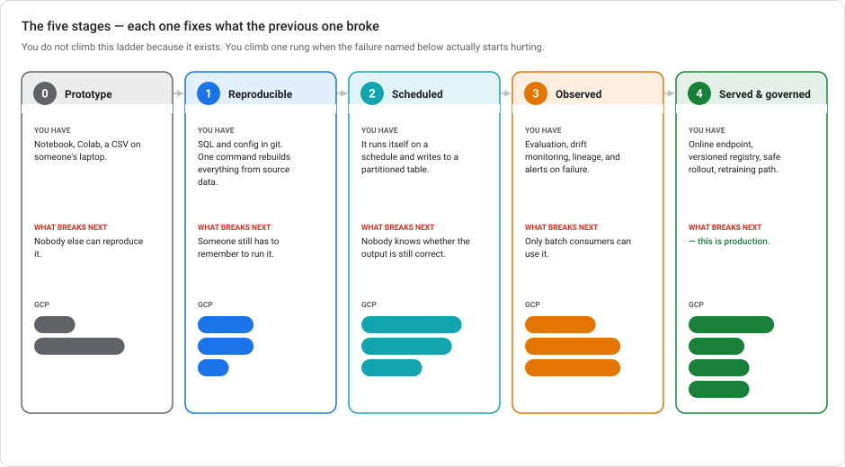
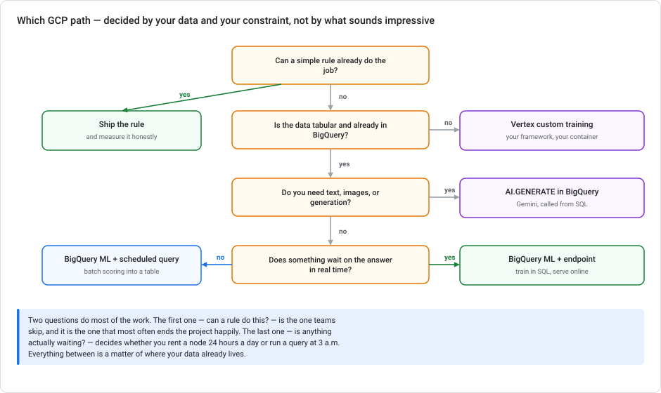
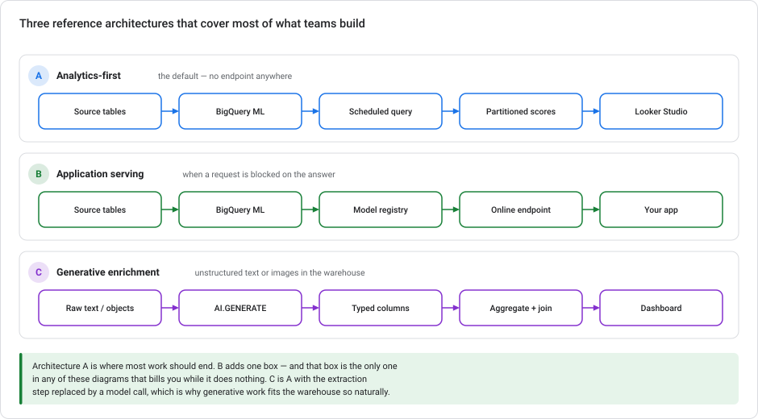

# Scaling prototypes into ML models on Google Cloud

> **Type** Explanation module (concepts, not a hands-on lab)  **Reading time** 30–40 minutes
> **Companion labs** [Lab 1 — Sentiment with Gemini](../labs/lab-01-sentiment-analysis-bigquery-gemini.md) · [Lab 2 — Churn with BigQuery ML](../labs/lab-02-customer-churn-lowcode-bqml.md) · [Lab 3 — Serving](../labs/lab-03-serving-ml-models-lowcode.md)
> **Last updated** 23 August 2026

---

## Who this is for

You have something that works. A notebook that predicts churn. A query that classifies support tickets. A spreadsheet model somebody on the commercial team has been quietly running for a year. It produces a useful answer, and someone has now asked the dangerous question: *can we make this real?*

This module is about the distance between those two states, and about the Google Cloud services that close it. It is deliberately not a tutorial. The three companion labs are the tutorials. This is the map you want *before* you start building, because most expensive mistakes in production ML are architecture decisions made early and discovered late.

---

## 1. What "scaling" means

The word does a lot of unhelpful work. When someone says a prototype needs to scale, they usually mean one of five different things. Each one needs a different response:

| They say | They mean | What it actually costs you |
|---|---|---|
| "It needs to handle more data" | **Volume** — 10k rows became 100M | Usually the easiest. Move the compute to the data. |
| "Other people need to run it" | **Reproducibility** — it only works on one laptop | Version control and declarative pipelines. Cheap, high payoff. |
| "It has to run every day" | **Automation** — someone is manually triggering it | A scheduler and a failure alert. Cheap. |
| "The app needs to call it" | **Latency** — a user request is blocked on the answer | Expensive. This is the one that adds always-on infrastructure. |
| "We need to trust it" | **Governance** — nobody can say if it's still correct | The slowest and most valuable. Monitoring, evaluation, lineage, versioning. |

**Diagnose before you build.** A team that says "we need to scale" and means *volume* should be moving their pandas code into BigQuery. A team that means *latency* is signing up for an endpoint, a container, autoscaling, and a 24/7 bill. Treating these as the same problem is how six-week projects become six-month ones.

Latency is almost always mis-diagnosed. Read §5 before you accept that you need it.

---

## 2. The five stages

Each stage exists to fix the specific failure the previous stage runs into. You climb a rung when that failure starts hurting — not because the ladder is there.

### Stage 0 — Prototype

A notebook, a Colab, a CSV. **This is a perfectly good place to be**, and a surprising number of valuable models should stay here forever. A quarterly analysis that informs one decision does not need a pipeline.

*You have left Stage 0 when* someone other than the author needs the output on a recurring basis.

### Stage 1 — Reproducible

The logic lives in version control, reads from source-of-truth data, and rebuilds from scratch with one command.

On GCP this usually means moving the transformation logic **into BigQuery as SQL** and putting that SQL in git. This is the highest-leverage step in the whole ladder. (The mechanics, from Workbench to GitHub and making notebooks reviewable, are in [Git and version control for ML work](GIT-FOR-ML-ON-GCP.md).) It is also the step people skip most often, because it seems to produce nothing new: the output is identical. What it produces is the ability to change anything later without fear.

If your transformations have grown dependencies, **Dataform** manages them declaratively inside BigQuery (dependency graph, testing, environments) without introducing a separate orchestration system.

*You have left Stage 1 when* the manual trigger becomes the bottleneck, or somebody forgets to run it.

### Stage 2 — Scheduled

It runs itself and writes to a table with a predictable schema.

- **Scheduled queries** — for anything expressible as SQL. Lowest possible operational surface: no container, no cluster, nothing to patch.
- **Cloud Scheduler + Workflows** — when you need multi-step orchestration with conditionals and retries.
- **Vertex AI Pipelines** — when you need genuine ML pipeline semantics: artifact lineage, step caching, parameterized reruns.

Three things distinguish a real scheduled job from a cron entry. It is **idempotent**, so running it twice does not double-count. (See [Event-driven ML automation](EVENT-DRIVEN-ML-AUTOMATION.md) for why that matters and how to achieve it.) It writes to a **partitioned** table, so history is queryable and old data expires. And it **alerts on failure** rather than failing silently. Lab 3, Task 2 builds exactly this.

*You have left Stage 2 when* you realize nobody would notice if the output silently became wrong.

### Stage 3 — Observed

You can answer "is this still correct?" without manual investigation.

- **Evaluation** — `ML.EVALUATE` re-run on recent data, tracked over time, not just once at training
- **Drift and skew monitoring** — Model Monitoring on serving inputs vs. the training baseline
- **Lineage** — Dataplex/Data Catalog to answer "what feeds this, and what breaks if I change it?"
- **Freshness alerts** — a query that fires when the last partition is older than expected

The unglamorous one matters most: **alert when the job did not run.** Most "the model broke" incidents are really "the pipeline stopped three weeks ago and the dashboard has been showing stale numbers."

*You have left Stage 3 when* a consumer needs a prediction faster than your batch cycle.

### Stage 4 — Served and governed

Online endpoints, a versioned registry, safe rollouts, and a defined retraining path. This is Lab 3.

Notice how late this appears. Most teams start here because it is what "deploying a model" sounds like.

---

## 3. Choosing your GCP path

### The first question is the important one

**Can a simple rule already do the job?**

In Lab 2, "contact every month-to-month customer" catches about 88% of churners with zero infrastructure. A gradient-boosted model has to beat that to justify existing at all, either on precision at comparable recall or on reach at comparable precision. Frequently it does. Frequently it does not, and nobody checked.

Always build the rule first. It costs an afternoon, it is your baseline forever, and it is your fallback when the model pipeline breaks.

### Then: where does your data already live?

| Situation | Path | Why |
|---|---|---|
| Tabular, already in BigQuery | **BigQuery ML** | The data never moves. `CREATE MODEL` is one statement, and the model is a queryable object with the same IAM as your tables. |
| Tabular, elsewhere | Load into BigQuery first | Almost always cheaper than building a pipeline to bring data to a training job. |
| Text, images, generation | **`AI.GENERATE` in BigQuery** (Lab 1) or Model Garden | For enrichment, calling Gemini from SQL avoids building any serving infrastructure at all. |
| Needs a specific framework, custom loss, unusual architecture | **Vertex custom training** | The escape hatch. Real capability, real operational cost. |
| Want maximum automation, tolerate hours and cost | **AutoML** (`AUTOML_CLASSIFIER`) | Note: **online prediction is not supported** for AutoML classifier/regressor — batch only. Choose knowing that. |

### The BigQuery ML bias, stated openly

For tabular problems on data that is already in BigQuery, BigQuery ML is usually the right answer, and this module is opinionated about it. The reason is that the **operational surface is smaller by an order of magnitude**. The models themselves are no better. But there is no training container, no artifact store, no serving infrastructure, and no separate permission model. The model is an object in a dataset, and everything you already know about governing tables applies to it.

You give up exotic architectures, fine-grained training control, and framework portability. For churn, propensity, forecasting, segmentation, and anomaly detection (the large majority of applied enterprise ML) that is a very good trade.

---

## 4. Three reference architectures

**A — Analytics-first.** Source tables → BigQuery ML → scheduled query → partitioned scores → Looker Studio. No endpoint anywhere. This should be your default and it covers most enterprise ML. Everything downstream reads a table.

**B — Application serving.** Adds a registry and an online endpoint between the model and the consumer, for when a user-facing request blocks on the answer. **The endpoint is the only component in any of these diagrams that bills you while doing nothing.** Add it deliberately.

**C — Generative enrichment.** Raw text or objects → `AI.GENERATE` with an `output_schema` → typed columns → aggregate and join → dashboard. Structurally identical to A, with the extraction step replaced by a model call. This is why generative AI fits the warehouse so naturally: it turns unstructured input into columns, and columns are what the rest of your stack already knows how to handle.

A and C compose. Lab 1's sentiment scores and Lab 2's churn scores live in the same warehouse, so "high churn risk **and** writing negative reviews" is a join, not an integration project.

---

## 5. When not to scale

Scaling has costs that rarely appear in the plan. Push back when:

**A rule works.** Covered above, and it is the most common case.

**The prediction isn't acted on.** If no decision changes based on the score, automating its production creates a maintenance burden and nothing else. Find the decision first.

**The data isn't there yet.** A model trained on six weeks of partial logging will be retrained from scratch in three months. Fix instrumentation first; it is a better investment than a model on bad data.

**Nobody owns it.** An automated pipeline with no owner is a future incident with no assignee. Stage 2 without a named owner is worse than Stage 1, because Stage 1 fails loudly.

**You want an endpoint but nothing is waiting.** The trap in §1. If the consumer reads a table or a dashboard, a nightly scheduled query is strictly better: cheaper, simpler, and it cannot page you at 3 a.m.

---

## 6. What each stage costs

Orders of magnitude for a mid-size tabular problem — a few million rows, daily scoring. Verify against [current pricing](https://cloud.google.com/pricing) before budgeting.

| Stage | Infrastructure cost | Engineering time | Ongoing attention |
|---|---|---|---|
| 0 — Prototype | ~free | days | none |
| 1 — Reproducible | ~free (query cost only) | 1–2 weeks | rare |
| 2 — Scheduled | cents to low $ / month | 1 week | when it fails |
| 3 — Observed | low $ / month | 2–3 weeks | weekly review |
| 4 — Served | **$ / day, continuously** | 2–4 weeks | on-call |

The discontinuity between Stage 3 and Stage 4 is the point of this table. Stages 0–3 are essentially free to *keep running*. You pay for compute when compute happens. Stage 4 introduces a node that bills whether or not anyone calls it, plus the operational load of something that can be down.

**Set these cost controls on day one:** partition expiration on scoring tables, `min-replica-count=0` for non-latency-critical endpoints, a billing budget alert, and a calendar reminder to check for endpoints nobody is using. That last one is not a joke. Orphaned endpoints are the most common source of surprise ML spend.

---

## 7. Anti-patterns

**The notebook in production.** A scheduled notebook is a script with hidden state and no tests. If the logic is SQL, run it as SQL. If it isn't, make it a proper pipeline step.

**Training-serving skew.** The model was trained on data preprocessed one way, and production preprocesses it another way. No error is raised. The predictions are quietly wrong. **The fix is structural:** BigQuery ML's `TRANSFORM` clause bakes preprocessing into the model, so training and serving cannot diverge. Use it.

**Accuracy as the headline metric.** On a 26.5% positive class, predicting "no" for everything scores 73.5%. Always state the class balance next to any accuracy figure, and lead with the metric that reflects the decision — recall when misses are expensive, precision when false alarms are.

**Threshold 0.5 because it's the default.** 0.5 encodes the assumption that false positives and false negatives cost the same. They almost never do. Derive the threshold from expected value (Lab 2, Task 9). It is usually not 0.5. The exercise also often reveals that the whole programme is uneconomic, which you need to know.

**Dashboards on live model calls.** A report backed by a live `AI.GENERATE` query re-invokes the model on every refresh, so your bill scales with your dashboard's popularity. Materialize once, point the dashboard at the table.

**Retraining on a calendar.** "Retrain monthly" is a guess. Retrain when monitoring says the inputs moved or evaluation says performance dropped. Otherwise you are spending money to replace a working model with a differently-working one.

**No rollback path.** If your deploy is `CREATE OR REPLACE MODEL` with no versioning, you cannot go back after a bad retrain. Register versions; keep the previous one deployable.

---

## 7a. API version note — a Stage-4 governance question

Preview dependencies are a **stage-dependent** risk. This is why they belong in this module's ladder rather than in a footnote.

| Stage | Preview dependency is… |
|---|---|
| 0–1 Prototype / Reproducible | **Fine.** Preview exists to be tried. |
| 2 Scheduled | Acceptable, if written down. |
| 3 Observed | Needs a named owner who knows it's preview. |
| 4 Served & governed | **A liability.** No SLA, no support, no notice period. |

**Concretely:** the same `v1beta1` call that is a sensible shortcut at Stage 1 becomes an unmanaged risk at Stage 4, because a preview surface can change shape with no deprecation window while you have an availability commitment.

The concrete case in this series is **scale-to-zero** (see [autoscaling](VERTEX-AUTOSCALING.md)): useful, `v1beta1`-only, and exactly the kind of thing to adopt knowingly rather than inherit from a sample.

See [API versions and launch stages](GCP-API-VERSIONS-AND-LAUNCH-STAGES.md).

---

## 8. A readiness checklist

Before you call something production:

**Data**
- [ ] Source data is a defined table, not an export someone makes
- [ ] Schema changes upstream will fail loudly, not silently produce nulls
- [ ] You know what happens when a day's data is late or missing

**Model**
- [ ] A baseline exists and the model beats it on the metric that matters
- [ ] Class balance is documented next to every reported metric
- [ ] The decision threshold was derived, not defaulted
- [ ] Preprocessing lives inside the model (`TRANSFORM`) or is provably shared

**Pipeline**
- [ ] Idempotent — running twice produces the same result
- [ ] Writes to a partitioned table with an expiration
- [ ] Alerts a named human on failure
- [ ] Alerts when it *doesn't run at all*

**Serving**
- [ ] The pattern matches how the consumer reads the prediction
- [ ] If there's an endpoint, someone can state why batch was insufficient
- [ ] Replica counts and machine type were chosen, not accepted
- [ ] A rollback is one command

**Governance**
- [ ] Model versions are registered and previous versions are deployable
- [ ] Drift monitoring is on, with a threshold set from a healthy period
- [ ] A named owner exists
- [ ] There is a written answer to "when do we retrain?"

---

## 9. Where the labs fit

| Module | Stage covered | What you build |
|---|---|---|
| [Lab 1 — Sentiment with Gemini](../labs/lab-01-sentiment-analysis-bigquery-gemini.md) | 1 → 2 | Architecture C: unstructured text becomes typed columns, validated against a ground-truth signal |
| [Lab 2 — Churn with BigQuery ML](../labs/lab-02-customer-churn-lowcode-bqml.md) | 1 → 3 | Architecture A: baseline, training, evaluation, explanation, and a threshold chosen from expected value |
| [Lab 3 — Serving](../labs/lab-03-serving-ml-models-lowcode.md) | 2 → 4 | All three architectures, and the judgement to pick between them |

Done in order, they walk the ladder end to end. Done separately, each stands alone.

---

## 10. A note on the 2026 platform

Two changes to carry into any architecture discussion this year:

**Vertex AI is now the Gemini Enterprise Agent Platform.** Announced 22 April 2026; the Vertex AI entry left the console navigation on 21 May 2026. Model Registry moved to **Govern → Registry**, Endpoints became **Scale → Deployments**. The API surface (`aiplatform.googleapis.com`), the IAM role IDs (`roles/aiplatform.user`), the `gcloud ai` commands, and all BigQuery ML SQL are **unchanged** — including the option value `MODEL_REGISTRY = 'VERTEX_AI'`. If a tutorial's SQL works but its screenshots don't match, this is why.

**The centre of gravity moved toward the warehouse.** The `AI.*` scalar functions reaching GA means a large class of ML work (classification, extraction, summarization, embedding) no longer requires any serving infrastructure at all. It is a `SELECT`. When scoping new work, ask whether the whole thing can be a query before you design a system.

---

## Further reading

- [BigQuery ML overview](https://docs.cloud.google.com/bigquery/docs/bqml-introduction)
- [Generative AI in BigQuery](https://docs.cloud.google.com/bigquery/docs/generative-ai-overview)
- [MLOps: continuous delivery and automation pipelines in machine learning](https://cloud.google.com/architecture/mlops-continuous-delivery-and-automation-pipelines-in-machine-learning) — the canonical maturity-level paper
- [Monitor feature skew and drift](https://docs.cloud.google.com/vertex-ai/docs/model-monitoring/using-model-monitoring)
- [Dataform for BigQuery](https://docs.cloud.google.com/dataform/docs/overview)
- [Scheduling queries](https://docs.cloud.google.com/bigquery/docs/scheduling-queries)
