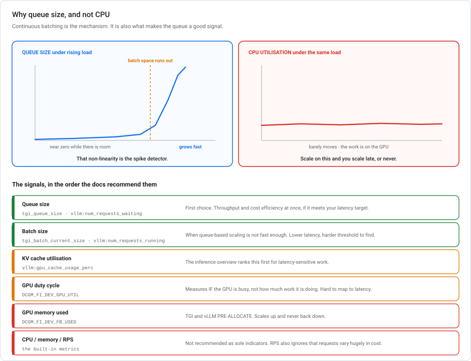
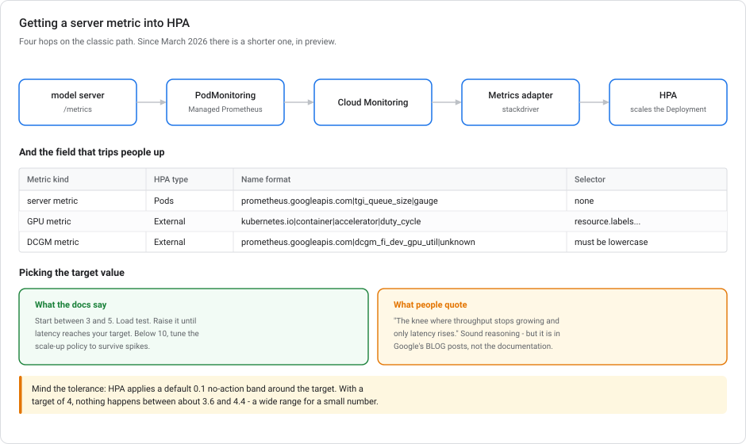

# Serving LLMs on GKE

**When you run the cluster yourself.** One decision matters most: autoscale GPU inference on a metric that reflects real load. CPU utilisation does not.

> **Module, not a lab.** This is the "I need cluster control" branch of the [serving fan-out](../ROADMAP.md). If you don't already run Kubernetes, read [Serving models on Cloud Run](SERVING-MODELS-ON-CLOUD-RUN.md) and [Vertex AI Prediction autoscaling](VERTEX-AUTOSCALING.md) first. They cover the same job with far less to operate.

---

## Autoscaling changes in 2026

| When | Change |
|---|---|
| **6 Mar 2026** | **GKE sources custom metrics natively** — no Stackdriver adapter. New `AutoscalingMetric` CRD (`autoscaling.gke.io/v1beta1`). **Preview**, and the autoscaling docs still describe the adapter path. See §6. |
| **2026** | **GKE Inference Gateway**, now powered by llm-d — an inference-aware load balancer routing on KV cache utilisation, queue length and prefix cache. Complements HPA rather than replacing it. |
| **GKE 1.33+** | The **performance HPA profile** is enabled by default on qualifying clusters, keeping HPA recalculation within 15 seconds at scale. |

---

## 1. Should you be here at all?

| | **Vertex AI endpoint** | **Cloud Run** | **GKE** |
|---|---|---|---|
| You manage | nothing | a container | **a cluster, GPU drivers, networking, scaling** |
| Scales to zero | no | yes | not really |
| GPU support | managed | yes | yours to configure |
| Reach for it when | standard artifact, want it managed | custom serving logic, spiky traffic | **you already run Kubernetes**, or need control nothing else gives |

**GKE is the most operational surface of the three. That is the trade-off.** For a Model Garden LLM that needs GPUs and protocol flexibility, a Vertex **dedicated public endpoint** gives you managed GPUs, gRPC, and isolation with no cluster at all (see [Private networking §5](GCP-PRIVATE-NETWORKING-FOR-ML.md#5-the-four-kinds-of-vertex-ai-endpoint)). Choosing GKE to avoid a managed service is choosing to own GPU drivers, node pools, and an autoscaler.

Choose it when you already have a Kubernetes platform, need to co-locate inference with other workloads, want a specific serving stack the managed options don't offer, or need multi-cluster/multi-cloud portability.

---

## 2. The model server matters more than the cluster

You don't serve an LLM with a Flask app. The serving stack is a **model server** doing continuous batching:

| Server | Notes |
|---|---|
| **vLLM** | The common default. PagedAttention, continuous batching, OpenAI-compatible API. |
| **TGI** (Text Generation Inference) | Hugging Face's server. Continuous batching. |
| **NVIDIA Triton / TensorRT-LLM** | Highest performance on NVIDIA hardware, most configuration. |

**The rest of this module depends on continuous batching.** Rather than waiting to assemble a fixed batch, the server admits new requests into the running batch as slots free up. So while there is batch space, the queue stays near zero whatever the load. The moment batch space runs out, the queue grows. That non-linearity is what makes queue size a good autoscaling signal.

---

## 3. The trouble with CPU utilisation as a metric

HPA works out of the box on CPU and memory. This is why people reach for it. Google's guidance is direct:

> *"For inference workloads running on GPUs, we don't recommend CPU and memory utilization as the only indicators of the amount of resources a job consumes because inferencing workloads primarily rely on GPU resources. Therefore, using CPU metrics alone for autoscaling can lead to suboptimal performance and costs."*

A GPU-saturated pod can sit at modest CPU while requests pile up. Scale on CPU and you scale late, or not at all.

**System memory is worse.** Inference servers consume **GPU** memory, and vLLM and TGI **pre-allocate** it. The host's memory footprint barely moves with load.

**Requests per second is tempting and also wrong.** Inference requests are not interchangeable units of work — a 50-token completion and a 4,000-token one cost wildly different amounts. RPS says how many arrived, not how much work that is.

---

## 4. The metrics that do work



### Queue size — the default recommendation

**The number of requests awaiting processing in the server queue.** Google's reasoning:

> *"vLLM and TGI use continuous batching, which maximizes concurrent requests and keeps the queue low when batch space is available. The queue grows noticeably when batch space is limited, so use the growth point as a signal to initiate scale-up."*

> *"Queue size directly correlates to request latency… Queue size is a sensitive indicator of load spikes, as increased load quickly fills the queue."*

Recommended *"when optimizing throughput and cost, and when your latency targets are achievable with the maximum throughput of your model server's max batch size."*

**Its limitation, stated plainly:** *"Queue size doesn't directly control concurrent requests, so its threshold can't guarantee lower latency than the max batch size allows."* The workaround is reducing max batch size, or scaling on batch size instead.

### Batch size — when queue-based scaling isn't fast enough

**The number of requests undergoing inference.** Recommended *"if you have latency-sensitive workloads where queue-based scaling isn't fast enough to meet your requirements."*

It reaches lower latency targets than queue size can, at the cost of a harder threshold to find: *"Varying request sizes and hardware constraints make finding the right batch size threshold challenging."*

### GPU metrics — useful, with real caveats

| Metric | What it is | The catch |
|---|---|---|
| `DCGM_FI_DEV_GPU_UTIL` | Duty cycle — how much of the time the GPU is active | *"Does not measure how much work is being done while the GPU is active"*, so it's hard to map to latency or throughput targets |
| `DCGM_FI_DEV_FB_USED` | GPU memory in use | For servers that **pre-allocate** memory — TGI and vLLM — *"this metric only works for scaling up, and won't scale down when traffic decreases"* |

That second caveat matters. An autoscaler that never scales down is a cost problem, not a scaling solution.

### The ordering

> *"If queue size already meets your latency targets, prioritize it for autoscaling. This maximizes both throughput and cost efficiency."*

Queue size first. Move to batch size only if queue-based scaling can't hit your latency target.

> **GKE's inference *overview* page ranks these slightly differently**, recommending **KV cache utilisation** first for latency-sensitive work (*"this metric is often the best indicator of impending latency spikes"*), then running requests, with queue size for throughput-sensitive work. The two pages do not contradict each other. They weight latency and throughput differently. If you are latency-bound, look at KV cache.

---

## 4a. Keeping non-GPU pods off your GPU nodes

Autoscaling on the right metric is wasted if the nodes can't drain. A GPU node has a lot of CPU and memory alongside the accelerator, so ordinary workloads land on it happily, and then **pin an expensive node that no longer has any GPU work to do.**

A **taint** prevents this, and on GKE it is mostly automatic.

### The taint

GKE applies:

| Key | Value | Effect |
|---|---|---|
| `nvidia.com/gpu` | `present` | `NoSchedule` |

A taint **repels**: a pod that doesn't tolerate it will not be scheduled there.

### The toleration, which you don't write

You might expect every GPU pod to need a matching `tolerations:` block. It doesn't:

> *"GKE automatically applies a toleration so only Pods requesting GPUs are scheduled on GPU nodes. This enables more efficient autoscaling as your GPU nodes can quickly scale down if there are not enough Pods requesting GPUs. To do this GKE runs the `ExtendedResourceToleration` admission controller."*

`ExtendedResourceToleration` is a **mutating admission controller**. Any pod requesting an extended resource (`nvidia.com/gpu` in `resources.limits`) gets the matching toleration injected automatically. So this manifest is complete:

```yaml
spec:
  containers:
  - name: inference-server
    resources:
      limits:
        nvidia.com/gpu: 2
  nodeSelector:
    cloud.google.com/gke-accelerator: nvidia-tesla-t4
```

No toleration written, and it schedules. The injected toleration matches on `operator: Exists`. This is why the taint's `present` value never has to appear anywhere.

> **It is disabled by default in vanilla Kubernetes.** GKE turns it on. This is why a manifest that works on GKE can fail on a self-managed cluster, with a pending pod and no obvious reason. The taint is there, and the toleration was never injected.

### Two traps in when the taint is applied

**It is conditional.** *"GKE only adds this taint if there is at least one non-GPU node pool in the cluster."* A cluster whose node pools are all GPU pools gets **no taint at all** — which is fine right up until you add a CPU pool.

**And it is not retroactive.** *"When you add a non-GPU node pool to the cluster in the future, GKE does not retroactively apply this taint to existing GPU nodes."* So a cluster that grew from GPU-only into mixed is where non-GPU pods start landing on GPU nodes, and nothing warns you. Add the taint manually there.

### Taints repel, selectors attract

The two are different jobs and you generally want both:

| Mechanism | Direction | Does |
|---|---|---|
| **Taint** on the node | repels | Keeps everything *else* off the GPU node |
| **`nodeSelector` / node affinity** on the pod | attracts | Puts *your* pod on the right node |

Google's guidance is explicit that they compose: *"Using node affinity in addition to node taints isn't mandatory, but we recommend it because you benefit from greater control over scheduling."*

The labels GKE puts on GPU nodes for you to select on:

| Label | Holds |
|---|---|
| `cloud.google.com/gke-accelerator` | The GPU type — `nvidia-tesla-t4`, `nvidia-a100-80gb`, `nvidia-h100-80gb` |
| `cloud.google.com/gke-accelerator-count` | How many are attached |
| `cloud.google.com/gke-gpu-driver-version` | `default` or `latest` |
| `cloud.google.com/gke-gpu-sharing-strategy` | `time-sharing`, `mps` |
| `cloud.google.com/gke-gpu-partition-size` | MIG partition, e.g. `1g.5gb` |

### The weaker alternatives

| Approach | Problem |
|---|---|
| **Node anti-affinity on every non-GPU workload** | You now edit every workload in the cluster, forever, and one team's new Deployment that forgets it silently reintroduces the problem. A taint defaults correctly instead. |
| **A custom taint plus hand-written tolerations** | Reimplements what already works, and any custom taint must *also* be tolerated by the GPU device-plugin and driver-installer DaemonSets — miss that and GPUs never register on the node at all. Note also that `gcloud container node-pools update --node-taints` *"overwrites any previous user-specified values"*, so a careless update drops the taint entirely. |
| **A PodDisruptionBudget** | Different axis. PDBs govern **voluntary disruption** — how many pods may be evicted at once during maintenance or scale-down. They have no influence on *where* a pod is scheduled. (A PDB can *block* scale-down, and that matters later, but it cannot stop a CPU pod landing on a GPU node.) |

> **Autopilot goes further.** It adds the taints *and* the tolerations, and places *"exactly one GPU Pod on each GPU node"*, plus GKE-managed workloads and any DaemonSet you configure to tolerate all taints. Less to think about, less control.

---

## 4b. Sharing one GPU between workloads

A GPU is the most expensive thing in the cluster, and inference workloads routinely need a fraction of one. Three strategies let several containers share a physical GPU. They differ on one main axis: **what kind of isolation you get.**

| | **Multi-instance GPU (MIG)** | **Time-sharing** | **NVIDIA MPS** |
|---|---|---|---|
| Mechanism | The GPU is **physically partitioned** into slices | Rapid **context switching** between processes | Concurrent CUDA processes via the **MPS daemon** |
| Runs | in parallel, on dedicated silicon | one at a time, interleaved | in parallel, sharing the GPU |
| Isolation | **hardware** — dedicated compute *and* memory | **software** — address space, performance, error | **limited** — thread % and pinned memory caps |
| Memory limits | enforced by hardware | **not enforced** | enforced |
| Max containers | **7** per GPU | 48 | 48 |
| Best for | **parallel inference needing QoS** | bursty, interactive, prototyping | batch, cooperative jobs, max throughput |

### MIG — when latency must be predictable

> *"Multi-instance GPU provides hardware isolation between the workloads, plus consistent and predictable Quality of Service (QoS) for all containers running on the GPU."*

> *"A container in a partition has a predictable throughput and latency even when other containers saturate other partitions."*

That second sentence is the main argument for latency-sensitive serving. The slices are real hardware divisions, with dedicated compute units and dedicated memory, so a noisy neighbour saturating its partition cannot reach into yours.

Partitions are named `[compute]g.[memory]gb`, and the supported sets are per-GPU-model:

| GPU | Partition sizes → instances |
|---|---|
| **A100 40GB** | `1g.5gb`→7 · `2g.10gb`→3 · `3g.20gb`→2 · `7g.40gb`→1 |
| **A100 80GB** | `1g.10gb`→7 · `2g.20gb`→3 · `3g.40gb`→2 · `7g.80gb`→1 |
| **H100 80GB** | `1g.10gb`→7 · `1g.20gb`→4 · `2g.20gb`→3 · `3g.40gb`→2 · `7g.80gb`→1 |
| **H200 141GB** | `1g.18gb`→7 · `1g.35gb`→4 · `2g.35gb`→3 · `3g.71gb`→2 · `7g.141gb`→1 |

```bash
gcloud container node-pools create mig-pool --cluster=CLUSTER \
  --accelerator=type=nvidia-tesla-a100,count=1,gpu-partition-size=1g.5gb \
  --machine-type=a2-highgpu-1g
```

**MIG needs supporting hardware**, and the list has grown well past the A100 it launched on — A100 40/80GB, H100 80GB, H200 141GB, B200 180GB, GB200, RTX PRO 6000. Older write-ups still say "A100 and H100 only". Check the current list rather than a blog.

> **A pod can consume at most one MIG instance.** Slices are not poolable — you cannot request two `1g.5gb` partitions and get a `2g.10gb` worth of GPU.

### Time-sharing — utilisation without partitioning

Time-sharing uses the GPU's own instruction-level preemption (Pascal and later) to interleave processes. Google is careful about what it does and doesn't provide:

> *"software-level isolation between the workloads in terms of address space isolation, performance isolation, and error isolation"*

> *"Time-sharing provides no memory limit enforcement between shared Jobs and the rapid context switching for shared access may introduce overhead."*

**Read those two together, because this is easy to over- or under-sell.** There *is* isolation: one container cannot read another's memory or crash it. But there is no **memory limit**. Any container can allocate until the GPU is full, and the one that hits OOM may not be the greedy one. The context switching also costs latency. This is why the guidance steers it toward *"bursty and interactive workloads, or for testing and prototyping."*

Its advantage is that it works on **every NVIDIA GPU model**, with no partitioning to plan.

### MPS — concurrency without context switching

MPS runs CUDA kernels from multiple processes concurrently rather than interleaving them, which removes the context-switch overhead. GKE enforces per-client limits by setting `CUDA_MPS_ACTIVE_THREAD_PERCENTAGE` and `CUDA_MPS_PINNED_DEVICE_MEM_LIMIT` to `1/N` of the GPU.

But it has *"limited resource isolation"* — those two caps are the only ones, and *"other resources like memory bandwidth, encoders or decoders are not captured."* So compute is shared and performance is coupled. Good for cooperative batch work, wrong for a service with a latency SLO.

### Configuring, and the labels

| Label | Value |
|---|---|
| `cloud.google.com/gke-gpu-partition-size` | the MIG partition, e.g. `1g.5gb` |
| `cloud.google.com/gke-gpu-sharing-strategy` | `time-sharing` or `mps` |
| `cloud.google.com/gke-max-shared-clients-per-gpu` | clients per GPU, as a **quoted string** |

```bash
--gpu-sharing-strategy=mps --max-shared-clients-per-gpu=4
```

> **They compose, and Google recommends it:** *"To maximize your GPU utilization, combine GPU sharing strategies. For each multi-instance GPU partition, use either time-sharing or NVIDIA MPS."* Hardware-isolate the tenants that need QoS, then time-share or MPS *within* a partition among workloads that don't.

### And the option that isn't sharing

Requesting a **whole GPU per workload** does give perfect isolation. But if the workload needs a fraction of one, you pay for the rest to sit idle. The cluster autoscaler can remove the node when nothing is scheduled. It cannot reclaim the 80% of a GPU that a running pod is not using. That is the cost the sharing strategies exist to address.

---

## 5. The actual metric names

**This is where guessing costs you an afternoon**, because the best-practices page names no server metrics at all — only the two DCGM ones. The concrete names live on the how-to pages.

| Server | Queue | Batch / running | Cache |
|---|---|---|---|
| **TGI** | `tgi_queue_size` | `tgi_batch_current_size` | — |
| **vLLM** | `vllm:num_requests_waiting` | `vllm:num_requests_running` | `vllm:gpu_cache_usage_perc` |

`tgi_queue_size` *"represents the number of requests in the queue"*. vLLM metrics follow the `vllm:metric_name` format, colon included — which becomes a problem in §6.

> **A live documentation bug to know about:** the GKE how-to page's prose says *"This example uses the `tgi_batch_size` TGI server metric"* while the YAML immediately below it uses **`tgi_batch_current_size`**. **Trust the YAML.**

> **Triton and TensorRT-LLM:** Google's docs name Triton in passing but publish **no** metric names for it. NVIDIA documents its own (`nv_inference_pending_request_count` and similar), but they aren't Google-recommended and I'd verify against your Triton version rather than a table.

---

## 6. Getting the metric to HPA



The classic path is four hops:

```
model server /metrics  →  PodMonitoring (Managed Service for Prometheus)
                       →  Cloud Monitoring
                       →  Custom Metrics Stackdriver Adapter
                       →  HPA
```

### The role of each piece in that chain

Four products with confusing names, each doing one job.

**Prometheus** is the open-source de-facto standard for metrics in Kubernetes. Its model is **pull-based**: your application exposes a `/metrics` HTTP endpoint in a simple text format, and a Prometheus server scrapes it on an interval. vLLM, TGI and Triton all speak it natively. That is why `tgi_queue_size` exists without you writing anything.

**Google Cloud Managed Service for Prometheus (GMP)** is Google running that for you. Same scrape model, same query language (PromQL), same metric format — but no Prometheus server to size, shard, or lose data from. It stores metrics in **Monarch**, the same backend Cloud Monitoring uses, and that makes the next step possible. It is **enabled by default** on new GKE clusters.

- You declare *what* to scrape with a **`PodMonitoring`** resource (namespace-scoped) or **`ClusterPodMonitoring`** (cluster-wide). That's the CRD in the manifest above.
- Metrics arrive in Cloud Monitoring prefixed **`prometheus.googleapis.com/`**. This is why the HPA metric name looks like `prometheus.googleapis.com|tgi_queue_size|gauge`. The pipe-delimited form is how Kubernetes' metrics API spells a Monitoring metric type.

**The Custom Metrics Stackdriver Adapter** is the translator. Kubernetes' HPA cannot read Cloud Monitoring. It only knows two APIs: `custom.metrics.k8s.io` and `external.metrics.k8s.io`. The adapter implements those APIs and answers by querying Cloud Monitoring underneath. It is a deployment you install into the cluster, and nothing works without it on the classic path.

**Cloud Monitoring** is the metrics and alerting product itself — dashboards, alerting policies, and the **notification channels** (email, Slack, PagerDuty, Pub/Sub) that other services reference. The same channels [Model Monitoring](VERTEX-MODEL-MONITORING.md) uses.

> **Put together:** the server exposes a metric, **GMP** scrapes it into **Cloud Monitoring**, the **adapter** exposes it back to Kubernetes as a custom metric, and **HPA** scales on it.

> **The chain exists** because Kubernetes and Google Cloud have separate metric systems. HPA natively reads only CPU and memory from the metrics server. That is the limitation this whole module is about, since neither tells you anything useful about a GPU.

**Where DCGM fits.** `DCGM_FI_DEV_GPU_UTIL` and friends come from NVIDIA's **Data Center GPU Manager**, exported into the same Prometheus pipeline by an exporter DaemonSet. Different source, same road: DCGM exporter → GMP → Cloud Monitoring → adapter → HPA. GKE also publishes its own GPU metrics under `kubernetes.io/container/accelerator/…` without DCGM. This is why you will see both spellings.

**1. Scrape the server.** Managed Service for Prometheus is enabled by default; you declare what to scrape:

```yaml
apiVersion: monitoring.googleapis.com/v1
kind: PodMonitoring
metadata:
  name: gemma-pod-monitoring
spec:
  selector:
    matchLabels:
      app: gemma-server
  endpoints:
  - port: 8000
    interval: 15s
```

**2. Install the adapter**, which exposes Cloud Monitoring metrics through Kubernetes' custom-metrics API:

```bash
kubectl apply -f https://raw.githubusercontent.com/GoogleCloudPlatform/k8s-stackdriver/master/custom-metrics-stackdriver-adapter/deploy/production/adapter_new_resource_model.yaml
```

**3. Point HPA at it:**

```yaml
apiVersion: autoscaling/v2
kind: HorizontalPodAutoscaler
metadata:
  name: gemma-server
spec:
  scaleTargetRef:
    apiVersion: apps/v1
    kind: Deployment
    name: tgi-gemma-deployment
  minReplicas: 1
  maxReplicas: 5
  metrics:
  - type: Pods
    pods:
      metric:
        name: prometheus.googleapis.com|tgi_queue_size|gauge
      target:
        type: AverageValue
        averageValue: 4
```

**Server metrics use `type: Pods`. GPU metrics use `type: External` with a selector** — that distinction is easy to get wrong:

```yaml
  - type: External
    external:
      metric:
        name: kubernetes.io|container|accelerator|duty_cycle
        selector:
          matchLabels:
            resource.labels.container_name: inference-server
            resource.labels.namespace_name: default
      target:
        type: AverageValue
        averageValue: 60
```

> **External metric names must be lowercase.** HPA doesn't work with uppercase external metric names, so `DCGM_FI_DEV_GPU_UTIL` becomes `prometheus.googleapis.com|dcgm_fi_dev_gpu_util|unknown`, lowercased via `metricRelabeling`.

### The 2026 shortcut: native custom metrics

Since March 2026, GKE can read custom metrics **directly from pods** — no adapter. You declare an `AutoscalingMetric` and HPA references `autoscaling.gke.io|NAME|METRIC` with `type: Pods`.

It also solves the vLLM colon problem: a `prometheusMetricName` field maps `vllm:gpu_cache_usage_perc` onto an autoscaler-legal name (lowercase, hyphens, ≤63 characters).

**Preview**, and it wants GKE **1.35.1-gke.1396000+** on the Rapid channel with the HPA performance profile enabled. Gauge metrics only, Prometheus format, **20 unique metrics per cluster** maximum. The autoscaling docs have not been rewritten for it, so you'll find the adapter path everywhere and this in a blog post.

---

## 7. Choosing the target value

Google's own guidance is plainer than the theory suggests:

> **Queue size:** *"start with a value between 3-5 and gradually increase it until requests reach the preferred latency. Use the `locust-load-inference` tool for testing. For thresholds under 10, fine-tune HPA scale-up settings to handle traffic spikes."*

> **Batch size:** *"experimentally increase the load on your server and observe where the batch size peaks… Once you've identified the max batch size, set the initial target value slightly beneath this maximum and decrease it until the preferred latency is achieved."*

> **A note on a common framing.** You'll often see the target described as "the point where throughput stops growing and only latency increases" — the saturation knee. That reasoning is sound and it appears in Google's **blog posts** (with the `profile-generator` tool), but it is **not** what the documentation says. The docs say: start at 3–5, load test, increase until latency degrades. Same destination, but know which source you are quoting.

**Mind the tolerance.** HPA applies a default **0.1 no-action band** around the target to dampen oscillation. With a target of 4, nothing happens between roughly 3.6 and 4.4 — which is a large fraction of a small target.

---

## 8. Scaling is slower than you think

HPA deciding to add a pod is the fast part. What follows is not:

1. **Node provisioning**, if no GPU node is free — minutes.
2. **Image pull.** LLM serving images are large. *Image streaming* lets containers *"start before the entire image has been downloaded."*
3. **Model loading.** Tens of gigabytes of weights from Cloud Storage into GPU memory. This usually dominates.

This is why the mitigations are mostly about loading, not scaling: **Run:ai Model Streamer** (vLLM ≥ 0.10.2, streaming from GCS), **Cloud Storage FUSE** with hierarchical namespaces and parallel downloads, **Managed Lustre**, **Rapid Cache** zonal read caches, Local SSD, and GKE Data Cache. **Fast-starting nodes** cut node startup where the cluster qualifies, and GKE enables them automatically.

**Tune HPA's behaviour too.** Defaults are *"5 minutes for scale-down (avoiding premature downscaling) and 0 for scale-up (ensuring responsiveness)"*, with `Pods` (absolute) or `Percent` policies to cap the rate of change.

> **Always set `minReplicas` above zero.** Scaling from zero means a user waits through node provisioning *plus* model loading. Also note HPA **won't scale down if any monitored metric is unavailable** — a broken scrape silently pins you at your current replica count.

For capacity itself: reservations, future reservations in calendar mode, Spot VMs, or Dynamic Workload Scheduler.

---

## 8a. The other autoscaler — nodes, not pods

Everything above is the **Horizontal Pod Autoscaler**: it adds *pods*. When there is nowhere to put them, a second, independent system adds *nodes* — the **cluster autoscaler**. They are different layers and both have to work.

| | **HPA** | **Cluster autoscaler** |
|---|---|---|
| Adds | pods | nodes |
| Reacts to | a metric (queue size, batch size) | **unschedulable pods** |
| Timescale | seconds | minutes |
| Configured on | the workload | the node pool |

HPA creating five pods that stay `Pending` is not an HPA problem. That's the cluster autoscaler's turn, and it's where the real latency lives.

### Profiles

The cluster autoscaler has two, and they trade latency against cost:

| Profile | What it does |
|---|---|
| **`balanced`** | *"Prioritizes keeping more resources readily available for incoming pods and thus reducing the time needed for having them active."* **The default for Standard clusters.** Not available on Autopilot. |
| **`optimize-utilization`** | *"Prioritize optimizing utilization over keeping spare resources in the cluster. When you enable this profile, the cluster autoscaler scales down the cluster more aggressively."* |

```bash
gcloud container clusters update CLUSTER_NAME \
  --autoscaling-profile optimize-utilization
```

**For a latency-sensitive serving workload, `balanced` is the right profile, and it's already the default.** The instinct to switch to `optimize-utilization` for cost is the trap: removing underutilised nodes aggressively means the next traffic spike waits for a node to be provisioned *and* GPU drivers to install *and* the image to pull *and* the model to load (§8). You save money between spikes and pay for it during them. For a service whose requirement is low latency, that is backwards.

`optimize-utilization` earns its place on batch and dev clusters, where a few minutes of scheduling delay costs nothing.

> **It changes more than scale-down.** Under `optimize-utilization`, the autoscaler sets the scheduler in the pod spec to `gke.io/optimize-utilization-scheduler` — so it alters *scheduling* behaviour too, and silently does nothing for pods that pin their own scheduler.

### And the alternatives that aren't answers

| Approach | Problem |
|---|---|
| **`minReplicas: 0` / min nodes 0 on the GPU pool** | The cheapest possible idle state and the worst possible cold start: node provisioning, GPU driver init, a large image pull, and loading tens of gigabytes of weights — all in the first user's face. Directly contradicts a low-latency requirement. |
| **Disabling autoscaling and managing node counts by hand** | You now choose permanently between over-provisioning and being caught short, and you've swapped an automated response for a human one. |

### Node-removal blockers

Know these, because "why won't this scale down" is the other half of the complaint. A node is not deleted if it hosts a pod with:

- affinity or anti-affinity rules that prevent rescheduling elsewhere
- **no controller** managing it — no Deployment, StatefulSet, Job or ReplicaSet
- the annotation **`cluster-autoscaler.kubernetes.io/safe-to-evict: "false"`**
- a deletion that would violate a **PodDisruptionBudget**

That last one is the connection back to §4a. PDBs govern *voluntary disruption*, so they can **block** scale-down. They cannot influence where a pod is scheduled in the first place.

> **On GPU cold-start numbers:** you will find confident figures for GPU scale-from-zero (three to five minutes to provision, one to two for drivers, and so on). **Google does not publish them** — neither the cluster-autoscaler page nor the GPU page gives timings. The qualitative point is solid and the numbers are folklore. Measure your own.

---

## 9. Common GPU autoscaling failure modes

**Autoscaling GPU inference on CPU utilisation.** The single most common mistake, and the reason this module exists.

**Assuming the GPU taint is always there.** It's only applied when the cluster already has a non-GPU node pool, and it is never applied retroactively. A cluster that grew from GPU-only into mixed has GPU nodes with no taint.

**Autoscaling on system memory.** Inference servers use GPU memory, and vLLM and TGI pre-allocate it.

**Autoscaling on requests per second.** A 50-token and a 4,000-token completion are not the same unit of work.

**Scaling on `DCGM_FI_DEV_FB_USED` with a pre-allocating server.** It scales up and never down.

**`minReplicas: 0`.** Node provisioning plus model loading, in the user's face.

**Switching the cluster autoscaler to `optimize-utilization` for a latency-sensitive service.** It removes idle nodes faster, so the next spike waits for a node. `balanced` is the default for a reason.

**Choosing GKE to avoid a managed service.** You've traded a configuration decision for GPU drivers, node pools, an autoscaler and a metrics pipeline.

**Copying `tgi_batch_size` from the docs' prose.** The YAML says `tgi_batch_current_size`, and the YAML is right.

---

## 10. Diagnosing autoscaling signals

<details markdown="1">
<summary><b>1.</b> TGI-based LLM service on GKE with NVIDIA GPUs, traffic spikes, minimise latency. What metric do you autoscale on?</summary>

**`tgi_queue_size`, exported through Google Cloud Managed Service for Prometheus**, with the target found by load testing — start at 3–5 and raise it until latency degrades.

Queue size works *because* TGI uses continuous batching: while batch space is available the queue stays near zero, and it grows sharply the moment batch space runs out. That non-linearity is a sensitive spike detector.

CPU and memory are explicitly not recommended as sole indicators for GPU inference, and requests per second ignores that inference requests vary enormously in cost.
</details>

<details markdown="1">
<summary><b>2.</b> When would you scale on batch size instead of queue size?</summary>

When queue-based scaling **isn't fast enough** to hit a latency target. Batch size reaches lower latency thresholds, but the threshold is harder to find because request sizes and hardware constraints vary.

The stated order is: if queue size already meets your latency targets, prefer it — it maximises throughput and cost efficiency at once.
</details>

<details markdown="1">
<summary><b>3.</b> Why is <code>DCGM_FI_DEV_FB_USED</code> a trap with vLLM?</summary>

vLLM pre-allocates GPU memory, so the metric goes up and stays up. It *"only works for scaling up, and won't scale down when traffic decreases"* — you'd scale out on a spike and then hold that capacity indefinitely.
</details>

<details markdown="1">
<summary><b>4.</b> Your HPA is configured correctly and nothing scales. What do you check?</summary>

Three things. **The metrics pipeline**: PodMonitoring scraping the right port, the adapter installed, the metric name matching exactly (including `prometheus.googleapis.com|…|gauge` and lowercase for external metrics). **The tolerance**: HPA's default 0.1 band around a small target covers a wide range. And **metric availability**: HPA will not scale *down* if a monitored metric is unavailable, so a broken scrape pins your replica count.
</details>

---

## Recap: the case for queue size

Keeping non-GPU pods off GPU nodes is a job for a **taint**, not for per-workload affinity. GKE applies `nvidia.com/gpu=present:NoSchedule`, and its **`ExtendedResourceToleration`** admission controller injects the matching toleration into any pod requesting `nvidia.com/gpu`, so you never write one. But the taint is only added when the cluster already has a non-GPU node pool, and never retroactively. GKE is the serving option where **you own the cluster**. It is the right call when you already run Kubernetes, not as a way to avoid a managed service: a Vertex **dedicated public endpoint** gives you managed GPUs and gRPC with none of this. Serving is done by a **continuous-batching model server** (vLLM, TGI, Triton), and that batching behaviour explains how autoscaling works here. **CPU and memory are explicitly not recommended as sole indicators for GPU inference.** System memory barely moves, because GPU memory is pre-allocated. RPS ignores that requests vary hugely in cost. The recommended signal is **queue size** (`tgi_queue_size`, `vllm:num_requests_waiting`), because the queue stays near zero while batch space lasts and grows sharply when it runs out. Move to **batch size** only when queue-based scaling cannot meet a latency target. Metrics reach HPA via **Managed Service for Prometheus plus the custom metrics adapter** (server metrics `type: Pods`, GPU metrics `type: External` with a lowercase name), or via **native custom metrics**, in preview since March 2026. Pick the target by load testing from 3–5 upward, mind HPA's 0.1 tolerance, and remember that the slow part is not the scaling decision. It is node provisioning and loading tens of gigabytes of weights.

---

## GKE autoscaling documentation

- [Best practices for autoscaling LLM inference workloads with GPUs](https://cloud.google.com/kubernetes-engine/docs/best-practices/machine-learning/inference/autoscaling)
- [Configure autoscaling for LLM workloads on GPUs](https://cloud.google.com/kubernetes-engine/docs/how-to/machine-learning/inference/autoscaling)
- [Overview of inference best practices on GKE](https://cloud.google.com/kubernetes-engine/docs/best-practices/machine-learning/inference)
- [About GKE Inference Gateway](https://cloud.google.com/kubernetes-engine/docs/concepts/about-gke-inference-gateway)
- [Managed Service for Prometheus and HPA](https://cloud.google.com/stackdriver/docs/managed-prometheus/hpa)
- Related: [Vertex AI Prediction autoscaling](VERTEX-AUTOSCALING.md) · [Serving models on Cloud Run](SERVING-MODELS-ON-CLOUD-RUN.md) · [Networking for ML serving](GCP-NETWORKING-FOR-ML-SERVING.md) · [GPUs and TPUs, from zero](GPUS-AND-TPUS-FOR-ML.md)
