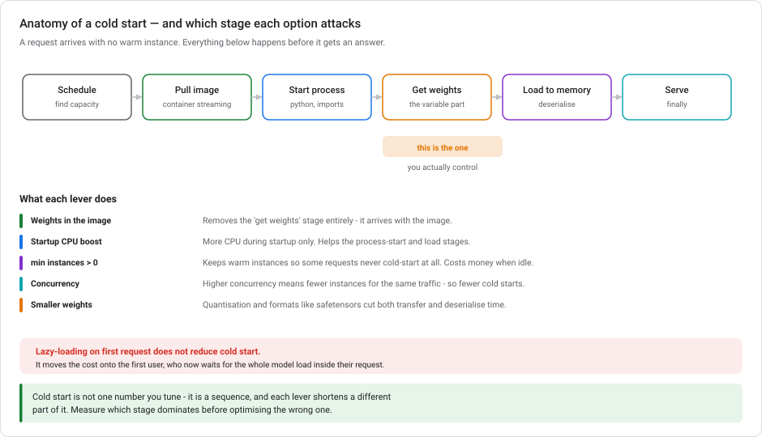
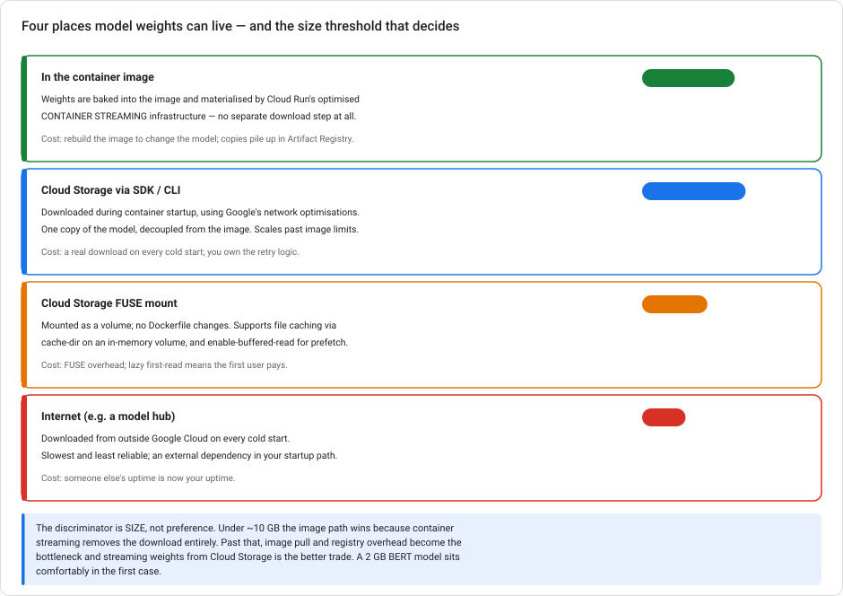

# Serving models on Cloud Run — cold starts and where the weights live

> **Type** Explanation module (theory, no console steps)  **Reading time** 25–35 minutes
> **Related** [Networking for ML serving](GCP-NETWORKING-FOR-ML-SERVING.md) · [Vertex AI autoscaling](VERTEX-AUTOSCALING.md) · [Lab 3 — Serving](../labs/lab-03-serving-ml-models-lowcode.md) · [Where training runs](VERTEX-TRAINING-COMPUTE.md)
> **Last updated** 23 August 2026

---

## Cloud Run as the serving layer

Cloud Run appears elsewhere in this series only as a *backend behind a load balancer*. The [networking module](GCP-NETWORKING-FOR-ML-SERVING.md) explains serverless NEGs and why they have no health checks. This module is about the other side: **Cloud Run as the service that runs your model.**

That surfaces a question the Vertex endpoint path never makes you answer, because Vertex hides it: **where do the model weights live, and when do they arrive?**

For a 2 GB BERT model that needs to scale on traffic spikes, that single decision dominates your cold-start time.

---

## 1. Cloud Run or a Vertex endpoint?

Both serve models over HTTPS and both autoscale. The difference is how much you own.

| | Vertex AI endpoint | Cloud Run |
|---|---|---|
| You supply | A model artifact | A container |
| Scaling metric | CPU / GPU utilization ([see](VERTEX-AUTOSCALING.md)) | Concurrent requests |
| Scale to zero | `v1beta1` only | Standard |
| Model loading | Managed | **Yours to design** |
| Custom pre/post-processing | Awkward | Natural — it's your code |
| Cost when idle | Per node-hour (unless scale-to-zero) | Zero at `min-instances=0` |

**Cloud Run is the better fit when** you have custom serving logic, want scale-to-zero on the GA surface, or your "model" is really a service that happens to include a model — a tokenizer, business rules, several models behind one endpoint.

**A Vertex endpoint is the better fit when** you want the model-loading and scaling problem to be someone else's, and you're serving a standard artifact.

This module assumes you picked Cloud Run.

---

## 2. Anatomy of a cold start

A request arrives with no warm instance. Before it gets an answer:

1. **Schedule** — find capacity
2. **Pull image** — materialised through Cloud Run's container streaming
3. **Start process** — Python starts, imports run (`import torch` is not free)
4. **Get weights** — **the variable part, and the one you control**
5. **Load to memory** — deserialise into the framework
6. **Serve**

Only stage 4 changes based on your design decision, and for a multi-gigabyte model it can dominate everything else.

### The levers

| Lever | What it shortens |
|---|---|
| **Weights in the image** | Removes stage 4 entirely — they arrive with the image |
| **Startup CPU boost** | Extra CPU *during startup only*; helps stages 3 and 5 |
| **`min-instances` > 0** | Some requests never cold-start. Costs money while idle |
| **Higher concurrency** | Fewer instances for the same traffic, so fewer cold starts |
| **Smaller weights** | Quantisation and formats like safetensors cut transfer *and* deserialise time |

> **Cold start is a sequence, not a number.** Each lever shortens a different part. Measure which stage dominates before you optimise the wrong one. A team that quantises a model whose real cost was `import torch` has spent a week for nothing.

---

## 3. Where the weights live

### In the container image

Weights are baked into the image, and Cloud Run's **optimized container streaming infrastructure** materialises it during startup. There is no separate download step. The model arrives as part of the image, and streaming means the container can begin running before every byte has landed.

**Good for models under roughly 10 GB.** For a 2 GB BERT model, this is comfortably the right call: fast, reliable, no external dependency, and nothing to retry.

The costs are real but manageable: you rebuild and redeploy the image to change the model, and copies accumulate in Artifact Registry.

### Cloud Storage via the SDK or CLI

Downloaded during container startup using Google's network optimisations. **This is what Google's current GPU best-practices guidance leads with** — see §4, because it complicates the simple rule.

One copy of the model, decoupled from the image, and no image-size ceiling. In exchange you take a real download on every cold start and own the retry logic.

### Cloud Storage FUSE volume mount

Mounted as a volume, so no Dockerfile changes. Supports **file caching** via a `cache-dir` mount option on an in-memory volume, and **`enable-buffered-read: true`** for asynchronous prefetching.

Useful when several services share one model, or when the model changes independently of the code. The trap is *lazy* loading — see §5.

### Downloading from the internet

From a public model hub, on every cold start. **The slowest and least reliable option**, and it puts an external service's uptime inside your startup path. A hub outage becomes your outage; a hub rate-limit becomes your scaling ceiling.

---

## 4. Where the common advice and the current docs diverge

Be precise here, because this kind of guidance shifts.

The usual reasoning is sound: storing the model in the image lets loading **benefit from Cloud Run's optimized container streaming infrastructure**, which is faster and more reliable than downloading from an external source. For a 2 GB model, that is the right call.

But **Google's current best-practices doc for AI inference on Cloud Run leads with Cloud Storage**, recommending you download models from Cloud Storage via the SDK or CLI as the fastest approach, and describing the container-image route as an alternative for models **under 10 GB**.

So the practical position is:

| Model size | Practical answer |
|---|---|
| **Under ~10 GB** | In-image is a strong choice — container streaming removes the download step. Cloud Storage is also fine. |
| **Over ~10 GB** | Image pull and registry overhead become the bottleneck. Stream from Cloud Storage. |

**The discriminator is size, not preference.** Both routes are legitimate, and the advice you'll usually hear was formed at a size where baking it in works well. Don't carry "always bake it in" to a 40 GB LLM.

> This is also a good illustration of the general point in the [API versions and launch stages](GCP-API-VERSIONS-AND-LAUNCH-STAGES.md) module: guidance moves. Any written advice captures a moment; check the product page before committing an architecture.

---

## 5. Lazy loading is not an optimisation

The most tempting wrong answer in this space: *mount the weights and load them lazily on the first request, to reduce startup time.*

It does reduce *startup* time. It does not reduce *time to first answer*. It moves that cost onto **the first user**, who now waits for the entire model load inside their request. During a traffic spike, when several instances start at once, that is several users each taking a multi-second wait, and possibly a timeout.

Two related traps:

- **A startup probe that waits for a download** is honest but not an optimisation. You have described a slow start accurately, not made it fast.
- **In-memory caching after a hub download** loses the cache when the instance is terminated, and instances are terminated constantly on a scale-to-zero service. You pay the download again, and again.

**Load the model during startup, not during a request.** Cloud Run only routes traffic to an instance once it reports ready, so work done at startup is work the user never waits for.

---

## 6. The other cold-start settings

**`min-instances`** — the direct fix for cold starts, and it costs money. One warm instance billing continuously is the same trade as [Vertex's `minReplicaCount`](VERTEX-AUTOSCALING.md): you're buying latency insurance. For spiky traffic with a latency SLO, usually worth it.

**Startup CPU boost** — extra CPU during the startup phase only. Helps whenever startup is CPU-bound, which model deserialisation often is. Cheap, since you pay for the boost only during startup.

**Concurrency** — Cloud Run scales on *concurrent requests*, not CPU. Raising concurrency means fewer instances for the same traffic, which means fewer cold starts. But an ML container holding a model in memory has a real memory ceiling, and inference is often CPU-bound enough that high concurrency only creates a queue. Tune it against measured latency, not upward on principle.

**Image size** — smaller images materialise faster. Use a slim base, multi-stage builds, and don't ship build tooling into the runtime image. Note the tension with §3: baking in weights makes the image bigger *on purpose*, and that's fine, because streaming handles it better than a download would.

---

## 6a. Every knob is right for something

For *"4 GB model, idle periods, spikes, high latency after idle"*, the answer is **`min-instances`**. It is the only setting that addresses the real cause: there is no instance at all when the spike arrives. Everything else optimises a cold start you could have avoided.

But each of the others is the right choice for a neighbouring problem. Knowing which is more useful than memorising this one case.

### Concurrency = 1

**Wrong here**, because forcing one request per instance means a spike creates *many* instances, each paying its own cold start. You multiply the problem you were trying to solve.

**Right when the container really cannot serve two requests at once.** That happens more than you'd think:

- A framework or library that isn't thread-safe.
- Inference that saturates the CPU on a single request, so a second one only queues — you've added latency without adding throughput.
- **GPU inference**, where a second concurrent request contends for the same device.
- A model whose per-request memory footprint means two in flight would OOM.

You can measure this. If p50 latency rises roughly linearly as you raise concurrency, the instance is not working in parallel, and concurrency 1 describes that honestly.

### More memory (and a longer timeout)

**Wrong here**, because 8 GB doesn't make a 4 GB model load faster. Memory is a *capacity* limit, not a speed dial, and a longer timeout only lets a slow start take longer without failing.

**Right when you're hitting the ceiling rather than the clock:**

- The container is **OOM-killed**, because the model plus a request's working set really exceeds the limit. Note that Cloud Run counts anything you write to the in-memory filesystem against it.
- You need **more CPU**, which on Cloud Run is coupled to memory. Raising the memory tier is how you get more cores, and *that* can speed up a CPU-bound load.
- A **long-running** request (batch-shaped work inside a request) legitimately needs the extended timeout.

So "raise the memory" is right when the symptom is a crash or a CPU-bound startup, and wrong when the symptom is a cold start.

### Startup CPU boost, and downloading weights at startup

This one is a **package of two changes pointing in opposite directions**. That is what makes it awkward.

**Startup CPU boost is almost always right.** Extra CPU during the startup phase only, billed only for that phase. Model deserialisation is usually CPU-bound, so it directly shortens cold starts. Turn it on regardless of what else you do — including alongside `min-instances`, since the warm instance still had to start once and will start again when scaling out.

**Downloading weights from Cloud Storage at startup is the part that backfires** for a small model. It trades a smaller image for a network fetch on every cold start, and Cloud Run's [container streaming](#in-the-container-image) is faster and more reliable than that fetch. For 4 GB, bake them in.

**But it inverts with size.** Past roughly 10 GB, and certainly for an LLM, the image becomes unwieldy to build, push and cache. Cloud Storage or a [FUSE mount](#cloud-storage-fuse-volume-mount) is the documented approach (§4). At that point "download at startup" stops being the wrong answer and becomes the only practical one. This is why §4 exists.

### Matching symptoms to fixes

| Symptom | Reach for |
|---|---|
| Slow first request after idle | **`min-instances`** |
| Slow start, every time, CPU-bound | **startup CPU boost** |
| Container OOM-killed | **more memory** |
| Requests queue behind each other on one instance | **lower concurrency** |
| Too many instances, each cold-starting | **raise concurrency** |
| Model too large to bake into the image | **Cloud Storage or FUSE** (§3) |

**They compose.** The realistic production configuration for this workload is `min-instances=1` **and** startup CPU boost **and** a measured concurrency — not one of them instead of the others.

> **The cost sentence to keep.** `min-instances=1` means Cloud Run no longer scales to zero, so you've given up the property that made it attractive against a [Vertex endpoint](VERTEX-AUTOSCALING.md). That can still be the right call, since one small always-on instance is far cheaper than an always-on GPU node. But make it deliberately rather than discovering it on the bill.

---

## 7. Cold-start decisions that backfire

**Downloading from a public model hub at startup.** Slowest, least reliable, and an external dependency in your critical path.

**Lazy-loading on first request.** Moves the cost onto a user instead of removing it.

**Caching a downloaded model in memory on a scale-to-zero service.** The cache dies with the instance, which is constantly.

**Assuming a small image is always better.** For weights under ~10 GB, a bigger image that streams beats a smaller one that downloads.

**Baking in a 40 GB model.** The threshold is real. Past it, image pull becomes the bottleneck.

**Tuning cold start without measuring it.** Six stages, and the dominant one is often not the one you assumed.

**Using Cloud Run because it's cheaper, when you wanted a Vertex endpoint.** If you don't need custom serving logic, you've taken on the model-loading problem for no reason.

---

## 8. Cold-start troubleshooting cases

<b>1.</b> 2 GB BERT model on Cloud Run, optimising startup for traffic spikes. Where do the weights go?

**In the container image.** At 2 GB you're well under the ~10 GB threshold, so the model is materialised by Cloud Run's optimized container streaming infrastructure: there's no separate download step, no external dependency, and nothing to retry. The cost is rebuilding the image when the model changes, which is manageable for a model that changes rarely.

<b>2.</b> Why not download from a public model hub at startup and cache it in memory?

Two problems. The download adds real latency on every cold start and puts an external service's availability inside your startup path — their outage is your outage. And the in-memory cache dies with the instance, which on a scaling service happens constantly, so you pay the download repeatedly rather than once.

<b>3.</b> Would GCS FUSE with lazy loading on first request reduce cold start?

It reduces *startup* time while making *time to first answer* worse. The first user now waits for the whole model load inside their request, and during a spike that means several users each taking the hit. FUSE also adds overhead versus having the model already present. FUSE is reasonable when several services share a model, or when it changes independently of the code. Lazy-loading it is not an optimisation.

<b>4.</b> Is "bake the model into the image" always the right answer?

No. The discriminator is **size**. Under ~10 GB, container streaming makes the in-image route excellent. Past that, image pull and registry overhead become the bottleneck, and streaming from Cloud Storage is better. Google's current best-practices doc leads with Cloud Storage via the SDK/CLI, describing in-image as the alternative for models under 10 GB. Both are legitimate, and the size decides.

<b>5.</b> Which cold-start stage does startup CPU boost help?

Process start and model deserialisation — the CPU-bound parts. It gives extra CPU *during startup only*, so you pay for it briefly. It does nothing for the download stage, which is network-bound. Where the weights live addresses that one.

<b>6.</b> When would you use a Vertex endpoint instead?

When you want model loading and scaling to be someone else's problem and you're serving a standard artifact. Cloud Run earns its place when you have custom pre/post-processing, several models behind one endpoint, or want scale-to-zero on the GA surface — Vertex's scale-to-zero is `v1beta1`-only. If none of that applies, Cloud Run means owning the model-loading problem for no benefit.

---

## Cold starts, distilled

Serving a model on Cloud Run makes you answer a question Vertex endpoints hide: **where do the weights live, and when do they arrive?** Cold start is a six-stage sequence, and the "get weights" stage is the one your design controls. For models under roughly **10 GB** (a 2 GB BERT included) putting them **in the container image** lets Cloud Run's **container streaming** materialise them with no separate download, no external dependency and nothing to retry. Past ~10 GB, image pull becomes the bottleneck and streaming from **Cloud Storage** is the better trade. That route is also what Google's current best-practices guidance leads with. **Never download from a public hub at startup**, and **never lazy-load on first request**. Lazy loading does not remove the cost. It hands it to a user. Beyond storage, the levers are `min-instances`, startup CPU boost, concurrency and smaller weights, each shortening a different stage.

---

## Cloud Run documentation used here

- [Best practices: AI inference on Cloud Run services with GPUs](https://docs.cloud.google.com/run/docs/configuring/services/gpu-best-practices)
- [Cloud Storage volume mounts](https://cloud.google.com/run/docs/configuring/services/cloud-storage-volume-mounts)
- [General development tips for Cloud Run](https://cloud.google.com/run/docs/tips/general)
- [A guide to AI cold starts on Cloud Run](https://cloud.google.com/blog/topics/developers-practitioners/a-guide-to-ai-cold-starts-on-cloud-run)
- [Cloud Run — instance autoscaling](https://cloud.google.com/run/docs/about-instance-autoscaling)
