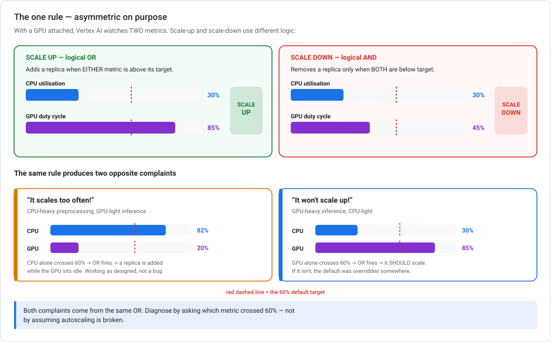
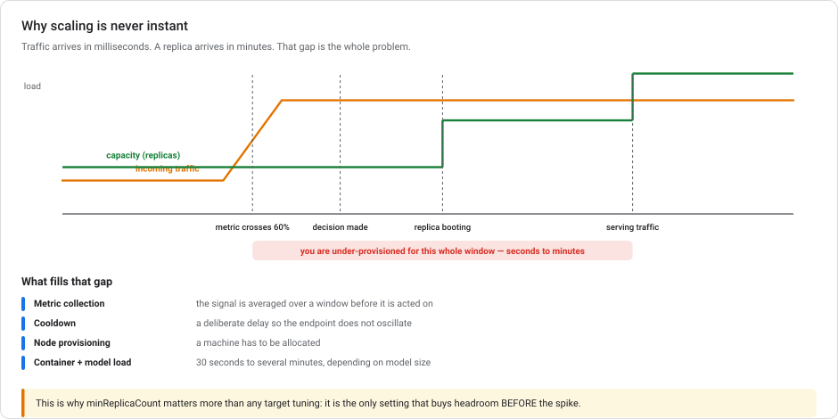
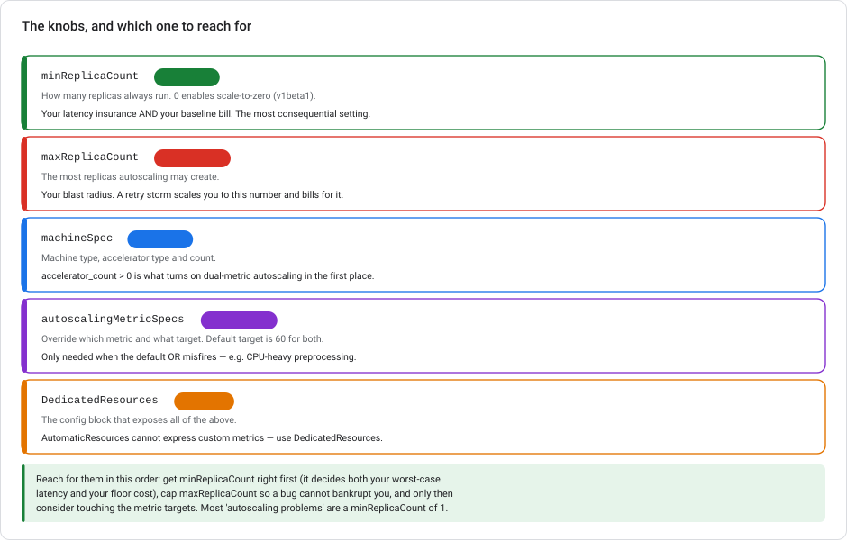

# Vertex AI Prediction autoscaling — from zero

> **Type** Explanation module (theory, no console steps)  **Reading time** 30–40 minutes
> **Assumes** no autoscaling background. If you have run Kubernetes HPA, skim §1.
> **Related** [Lab 3 — Serving](../labs/lab-03-serving-ml-models-lowcode.md) · [Networking for ML serving](GCP-NETWORKING-FOR-ML-SERVING.md) · [Model Monitoring](VERTEX-MODEL-MONITORING.md)
> **Last updated** 23 August 2026

---

## The one rule

Almost everything about Vertex AI autoscaling follows from a single asymmetric rule:

> **With a GPU attached, Vertex AI watches two metrics: CPU utilization and GPU duty cycle.**
> **It scales UP when *either* exceeds its target. It scales DOWN only when *both* are below.**

Default target: **60** for both.



That single OR/AND asymmetry produces two *opposite* complaints. Here are both:

| Symptom | What's happening |
|---|---|
| *"It scales constantly even though the GPU is idle"* | CPU-heavy preprocessing pushes CPU past 60%. The **OR** fires. A replica is added while the GPU sits at 20%. Working as designed. |
| *"GPU is at 85% and it won't scale up"* | The **OR** should already be firing. The default is correct here, so something overrode it. |

Same rule, opposite outcomes. **Diagnose by asking which metric crossed 60%**, not by assuming autoscaling is broken.

---

## 1. What autoscaling is

If this is new: a **replica** is one copy of your model server running on one machine. Autoscaling adds and removes replicas so you have enough to serve traffic without paying for idle ones.

Three numbers define it:

- **`minReplicaCount`** — how many always run. Your floor.
- **`maxReplicaCount`** — the most it may create. Your ceiling.
- **A target utilization** — how busy a replica should be before another is added. Default 60%.

The loop is: measure utilization → compare to target → add or remove a replica → wait → repeat.

> **Why 60% and not 95%?** Because a replica running at 95% has no headroom for a traffic spike, and adding a new one takes minutes (§4). The target does not mean "how busy can it get". It means "how busy before I start preparing for more". Aiming for high utilization is how you get a queue.

---

## 2. The two metrics

| Metric | Full name | Applies when |
|---|---|---|
| **CPU utilization** | `aiplatform.googleapis.com/prediction/online/cpu/utilization` | Always |
| **GPU duty cycle** | `aiplatform.googleapis.com/prediction/online/accelerator/duty_cycle` | `machineSpec.accelerator_count > 0` |

**Duty cycle** is the fraction of time the GPU was actively processing. It does not measure how much GPU memory you used. A GPU at 85% duty cycle spent 85% of the last interval doing work.

**If `accelerator_count` is 0**, there is only CPU and the rule collapses to the simple case: scale up above 60%, down below.

**If `accelerator_count > 0`**, both metrics are live, and the OR/AND rule applies.

---

## 3. Overriding the default

`autoscalingMetricSpecs` changes which metric drives scaling and at what target.

```json
{
  "dedicatedResources": {
    "machineSpec": {
      "machineType": "n1-standard-8",
      "acceleratorType": "NVIDIA_TESLA_T4",
      "acceleratorCount": 1
    },
    "minReplicaCount": 2,
    "maxReplicaCount": 10,
    "autoscalingMetricSpecs": [
      {
        "metricName": "aiplatform.googleapis.com/prediction/online/accelerator/duty_cycle",
        "target": 70
      }
    ]
  }
}
```

Rules that matter:

- **At most one entry per metric.**
- **The default target is 60** if you don't set one.
- **This lives in `DedicatedResources`.** `AutomaticResources` cannot express custom metrics at all: if you need `autoscalingMetricSpecs`, you need `DedicatedResources`.

### The scenario this solves

A model with **CPU-intensive preprocessing and GPU-intensive inference**. During preprocessing, CPU spikes past 60% while the GPU is nearly idle. The OR fires and a replica is added. But the bottleneck was never GPU capacity, so the new replica doesn't help. You pay for an extra T4.

Specifying `autoscalingMetricSpecs` on the accelerator duty cycle metric makes GPU utilization drive scaling, so CPU spikes from preprocessing stop triggering it.

> **Consider fixing the workload first.** If preprocessing is heavy enough to dominate CPU, it may belong somewhere else. Move it upstream into a batch job, or onto a separate CPU-only service. Autoscaling configuration only treats the symptom. A preprocessing step that saturates the CPU of a GPU machine is usually a design smell, because you are renting a T4 to run pandas.

### The other scenario: it isn't scaling when it should

GPU at 85%, CPU at 30%, "not scaling up". Under the default, GPU alone crossing 60% is enough, so **it should already be scaling**. The default is not your problem. Something else is. Check, in order:

1. **Is `maxReplicaCount` already reached?** The most common answer by far. It's a ceiling, and it's silent.
2. **Was `autoscalingMetricSpecs` set to CPU only?** That would explicitly exclude the GPU metric. With CPU at 30%, nothing ever fires.
3. **Is it actually scaling, just slowly?** See §4. Minutes, not seconds.
4. **Is `minReplicaCount == maxReplicaCount`?** Then autoscaling is pinned off by construction.

The wrong answers here are instructive. *"switch to CPU-only, since Vertex can't scale on GPU"* is false. The duty cycle metric exists for exactly this case. *"Raise `minReplicaCount` to peak"* is a surrender, not a fix. It costs peak money permanently and leaves the underlying configuration unexamined.

---

## 4. Why scaling is never instant



Traffic arrives in milliseconds. A replica arrives in minutes. Four things fill that gap:

1. **Metric collection** — utilization is averaged over a window before anything acts on it.
2. **Cooldown** — a deliberate delay between scaling events so the endpoint doesn't oscillate.
3. **Node provisioning** — a machine has to be allocated.
4. **Container start + model load** — **30 seconds to several minutes**, depending on model size. A large model reading weights from Cloud Storage is the usual culprit.

During that whole window you are under-provisioned, and requests queue or time out.

> **This is why `minReplicaCount` matters more than any target tuning.** It is the only setting that buys headroom *before* the spike. Tuning the target from 60 to 50 makes you react slightly earlier. Setting `minReplicaCount` to 3 means you were already ready.
>
> Corollary: if your traffic is predictable (a daily batch, a business-hours pattern), schedule the capacity instead of making autoscaling rediscover it every morning.

---

## 5. The knobs, in the order to reach for them



**1. `minReplicaCount` — get this right first.** It decides both your worst-case latency and your floor cost. Most "autoscaling problems" are a `minReplicaCount` of 1.

**2. `maxReplicaCount` — cap it.** This is your blast radius. A retry storm or a runaway client scales you to this number and bills for every one. Especially important with GPUs, where each replica is expensive.

**3. `machineSpec` — the shape.** Machine type, accelerator type and count. Note this is what *turns on* dual-metric autoscaling in the first place: `accelerator_count > 0` is the switch.

**4. `autoscalingMetricSpecs` — only if the default misfires.** The CPU-heavy-preprocessing case in §3 is the realistic reason to touch it.

### Scale to zero

Setting **`min_replica_count = 0`** enables scale-to-zero (via the v1beta1 API), with a `ScaleToZeroSpec` block. Its `min_scaleup_period` sets how long a model server runs before it's eligible to scale back down. It is a buffer after deployment and after each scale-up, so a brand-new replica isn't immediately reaped.

The trade-off is stark:

- **You pay nothing when idle.** Excellent for dev, demo, and truly intermittent internal endpoints.
- **The first request after idle pays a full cold start**, model load included. That means seconds to minutes.
- **Not recommended for production endpoints needing consistent latency**, and it is limited to single-model deployments (one model per endpoint).

---

## 6. What replicas actually cost

Replicas bill **per node-hour while they exist**, whether or not they serve a request. That single sentence explains most surprise Vertex bills. It is the same warning as [Lab 3](../labs/lab-03-serving-ml-models-lowcode.md)'s endpoint caution, now with a second dimension.

Your floor is `minReplicaCount × node-hour rate × 24 × 30`. Your ceiling is the same with `maxReplicaCount`. **Both are decisions, and the gap between them is the range of your monthly bill.**

With GPUs this compounds: a T4 replica costs multiples of a CPU-only one, so an unbounded `maxReplicaCount` on a GPU endpoint is the most expensive misconfiguration in this module.

Three habits to adopt:

- Set a **billing budget alert** before your first GPU deployment, not after.
- Check for **endpoints nobody uses** on a schedule. Orphaned endpoints are the classic surprise.
- Ask whether you need an endpoint at all. [Lab 3](../labs/lab-03-serving-ml-models-lowcode.md) makes the case that most ML work is served fine by a nightly batch job that costs nothing between runs. A batch job also has no autoscaling to configure.

---

## 6a. API version note — `v1` vs `v1beta1` here

In this module the API version changes **what you can do**, not only what it is called.

| | `v1` (GA) | `v1beta1` (Preview) |
|---|---|---|
| `minReplicaCount` floor | **1** — a node always runs | **0** — scale-to-zero |
| `ScaleToZeroSpec` / `min_scaleup_period` | not available | available |
| Everything else in this module | GA | same |

**Concretely:** on `v1` you cannot set `minReplicaCount = 0`, so an endpoint has a permanent floor of one node billing 24/7 whether or not anyone calls it. Scale-to-zero is the single most consequential preview-only feature in this series. For a dev or demo endpoint it is the difference between near-zero cost and a standing line item.

Everything else (the OR/AND rule, both metrics, `autoscalingMetricSpecs`, `DedicatedResources`) is GA on `v1`. So the decision is narrow: **you take a preview dependency only to stop paying for idle capacity.** That is fine for dev. Think twice for a production endpoint with a latency commitment, where you probably didn't want scale-to-zero anyway.

See [API versions and launch stages](GCP-API-VERSIONS-AND-LAUNCH-STAGES.md) for what a preview dependency costs you.

---

## 7. Common autoscaling mistakes

**`minReplicaCount = maxReplicaCount`.** This disables autoscaling rather than tuning it, and you pay peak rates permanently. Legitimate for a hard-latency-SLA service; an expensive accident otherwise.

**Chasing high utilization.** Targeting 90% leaves no headroom for the minutes a new replica takes to arrive. 60% exists for a reason.

**Assuming it isn't working because it hasn't reacted yet.** Give it minutes. Watch the replica count over time before concluding anything.

**Overriding metrics before checking `maxReplicaCount`.** The ceiling is silent and by far the most common cause of "it won't scale".

**Unbounded `maxReplicaCount` on GPU endpoints.** The single most expensive mistake here.

**Fixing a workload problem with a scaling setting.** If CPU preprocessing saturates a GPU machine, the better fix is usually to move that work, not to reconfigure the trigger.

**Scale-to-zero on a latency-sensitive production endpoint.** The cold start is real and the first user eats it.

---

## 8. Diagnostic scenarios

<details markdown="1">
<summary><b>1.</b> GPU-heavy inference, CPU-light preprocessing. GPU hits 85%, CPU stays at 30%, and it "won't scale". What's your first check?</summary>

Check **`maxReplicaCount`** first, not the metric configuration. Under the default, GPU alone crossing 60% is enough to trigger scale-up, so the default behaviour is already correct here. The most likely causes are that the ceiling has been reached, that `autoscalingMetricSpecs` was set to CPU only (explicitly excluding the GPU metric), or that `minReplicaCount == maxReplicaCount`. Switching to CPU-only would be wrong, because Vertex scales on GPU duty cycle perfectly well.
</details>

<details markdown="1">
<summary><b>2.</b> CPU-heavy preprocessing, GPU-heavy inference. It scales constantly while the GPU is idle. Why, and what fixes it?</summary>

The default scales up when **either** metric exceeds 60%, so CPU spikes from preprocessing trigger scaling even with an idle GPU. Specify `autoscalingMetricSpecs` with `metricName` set to `aiplatform.googleapis.com/prediction/online/accelerator/duty_cycle` and a target suited to the workload, so GPU utilization drives the decision. Also ask whether the preprocessing belongs on that machine at all. You are renting a T4 to run it.
</details>

<details markdown="1">
<summary><b>3.</b> Why is scale-up an OR but scale-down an AND?</summary>

Because the costs are asymmetric. Scaling up late means dropped or slow requests. Scaling down too eagerly means removing capacity something still needs. The OR makes it eager to add (any bottleneck is a reason), and the AND makes it reluctant to remove (every metric must agree there's slack). Conservative in the direction where being wrong hurts users.
</details>

<details markdown="1">
<summary><b>4.</b> Can you use <code>autoscalingMetricSpecs</code> with <code>AutomaticResources</code>?</summary>

No. `AutomaticResources` uses default scaling behaviour and can't express custom metrics. Custom autoscaling configuration requires `DedicatedResources`, which is also where `machineSpec`, `minReplicaCount` and `maxReplicaCount` live.
</details>

<details markdown="1">
<summary><b>5.</b> Traffic spikes at 09:00 and users see timeouts for two minutes even though it scaled. Why, and what actually helps?</summary>

Because a replica takes minutes to arrive: metric averaging, cooldown, node provisioning, then container start and model load (30 s to several minutes). Autoscaling reacted correctly. You were under-provisioned during the gap. Lowering the target only reacts slightly earlier. What helps is **raising `minReplicaCount`** so the capacity is already there. For a predictable 09:00 spike, schedule it instead of rediscovering it daily.
</details>

<details markdown="1">
<summary><b>6.</b> When is <code>minReplicaCount = 0</code> right?</summary>

Dev, demo, and truly intermittent internal endpoints where nobody is waiting. You pay nothing while idle. In exchange, the first request after idle eats a full cold start including model load. It's not recommended for production endpoints needing consistent latency, and it's limited to single-model deployments.
</details>

---

## Autoscaling behavior at a glance

Vertex AI Prediction autoscaling adds replicas when a utilization metric exceeds its target (default **60**) and removes them when utilization falls. With **`accelerator_count > 0`** it watches **CPU utilization** and **GPU duty cycle** together: **up when either exceeds, down only when both are below.** Override with **`autoscalingMetricSpecs`**: one entry per metric, `DedicatedResources` only. Scaling takes **minutes**, not seconds, because of metric averaging, cooldown, provisioning and model load. This is why **`minReplicaCount` is the most consequential setting**. It is the only one that buys headroom before the spike, and it sets your floor cost. Cap **`maxReplicaCount`** so a retry storm can't run away with a GPU fleet.

---

## Related Vertex AI documentation

- [Scale inference nodes by using autoscaling](https://cloud.google.com/vertex-ai/docs/predictions/autoscaling)
- [`DedicatedResources` reference](https://docs.cloud.google.com/vertex-ai/docs/reference/rest/v1/DedicatedResources)
- [Configure compute resources for inference](https://cloud.google.com/vertex-ai/docs/predictions/configure-compute)
- [`AutoscalingMetricSpec` reference](https://docs.cloud.google.com/vertex-ai/docs/reference/rest/v1/DedicatedResources#autoscalingmetricspec)
- [Vertex AI pricing](https://cloud.google.com/vertex-ai/pricing)
