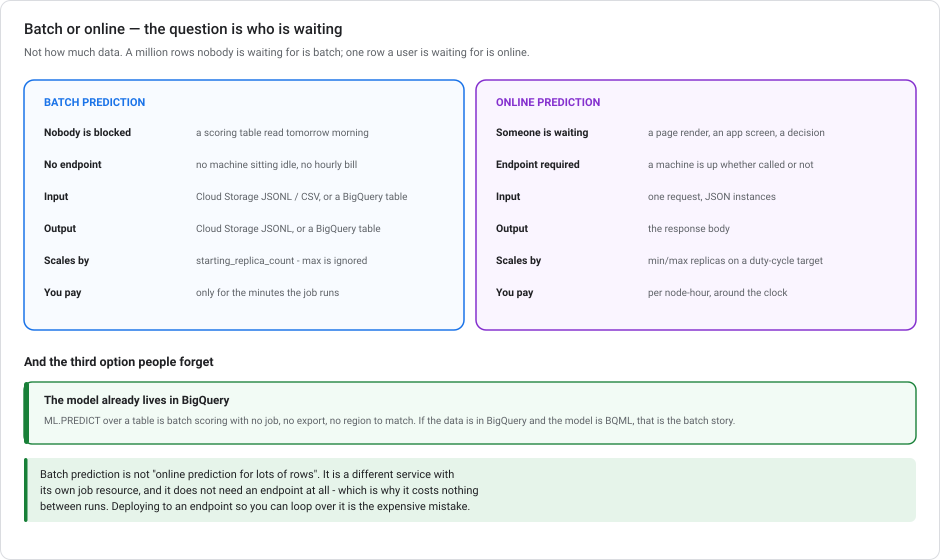
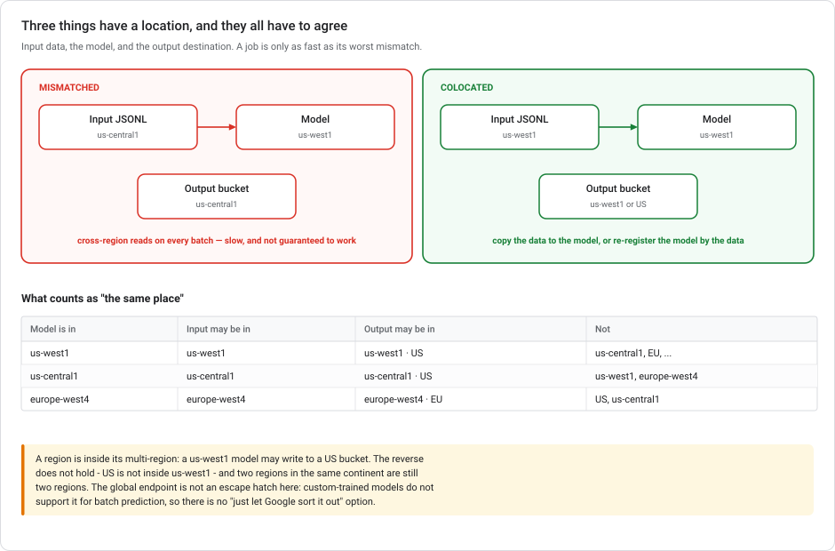

# Vertex AI batch prediction

**Scoring a pile of data that nobody is waiting for.** No endpoint, no hourly bill, and one rule about *where things live*. That rule quietly decides whether your job takes four minutes or forty.

> **Module, not a lab.** Nothing here needs running. [Lab 3](../labs/lab-03-serving-ml-models-lowcode.md) does batch serving hands-on, from the BigQuery side.

---

## Recent naming and scope changes

| When | What |
|---|---|
| **22 Apr – 21 May 2026** | Vertex AI became the **Gemini Enterprise Agent Platform** in console and docs. The batch prediction API, the `BatchPredictionJob` resource and the SDK are unchanged. Only the branding moved. |
| **Ongoing** | Generative batch prediction (Gemini over a table of prompts) is a **separate** service with its own quotas and its own docs. This module is about batch prediction for *your* models — custom-trained, AutoML, and BQML. |

---

## 1. The question batch answers

Not "how much data". **Who is waiting.**



A million rows scored overnight into a table someone reads at 9am is **batch**. One row scored while a user watches a spinner is **online**. The row count is a coincidence. The latency requirement is what decides.

This matters because the costs are shaped completely differently:

- **Online** needs an **endpoint** — at least one machine, running whether anyone calls it or not, billed by the node-hour around the clock.
- **Batch** needs **no endpoint at all**. Vertex provisions machines when the job starts, releases them when it finishes, and bills only for the minutes in between.

That is the economic argument. Deploying a model to an endpoint so you can loop over 500,000 rows is an expensive mistake. You pay for a permanently-running machine *and* get worse throughput than the service designed for it.

> **Third option, easy to forget:** if the model is BigQuery ML and the data is already in BigQuery, `ML.PREDICT` over a table *is* batch scoring. No job resource, no export, no region to match. See [Lab 3, Task 2](../labs/lab-03-serving-ml-models-lowcode.md#task-2-batch-serving-with-a-scheduled-query).

---

## 2. The colocation rule

This part quietly decides whether a job takes four minutes or forty.

**Three things have a location: the input data, the model, and the output destination. They must all be in the same region, or the same multi-region.**



Read Google's wording closely. It separates two requirements that are easy to merge:

- *"To minimize processing time, your input and output locations must be in the same region or multi-region."*
- *"Your input and output must also be in the same region or multi-region as your model."*

So the rule covers **all three**, not only input and output.

### Region equivalence rules

| Model is in | Input may be in | Output may be in | Not |
|---|---|---|---|
| `us-west1` | `us-west1` | `us-west1` or `US` | `us-central1`, `EU`, `europe-west4` |
| `us-central1` | `us-central1` | `us-central1` or `US` | `us-west1`, `europe-west4` |
| `europe-west4` | `europe-west4` | `europe-west4` or `EU` | `US`, `us-central1` |

**A region sits inside its multi-region.** A `us-west1` model may write to a `US` bucket. The reverse does not hold, because `US` is not inside `us-west1`. Two regions on the same continent are still two regions. `us-central1` and `us-west1` are *both* in the US and are *not* interchangeable.

### Fixing a mismatch

If the model is in `us-west1` and the data is in `us-central1`, you have two options:

1. **Move the data to the model** — copy the JSONL to a `us-west1` bucket (`gcloud storage cp`, or a Storage Transfer job for anything large), then run the job in `us-west1` with output to `us-west1` or `US`.
2. **Move the model to the data** — re-register the model in `us-central1` and run everything there.

Which one is cheaper depends on sizes. Copying a terabyte of JSONL costs egress and time. Re-registering a model is nearly free, but you then maintain a second regional copy, and every retrain has to update both.

**What is not an option:** "enable cross-region access". There is no such setting. And **custom-trained models do not support the `global` endpoint for batch prediction**, so there is no location-agnostic mode to fall back on.

> **Get the output region wrong and the job still runs.** It violates the colocation requirement and pays cross-region costs on every write. The failure here is usually a slow, expensive job rather than an error message. This is why you should check the regions before you configure the job, not after.

---

## 3. Inputs and outputs

**Input formats** for custom-trained models:

| Format | Notes |
|---|---|
| **JSONL** | One JSON instance per line. The default and the most flexible. |
| **CSV** | First row is the header. Simple tabular cases. |
| **TFRecord** | Optionally gzipped. TensorFlow pipelines that already produce it. |
| **File list** | A text file of Cloud Storage URIs — used for images and other blobs. |
| **BigQuery table** | Point at `project.dataset.table` and skip the export entirely. |

**Output destinations:** a **Cloud Storage** prefix (JSONL out), or a **BigQuery table**. You pick independently of the input: BigQuery in, Cloud Storage out is fine, as long as the regions line up.

> **If your data is already in BigQuery, use BigQuery as both input and output.** Exporting to JSONL just to feed a batch job adds a step, a storage cost, and a second thing whose region has to match.

### A job, in the SDK

```python
from google.cloud import aiplatform

aiplatform.init(project=PROJECT, location="us-west1")   # same region as the model

model = aiplatform.Model("projects/.../locations/us-west1/models/1234567890")

job = model.batch_predict(
    job_display_name="churn-scoring-2026-08",
    gcs_source="gs://my-bucket-us-west1/scoring/input/*.jsonl",
    gcs_destination_prefix="gs://my-bucket-us-west1/scoring/output/",
    instances_format="jsonl",
    predictions_format="jsonl",
    machine_type="n1-standard-4",
    starting_replica_count=10,
    sync=True,
)
```

**`starting_replica_count` is the setting to get right.** For custom-trained batch prediction, Vertex uses it and **ignores `max_replica_count`**. It is not a floor that scales up. It is the count you get. Set it to the number you want the job to run with.

---

## 4. Batch job cost drivers

You pay for **machine time while the job runs**, at the same node-hour rates as training and online prediction, times the replica count. Nothing between runs.

| Lever | Effect |
|---|---|
| `starting_replica_count` | Linear: 10 replicas cost 10× per hour and (roughly) finish 10× sooner. Total cost is similar, but wall-clock time is not. |
| `machine_type` | Right-size it. Batch scoring a tabular model rarely needs more than `n1-standard-4`. |
| GPUs | Only for models that need one. A GPU does nothing for a boosted tree. |
| Colocation | Getting this wrong adds cross-region read and write costs on every row. |

There is no "scale to zero" configuration to worry about, because zero is the resting state.

---

## 4a. Checking the input before you trust the output

A batch job scores whatever you hand it. If the input has drifted from what the model was trained on, you get two million confidently wrong predictions and no error anywhere. This failure mode is what makes stale scoring tables so dangerous.

Model Monitoring covers this, but **not** in the way the endpoint documentation suggests. There is no monitoring job to create, no endpoint to deploy to, and no schedule. You attach the configuration **to the batch job itself**:

```python
job = model.batch_predict(
    job_display_name="churn-scoring-2026-08",
    gcs_source="gs://my-bucket-us-west1/scoring/input/*.jsonl",
    gcs_destination_prefix="gs://my-bucket-us-west1/scoring/output/",
    model_monitoring_config=ModelMonitoringConfig(
        alert_config=ModelMonitoringAlertConfig(
            email_alert_config=ModelMonitoringAlertConfig.EmailAlertConfig(
                user_emails=["ml-team@example.com"])),
        objective_configs=[ModelMonitoringObjectiveConfig(
            training_dataset=ModelMonitoringObjectiveConfig.TrainingDataset(
                data_format="bigquery",
                bigquery_source=BigQuerySource(
                    input_uri="bq://myproject.mlops.training_data"),
            ),
            training_prediction_skew_detection_config=
              ModelMonitoringObjectiveConfig.TrainingPredictionSkewDetectionConfig(
                skew_thresholds={
                    "tenure_months":   ThresholdConfig(value=0.3),
                    "monthly_charges": ThresholdConfig(value=0.3),
                    "contract":        ThresholdConfig(value=0.1),
                }),
        )],
    ),
)
```

**It's a one-time analysis.** It runs against that job's inputs when the job completes and writes a per-feature JSON report into the output location. It is not a standing resource, and not a rolling window.

| | **Batch** — `modelMonitoringConfig` on the job | **Endpoint** — `ModelDeploymentMonitoringJob` |
|---|---|---|
| Is | a **field on one job** | a **standing resource** on an endpoint |
| Runs | **once**, when that job finishes | on a recurring `monitoringInterval` |
| Needs | the training dataset | prediction logging enabled |
| Produces | a static report | continuous alerts |

### Skew, not drift — and why that's structural

For batch jobs on the v1 monitoring surface, *"Model Monitoring supports **feature skew detection** for categorical and numerical input features."* You supply the **training dataset** (BigQuery or Cloud Storage), and it compares this job's inputs against it.

Drift is not only unsupported. It has nothing to compare against. Drift means *"production now versus production earlier"*, and a single batch job has no earlier. This is why the config takes a training dataset and calls the field `trainingPredictionSkewDetectionConfig`.

The default threshold is **0.3** per feature if you don't set one. It is the same default, and the same [Jensen-Shannon / L-infinity split](VERTEX-MODEL-MONITORING.md), as everywhere else.

> **Model Monitoring v2 changes this.** The newer surface introduces a `ModelMonitor` resource with `ModelMonitoringJob` children, and its baseline can be training data, a **prior batch job**, or a dataset in Cloud Storage. That makes drift meaningful for batch for the first time, because it gives you two runs to compare. If you're building new, look at v2. The inline-field design above is the v1 shape, and the docs now label it as such.

Two more configurations look reasonable but are not. **Deploying to an endpoint before each batch run** to borrow endpoint monitoring pays for a node and an undeploy, and gives you a worse version of a built-in feature. **Request-response logging with a rolling window** is endpoint machinery that batch jobs never touch.

---

## 5. Common batch prediction mistakes

**Deploying to an endpoint to score a table.** You pay for a permanent machine and hand-roll the batching. Batch prediction exists for this.

**Exporting BigQuery to JSONL to feed a batch job whose output goes back to BigQuery.** Two extra hops, two extra regions to keep straight, and a storage bill. Use the BigQuery source and sink.

**Assuming `US` and `us-central1` are interchangeable.** A `US` multi-region bucket satisfies a `us-central1` model; a `us-central1` bucket does not satisfy a `US`-registered anything. The containment runs one way.

**Setting `max_replica_count` and expecting it to do something.** It's ignored for custom-trained batch jobs. Your job runs at `starting_replica_count`.

**Scoring without checking the input.** A batch job takes a `modelMonitoringConfig` (§4a). That gives you skew detection against the training data, one-time, with no endpoint required. Skipping it means your first sign of trouble is a business metric.

**Batch-scoring on a schedule and never checking the job ran.** A batch job that silently stops leaves a scoring table that quietly goes stale. Stale predictions look exactly like fresh ones. Alert on *absence*, the same way [Lab 3](../labs/lab-03-serving-ml-models-lowcode.md) does for scheduled queries.

---

## 6. Scenario questions

<details markdown="1">
<summary><b>1.</b> Your input JSONL is in <code>us-central1</code>, your custom-trained model is registered in <code>us-west1</code>, and you want output in Cloud Storage. What do you configure?</summary>

**Copy the input to a `us-west1` bucket, run the job in `us-west1`, and write output to `us-west1` or the `US` multi-region.**

All three locations must agree. Since the model is in `us-west1`, everything else moves to it. The alternative is to re-register the model in `us-central1` and move everything there instead. Output in the `US` multi-region is acceptable because `us-west1` is inside it; output in `europe-west4` is not.

There is no "cross-region access" toggle, and the `global` endpoint isn't supported for custom-trained batch prediction.
</details>

<details markdown="1">
<summary><b>2.</b> A colleague deployed the model to an endpoint and wrote a loop calling it 400,000 times. What's wrong with that?</summary>

Cost and throughput, in that order. The endpoint bills by the node-hour whether or not anyone calls it, so it keeps costing money after the loop finishes. The loop itself is also slower than a batch job, which parallelises across replicas natively.

The clue is that **nobody is waiting for any individual prediction**. That is the definition of a batch workload.
</details>

<details markdown="1">
<summary><b>3.</b> You set <code>starting_replica_count=5</code> and <code>max_replica_count=50</code>. How many replicas run?</summary>

**Five.** Custom-trained batch prediction uses `starting_replica_count` and ignores `max_replica_count`. It doesn't autoscale up during the job the way an endpoint does, so pick the number you want.
</details>

<details markdown="1">
<summary><b>4.</b> Your model is BigQuery ML and your data is a BigQuery table. Do you need a batch prediction job?</summary>

No. `ML.PREDICT` is batch scoring, in-place, with no job resource and no data movement. Batch prediction jobs are for models that live in the Model Registry rather than in BigQuery.

The exception is if you *exported* the BQML model to Vertex to serve it elsewhere. But then you are serving it elsewhere for a reason, and scoring in BigQuery is still cheaper.
</details>

---

## The colocation rule, recapped

Batch prediction is for work **nobody is waiting for**. It needs no endpoint, costs nothing between runs, and bills only for the machine-minutes a job uses. The rule to remember is **colocation**. The input data, the model, and the output destination must all be in the same region or the same multi-region. A region counts as inside its multi-region, but not the reverse, and `us-central1` and `us-west1` are two different places despite both being in the US. When they don't match, you move the data to the model or re-register the model by the data. There is no cross-region setting, and custom-trained models cannot use the `global` endpoint for batch. Inputs may be JSONL, CSV, TFRecord, a file list, or a BigQuery table; output goes to Cloud Storage or BigQuery. And for custom-trained jobs, **`starting_replica_count` is the replica count**, because `max_replica_count` is ignored.

---

## Further reading

- [Get batch predictions from a custom trained model](https://cloud.google.com/vertex-ai/docs/predictions/get-batch-predictions)
- [Vertex AI locations](https://cloud.google.com/vertex-ai/docs/general/locations)
- [Vertex AI pricing](https://cloud.google.com/vertex-ai/pricing)
- Related: [Vertex AI Prediction autoscaling](VERTEX-AUTOSCALING.md) · [Serving models on Cloud Run](SERVING-MODELS-ON-CLOUD-RUN.md) · [Lab 3](../labs/lab-03-serving-ml-models-lowcode.md)
