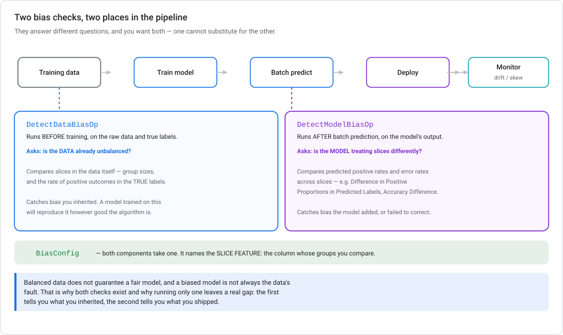
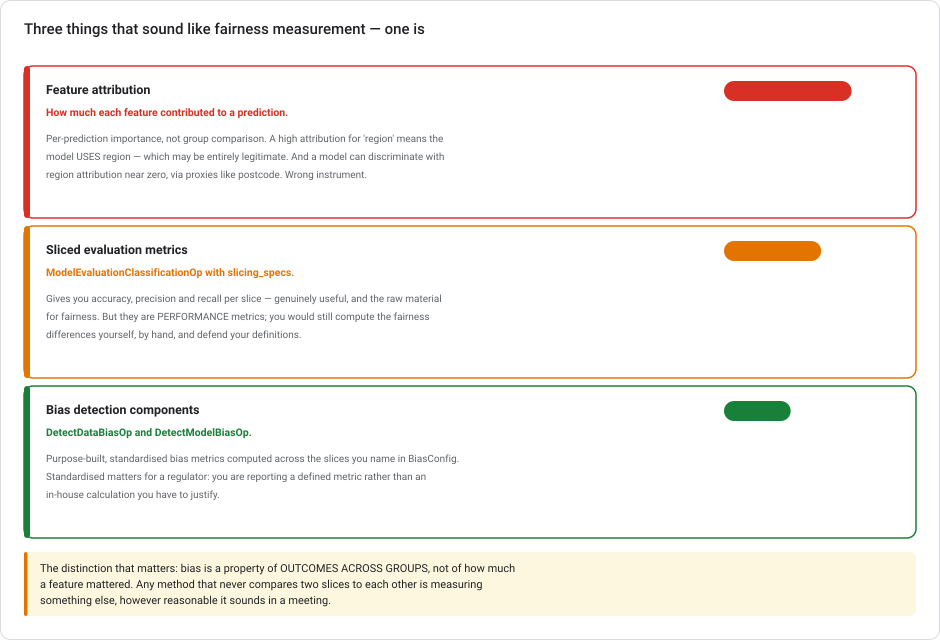
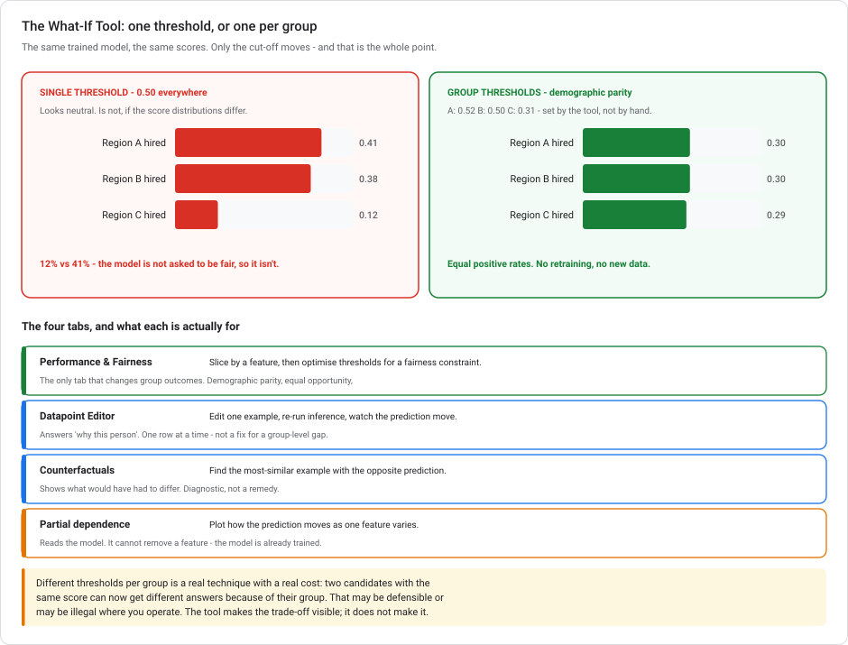

# Fairness and bias detection on Vertex AI

> **Type** Explanation module (theory, no console steps)  **Reading time** 25–35 minutes
> **Related** [Kubeflow Pipelines](KUBEFLOW-PIPELINES-ON-GCP.md) · [Model Monitoring](VERTEX-MODEL-MONITORING.md) · [Lab 5 — Feature engineering](../labs/lab-05-feature-engineering-tabular.md) · [API versions and launch stages](GCP-API-VERSIONS-AND-LAUNCH-STAGES.md)
> **Last updated** 23 August 2026

---

## Why this module exists

The rest of this series measures whether a model is **accurate**. This one is about whether it is **fair**. Those are different questions, measured with different instruments.

A loan approval model can hit 0.87 AUC and still approve one region's applicants at half the rate of another's. Nothing in [Lab 2](../labs/lab-02-customer-churn-lowcode-bqml.md)'s evaluation, [Lab 5](../labs/lab-05-feature-engineering-tabular.md)'s importance analysis, or the [drift monitoring](VERTEX-MODEL-MONITORING.md) module would tell you that. They aren't looking.

The distinction underneath everything here:

> **Bias is a property of outcomes across groups.** Any method that never compares two groups to each other is measuring something else.

---

## 1. Two checks, two places



Vertex AI ships two pipeline components, and they sit at different points for a reason.

### `DetectDataBiasOp` — before training

Runs on the **raw data and its true labels**, before a model exists.

**Asks:** is the data already unbalanced? It compares slices on things like group size and the rate of positive outcomes in the *true* labels.

**Catches:** bias you inherited. If historical approvals were skewed, that skew is in your labels, and a model trained on it will reproduce it no matter how good the algorithm is. Finding this before training saves you from debugging a model that is faithfully learning the wrong thing.

### `DetectModelBiasOp` — after batch prediction

Runs on the **model's predictions**, after training.

**Asks:** is the model treating slices differently? It compares predicted positive rates and error rates across slices. Two of those are **Difference in Positive Proportions in Predicted Labels (DPPPL)**, which measures whether the model makes disproportionately more positive predictions for one slice, and **accuracy differences** between slices.

**Catches:** bias the model introduced, or failed to correct. A model can amplify a small imbalance in the data, or introduce one that wasn't there.

### `BiasConfig` — what both need

Both components take a **`BiasConfig`**, which names the **slice feature**: the column whose groups you're comparing. For the loan scenario that's the geographic region column.

Without it there's nothing to compare. Bias is a property of outcomes *across groups*, and you have to say which groups.

> **Run both.** Balanced data does not guarantee a fair model, and an unfair model is not always the data's fault. The first tells you what you inherited. The second tells you what you shipped. Running only one leaves a real gap in either direction.

---

## 2. Three things that sound like fairness measurement



This is where good instincts go wrong, so be precise here.

> ### ⚠️ Vertex Explainable AI is being sunset
>
> **Deprecated 16 March 2026; fully sunset 16 March 2027**, after which the APIs are no longer available. No new features from the deprecation date, and there is **no grace period for critical patches** the way the Feature Store deprecations had one.
>
> **Google offers no replacement product.** The only stated alternatives are the open-source libraries **SHAP** and **LIME**. Those substitute for *feature-based* explanations only. Nothing is offered for **example-based** explanations.
>
> **What this does and doesn't touch:**
>
> | | Status |
> |---|---|
> | `explanationSpec`, `endpoints.explain`, AutoML tabular attributions | **sunsetting 16 Mar 2027** |
> | Attribution-based **model monitoring** (requires an `ExplanationSpec`) | **depends on it** — not itself deprecated, but built on what is going away |
> | `ModelEvaluationFeatureAttributionOp` and the attribution eval pipelines | **depends on it** — they drive Explainable AI through batch prediction |
> | Skew and drift monitoring | **unaffected** — no explainability involved |
> | BigQuery ML `ML.EXPLAIN_PREDICT`, `ML.GLOBAL_EXPLAIN`, `ML.FEATURE_IMPORTANCE` | **unaffected** — a separate surface with its own implementation |
>
> Be precise about that middle band. Google has **not** deprecated the pipeline components or attribution monitoring, and neither carries a banner. But both call the sunsetting APIs, so plan as though they stop in March 2027.
>
> One practical trap: as of the current API surface, **none** of `ExplanationSpec`, `endpoints.explain` or `DeployedModel.explanationSpec` is flagged deprecated in the discovery document. You get **no programmatic warning** — the deprecation exists only in the docs.

### Feature attribution — the wrong instrument

*"Check whether region has high feature importance, and flag the model if it exceeds a threshold."*

Reasonable-sounding and wrong, in **both** directions:

- **High attribution ≠ bias.** It means the model *uses* the feature. Region may be a legitimate predictor. Different regions do have different economic conditions. Using it isn't automatically discrimination.
- **Low attribution ≠ fairness.** A model can discriminate heavily with region attribution near zero, through **proxies**: postcode, branch, income band, even name. Drop the protected attribute and the model finds it again through correlated features. This is the most important idea in fairness work. It is why "we don't use race as a feature" is not a defence.

Attribution answers *"what drove this prediction?"*. That is useful, and covered properly in [Explainability and feature attribution](EXPLAINABILITY-AND-ATTRIBUTION.md). It never compares two groups, so it cannot answer a fairness question.

### Sliced evaluation metrics — close, but not it

`ModelEvaluationClassificationOp` with `slicing_specs` computes accuracy, precision and recall **per slice**. That is useful, and it *is* the raw material for fairness analysis.

But they're **performance** metrics, not fairness metrics. You'd still compute the differences yourself, choose which differences count, and defend those choices. For a regulator, "we wrote our own fairness calculation" is a much weaker position than "we report a standardised, documented metric."

> **"Not sufficient" is not "not useful."** When compliance asks for *both* standard performance metrics **and** fairness metrics (the usual ask for a regulated decision like loan approval), the answer is **both components in the same pipeline**: `ModelEvaluationClassificationOp` with `slicing_specs` for accuracy and AuPRC per demographic slice, and `DetectModelBiasOp` with `bias_configs` for the fairness metrics over the same slices. They answer different halves of one question, and neither substitutes for the other.

One component does *not* belong in that answer: **`ModelEvaluationFeatureAttributionOp`**. It computes feature attributions, which is explainability. That is the wrong instrument, for the reason above: attribution never compares two groups. "Attribution across demographic segments" sounds like fairness, and that is the trap this section exists to disarm.

### The bias detection components — this one

`DetectDataBiasOp` and `DetectModelBiasOp` give purpose-built, standardised bias metrics across the slices you name. **Standardisation is the point** in a regulated setting: you are reporting a defined metric rather than an in-house calculation you have to justify line by line.

### And custom Fairness Indicators?

TensorFlow Fairness Indicators is a real, respectable library. But building a custom component, wiring it to batch prediction output, and storing results in your own database means writing and maintaining infrastructure that Vertex already provides. You also lose the pipeline-native integration, the artifact lineage, and the standardised metric names. Reach for it when you need something the native components do not compute, not by default.

---

## 3. What this looks like in a pipeline

The shape, in the [KFP](KUBEFLOW-PIPELINES-ON-GCP.md) terms of that module:

```python
# sketch — check current GCPC docs for exact signatures
from google_cloud_pipeline_components.v1.model_evaluation import (
    ModelEvaluationClassificationOp)
# bias components live under the preview namespace
from google_cloud_pipeline_components.preview.model_evaluation import (
    DetectDataBiasOp, DetectModelBiasOp)

@dsl.pipeline(name="loan-model-with-fairness")
def pipeline(...):
    data = prepare_data(...)

    # 1. before training — is the data itself skewed?
    data_bias = DetectDataBiasOp(
        target_field_name="approved",
        bias_configs=[...],          # slice on region
        dataset=data.outputs["dataset"],
    )

    trained = train(dataset=data.outputs["dataset"])
    preds   = batch_predict(model=trained.outputs["model"])

    # 2a. standard performance metrics, per slice
    evaluation = ModelEvaluationClassificationOp(
        target_field_name="approved",
        slicing_specs=[...],         # same slice, performance view
        predictions_gcs_source=preds.outputs["gcs_output_directory"],
    )

    # 2b. after prediction — is the model skewed?
    model_bias = DetectModelBiasOp(
        target_field_name="approved",
        bias_configs=[...],          # same slice
        predictions_gcs_source=preds.outputs["gcs_output_directory"],
    )

    # 3. the gate — the pattern from the KFP module
    with dsl.If(model_bias.outputs["passes_threshold"] == True):
        deploy(model=trained.outputs["model"])
```

Two design points matter more than the component names:

**Make it a gate, not a report.** The `dsl.If` conditional-deploy pattern from the [KFP module](KUBEFLOW-PIPELINES-ON-GCP.md) applies exactly here. A fairness metric written to a dashboard nobody reads has automated the measurement and none of the decision. A model that fails the bias threshold should not reach production.

**It runs on every retrain.** That's the point of putting it in the pipeline rather than doing it once at launch. Data drifts, populations change, and a model that was fair in January can fail in June. This is the same reason [drift monitoring](VERTEX-MODEL-MONITORING.md) exists.

> **⚠️ Launch stage:** the bias detection components sit in the **`preview`** namespace of GCPC, with the caveats from the [API versions module](GCP-API-VERSIONS-AND-LAUNCH-STAGES.md) — no SLA, and the interface can change. Pin your GCPC version and re-test on upgrade, particularly if the output feeds a compliance report.

---

## 3a. The What-If Tool — fixing bias without retraining

Everything above runs **inside a pipeline** and produces numbers. The What-If Tool (WIT) is the other half. It is an **interactive** panel you open in a notebook (Colab, Jupyter, or a Vertex AI Workbench instance). It loads a dataset and a model and lets you poke at both.

It is not new. Google's PAIR team released it in 2018, and it long predates the Vertex bias components. If you have not met it, that is because the pipeline components are what you reach for in automation. WIT is for when a human is sitting there asking *why*.



### The move that matters: per-slice thresholds

A binary classifier does not output "hire". It outputs a **score**, and something compares that score to a **threshold**. Change the threshold and the same trained model produces different decisions — no retraining, no new data, no new weights.

The **Performance & Fairness** tab is built on that fact:

1. **Slice** the dataset by a feature — geographic region, in the scenario above.
2. WIT shows a confusion matrix, ROC curve and positive-prediction rate **per slice**.
3. Give each slice **its own threshold slider**, or let the tool set them for you by picking a fairness constraint.

The constraints it can optimise for:

| Strategy | Equalises | Reads as |
|---|---|---|
| **Single threshold** | nothing | "One rule for everyone" — the default, and the one that produced the gap. |
| **Demographic parity** | the **rate** of positive predictions | Each group gets `hire` at the same rate. |
| **Equal opportunity** | **true positive rate** | Among candidates who would succeed, each group is found at the same rate. |
| **Equal accuracy** | overall accuracy per group | The model is right equally often for everyone. |

For "predicts hire at significantly different rates across regions", the target is **demographic parity**, and per-slice thresholds are how you get there, without touching the model.

### What the other tabs are, and why they don't solve this

| Tab | What it does | Why it isn't the fix |
|---|---|---|
| **Datapoint Editor** | Edit a feature value on one example, re-run inference, watch the prediction move. | Answers "why *this* person". Editing rows one at a time doesn't shift a group-level rate. |
| **Counterfactuals** | Find the most-similar datapoint with the *opposite* prediction. | Shows what would have had to differ. Useful for explaining a decision, and still one row. |
| **Partial dependence plots** | Plot how the prediction moves as one feature varies across its range. | **Reads** the model. It cannot remove a feature, because the model is already trained on it. |

All three are diagnostic. Only threshold optimisation changes outcomes.

### One caveat

Per-group thresholds mean **two candidates with the same score can get different answers because of their group.** That is not a technicality you can gloss over. Depending on the jurisdiction and the decision, it ranges from best practice to unlawful. In the US, deliberately different cut-offs by a protected class in hiring is legally fraught regardless of the fairness metric it optimises.

So treat WIT's slider as what it is: a way to **see the trade-off precisely**, and to find out what parity would cost, before anyone decides whether to take it. The tool makes the trade-off visible. It does not make the decision, and it does not make the decision legal.

### Where it fits against the pipeline components

| | **What-If Tool** | **`DetectModelBiasOp`** |
|---|---|---|
| Runs in | A notebook, interactively | A pipeline, automatically |
| Needs | A human at the keyboard | Nothing — it's a gate |
| Output | Understanding, and candidate thresholds | Metrics, and a pass/fail |
| Good for | Investigating *why*, exploring remedies | Catching regressions on every retrain |

Use WIT when the question is open-ended. Use the components when you want the answer checked on every run without anyone remembering to look — see §3.

---

## 4. The limits of the tooling

Say this plainly, because tooling can create false confidence.

**A metric is not a definition of fairness.** There are many mathematical fairness definitions (equal positive rates, equal error rates, equal calibration), and they are **provably incompatible** in general. You cannot satisfy all of them at once. Choosing which one matters is a policy decision, not a technical one, and the components will happily compute several without telling you which your regulator cares about.

**Passing a threshold is not being fair.** It means the metric you chose, on the slice you named, stayed inside the bound you set. All three of those were choices.

**You have to name the slice.** The components compare groups you specify. Bias along an axis you didn't think to check goes undetected. In many jurisdictions you may not even be permitted to collect the attribute you'd need.

**Proxies survive removal.** Dropping the protected attribute rarely removes the effect, because correlated features reconstruct it. Measuring outcomes is the only reliable check.

None of this argues against the tooling. It argues for treating the output as **evidence in a human decision**, which is also how a regulator will treat it.

---

## 5. Anti-patterns

**Using feature attribution as a bias check.** Wrong instrument, and wrong in both directions. §2.

**Running only the model check.** You'll debug a model that is faithfully reproducing biased labels.

**Running only the data check.** Balanced data doesn't guarantee a fair model.

**Reporting fairness without gating on it.** Measurement without a decision is theatre. Use `dsl.If`.

**Assuming removing the attribute removes the bias.** Proxies. §2.

**Checking once at launch.** It belongs in the retraining pipeline, for the same reason drift monitoring exists.

**Treating the threshold as the definition.** The metric, the slice and the bound were all your choices.

---

## 6. Test your understanding

<details markdown="1">
<summary><b>1.</b> Automated fairness evaluation in a retraining pipeline, detecting both data-level and model-level bias. What do you add?</summary>

**`DetectDataBiasOp`** before training, which analyses the raw data and true labels, and **`DetectModelBiasOp`** after batch prediction, which evaluates the model's predictions. Configure both with a **`BiasConfig`** naming the slice feature (here, geographic region). Two components because they answer different questions: what you inherited versus what you shipped.
</details>

<details markdown="1">
<summary><b>2.</b> Why not use Explainable AI feature attributions to flag high region importance?</summary>

Because attribution measures per-prediction feature importance, not systematic differences across groups. It is also wrong in both directions. High region attribution may be legitimate. Low attribution doesn't mean fair, because proxies like postcode reconstruct the protected attribute. Bias is a property of *outcomes across groups*, so any method that never compares two groups can't measure it.
</details>

<details markdown="1">
<summary><b>3.</b> <code>ModelEvaluationClassificationOp</code> supports <code>slicing_specs</code>. Why isn't that enough?</summary>

It computes **performance** metrics per slice (accuracy, precision, recall), not fairness metrics. You'd have to derive the fairness differences yourself, choose which differences count, and defend those choices. The bias components provide standardised, purpose-built metrics like DPPPL, which matters in a regulated setting where you'd rather report a defined metric than an in-house calculation.
</details>

<details markdown="1">
<summary><b>3a.</b> Compliance wants standard performance metrics <em>and</em> fairness metrics across demographic groups, in one pipeline. What do you build?</summary>

**Both components.** `ModelEvaluationClassificationOp` with `slicing_specs` for accuracy, precision, recall and AuPRC per slice; `DetectModelBiasOp` with `bias_configs` for the standardised fairness metrics over the same slices.

The two wrong turns: `ModelEvaluationFeatureAttributionOp` computes **explainability**, not fairness, because attribution never compares groups. And a custom TFMA component computes fairness metrics you'd then have to maintain and justify, when a purpose-built, natively integrated component already exists.

`DetectDataBiasOp` isn't a substitute either: it evaluates the *dataset* before training and returns no model performance metrics at all.
</details>

<details markdown="1">
<summary><b>4.</b> Why run the data check when you're going to check the model anyway?</summary>

Because they catch different failures. Data bias tells you the labels themselves are skewed. A model trained on them will reproduce that however good the algorithm is, and knowing beforehand saves you debugging a model that's faithfully learning the wrong thing. Model bias catches what the model added or failed to correct. Balanced data doesn't guarantee a fair model, and an unfair model isn't always the data's fault.
</details>

<details markdown="1">
<summary><b>5.</b> Your model passes the bias threshold. Is it fair?</summary>

It means the metric you chose, on the slice you named, stayed inside the bound you set. Those are three choices, all yours. Different fairness definitions (equal positive rates, equal error rates, equal calibration) are provably incompatible in general, so passing one says nothing about the others. Treat the output as evidence in a human decision, which is how a regulator will treat it too.
</details>

<details markdown="1">
<summary><b>6.</b> You removed region from the feature set. Problem solved?</summary>

Almost certainly not. Correlated features (postcode, branch, income band) act as **proxies** and let the model reconstruct the signal. This is why "we don't use the protected attribute" is not a defence, and why measuring *outcomes across groups* is the only reliable check. Removing the attribute may even make things worse by removing your ability to measure.
</details>

---

## Summary

Accuracy and fairness are different questions with different instruments. Vertex AI provides two purpose-built pipeline components: **`DetectDataBiasOp`** runs before training on the raw data and true labels, and **`DetectModelBiasOp`** runs after batch prediction on the model's output. Both are configured with a **`BiasConfig`** naming the slice feature. Run both, because balanced data doesn't guarantee a fair model and an unfair model isn't always the data's fault. **Feature attribution is not a bias check** (a model can discriminate through proxies with the protected attribute's attribution near zero), and **sliced performance metrics are not fairness metrics**. Make it a **gate** with `dsl.If` rather than a report, run it on every retrain, and remember that passing a threshold reflects three choices you made: the metric, the slice, and the bound.

---

## References

- [Introduction to model evaluation for fairness](https://docs.cloud.google.com/vertex-ai/docs/evaluation/intro-evaluation-fairness)
- [Data bias metrics for Vertex AI](https://docs.cloud.google.com/vertex-ai/docs/evaluation/data-bias-metrics)
- [Model bias metrics for Vertex AI](https://docs.cloud.google.com/vertex-ai/docs/evaluation/model-bias-metrics)
- [Model evaluation components](https://docs.cloud.google.com/vertex-ai/docs/pipelines/model-evaluation-component)
- [Google Cloud Pipeline Components list](https://docs.cloud.google.com/vertex-ai/docs/pipelines/gcpc-list)
- [Google's Responsible AI practices](https://ai.google/responsibility/responsible-ai-practices/)
