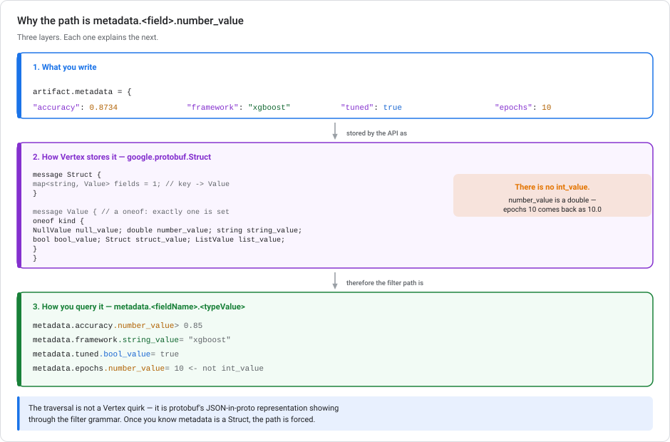
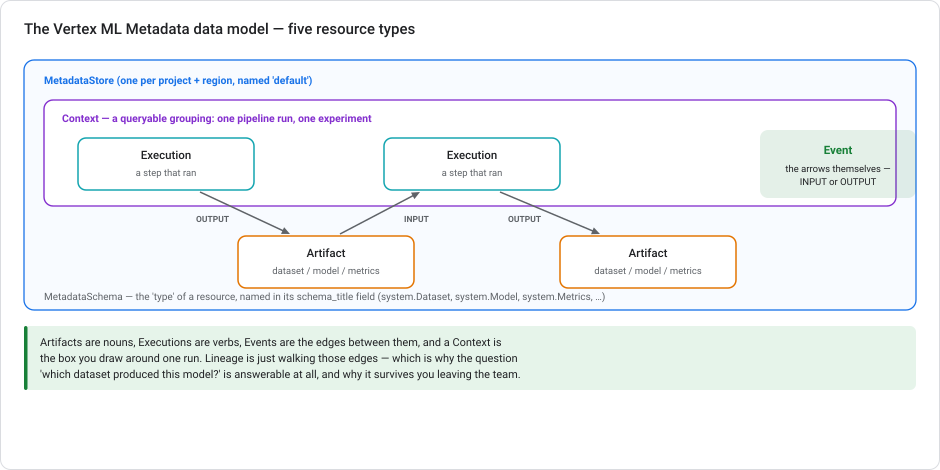
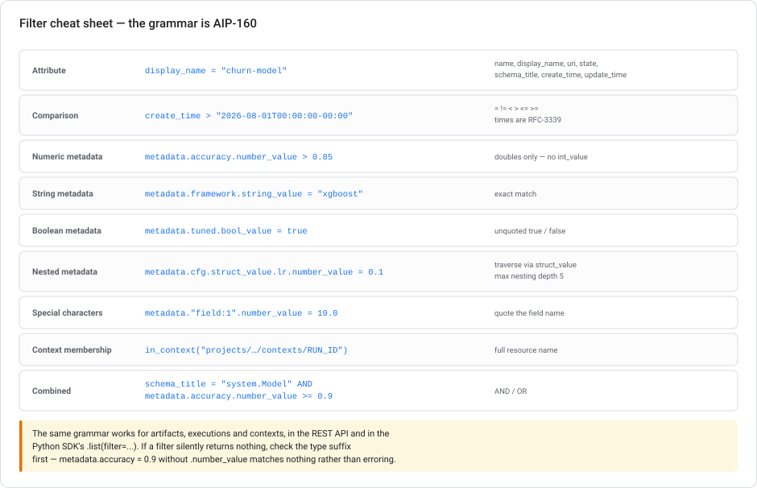

# Vertex ML Metadata — lineage, artifacts, and the `number_value` traversal

> **Type** Explanation module (concepts + runnable code)  **Reading time** 35–45 minutes
> **Related** [Kubeflow Pipelines on GCP](KUBEFLOW-PIPELINES-ON-GCP.md) · [Scaling prototypes into ML models](SCALING-PROTOTYPES-TO-ML.md) · [Lab 2 — Churn with BigQuery ML](../labs/lab-02-customer-churn-lowcode-bqml.md)
> **Last updated** 23 August 2026

---

## The number_value rule, stated

> *In Vertex ML Metadata, metadata is stored as `google.protobuf.Struct`, and numeric values must be accessed using the `number_value` traversal path.*

That statement is correct. This module explains **why**, because the "why" makes the rest of the API predictable instead of something you memorize.

```text
metadata.accuracy.number_value > 0.85
         └───┬───┘ └─────┬────┘
             │           └── the protobuf Value field for this type
             └────────────── your key inside the Struct
```

The traversal is not a Vertex design choice. It follows from the type of the `metadata` field: `google.protobuf.Struct`. A `Struct` is a map from string keys to `google.protobuf.Value`, and a `Value` is a **`oneof`** where exactly one typed field is set. Once you know that, the filter path is forced, and so is every consequence in §4.

---

## 1. Why the path looks like that



### Layer 1 — what you write

```python
artifact.metadata = {
    "accuracy": 0.8734,
    "framework": "xgboost",
    "tuned": True,
    "epochs": 10,
}
```

Ordinary JSON-shaped data. The API accepts arbitrary keys: there is no fixed column list.

### Layer 2 — how it is stored

That flexibility is why the field is a `Struct`. From protobuf's `struct.proto`:

```protobuf
message Struct {
  map<string, Value> fields = 1;
}

message Value {
  oneof kind {
    NullValue null_value    = 1;
    double    number_value  = 2;   // <- every number, integer or not
    string    string_value  = 3;
    bool      bool_value    = 4;
    Struct    struct_value  = 5;   // nested object
    ListValue list_value    = 6;   // array
  }
}
```

`Struct` is protobuf's canonical representation of arbitrary JSON. Each value carries its own type tag because the schema isn't known at compile time.

### Layer 3 — how you query it

Because a `Value` is a `oneof`, a query must name **which** field it means. Hence:

| Your value | Filter path |
|---|---|
| `0.8734` | `metadata.accuracy.number_value > 0.85` |
| `"xgboost"` | `metadata.framework.string_value = "xgboost"` |
| `True` | `metadata.tuned.bool_value = true` |
| `10` | `metadata.epochs.number_value = 10` |
| `{"lr": 0.1}` | `metadata.cfg.struct_value.lr.number_value = 0.1` |

The official grammar is `metadata.<fieldName>.<typeValue>`, with the documented example `metadata.field_1.number_value = 10.0`.

> **The single most consequential detail:** there is **no `int_value`**. `number_value` is a `double`. An integer you wrote as `10` is stored as `10.0` and comes back as a Python `float`. §4 is a list of the ways that bites.

---

## 2. What Vertex ML Metadata is

It is a **lineage store** — Google's managed implementation of the open-source [ML Metadata (MLMD)](https://github.com/google/ml-metadata) project. It answers questions like:

- Which dataset produced this model?
- Which model version is behind this prediction table?
- Which of last month's 40 training runs had the best AUC, and what were its hyperparameters?
- If this upstream table was wrong, which models are contaminated?



Five resource types, and the mental model is grammatical:

| Resource | What it is | Think of it as |
|---|---|---|
| **MetadataStore** | Top-level container, one per project + region, named `default` | The database |
| **Artifact** | A discrete thing produced or consumed — dataset, model, metrics file | A **noun** |
| **Execution** | A record of one workflow step that ran, with its runtime parameters | A **verb** |
| **Event** | The link between an artifact and an execution, typed `INPUT` or `OUTPUT` | An **edge** |
| **Context** | A queryable grouping — one pipeline run, one experiment | A **box** around a run |

**Lineage is graph traversal over Events.** Artifacts and executions alternate, edges are directed and typed, and "what produced this?" means walking backwards.

### `schema_title` — the type system

Every artifact, execution, and context carries a `schema_title` naming its `MetadataSchema`. The system types you'll meet constantly:

`system.Dataset` · `system.Model` · `system.Metrics` · `system.Artifact` · `system.Run` · `system.PipelineRun` · `system.ContainerExecution`

`schema_title` is what makes `metadata` interpretable. It tells you which keys to expect inside the Struct. It is also the cheapest filter you can apply, and usually the first clause of any real query.

---

## 3. Writing metadata

### Automatically, from pipelines

If you ran anything from the [Kubeflow module](KUBEFLOW-PIPELINES-ON-GCP.md), you already populated ML Metadata without touching it. Every KFP component's inputs and outputs become Artifacts, every step becomes an Execution, and the run becomes a Context.

```python
@dsl.component
def train(dataset: dsl.Input[dsl.Dataset],
          model: dsl.Output[dsl.Model],
          metrics: dsl.Output[dsl.Metrics]):
    ...
    metrics.log_metric("roc_auc", 0.8471)      # -> metadata.roc_auc.number_value
    model.metadata["framework"] = "xgboost"    # -> metadata.framework.string_value
    model.metadata["epochs"] = 31              # -> metadata.epochs.number_value (31.0!)
```

`log_metric` writes into exactly the Struct described above. That is the connection between the two modules: **KFP's `Metrics` artifact is a Vertex ML Metadata Artifact with `schema_title = "system.Metrics"`.**

### Explicitly, with the SDK

```python
from google.cloud import aiplatform

aiplatform.init(project="PROJECT_ID", location="us-central1")

model_artifact = aiplatform.Artifact.create(
    schema_title="system.Model",
    display_name="churn-model-v3",
    uri="gs://your-bucket/models/churn/v3/",
    metadata={
        "framework": "bigquery-ml",
        "model_type": "BOOSTED_TREE_CLASSIFIER",
        "roc_auc": 0.8471,
        "recall": 0.7270,
        "training_rows": 7043,
        "auto_class_weights": True,
        "as_of": "2026-08-01",
    },
)
print(model_artifact.resource_name)
```

Note `training_rows: 7043`: an int on the way in, a `7043.0` double on the way out.

### Grouping into a Context

```python
run_context = aiplatform.Context.create(
    schema_title="system.Run",
    display_name="churn-retrain-2026-08-23",
    metadata={"as_of": "2026-08-01", "triggered_by": "schedule"},
)
run_context.add_artifacts_and_executions(
    artifact_resource_names=[model_artifact.resource_name],
)
```

---

## 4. The `number_value` consequences

Learn this part properly. Each item follows directly from "numbers are doubles in a `oneof`".

### 4.1 Integers are not integers

```python
a = aiplatform.Artifact.get(resource_name)
print(a.metadata["epochs"], type(a.metadata["epochs"]))   # 31.0 <class 'float'>
```

```python
# Breaks in a report or a filename
f"trained for {a.metadata['epochs']} epochs"     # "trained for 31.0 epochs"

# Do this
epochs = int(a.metadata["epochs"])
```

If a value must stay an exact integer (an ID, a hash, a version), **store it as a string**. `double` has 53 bits of integer precision, so anything past 2^53 silently loses accuracy.

### 4.2 The type suffix is mandatory, and its absence is silent

```python
# Matches nothing. No error, no warning — just an empty list.
aiplatform.Artifact.list(filter='metadata.roc_auc = 0.8471')

# Correct
aiplatform.Artifact.list(filter='metadata.roc_auc.number_value > 0.84')
```

**An empty result is the normal symptom of a malformed metadata filter.** When a query returns nothing, check the type suffix before you question your data.

### 4.3 Float comparison is still float comparison

`= 0.8471` may not match a value stored from a computation that produced `0.84709999999999996`. Prefer ranges:

```python
filter='metadata.roc_auc.number_value >= 0.847 AND metadata.roc_auc.number_value < 0.848'
```

### 4.4 Booleans are unquoted; strings are quoted

```text
metadata.tuned.bool_value = true            correct
metadata.tuned.bool_value = "true"          wrong (that's a string_value)
metadata.framework.string_value = "xgboost" correct
```

### 4.5 Nested objects traverse through `struct_value`

```python
metadata = {"hparams": {"learning_rate": 0.1, "max_depth": 6}}
```

```text
metadata.hparams.struct_value.learning_rate.number_value = 0.1
```

**Maximum nesting depth is 5.** Deeply nested config is a good reason to flatten keys (`hparams_learning_rate`) at write time. You cannot filter what you cannot reach.

### 4.6 Arrays are essentially unfilterable

`list_value` exists, but there is no "contains" operator. If you need to filter on membership, store a flattened scalar alongside the list:

```python
metadata = {
    "tags": ["prod", "eu"],           # kept for humans
    "tag_prod": True,                 # filterable: metadata.tag_prod.bool_value = true
}
```

### 4.7 Special characters need quoting

```text
metadata."field:1".number_value = 10.0
```

Any key containing a colon, space, or other special character must be wrapped in double quotes.

---

## 5. Querying — the full grammar



The filter syntax follows [AIP-160](https://google.aip.dev/160) and is identical across artifacts, executions, and contexts, in both REST and the Python SDK.

**Attribute fields:** `name`, `display_name`, `uri`, `state`, `schema_title`, `create_time`, `update_time`
**Operators:** `=` `!=` `<` `>` `<=` `>=`, combined with `AND` / `OR`
**Timestamps:** RFC-3339, quoted

### Find your best model

```python
from google.cloud import aiplatform
aiplatform.init(project="PROJECT_ID", location="us-central1")

best = aiplatform.Artifact.list(
    filter=(
        'schema_title = "system.Model" '
        'AND metadata.roc_auc.number_value >= 0.84 '
        'AND metadata.framework.string_value = "bigquery-ml" '
        'AND create_time > "2026-08-01T00:00:00-00:00"'
    ),
    order_by="create_time desc",
)
for a in best:
    print(f"{a.display_name:28s} auc={a.metadata['roc_auc']:.4f}  {a.uri}")
```

### Everything in one pipeline run

```python
artifacts = aiplatform.Artifact.list(
    filter='in_context("projects/PROJECT_NUMBER/locations/us-central1'
           '/metadataStores/default/contexts/CONTEXT_ID")'
)
```

`in_context()` takes the **full resource name**, and note it uses the project *number*, not the project ID.

### Live artifacts created since a date

```text
create_time > "2026-08-01T00:00:00-00:00" AND state = LIVE
```

### The same thing in REST

```bash
curl -H "Authorization: Bearer $(gcloud auth print-access-token)" \
  "https://us-central1-aiplatform.googleapis.com/v1/projects/${PROJECT}/locations/us-central1/metadataStores/default/artifacts?filter=metadata.roc_auc.number_value%3E0.84"
```

Here you see the raw shape the SDK hides:

```json
{
  "artifacts": [{
    "displayName": "churn-model-v3",
    "schemaTitle": "system.Model",
    "metadata": {
      "roc_auc": 0.8471,
      "epochs": 31,
      "framework": "xgboost"
    }
  }]
}
```

> **A common point of confusion.** In JSON the Struct is rendered as plain JSON, so you do *not* see `{"number_value": 0.8471}`. The proto encoding is invisible in the response body but **fully visible in the filter grammar**. That mismatch is why the `number_value` requirement is so surprising. Nothing in the data you get back hints at it. The filter talks to the proto. The response talks JSON.

---

## 6. Lineage

The reason the store exists.

```python
model = aiplatform.Artifact.get(resource_name="projects/.../artifacts/ARTIFACT_ID")

# Executions that consumed or produced this artifact
lineage = model.query_lineage_subgraph()
for e in lineage.executions:
    print(e.display_name, e.schema_title)
for a in lineage.artifacts:
    print(a.display_name, a.uri)
```

The REST equivalent is `artifacts.queryArtifactLineageSubgraph`, which accepts the same attribute filters (`name`, `display_name`, `uri`, `state`, `schema_title`, `create_time`, `update_time`).

Two questions this makes answerable, which are painful without it:

- **Upstream:** "This model is misbehaving — which dataset version trained it?" Walk `INPUT` events backwards from the model.
- **Downstream (impact analysis):** "We found a bug in the July feature table — what's contaminated?" Walk `OUTPUT` events forwards. This matters most during an incident.

In the console: **Agent Platform → Metadata**, which renders the graph and lets you click through it.

---

## 7. ML Metadata vs. Experiments — they overlap

| | Vertex ML Metadata | Vertex AI Experiments |
|---|---|---|
| Purpose | Lineage and provenance | Comparing runs while you iterate |
| Granularity | Artifacts, executions, events | Runs and their parameters/metrics |
| Populated by | Pipelines automatically, or explicit SDK calls | `aiplatform.start_run()` |
| Best question | "What produced this?" | "Which config won?" |

**Experiments is built on top of ML Metadata.** An experiment is a Context, a run is a Context, and logged metrics are Artifacts. They are two views of one store. This is why an experiment run shows up when you list contexts.

```python
aiplatform.init(experiment="churn-tuning")
with aiplatform.start_run("run-lr-0.05") as run:
    run.log_params({"learning_rate": 0.05, "max_depth": 6})
    run.log_metrics({"roc_auc": 0.8471})
```


### Logging to a run by hand

The autologging in the tuning flow covers a lot. But sometimes you want *specific* parameters and summary metrics, for example from a custom TensorFlow loop inside a custom training job. The sequence is short and procedural:

```python
from google.cloud import aiplatform

aiplatform.init(project=PROJECT, location=REGION, experiment="churn-tuning")

aiplatform.start_run(run="run-lr-0.05")

aiplatform.log_params({"learning_rate": 0.05, "max_depth": 6, "epochs": 30})
aiplatform.log_metrics({"roc_auc": 0.8471, "accuracy": 0.79})

aiplatform.end_run()
```

**`init()` establishes the experiment context, `start_run()` creates or resumes a run, the `log_*` calls attach data to it, and `end_run()` closes it.** The context-manager form above is the same thing with the `end_run()` implicit. Use it where you can. An exception between `start_run()` and `end_run()` otherwise leaves the run open.

**`log_params` versus `log_metrics`** is the split you'd expect: parameters are the inputs you chose, metrics are the numbers that came out. They land in different columns in [`get_experiment_df()`](#reading-the-runs-back-getexperimentdf), prefixed `param.` and `metric.`. So respect the distinction instead of logging everything as a metric.

> **On MLflow.** Vertex AI Experiments *autologging* uses MLflow internally, which leads people to reach for `mlflow.log_params()` and a tracking URI pointed at Vertex. That is not a supported integration. Manual logging goes through the Vertex SDK calls above. The MLflow relationship is an implementation detail of autologging, not a public interface.

> **And `log_artifact` is a different thing.** Serialising your parameters to JSON and storing them as a metadata artifact does write *something* to ML Metadata, but not as parameters or metrics. Nothing appears in the run's columns, `get_experiment_df()` returns nothing useful, and the console shows an empty run. The typed calls exist so the data lands in the right shape.


### Pipeline runs in an experiment — mostly automatic

Associating a `PipelineJob` with an experiment does not mean sprinkling `log_params()` through your components. When the job is represented as a **single run**, both sides are **inferred**:

| | Inferred from |
|---|---|
| **Parameters** | the **`PipelineJob` parameters** — what you passed as `parameter_values` |
| **Metrics** | the **`system.Metric` artifacts** the pipeline produced |

```python
job = aiplatform.PipelineJob(
    display_name="churn-retraining",
    template_path="churn_retraining.yaml",
    parameter_values={"learning_rate": 0.05, "auc_threshold": 0.82},
)
job.submit(experiment="churn-tuning")     # <- the association
```

That is all the setup needed. The run appears with `param.learning_rate` from `parameter_values` and `metric.*` from whatever your evaluation component emitted as a `system.Metric`. It lands in `get_experiment_df()` beside your hand-logged runs and compares directly.

**Manual logging is for what isn't inferable**, such as a value computed inside a component that never becomes a pipeline parameter or a `Metric` artifact. It is the exception, not the default.

> **Two things this rules out.** There is no separate metadata store to configure: Vertex AI Pipelines writes to the **default metadata store for the project and region** automatically. And nothing is read from environment variables or scraped from Cloud Logging. The plumbing is the artifact graph.

> **Artifacts are not parameters.** Datasets and models the pipeline produced are tracked as **artifacts** (§2), not folded into the run's parameter columns. Parameters are the knobs you turned. Artifacts are what came out.

### Reading the runs back — `get_experiment_df()`

To compare runs **programmatically**, for example in a notebook while sorting for the best hyperparameters, Experiments gives you one call that returns everything as a pandas DataFrame:

```python
df = aiplatform.get_experiment_df(experiment="churn-tuning")

best = df.sort_values("metric.roc_auc", ascending=False).head(1)
print(best[["run_name", "param.learning_rate", "param.max_depth", "metric.roc_auc"]])
```

Parameters and metrics arrive as columns (prefixed `param.` and `metric.`), already joined per run. So "which hyperparameters produced the best accuracy?" is a `sort_values`, not a data-engineering task.

**Reach for this instead of:**

- **`list_artifacts()` + `list_executions()` and joining them yourself.** That's the metadata layer underneath. `get_experiment_df()` does the retrieval and the correlation for you.
- **Exporting a CSV from the console.** Works, but it's manual and can't be re-run.
- **Piping runs into BigQuery via Dataflow.** Enormous overhead for a DataFrame you can have in one line.


### From a filtered run to its model artifact

`get_experiment_df()` gets you the *rows*. The artifacts hang off the runs those rows name. So "find every model that scored above 0.90 with this learning rate" is a DataFrame filter followed by a lookup:

```python
df = aiplatform.get_experiment_df(experiment="churn-tuning")

winners = df[(df["metric.accuracy"] > 0.90) & (df["param.learning_rate"] == 0.05)]

for run_name in winners["run_name"]:
    run = aiplatform.ExperimentRun(run_name=run_name, experiment="churn-tuning")
    for artifact in run.get_artifacts():
        print(run_name, artifact.uri)
```

**Why not query ML Metadata directly for this?** You can filter artifacts by schema type, such as `system.Model`. But **metrics and parameters are not fields on the artifact.** They belong to the *run* (or the execution), and an artifact does not inherit them. So a filter like `metadata.accuracy > 0.90` on a `system.Model` artifact matches nothing, because that field isn't there. Experiments maintains the association you want (run ↔ params ↔ metrics ↔ artifacts), and `get_experiment_df()` plus the run's artifacts is how you walk it.

Two other routes don't work. **Cloud Logging** holds unstructured training output, not queryable experiment metadata. And there is **no native "export experiments to BigQuery"** feature to run SQL against.

> **The split:** `get_experiment_df()` answers *"which run won?"*; `queryArtifactLineageSubgraph` (§6) answers *"what produced this artifact?"* Comparison versus provenance. Reach for the one that matches your question.

Use Experiments while iterating. Query ML Metadata when you need provenance or to search across everything.

---

## 8. Practical recipes

**Promote only if it beats production**: the quality gate from the [KFP module](KUBEFLOW-PIPELINES-ON-GCP.md), expressed as a metadata query:

```python
def is_better_than_production(candidate_auc: float) -> bool:
    prod = aiplatform.Artifact.list(
        filter='schema_title = "system.Model" AND metadata.stage.string_value = "production"',
        order_by="create_time desc",
    )
    if not prod:
        return True
    return candidate_auc > float(prod[0].metadata["roc_auc"])   # float() — see §4.1
```

**Metric history for a chart:**

```python
import pandas as pd

rows = [
    {"name": a.display_name,
     "created": a.create_time,
     "auc": float(a.metadata.get("roc_auc", 0)),
     "rows": int(a.metadata.get("training_rows", 0))}
    for a in aiplatform.Artifact.list(filter='schema_title = "system.Model"')
]
pd.DataFrame(rows).sort_values("created").plot(x="created", y="auc")
```

**Tag a model as production** (metadata is mutable):

```python
a = aiplatform.Artifact.get(resource_name="projects/.../artifacts/ARTIFACT_ID")
a.update(metadata={**a.metadata, "stage": "production",
                   "promoted_at": "2026-08-23T10:14:00Z"})
```

> `update` **replaces** the metadata map. Spread the existing dict as above, or you will silently drop every other key.

---

## 8a. API version note — nothing here needs beta

The calmest module in the series from a versioning standpoint.

| | Status |
|---|---|
| Artifacts, Executions, Contexts, Events | **GA on `v1`** |
| Lineage subgraph queries | **GA on `v1`** |
| The `metadata.<field>.number_value` filter grammar | **GA on `v1`** |
| `aiplatform.Artifact` / `.Execution` / `.Context` | curated SDK, GA |

**Concretely:** every technique in this module works on the stable surface. If you find yourself importing `aiplatform_v1beta1` for metadata work, you have almost certainly taken a wrong turn. Check the curated SDK first.

One adjacent thing that *is* preview: the **Model Monitoring v2** resources (see that module's note) are `v1beta1`, and they write into this same metadata store. The store is GA. A particular producer of records may not be.

See [API versions and launch stages](GCP-API-VERSIONS-AND-LAUNCH-STAGES.md).

---

## 8b. Audit logs — who did what, versus what produced what

Lineage and audit logs get conflated because both sound like "history". They answer different questions and live in different systems:

| | **ML Metadata** (this module) | **Cloud Audit Logs** |
|---|---|---|
| Answers | *"What produced this artifact?"* | *"**Who** did what, where, and when?"* |
| Records | artifacts, executions, events | API calls and their callers |
| Audience | you, debugging | compliance, security |

Google's own framing for the second is that phrase verbatim: audit logs exist to answer *"Who did what, where, and when?"*

### Four log types, and which is off by default

| Type | Captures | Default |
|---|---|---|
| **Admin Activity** | Calls that **modify** configuration or metadata | **always on, cannot be disabled** |
| **Data Access** | Calls that **read** metadata, and read or write user data | **off by default** |
| **System Event** | Google-initiated changes | always on, cannot be disabled |
| **Policy Denied** | Access refused by a security policy | on, excludable by filter |

**That second row explains the usual complaint**: "creation and deletion are logged but the run details aren't". You are seeing Admin Activity, which is always on. Everything else is off until enabled, and it does **not** backfill.

### Where Vertex AI operations land

| Operation | Log | Sub-type |
|---|---|---|
| `pipelineJobs.create` / `.delete` / `.cancel` | Admin Activity | `ADMIN_WRITE` |
| **`pipelineJobs.get` / `.list`** | **Data Access** | **`ADMIN_READ`** |
| `models.upload`, `endpoints.deployModel` | Admin Activity | `ADMIN_WRITE` |
| `models.get` / `.list`, `endpoints.get` | Data Access | `ADMIN_READ` |
| `endpoints.predict` / `.explain` | Data Access | `DATA_READ` |
| `featurestores…importFeatureValues` | Data Access | `DATA_WRITE` |

So **pipeline run detail is `ADMIN_READ`**, a Data Access sub-type. This is why it is missing while create and delete are present.

> **The create/delete-means-Admin-Activity rule has documented exceptions.** `indexes.create` and `indexes.patch` are `DATA_WRITE`; `indexes.delete` is `ADMIN_READ`. Check the operation rather than reasoning from the verb.

### Enabling them, and reading them

Per service and per sub-type, in the console under **IAM & Admin → Audit Logs**, or in IAM policy:

```json
"auditConfigs": [{
  "service": "aiplatform.googleapis.com",
  "auditLogConfigs": [
    {"logType": "ADMIN_READ"},
    {"logType": "DATA_READ"},
    {"logType": "DATA_WRITE"}
  ]
}]
```

Two traps in that JSON. **Omitting a `logType` disables it.** And deleting the `auditConfigs` block entirely changes nothing, because `setIamPolicy` leaves the existing configuration alone. Disabling requires an explicit `"auditConfigs": []`.

**Reading them needs a different role than you would guess:**

| Role | Can read |
|---|---|
| `roles/logging.viewer` | Admin Activity, System Event, Policy Denied — **not Data Access** |
| **`roles/logging.privateLogViewer`** | all of the above **plus Data Access** |

> **One caveat:** that restriction applies to the `_Default` bucket. *"If these private logs are stored in user-defined buckets, then any user who has permissions to read logs in those buckets can read the private logs."* Routing Data Access logs to a custom sink for retention quietly widens who can read them.

> **And Google warns about volume:** *"Data Access audit logs volume can be large. Enabling Data Access logs might result in your Google Cloud project being charged for the additional logs usage."* The levers are the per-service and per-sub-type granularity, plus exempting high-volume service accounts. `ADMIN_READ` alone often satisfies the requirement.

**What not to build.** A log-based metric counts logs that already exist. It cannot create missing ones. A Cloud Function fed by Pub/Sub reimplements a built-in feature. This is a configuration change, not code.

---

## 9. Metadata query mistakes to avoid

**Filtering without the type suffix.** §4.2. Returns empty, never errors. If a query surprises you with zero rows, check this first.

**Trusting integers.** `epochs` comes back `31.0`. Cast explicitly, and store IDs and hashes as strings.

**Deep nesting.** Depth limit 5, and every level makes the filter uglier. Flatten at write time.

**Storing large blobs in metadata.** Metadata is for *searchable* facts. Put the artifact in Cloud Storage and store its `uri`. That field exists for this reason.

**`update()` without spreading.** It replaces, it does not merge.

**Free-form key names.** `roc_auc` in one pipeline and `rocAuc` in another makes cross-run queries impossible. Agree a key vocabulary and put it in code review.

**Ignoring `schema_title`.** Without it a query scans everything and your results mix datasets with models. Make it the first clause of every filter.

---

## 10. Self-test

<details markdown="1">
<summary><b>1.</b> Why must numeric metadata be accessed via <code>number_value</code>?</summary>

Because the `metadata` field is typed `google.protobuf.Struct`, which maps string keys to `google.protobuf.Value`. `Value` is a `oneof` over `null_value`, `number_value`, `string_value`, `bool_value`, `struct_value`, and `list_value`. Since the schema isn't known at compile time, each value carries its own type tag, and a filter must name which member of the `oneof` it means. Hence `metadata.<fieldName>.<typeValue>`, e.g. `metadata.accuracy.number_value > 0.85`.
</details>

<details markdown="1">
<summary><b>2.</b> You stored <code>{"epochs": 10}</code>. Which filter matches — <code>metadata.epochs.int_value = 10</code>?</summary>

Neither `int_value` nor bare `metadata.epochs` works. There **is no `int_value`** in `protobuf.Value`: every number is a `double` in `number_value`. The correct filter is `metadata.epochs.number_value = 10`, and reading it back in Python gives `10.0`, a float.
</details>

<details markdown="1">
<summary><b>3.</b> Your filter <code>metadata.roc_auc = 0.85</code> returns nothing but you can see the artifact in the console. Why?</summary>

The type suffix is missing. A metadata filter without `.number_value` (or the appropriate type) matches nothing, and it **raises no error**. An empty result is the normal symptom of a malformed metadata filter. Check the suffix before you start doubting your data.
</details>

<details markdown="1">
<summary><b>4.</b> The JSON response shows <code>"roc_auc": 0.8471</code>, not <code>{"number_value": 0.8471}</code>. So why does the filter need it?</summary>

The JSON mapping of `Struct` renders as plain JSON, so the proto encoding is invisible in the response body. But the *filter grammar* is expressed against the proto representation, where the `oneof` member must be named. The response speaks JSON. The filter speaks proto. That mismatch is why this is so easy to miss. Nothing in the data you get back hints at the requirement.
</details>

<details markdown="1">
<summary><b>5.</b> How do you filter on <code>{"hparams": {"learning_rate": 0.1}}</code>?</summary>

Traverse through `struct_value`: `metadata.hparams.struct_value.learning_rate.number_value = 0.1`. Maximum nesting depth is 5, so flatten deeply nested config at write time (`hparams_learning_rate`). You cannot filter what you cannot reach.
</details>

<details markdown="1">
<summary><b>6.</b> Difference between an Artifact, an Execution, and a Context?</summary>

Artifacts are **nouns** (datasets, models, metrics), Executions are **verbs** (a training step that ran), Events are the typed `INPUT`/`OUTPUT` **edges** between them, and a Context is a **box** grouping one pipeline run or experiment. Lineage is traversal over the Event edges. That is how "which dataset produced this model?" becomes answerable.
</details>

<details markdown="1">
<summary><b>7.</b> You call <code>artifact.update(metadata={"stage": "production"})</code>. What happened to <code>roc_auc</code>?</summary>

It's gone. `update` **replaces** the metadata map rather than merging into it. Always spread the existing dict: `a.update(metadata={**a.metadata, "stage": "production"})`.
</details>

---

## 11. The 2026 rebrand and SDK changes

| Change | Effect |
|---|---|
| **Vertex AI → Gemini Enterprise Agent Platform** (console entry removed 21 May 2026). | ML Metadata is now at **Agent Platform → Metadata**. Docs moved to `/gemini-enterprise-agent-platform/machine-learning/ml-metadata/`. The API (`aiplatform.googleapis.com`), resource names (`metadataStores/default`), IAM roles, and the entire filter grammar are **unchanged**. |
| **`google-cloud-aiplatform` generative modules removed 24 Jun 2026.** | Does **not** affect `aiplatform.Artifact`, `.Execution`, `.Context`, or `.Experiment` — only `vertexai.generative_models` and siblings moved to `google-genai`. Same clarification as in the [KFP module](KUBEFLOW-PIPELINES-ON-GCP.md). |

---

## The number_value rule in one paragraph

Vertex ML Metadata stores arbitrary user metadata in a `google.protobuf.Struct`, protobuf's representation of schemaless JSON. A `Struct` maps string keys to `Value` messages, and `Value` is a `oneof`. So every filter must name the type it means, giving the grammar `metadata.<fieldName>.<typeValue>`. Numbers live in `number_value` and are always **doubles** (there is no `int_value`), strings in `string_value`, booleans in `bool_value`, nested objects in `struct_value`. Omitting the suffix returns an empty result rather than an error. That is the most common way to lose an afternoon here.

---

## Source documentation

- [Analyze Vertex ML Metadata](https://docs.cloud.google.com/vertex-ai/docs/ml-metadata/analyzing) — the filter grammar
- [Data model and resources](https://cloud.google.com/vertex-ai/docs/ml-metadata/data-model)
- [Track Vertex ML Metadata](https://docs.cloud.google.com/gemini-enterprise-agent-platform/machine-learning/ml-metadata/tracking)
- [`artifacts.list` REST reference](https://cloud.google.com/vertex-ai/docs/reference/rest/v1/projects.locations.metadataStores.artifacts/list)
- [`artifacts.queryArtifactLineageSubgraph`](https://cloud.google.com/vertex-ai/docs/reference/rest/v1/projects.locations.metadataStores.artifacts/queryArtifactLineageSubgraph)
- [`struct.proto` — the `Struct` and `Value` definitions](https://github.com/protocolbuffers/protobuf/blob/main/src/google/protobuf/struct.proto)
- [AIP-160 — filtering](https://google.aip.dev/160)
- [Open-source ML Metadata (MLMD)](https://github.com/google/ml-metadata)
- [Codelab: Using Vertex ML Metadata with Pipelines](https://codelabs.developers.google.com/vertex-mlmd-pipelines)
