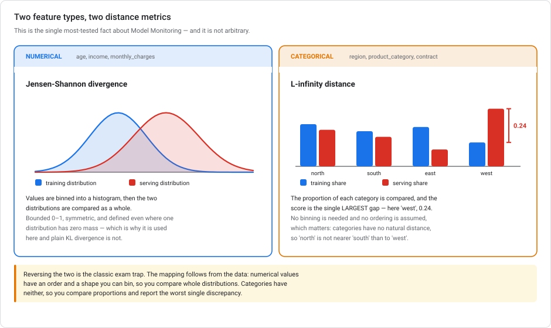
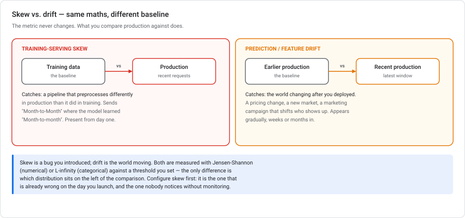
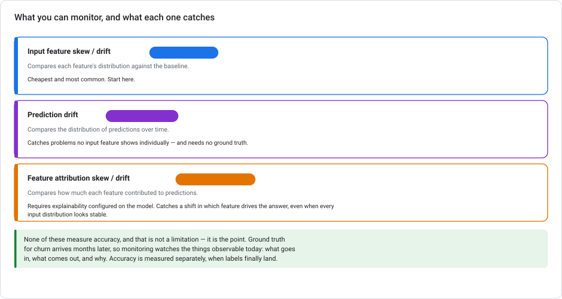

# Vertex AI Model Monitoring — skew, drift, and the two distance metrics

> **Type** Explanation module (concepts + configuration)  **Reading time** 35–45 minutes
> **Related** [Lab 3 — Serving](../labs/lab-03-serving-ml-models-lowcode.md) (Task 9 sets this up) · [Lab 5 — Feature engineering](../labs/lab-05-feature-engineering-tabular.md) · [Vertex ML Metadata](VERTEX-ML-METADATA.md)
> **Last updated** 23 August 2026

---

## The short answer

> **Numerical features → Jensen-Shannon divergence.**
> **Categorical features → L-infinity distance.**

When either score exceeds the threshold you configured, Model Monitoring raises the anomaly as **skew** or **drift**.

Reversing the two is the classic mistake. Understand the mapping instead of memorizing it, because it follows directly from what the data *is*.



### Why each metric fits its type

**Numerical features have order and shape.** `age` and `income` can be binned into a histogram, and once you have two histograms the natural question is "how different are these distributions overall?" **Jensen-Shannon divergence** answers exactly that:

- **Bounded** between 0 and 1 (using log base 2), so a threshold like `0.3` means something comparable across features
- **Symmetric** — JS(P,Q) = JS(Q,P), so it doesn't matter which you call the baseline
- **Defined everywhere**, including where one distribution has zero mass in a bin

That last property is why it's used and plain **Kullback-Leibler divergence is not**. KL is asymmetric and blows up to infinity when the baseline has zero probability where production has some, which happens constantly with real data. JS is the smoothed, symmetric, bounded fix: the average KL divergence of each distribution from their midpoint.

**Categorical features have neither order nor distance.** `region ∈ {north, south, east, west}` cannot be binned, and "north" is not closer to "south" than to "west". All you have is the *proportion* of each category. **L-infinity distance** takes the largest single gap:

```text
L∞ = max over categories of | P_training(category) − P_serving(category) |
```

In the figure, `west` went from 17% of training rows to 41% of serving rows. That is a gap of 0.24, and since it is the largest, the L∞ score is **0.24**. Also bounded 0–1, needs no binning, and assumes no ordering.

> **In short:** numerical values can be shaped into a distribution, so you compare distributions. Categories can only be counted, so you compare proportions and report the worst discrepancy.

---

## 1. Skew vs. drift — the maths is identical



Both use the same metrics against the same kind of threshold. **The only difference is what production is compared against.**

| | Training-serving skew | Drift |
|---|---|---|
| Baseline | The **training data** | **Earlier production** data |
| Catches | A bug you shipped | The world changing |
| Typical cause | Preprocessing differs between training and serving | Pricing change, new market, seasonality, a campaign |
| When it appears | Day one, silently | Gradually, weeks or months in |

**Skew is the more urgent of the two and the more commonly skipped.** A serving pipeline that sends `"Month-to-Month"` where the model learned `"Month-to-month"` produces confidently wrong predictions from the first request, with no error anywhere. Nothing but monitoring catches that.

This is also why [Lab 5](../labs/lab-05-feature-engineering-tabular.md)'s advice to bake preprocessing into the model with `TRANSFORM` matters: it makes an entire class of skew structurally impossible, so monitoring has less to catch.

---

## 2. What you can monitor



**Input feature skew/drift** — per-feature distribution comparison. Cheapest, most common, start here.

**Prediction drift** — the distribution of the model's *outputs* over time. Catches problems that no single input feature reveals, and needs no ground truth. If your churn model's mean predicted probability moves from 0.26 to 0.51, something is wrong regardless of what the inputs look like.

**Feature attribution skew/drift** — how much each feature *contributed* to predictions, compared over time. Requires explainability configured on the model. This is the subtle one. It catches a change in which feature is driving the answer, even when every input distribution looks stable. That is the signature of a relationship change rather than an input change.

> **None of these measure accuracy, and that is deliberate.** Ground truth for churn arrives months later. Monitoring watches what is observable *today* — what goes in, what comes out, and why. Accuracy evaluation is a separate exercise you run when labels finally land, using `ML.EVALUATE` as in [Lab 2](../labs/lab-02-customer-churn-lowcode-bqml.md).

---

## 3. Setting it up

### Prerequisites

1. **A deployed model** on an endpoint. For **batch** jobs the setup is different enough to live elsewhere. Monitoring is a field on the job rather than a standing resource, and it does skew only. See [batch prediction §4a](VERTEX-BATCH-PREDICTION.md).
2. **Prediction logging to BigQuery enabled** — monitoring reads the logged requests. This is the checkbox in [Lab 3, Task 3](../labs/lab-03-serving-ml-models-lowcode.md). Without it there is nothing to compare.
3. **A baseline** for skew detection.

### Baseline sources

For skew, the baseline is your training data, supplied as one of:

- A **BigQuery table** — usually the easiest, and the natural choice if you followed Lab 2
- A **CSV or TFRecord file** in Cloud Storage
- A **Vertex managed dataset**

For **drift**, you supply no baseline. Monitoring uses an earlier window of production data. **This is the answer when the training data no longer exists**, which is common for a model deployed long ago. Skew is unavailable without it, and there is no substitute. A synthetic baseline from the schema does not exist, a hand-specified distribution does not exist, and using the first week of production as "the training data" is drift detection with a misleading label on it. Configure drift and be clear about what it measures.


### One endpoint, several models — what's shared and what isn't

An endpoint can host several deployed models, and a v1 monitoring job attaches to **the endpoint**, not to a model. So some settings are necessarily common and some are per model.

**Shared across every model on the endpoint** — the docs name three explicitly:

> - *Type of detection*
> - *Monitoring frequency*
> - *Fraction of input requests monitored*
>
> *"For the other configuration parameters, you can set different values for each model."*

**Per deployed model:** the **per-feature alert thresholds**, which usually matter most. In the API they live under `modelDeploymentMonitoringObjectiveConfigs[]`, keyed by `deployedModelId`, so each model version carries its own thresholds. The default is 0.3 per feature.

**Notification settings are endpoint-level too**, though not via that three-item list: `modelMonitoringAlertConfig.emailAlertConfig.userEmails` and `notificationChannels` are **top-level job fields**, outside the per-model configs. The console states it plainly: *"Any monitoring settings you configure apply to all models deployed to the endpoint."*

So for *"consistent coverage across versions, different thresholds per version"*: **one job on the endpoint**, shared window and notifications, per-model thresholds. There is no per-model job in v1. An endpoint per model version would also cost you the traffic splitting that made a shared endpoint useful.

> **Model Monitoring v2 flips the axis.** v2 associates monitoring with **a model version**: *"You can create only one model monitor per model version"*. It also decouples from endpoints, so it can watch models served on GKE or scored in BigQuery. It is **Preview**, and Google's guidance is explicit: *"If you need production-level support and want to monitor a model that's deployed on an Agent Platform endpoint, use Model Monitoring v1."* Both can run at once.

### Alerting beyond email

Email is the default and not the limit. Model Monitoring writes to **Cloud Monitoring notification channels**, which means **Slack**, **PagerDuty** and **Pub/Sub** are configured the same way as any other alert in your project and then named in the monitoring job — `notificationChannels` alongside `emailAlertConfig`.

This matters because the alternatives look reasonable and are more work. You do **not** need to build direct webhook integrations against the Slack or PagerDuty APIs, and you do not need Pub/Sub as a sole channel with your own fan-out downstream. Create the channel once in Cloud Monitoring, then reference it.

### Console setup

**Agent Platform → Govern → Monitoring → Create monitoring job**, then:

| Setting | What it does | Sensible start |
|---|---|---|
| **Monitoring frequency** | How often the job runs | 24 hours; hourly only if you can act that fast |
| **Baseline** | Training dataset (skew) or prior window (drift) | Your `customers_ml` BigQuery table |
| **Features to monitor** | Which columns | Start with the top features from `ML.GLOBAL_EXPLAIN` |
| **Alert threshold** | Per-feature distance limit | `0.3` as a starting point, then tune — see §4 |
| **Sampling rate** | Fraction of requests analysed | 100% at low volume; sample at high volume to control cost |
| **Notification** | Email / Cloud Monitoring alert | A real inbox someone reads |

### With the SDK

```python
from google.cloud import aiplatform

aiplatform.init(project="PROJECT_ID", location="us-central1")

# Thresholds are per-feature; the key is the feature name, the value is the
# distance above which an anomaly is raised.
skew_thresholds = {
    "contract": 0.3,           # categorical -> compared with L-infinity
    "payment_method": 0.3,     # categorical -> L-infinity
    "monthly_charges": 0.3,    # numerical   -> Jensen-Shannon
    "tenure_months": 0.3,      # numerical   -> Jensen-Shannon
}
```

You set a threshold per feature. **Vertex chooses the metric from the feature's type.** You never select Jensen-Shannon or L-infinity yourself. So knowing the mapping helps you read the results, not configure them.

> **v1 vs v2.** Model Monitoring v2 introduces a reusable **`ModelMonitor`** resource that holds the baseline (training) and target (production) dataset configuration plus your monitoring objectives, so runs can be scheduled or triggered on demand against a stored config. v1 attached monitoring jobs directly to an endpoint. The distance metrics and thresholds are unchanged. v2 restructures how the configuration is stored and reused. New work should use v2.

---

## 4. Setting the threshold

`0.3` is a starting point, not an answer. A threshold too tight trains your team to ignore alerts, which is strictly worse than having none.

The approach that works:

1. **Run monitoring in observation mode** over a period you believe was healthy.
2. **Record the natural range** of each feature's distance score. Real features are never at 0 — sampling noise alone moves them.
3. **Set each threshold above that band**, per feature. A high-cardinality categorical will naturally sit higher than a stable numerical one, so a single global threshold is a compromise, not a default.
4. **Revisit after any known business change**, because the baseline is now stale by definition.

> Two features drifting **together** usually means the world changed. A payment-method migration shifts contract types with it. A **single** feature drifting alone is more often an upstream data bug. The diagnosis differs even though the response is the same: retrain on recent data, then re-check the evaluation metrics.

---

## 5. Reading an alert

An alert says a distribution moved. It does **not** say the model is broken. Work through it in order:

1. **Is it a data bug?** Check the serving pipeline first. A feature that jumps to 100% null, or a category that suddenly appears with a different spelling, is an ingestion problem, not a model problem.
2. **Did the business change?** Correlated drift across related features usually has a mundane explanation someone in marketing can give you in thirty seconds.
3. **Did performance actually degrade?** Drift is a *leading indicator*, not a verdict. If ground truth is available, evaluate on recent data before doing anything drastic.
4. **Then decide:** retrain on recent data, adjust the threshold if the new distribution is the correct one going forward, or fix the upstream pipeline.

The mistake to avoid is automatic retraining on every alert. That replaces a working model with a differently-working one on a signal that may be a spelling change in an upstream system.

---

## 5a. The other half — continuous evaluation

Everything above watches **distributions**. None of it tells you the model got *worse*, because none of it has ever seen a correct answer. When someone asks for an alert on **precision dropping below 0.85**, monitoring is the wrong tool. It is not misconfigured; it cannot answer that question at all. There is no threshold you can set on a Jensen-Shannon divergence that means "precision is 0.84".

The managed answer is a **scheduled Vertex AI Pipeline** built from the model evaluation components:

| Step | Component | What it does |
|---|---|---|
| 1 | `ModelBatchPredictOp` | Run the deployed model over a labelled evaluation set |
| 2 | `ModelEvaluationClassificationOp` | Compute precision, recall, AUC, confusion matrix from predictions + ground truth |
| 3 | `ModelEvaluationOp` / import | Attach the metrics to the model version in the Registry, so they're visible in the console and comparable across versions |
| 4 | your own gate component | Compare precision against 0.85 and write a Cloud Monitoring metric (or fail the step) when it's below |
| 5 | Cloud Monitoring alerting policy | Fire the notification channel: email, PagerDuty, Slack, Pub/Sub |

Schedule it with `create_schedule()` exactly as in [Kubeflow Pipelines §10](KUBEFLOW-PIPELINES-ON-GCP.md#10-scheduling), and the whole thing is components-plus-config rather than code you maintain.

### The components, by task type

`ModelEvaluationClassificationOp` is one of a family — reach for the one matching your task:

| Component | For |
|---|---|
| `ModelEvaluationClassificationOp` | classification — precision, recall, AUC, confusion matrix |
| `ModelEvaluationRegressionOp` | regression — MAE, RMSE, R² |
| `ModelEvaluationForecastingOp` | forecasting |

**One more is easy to leave out and changes the outcome.** `ModelImportEvaluationOp` **attaches the computed metrics to the model version in the Registry**. That is what makes them visible in the console alongside the model, instead of sitting in a pipeline artifact nobody opens. If the requirement is *"metrics visible next to the model"*, that component is the requirement.

So a weekly continuous-evaluation pipeline for a regression model is four steps and a schedule:

```python
# in the pipeline
preds = ModelBatchPredictOp(model=model, gcs_source=..., ...)
evaluation = ModelEvaluationRegressionOp(
    model=model,
    predictions_gcs_source=preds.outputs["gcs_output_directory"],
    ground_truth_gcs_source=GROUND_TRUTH,
)
ModelImportEvaluationOp(                      # <- puts it in the Registry
    model=model,
    regression_metrics=evaluation.outputs["evaluation_metrics"],
)
```

```python
# then, once
job = aiplatform.PipelineJob(display_name="clv-weekly-eval",
                             template_path="clv_eval.yaml")
job.create_schedule(display_name="weekly-clv-eval",
                    cron="0 6 * * 1", timezone="Asia/Jakarta",
                    max_concurrent_run_count=1)
```

**Nothing else is required.** The scheduler is native to Vertex AI Pipelines ([§10](KUBEFLOW-PIPELINES-ON-GCP.md#10-scheduling)), so wrapping the pipeline in a Cloud Run service and poking it with Cloud Scheduler adds two services to operate and buys nothing. Compiling to YAML and triggering by hand each week satisfies neither "automatic" nor "low overhead". And a Composer DAG running `ML.EVALUATE` means a permanently-running Airflow environment. It also leaves the BigQuery results out of the console beside the model, which was half the requirement.


**Why not the alternatives:**

| Instead | Why not |
|---|---|
| Model Monitoring with a "precision threshold" | There isn't one. Monitoring compares input and output *distributions* against a baseline; it never sees labels. |
| A Cloud Function that calls the endpoint and computes precision with sklearn | You now own the metric maths, the storage, the alerting logic, and the dependency updates — to reproduce a component that already exists. |
| A custom **training** job that runs the evaluation | A training job is the wrong resource for scoring, and you still write all the evaluation code yourself. |

> **The distinction:** monitoring watches the *inputs* continuously and needs no labels. Continuous evaluation scores the *outputs* periodically and needs labels. You want both: one is your early warning, the other is your verdict.

The catch is the same one from §2: **you need labelled data on a schedule.** A held-out test set works for detecting regressions after a retrain. Measuring live production performance needs ground truth as it arrives, which for churn is months later. Run the evaluation on whatever cadence labels actually land at, not on whatever cadence feels responsive.

---

## 6. Cost and limits

**Cost** is driven by the volume of prediction data analysed. Sampling is your main lever, along with monitoring fewer features and running daily rather than hourly. Monitoring itself is cheap relative to the endpoint it watches. Check [current pricing](https://cloud.google.com/vertex-ai/pricing) before committing at high volume.

**Limits to keep in mind:**

- Feature monitoring targets **tabular** models. Unstructured inputs need a different approach — monitor derived features or embeddings instead.
- **Attribution monitoring requires explainability** to be configured on the model, which not every model type supports. Also, **Vertex Explainable AI is sunsetting on 16 March 2027** (deprecated 16 March 2026). Attribution monitoring is not itself deprecated and carries no banner, but it is built on an `ExplanationSpec`. Treat it as time-limited and don't design new monitoring around it. **Skew and drift monitoring are unaffected**, because they involve no explainability at all. See [Fairness and bias](VERTEX-FAIRNESS-AND-BIAS.md) for the full scope.
- **Prediction logging must be enabled** before monitoring can see anything — turning it on later does not backfill.
- A monitoring job that never fires is not proof of health. Verify it is running, in the same spirit as [Lab 3](../labs/lab-03-serving-ml-models-lowcode.md)'s advice to alert when a scheduled job *doesn't* run.

---

## 6a. API version note — `v1` vs `v1beta1` here

This module is the clearest case of **two version axes stacking**: a v2 *feature generation* living on a v1beta1 *API surface*.

| | `v1` (GA) | `v1beta1` (Preview) |
|---|---|---|
| Resource | `ModelDeploymentMonitoringJob`, attached to an endpoint | `ModelMonitor` + `ModelMonitoringJob` |
| Generation | the original design | **Model Monitoring v2** |
| Config | per-endpoint | a reusable `ModelMonitor` holding baseline + objectives |
| Python | `aiplatform` | `vertexai.resources.preview.ml_monitoring` |

**Concretely:** the reusable `ModelMonitor` resource, which is what "Model Monitoring v2" usually means, is reached through **`v1beta1`** (`projects.locations.modelMonitors`). Pin to `v1` and you get the older monitoring job attached directly to an endpoint instead.

So *"use Model Monitoring v2"* and *"use the v1beta1 API"* are not competing instructions. The first is a product generation, the second a stability contract, and here they coincide.

**What does not change either way:** the distance metrics. Jensen-Shannon for numerical, L-infinity for categorical, in both generations. The maths in §1 is not a preview feature.

See [API versions and launch stages](GCP-API-VERSIONS-AND-LAUNCH-STAGES.md) for the four different things called "version".

---

## 7. Anti-patterns

**Monitoring nothing because you have no ground truth.** The most common failure. Skew and drift are observable today; accuracy isn't. Monitor what you can see.

**One global threshold for every feature.** A five-category column and a continuous one have different natural noise floors. That is why the configuration is per feature.

**Auto-retraining on every alert.** See §5. Diagnose before you retrain.

**Monitoring every feature.** Alert fatigue is real. Start with the features that drive predictions: the top of `ML.GLOBAL_EXPLAIN` from [Lab 5](../labs/lab-05-feature-engineering-tabular.md).

**Skipping skew because drift sounds more sophisticated.** Skew is present on day one and is a bug you can fix. Drift takes months to appear. Configure skew first.

**Forgetting prediction logging.** Everything else is configured correctly and the job silently has nothing to read.

---

## 8. Test your understanding

<details markdown="1">
<summary><b>1.</b> Which metric applies to <code>region</code>, and which to <code>income</code>?</summary>

`region` is categorical → **L-infinity distance**, the largest absolute gap between any category's training and serving proportions. `income` is numerical → **Jensen-Shannon divergence**, comparing the binned distributions as a whole. Reversing them is the standard mistake.
</details>

<details markdown="1">
<summary><b>2.</b> Why Jensen-Shannon rather than Kullback-Leibler for numerical features?</summary>

KL is asymmetric and becomes infinite when the baseline assigns zero probability to a bin that production populates, which happens routinely with real data. JS is the symmetric, smoothed variant: the average KL divergence of each distribution from their midpoint, bounded 0–1, and finite everywhere. Bounded matters in practice, because one threshold value then means roughly the same thing across features.
</details>

<details markdown="1">
<summary><b>3.</b> Why not use Jensen-Shannon for categorical features too?</summary>

You could compute something, but it would imply structure that isn't there. JS compares distributions, which presumes bins in a meaningful arrangement. Categories have no order or distance: "north" isn't nearer "south" than "west". L-infinity only compares proportions category by category and reports the worst gap, which assumes nothing about ordering and needs no binning.
</details>

<details markdown="1">
<summary><b>4.</b> Skew and drift both alert on the same feature. Same investigation?</summary>

No. **Skew** means production differs from the *training data*, most likely a preprocessing mismatch in your serving pipeline, present since launch. **Drift** means recent production differs from *earlier production*, so the world changed after you deployed. The metric and threshold are identical. Only the baseline differs, and that difference points at completely different causes.
</details>

<details markdown="1">
<summary><b>5.</b> Your model has no ground truth for six months. Is monitoring pointless?</summary>

The opposite — it's the only signal you have. Accuracy is unavailable, but input distributions, prediction distributions, and feature attributions are all observable today. Prediction drift is especially valuable here: a mean predicted probability moving from 0.26 to 0.51 is actionable immediately, without a single label.
</details>

<details markdown="1">
<summary><b>6.</b> Everything is configured, the job runs, and it never alerts. Healthy?</summary>

Unknown. Check that prediction logging is enabled and populating, that the features you configured match the names actually being logged, and that the thresholds aren't so loose nothing could trip them. A monitoring job that has never fired is indistinguishable from one that isn't working. So verify that it can fire, rather than assuming silence is good news.
</details>

---

## 9. 2026 notes

| Change | Effect |
|---|---|
| **Vertex AI → Gemini Enterprise Agent Platform** (console entry removed 21 May 2026) | Monitoring now sits under **Agent Platform → Govern → Monitoring**. The API, IAM roles, and metrics are unchanged. |
| **Model Monitoring v2** | Introduces the reusable `ModelMonitor` resource holding baseline/target dataset config and objectives. Distance metrics and thresholds unchanged. Prefer v2 for new work. |
| **Feature Store optimized online serving deprecated** (no new features since 17 May 2026; APIs sunset 17 Feb 2027) | If you monitor *features* through Feature Store rather than the endpoint, check what you're building on. Endpoint-based monitoring is unaffected. |

---

## Summary

Vertex AI Model Monitoring compares a production distribution against a baseline, using **Jensen-Shannon divergence for numerical features** and **L-infinity distance for categorical features**, and raises an anomaly when the distance exceeds your per-feature threshold. Whether it is called **skew** or **drift** depends only on the baseline: training data for skew, earlier production for drift. You can watch input features, predictions, or feature attributions. None of these measure accuracy, because accuracy needs ground truth you usually don't have yet. These are the signals you *do* have today.

---

## References

- [Introduction to Model Monitoring](https://docs.cloud.google.com/vertex-ai/docs/model-monitoring/overview)
- [Monitor feature skew and drift](https://cloud.google.com/vertex-ai/docs/model-monitoring/using-model-monitoring)
- [Monitor feature attribution skew and drift](https://docs.cloud.google.com/gemini-enterprise-agent-platform/machine-learning/model-monitoring/monitor-explainable-ai)
- [Set up model monitoring](https://docs.cloud.google.com/gemini-enterprise-agent-platform/machine-learning/model-monitoring/set-up-model-monitoring)
- [Run monitoring jobs](https://docs.cloud.google.com/vertex-ai/docs/model-monitoring/run-monitoring-job)
- [Model Monitoring v2 notebook samples](https://github.com/GoogleCloudPlatform/vertex-ai-samples/tree/main/notebooks/official/model_monitoring_v2)
- [Jensen–Shannon divergence](https://en.wikipedia.org/wiki/Jensen%E2%80%93Shannon_divergence)
