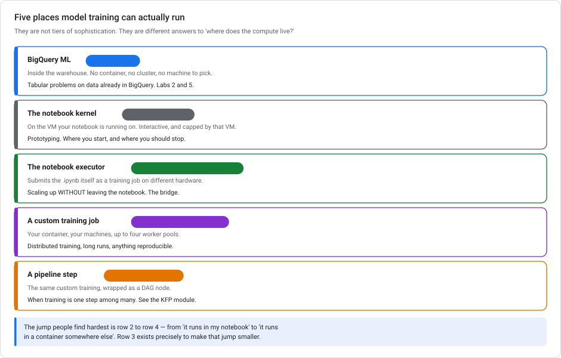
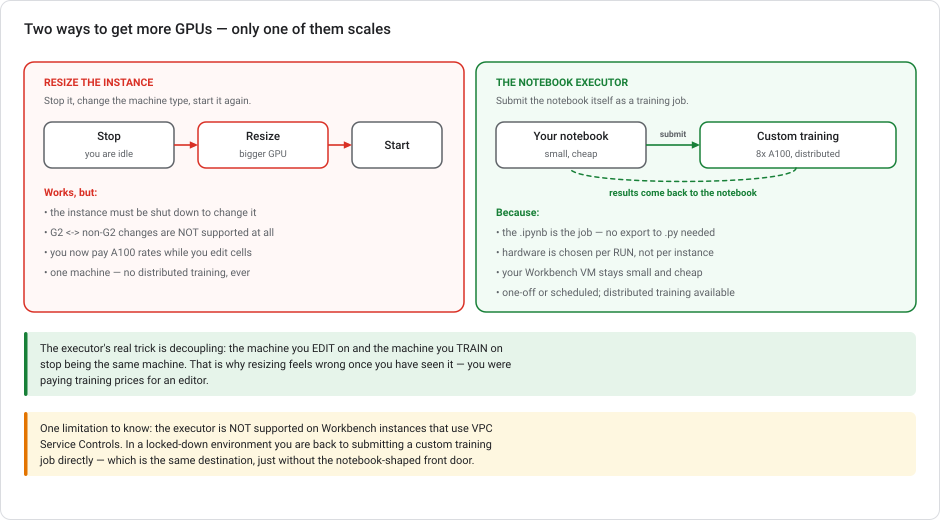
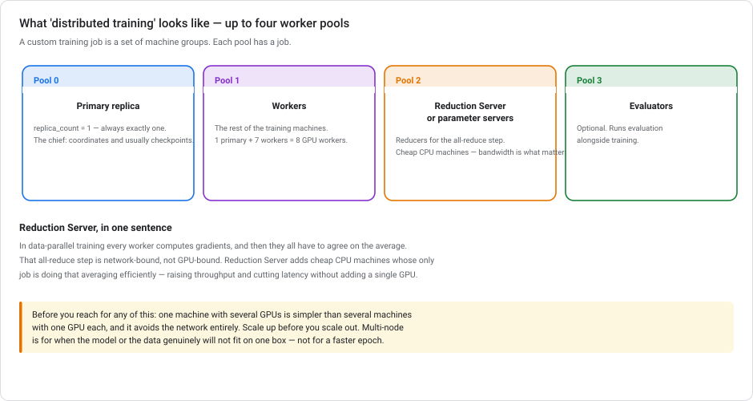
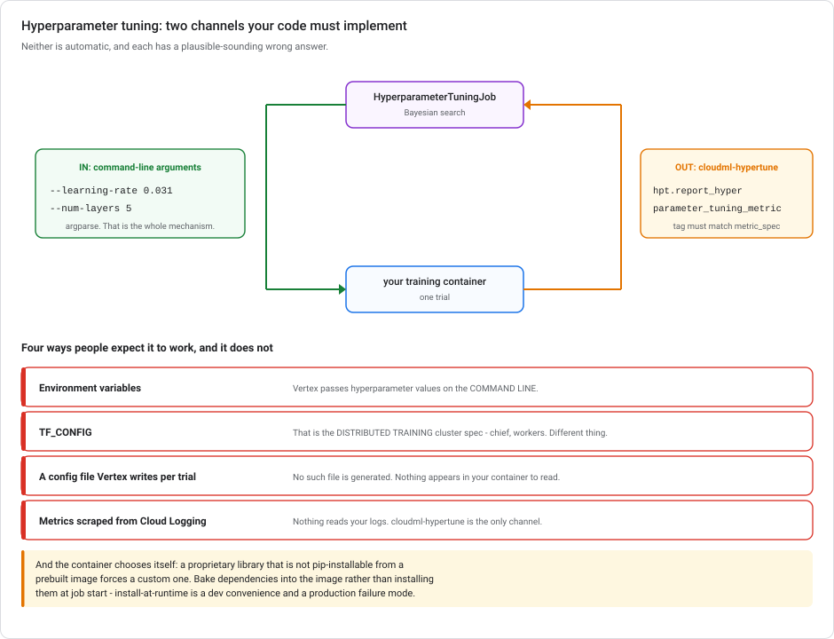

# Where model training runs on Google Cloud

> **Type** Explanation module (theory, no console steps)  **Reading time** 35–45 minutes
> **Related** [Lab 2 — Churn with BigQuery ML](../labs/lab-02-customer-churn-lowcode-bqml.md) · [Kubeflow Pipelines](KUBEFLOW-PIPELINES-ON-GCP.md) · [Vertex AI autoscaling](VERTEX-AUTOSCALING.md) · [Scaling prototypes into ML models](SCALING-PROTOTYPES-TO-ML.md)
> **Last updated** 23 August 2026

---

## Scaling past your notebook's GPU

You prototyped a deep learning model in a notebook on a small GPU. It works. Now you need to train on the full dataset with multiple GPUs, and every option feels wrong:

- Resize the notebook VM? Then you pay A100 rates to edit cells.
- Export to a `.py` and submit a training job? Then you leave the environment you were working in.
- Create a whole new instance? For one training run?

There is a fourth option that is less well known, and it was designed for exactly this moment.

---

## 1. Five places training can run



These are not tiers of sophistication. They are different answers to *where does the compute live?*

| Where | What it is | When |
|---|---|---|
| **BigQuery ML** | `CREATE MODEL` inside the warehouse | Tabular data already in BigQuery — [Labs 2](../labs/lab-02-customer-churn-lowcode-bqml.md) and [5](../labs/lab-05-feature-engineering-tabular.md) |
| **The notebook kernel** | On the VM your notebook runs on | Prototyping. Where you start — and where you should stop |
| **The notebook executor** | Submits the `.ipynb` itself as a training job | **Scaling up without leaving the notebook** |
| **A custom training job** | Your container, your machines, worker pools | Distributed training, long runs, reproducibility |
| **A pipeline step** | The same custom training, as a DAG node | When training is one step among many — see [KFP](KUBEFLOW-PIPELINES-ON-GCP.md) |

The hardest jump is **row 2 to row 4**, from "it runs in my notebook" to "it runs in a container somewhere else". Row 3 exists to make that jump smaller.

---

## 2. Workbench, and the 2026 state of it

**Vertex AI Workbench** (now surfaced as **Agent Platform Workbench**) is a managed JupyterLab VM. You pick a machine type and GPUs, it runs, you pay while it exists.

### The deprecation history matters

Workbench had three flavours, and two are gone:

| Flavour | Status |
|---|---|
| **Managed notebooks** | Support ended **30 Jan 2025**. Existing instances kept running until **30 March 2026** — that date has passed, so they are gone. |
| **User-managed notebooks** | Superseded by Instances; a migration tool exists. |
| **Workbench Instances** | The current product. |

This matters when reading older material: **the notebook executor was originally a managed-notebooks feature**, so tutorials about it often reference a product that no longer exists. The executor itself carried over to Workbench Instances and is still there.

### Changing the machine type

You *can* resize a Workbench instance, but there are two constraints:

1. **The instance must be shut down** to change machine type or GPUs.
2. **You cannot change between a G2 machine type and a non-G2 machine type.** A G2 instance can only become a different G2; a non-G2 can only become a different non-G2. To cross that line you create a new instance.

G2 machines are the L4-GPU family. So "my instance has an L4, I want an A100 (A2 family)" is the unsupported change. You would be creating a new instance anyway.

---

## 3. The notebook executor



The executor runs a notebook file **from start to finish as a job on Vertex AI custom training**, with a machine type and accelerators you choose *per run*, independent of the Workbench instance you launched it from.

One-time or scheduled. The notebook is the job, and there is no export step.

### Why this is the right shape for that problem

Compare the two approaches:

| | Resize the instance | Notebook executor |
|---|---|---|
| Editing hardware | The big expensive one | Stays small and cheap |
| Training hardware | Same machine | Chosen per run |
| Distributed training | Impossible — one VM | Supported |
| G2 ↔ non-G2 | Not supported at all | Irrelevant |
| Downtime | Must stop and restart | None |
| Code changes | None | None |

**The trick is decoupling.** The machine you *edit* on and the machine you *train* on stop being the same machine. Once you've seen that, resizing looks like what it is: paying training prices for a text editor.

The executor also unlocks things a single VM cannot do at all: distributed training across machines, hyperparameter tuning, and scheduled continuous training.

### The limitation to know

**The executor is not supported on Workbench instances that use VPC Service Controls.** In a locked-down environment you submit a custom training job directly instead. Same destination, without the notebook-shaped front door.

### Why the obvious alternatives are worse

- **Resize the instance.** Works for a bigger single GPU, but ties expensive hardware to your editing session, can't do distributed training, and hits the G2 restriction.
- **Export to `.py`, submit a custom training job.** This is a *correct* approach and what you'd eventually automate. But as an immediate answer it adds manual steps and leaves the notebook. The executor gets you the same compute without the detour. (For a *pipeline*, you do want a real script or component. See [KFP](KUBEFLOW-PIPELINES-ON-GCP.md).)
- **A Dataproc-enabled instance.** Dataproc is Spark — distributed **data processing**, not GPU deep learning. Right tool, wrong problem. Spark is for the ETL that feeds training, not the training.

---

## 4. Custom training jobs and worker pools

Whether you arrive via the executor or submit directly, the destination is the same: a **custom training job**, which Google's docs increasingly call **serverless training**. You supply code and a machine spec, and no cluster is yours to manage.



A job is defined as **up to four worker pools**:

| Pool | Role |
|---|---|
| **0** | **Primary replica** — `replica_count = 1`, always exactly one. The chief: coordinates, usually checkpoints. |
| **1** | **Workers** — the rest of the training machines. 1 primary + 7 workers = 8 GPU workers. |
| **2** | **Reduction Server reducers**, or parameter servers |
| **3** | **Evaluators** — optional, runs evaluation alongside training |

Single-node training uses **pool 0 only**. That is the common case and there is nothing wrong with it.

### Containers

- **Prebuilt containers** for TensorFlow, PyTorch, scikit-learn and XGBoost — supply a Python training application and go.
- **Custom containers** when you need a specific framework version, a system dependency, or your own image.

### Where the model goes

**Training VMs are ephemeral. They are deleted when the job finishes, and you cannot get anything off them afterwards.** No SSH, no disk to attach, no post-mortem. Anything you want to keep has to leave the machine *while the job is still running*.

In practice that means: **your training code writes checkpoints and the final model to Cloud Storage itself.** Vertex AI does not go looking through the container filesystem for model files. There is no "collect artifacts" setting, because the platform has no way to know which of your files are the model.

TensorFlow reads and writes `gs://` paths natively, so this is not extra work:

```python
import os
import tensorflow as tf

model_dir = os.environ["AIP_MODEL_DIR"]           # gs://... , set by Vertex AI
ckpt_dir = os.environ.get("AIP_CHECKPOINT_DIR", model_dir + "checkpoints/")

model.fit(
    train_ds,
    epochs=30,
    callbacks=[tf.keras.callbacks.ModelCheckpoint(ckpt_dir, save_freq="epoch")],
)

model.save(model_dir)                              # writes the SavedModel to GCS
```

`tf.io.gfile` works the same way for anything else you need to write. PyTorch and scikit-learn need an explicit upload (`google.cloud.storage`, or `gcsfs`), but the rule is identical.

**The environment variables Vertex AI sets for you:**

| Variable | What it holds |
|---|---|
| `AIP_MODEL_DIR` | A **Cloud Storage URI** — where Vertex expects the final model. Model Registry looks here when you register the job's output. |
| `AIP_CHECKPOINT_DIR` | A Cloud Storage URI for intermediate checkpoints. |
| `AIP_TENSORBOARD_LOG_DIR` | Where to write TensorBoard event files. |

### Streaming metrics while it trains — Vertex AI TensorBoard

The same environment-variable pattern covers TensorBoard. Vertex AI sets **`AIP_TENSORBOARD_LOG_DIR`** to a Cloud Storage location it streams from, so your callback writes there and the metrics appear in near real time while the job runs:

```python
import os
import tensorflow as tf

tensorboard_cb = tf.keras.callbacks.TensorBoard(
    log_dir=os.environ["AIP_TENSORBOARD_LOG_DIR"],
    histogram_freq=1,
)

model.fit(train_ds, epochs=30, callbacks=[tensorboard_cb])
```

**Read the variable rather than constructing the path.** The staging bucket is what Vertex *uses* to set `AIP_TENSORBOARD_LOG_DIR`, but the variable carries the correct per-run subdirectory beneath it. Point the callback at the bucket directly and runs write over each other. And `GOOGLE_CLOUD_PROJECT` is the project ID, not a path. It comes up here only because it is the other environment variable that is easy to remember.

**Writing to a local path defeats the feature.** `/tmp/tensorboard_logs` plus a sync job gets the data to Cloud Storage eventually, which is not the same as near real-time. It is also more code to maintain than reading one variable.

> **`AIP_MODEL_DIR` is a Cloud Storage path, not a local directory.** This is easy to miss. Vertex sets the variable so you don't have to construct the bucket path yourself, but *you* still do the writing. Nothing syncs a local folder for you after the job ends, because by then there is no folder.

**Why checkpointing matters beyond crash recovery:** it is what makes [Spot VMs](#6-what-training-actually-costs) usable. A preempted job resumes from the last checkpoint instead of starting over. That is what makes a 60–91% discount safe to take. No checkpoints, no Spot.

### Reduction Server

In data-parallel training, every worker computes gradients and they all have to agree on the average. That **all-reduce step is network-bound, not GPU-bound**. Past a certain scale you are not waiting on GPUs. You are waiting on the network.

Reduction Server adds cheap CPU machines (pool 2) whose only job is doing that averaging efficiently. It raises throughput and cuts latency **without adding a single GPU**. When sizing reducers, network bandwidth of the machine type is what matters, not cores.

> **Scale up before you scale out.** One machine with 8 GPUs is simpler than 8 machines with one GPU each, and it avoids the network entirely, because NVLink beats Ethernet by a wide margin. Multi-node is for when the model or data will not fit on one box, not for a faster epoch. Reach for a single `a2-highgpu-8g` before you reach for worker pools.

---

## 4a. Containers: prebuilt or your own

Every custom training job runs in a container. You get two ways to supply one, and the choice is usually made for you by your dependencies.

| | **Prebuilt container** | **Custom container** |
|---|---|---|
| You supply | A Python training application | A Docker image |
| Google supplies | TensorFlow / PyTorch / scikit-learn / XGBoost, pinned | nothing |
| Good for | Standard frameworks, standard packages | Specific versions, system dependencies, **private or proprietary libraries** |
| Startup | fast — the image is cached | fast, once pulled from Artifact Registry |

**The deciding question is whether your dependencies can be installed at all.** A proprietary internal library, a wheel from a private index, a C extension needing system packages: none of those are `pip install`-able inside a prebuilt container at job start. Even where they are, you have moved a build step into every run. That means slower startup, and a job that fails when an index is unreachable.

### How each is expressed in the `WorkerPoolSpec`

The two routes are **mutually exclusive fields** on the worker pool, and picking the wrong one is a configuration error rather than a performance problem.

| | Prebuilt container + your code | Your own image |
|---|---|---|
| Field | **`pythonPackageSpec`** | **`containerSpec`** |
| You supply | a Python **source distribution** in Cloud Storage | an image in **Artifact Registry** |

```json
{
  "workerPoolSpecs": [{
    "machineSpec": {"machineType": "n1-standard-8"},
    "replicaCount": 1,
    "pythonPackageSpec": {
      "executorImageUri": "us-docker.pkg.dev/vertex-ai/training/tf-cpu.2-15:latest",
      "packageUris": ["gs://my-bucket/trainer-0.1.tar.gz"],
      "pythonModule": "trainer.train",
      "args": ["--epochs=30"]
    }
  }]
}
```

| Field | Holds |
|---|---|
| `executorImageUri` | **which prebuilt container** runs your package |
| `packageUris` | **Cloud Storage** URIs of your `.tar.gz` source distributions |
| `pythonModule` | the **entry point**, in dotted form — `trainer.train` for `train.py` inside a `trainer` package |
| `args` | command-line arguments passed to that module |

Vertex installs the packages into the prebuilt container and runs the module. You do not write a Dockerfile, and you do not `pip install` anything at runtime.

> **You cannot set both.** `containerSpec` and `pythonPackageSpec` are alternatives, not layers. There is no merging. If you have an image, you have a `containerSpec` and your dependencies are already inside it.

> **Python packages go to Cloud Storage, not Artifact Registry.** Artifact Registry holds container images (and language packages for `pip`, but that is not this field). `packageUris` takes `gs://` URIs. Nor is there any way to combine an image URI with a prebuilt container URI. `imageUri` names the *one* image that runs.

> **Bake dependencies into an image; don't install them at runtime.** The same reasoning as [Dataproc custom images](../../data-eng-gcp/modules/DATAPROC-AND-SPARK.md) and as pinning versions in [KFP components](KUBEFLOW-PIPELINES-ON-GCP.md). Install-at-startup is a development convenience that becomes a production failure mode.

---

## 4b. Hyperparameter tuning

Vertex AI's `HyperparameterTuningJob` wraps a custom training job and runs it many times with different hyperparameter values, using Bayesian optimisation to choose what to try next rather than sweeping a grid.

For that loop to work, your training code has to do **two specific things**, and neither is automatic.



### 1. Read hyperparameters from **command-line arguments**

Vertex passes each trial's values as **`--flags` on the command line**. Not environment variables. Not a config file it writes for you.

```python
import argparse

parser = argparse.ArgumentParser()
parser.add_argument("--learning-rate", type=float, default=0.01)
parser.add_argument("--num-layers", type=int, default=3)
args = parser.parse_args()
```

> **`TF_CONFIG` is not where hyperparameters live.** It's the environment variable describing the **cluster topology** for distributed training: which host is chief, which are workers. Different mechanism, different purpose.

### 2. Report the metric with **`cloudml-hypertune`**

Vertex cannot infer what you're optimising. You report it explicitly, using the `cloudml-hypertune` library, which writes to a location the service reads:

```python
import hypertune

hpt = hypertune.HyperTune()
hpt.report_hyperparameter_tuning_metric(
    hyperparameter_metric_tag="accuracy",     # must match the job's metric_spec
    metric_value=eval_accuracy,
    global_step=epoch,
)
```

The `hyperparameter_metric_tag` has to match the tag in the job's `metric_spec` exactly, or the service sees no metric and every trial looks identical.

> **Writing your metric to Cloud Logging, or to a JSON file of your own choosing, does nothing.** There is no scraping of your logs. `cloudml-hypertune` is the channel.

### Putting it together

```python
from google.cloud import aiplatform

worker_pool_specs = [{
    "machine_spec": {"machine_type": "n1-standard-8",
                     "accelerator_type": "NVIDIA_TESLA_T4", "accelerator_count": 1},
    "replica_count": 1,
    "container_spec": {                       # custom image: proprietary lib + hypertune
        "image_uri": "us-central1-docker.pkg.dev/PROJECT/training/pytorch-custom:1.4",
        "args": [],
    },
}]

job = aiplatform.HyperparameterTuningJob(
    display_name="churn-pytorch-hpt",
    custom_job=aiplatform.CustomJob(display_name="trial",
                                    worker_pool_specs=worker_pool_specs),
    metric_spec={"accuracy": "maximize"},
    parameter_spec={
        "learning-rate": aiplatform.hyperparameter_tuning.DoubleParameterSpec(
            min=1e-4, max=1e-1, scale="log"),
        "num-layers": aiplatform.hyperparameter_tuning.IntegerParameterSpec(
            min=2, max=8, scale="linear"),
    },
    max_trial_count=24,
    parallel_trial_count=4,
)
job.run()
```

### Choosing the trial counts

Two numbers, and they trade against different things.

**`maxTrialCount` — the floor is 10× your hyperparameter count.**

> *"To get the most out of hyperparameter tuning, you shouldn't set your maximum value lower than ten times the number of hyperparameters you use."*

Note the shape of that sentence. It is a **floor stated negatively**, not a target. Tuning four hyperparameters means **at least 40 trials**. Bayesian optimisation learns the response surface from completed trials, and below roughly ten points per dimension it has not seen enough to model interactions rather than just marginals.

Going far above it isn't automatically better either: *"Usually, there is a point of diminishing returns after which additional trials have little or no effect on the accuracy."* The docs' own advice on a budget is to *"start with a small number of trials to gauge the effect your chosen hyperparameters have on your model's accuracy"* before committing to a large run.

> **Each hyperparameter you add raises the floor by ten trials.** *"Every hyperparameter that you choose to tune has the potential to increase the number of trials required for a successful tuning job."* Tuning eight instead of four doubles the minimum spend. That is the real argument for choosing carefully rather than tuning everything. The docs decline to give a recommended maximum, because there isn't a universal one.

**`parallelTrialCount` — buys wall-clock, costs search quality.**

> *"Running parallel trials has the benefit of reducing the time the training job takes… However, running in parallel can reduce the effectiveness of the tuning job overall… When running in parallel, some trials start without having the benefit of the results of any trials still running."*

Both fields are **required**. Cost note: each parallel trial provisions its own training cluster from your worker pool spec, so parallelism multiplies concurrent spend, not total spend.

**`maxFailedTrialCount` — set it rather than inheriting the default.** Left unset, Vertex ends the job immediately if the *first* trial fails, which is reasonable because that suggests broken code. It may also end the job later based on failure count or ratio. The docs add: *"These rules are subject to change. To ensure a specific behavior, set the `maxFailedTrialCount` field."* It must be ≤ `maxTrialCount`.

### The search algorithm

Leave `algorithm` unset and you get the default: Bayesian optimisation, *"Gaussian process bandits, linear combination search, or their variants."* The two alternatives are narrow:

| `algorithm` | Use when |
|---|---|
| *(unset)* | Almost always. Learns from previous trials. |
| `GRID_SEARCH` | You want to exhaust a small discrete space. **All parameters must be `INTEGER`, `CATEGORICAL` or `DISCRETE`** — no `DOUBLE`. Useful when your trial count exceeds the number of points, where the default may otherwise suggest duplicates. |
| `RANDOM_SEARCH` | A baseline, or a truly uninformative space. |

> **A bonus that isn't widely known:** *"If you are doing hyperparameter tuning against similar models, changing only the objective function or adding a new input column, Agent Platform is able to improve over time and make the hyperparameter tuning more efficient."* Tuning transfers across jobs, so re-tuning a familiar model is cheaper than the first time.

> **Two traps.** The console shows an **Enable early stopping** toggle that the docs tell you to *"Ignore… which has no effect"*. The legacy `enableTrialEarlyStopping` field does not exist in Vertex AI. Early stopping is configured through `StudySpec`: `decayCurveStoppingSpec`, `medianAutomatedStoppingSpec`, `convexAutomatedStoppingSpec`, or `studyStoppingConfig`. And **hyperparameter tuning jobs cannot use TPUs.**

**`parallel_trial_count` is a real trade-off.** Higher means faster wall-clock and *worse* search: Bayesian optimisation picks each trial using what earlier trials returned, and trials running simultaneously can't learn from each other. Four parallel out of twenty-four is a reasonable balance. Twenty-four parallel is a random grid search wearing a Bayesian hat.

**`scale="log"`** matters for learning rates. Searching 0.0001–0.1 linearly spends almost every trial above 0.01. Log scale spreads them across the orders of magnitude you care about.

> **The BigQuery ML equivalent is `NUM_TRIALS`** — see [Lab 2](../labs/lab-02-customer-churn-lowcode-bqml.md#automated-hyperparameter-tuning). Same idea, one SQL option, no container and no reporting code. If your model is BQML, that is all you need.

---

## 4c. Getting the hardware at all

Picking `a2-highgpu-8g` is the easy half. The hard half is that eight A100s are not always sitting there waiting, and *how you ask for them* is a field on the job.

**`scheduling.strategy`** on a `CustomJob` decides which capacity pool you draw from:

| Strategy | What it means | Can it be interrupted? |
|---|---|---|
| **`STANDARD`** | Ordinary on-demand provisioning. Fails immediately if there's no capacity. | No |
| **`SPOT`** | Spot resources, 60–91% cheaper | **Yes — at any time, to reclaim capacity** |
| **`FLEX_START`** | **Dynamic Workload Scheduler.** Queue for capacity and start when it appears. | Not for capacity — it runs its allotted time |

> **Two deprecated values you'll still meet.** `ON_DEMAND` and `LOW_COST` are **valid enum members** (the API accepts them), but both are marked deprecated in the API definition. `STANDARD` replaced `ON_DEMAND` and `SPOT` replaced `LOW_COST`. So if you read somewhere that `ON_DEMAND` "isn't a valid strategy", that is not quite right. It is valid. It is the old spelling, and it should not go in new code.

### Flex-start — queue instead of failing

Dynamic Workload Scheduler is for the very common shape: *"I want 8 A100s, I don't need them this second, and I'd rather wait than get an error."*

```yaml
workerPoolSpecs:
  machineSpec:
    machineType: a2-highgpu-8g
  replicaCount: 1
  containerSpec:
    imageUri: us-central1-docker.pkg.dev/PROJECT/training/pytorch:1.4
scheduling:
  strategy: FLEX_START
  maxWaitDuration: 86400s      # how long to queue. 0 = wait indefinitely. Default 24h.
```

| Field | Meaning |
|---|---|
| `scheduling.strategy: FLEX_START` | Queue through DWS rather than failing on no capacity |
| `scheduling.maxWaitDuration` | **How long to wait in the queue before giving up.** Default **24 hours**; `0` means wait indefinitely. This is queue time, *not* run time. |
| `scheduling.timeout` | The maximum **running** time. Default and ceiling under flex-start: **7 days**. |

**Constraints to keep in mind:**

- **Supported accelerators:** L4, A100, H100, H200, B200. Notably **not TPUs**, for Vertex custom training.
- **Maximum runtime is 7 days** — the docs require *"a maximum timeout of 7 days or less"*.
- **Discount:** up to ~53% off on-demand. Real, and much less than Spot's 91%.

### Flex-start versus Spot — how to choose

This is the one that matters for a multi-day job.

**Spot can be taken away at any moment.** Google's own framing for spot is that you *"allow Compute Engine to stop or delete compute instances at any time to reclaim capacity."* For a three-day training run, that means you need checkpointing and you accept restarts.

**Flex-start is not reclaimed for capacity.** Compute Engine's description: flex-start VMs *"run uninterrupted for up to seven days"*, after which they're stopped at the deadline. The queue is at the *front*. You wait to start, instead of waiting throughout the run.

> **One confusing bit of Google's own vocabulary.** The AI Hypercomputer comparison table labels **both** Spot and flex-start as "Preemptible". That's using the word loosely to mean "has a bounded lifespan", not "can be yanked mid-run for someone else". The main difference stands: Spot is interrupted for capacity, flex-start runs its allotted duration.

So for *"8 A100s, run as soon as resources are available, expected to run 3 days"*: **`a2-highgpu-8g` with `FLEX_START` and a `maxWaitDuration`.** Spot would be cheaper and can be preempted on day two. And asking for `a2-megagpu-16g` buys 16 GPUs you didn't need, and **larger machines do not get queue priority**.

### And the other consumption models

| Model | Capacity assurance | Duration | Use when |
|---|---|---|---|
| **On-demand** (`STANDARD`) | none — fails if unavailable | unbounded | Small jobs, common hardware |
| **Spot** | none, and interruptible | unbounded | Fault-tolerant work that checkpoints |
| **Flex-start** (DWS) | **best-effort queue** | **≤ 7 days** | Short training runs that can wait to start |
| **Reservations** | **very high** | user-defined | Critical workloads that must run now |
| **Future reservations, calendar mode** | **very high** | **1–90 days** | Large clustered training with a known start date |

Calendar mode reserves up to 80 GPU VMs for 1–90 days, and the commitment is real: *"You commit to pay for the requested capacity from the request's start time, whether you use the capacity or not"*, and once approved *"you can't cancel, delete, or modify it."*

> **Reservations and DWS are mutually exclusive paths.** You draw from one or the other, not both.

**The decision:** if you can wait to start but not be interrupted, flex-start. If you can be interrupted, Spot. If neither, use a reservation and pay for it.

---

## 5. Choosing hardware

The short version, because this is easy to over-think:

1. **Does it need a GPU at all?** Tabular models (gradient-boosted trees, linear models) do not. A GPU does nothing for XGBoost on 7,000 rows. Deep learning on images, text, or audio does.
2. **Will it fit on one GPU?** If yes, use one. Check memory first — that's usually the binding constraint, not speed.
3. **Will it fit on one machine with several GPUs?** Then do that before considering multi-node.
4. **Only then, multi-node** — and consider Reduction Server when the all-reduce becomes the bottleneck.

On accelerator families: **T4** is the cheap inference-and-light-training option; **L4** (G2 family) is the modern mid-tier; **A100** (A2 family) is for serious training; **TPUs** suit large-scale TensorFlow/JAX. Remember the G2 boundary from §2. The family you pick for a Workbench instance constrains what you can later resize it to.

---

## 6. What training actually costs

Training bills **per node-hour while the job runs**, across every worker pool. Unlike an endpoint, it stops when the job stops. That makes training a *bounded* cost and serving an *unbounded* one.

The dangers are different from serving:

- **An idle Workbench instance with a big GPU** bills 24/7 until you stop it. This is the training-side equivalent of the orphaned endpoint from [Lab 3](../labs/lab-03-serving-ml-models-lowcode.md), and it is the most common surprise here. Configure **idle shutdown**.
- **A distributed job multiplies everything.** 8 A100 workers is 8× the rate. A bug that makes a job hang doesn't fail loudly. It bills quietly.
- **Set a job timeout.** A run that should take two hours should not be allowed to take twenty.

One more point: **Spot VMs** are much cheaper for interruption-tolerant training, and checkpointing is what makes them usable. If your job checkpoints properly, spot is often the single biggest saving available.

---

## 6a. API version note — GA core, preview edges

| | Status |
|---|---|
| `CustomJob`, worker pools, prebuilt containers | **GA on `v1`** |
| Workbench instances and the executor | GA |
| Reduction Server | GA |
| Newer scheduling / resource options | often preview first |

**Concretely:** the whole path this module describes is GA: prototype on Workbench, submit via the executor, land on a custom training job with up to four worker pools. You do not need `v1beta1` to train.

**The practical check:** if a training option you found isn't in `gcloud ai`, check `gcloud beta ai`. Finding it there means it is preview. That is a decision to make deliberately, not a command to copy. The same applies to `aiplatform_v1beta1` imports in training samples.

Compare this with [autoscaling](VERTEX-AUTOSCALING.md). There, preview buys you a capability (scale-to-zero) that `v1` lacks. Here, preview is mostly an early look at options that will land in `v1` anyway.

See [API versions and launch stages](GCP-API-VERSIONS-AND-LAUNCH-STAGES.md).

---

## 7. Common training compute mistakes

**Training on the notebook kernel because it's already open.** Fine for a prototype. Past that you're holding an interactive VM hostage to a long-running job, and losing the connection loses the run.

**Resizing the Workbench instance for every experiment.** Stop, resize, start, train, stop, resize back. The executor exists so you don't do this.

**Reaching for distributed training first.** Multi-node adds network bottlenecks, failure modes, and cost. Fill one machine first.

**Using Dataproc/Spark for deep learning.** Spark is for the data processing that *feeds* training.

**No idle shutdown on a GPU Workbench instance.** The classic surprise bill on the training side.

**No checkpointing.** Without it you can't use Spot VMs, can't recover from a preemption, and can't resume a run that died at hour six.

**Skipping BigQuery ML because it feels too simple.** If it's tabular and already in BigQuery, `CREATE MODEL` may beat everything here on total cost and time-to-result. [Lab 2](../labs/lab-02-customer-churn-lowcode-bqml.md) makes the case.

---

## 8. Comprehension check

<details markdown="1">
<summary><b>1.</b> Prototyped on a small-GPU Workbench instance, now need multiple GPUs on the full dataset, without leaving the notebook. What do you do?</summary>

Use the **notebook executor** to submit the notebook as a job on Vertex AI custom training, specifying a more powerful machine configuration with multiple GPUs. The executor runs the `.ipynb` on hardware chosen per run, independent of the Workbench instance. So your editing VM stays small and cheap, and you never export to a script or leave the notebook environment.
</details>

<details markdown="1">
<summary><b>2.</b> Why not just stop the instance and resize it to an A2 with multiple A100s?</summary>

Three reasons. It ties expensive hardware to your editing session, so you pay A100 rates while writing code. It's one machine, so distributed training is impossible. And if your instance is on a G2 machine type, **changing between G2 and non-G2 isn't supported at all**, so you'd have to create a new instance regardless.
</details>

<details markdown="1">
<summary><b>3.</b> Would a Dataproc-enabled Workbench instance help?</summary>

No. Dataproc is managed Spark: distributed **data processing**, not GPU-accelerated deep learning. It's the right tool for the ETL that produces your training data, and the wrong one for training the model. The confusion comes from "distributed" meaning two different things.
</details>

<details markdown="1">
<summary><b>4.</b> Exporting to a <code>.py</code> and submitting a custom training job — is that wrong?</summary>

Not wrong, just heavier than needed here. It reaches the same destination, a custom training job, with more manual steps and outside the notebook. It is the right shape when you are *productionising*: a script in version control is what a [pipeline](KUBEFLOW-PIPELINES-ON-GCP.md) step wants. For "I need more GPUs for this experiment right now", the executor gets you there without the detour.
</details>

<details markdown="1">
<summary><b>5.</b> What does worker pool 2 do, and why would you use it?</summary>

It holds **Reduction Server reducers** (or parameter servers). In data-parallel training the all-reduce step where workers average their gradients is **network-bound, not GPU-bound**, so at scale you wait on the network. Reduction Server adds cheap CPU machines dedicated to that averaging, raising throughput without adding GPUs. Size reducers by network bandwidth, not cores.
</details>

<details markdown="1">
<summary><b>6.</b> Single machine with 8 GPUs, or 8 machines with 1 GPU each?</summary>

Single machine, almost always. Intra-machine GPU interconnect (NVLink) is far faster than Ethernet between machines, so you avoid the network bottleneck entirely, and you avoid multi-node failure modes and configuration. Scale up before you scale out. Go multi-node when the model or data will not fit on one box.
</details>

<details markdown="1">
<summary><b>7.</b> Which costs more if you forget about it — a training job or a Workbench instance?</summary>

The Workbench instance. A training job is **bounded**: it bills per node-hour across its worker pools and stops when the job stops. A Workbench instance with a GPU bills 24/7 until someone stops it. It is the training-side twin of the orphaned endpoint. Configure idle shutdown, and set job timeouts so a hung run can't bill for twenty hours.
</details>

---

## 9. Naming changes since the 2026 rebrand

| Change | Effect |
|---|---|
| **Vertex AI → Gemini Enterprise Agent Platform** (console entry removed 21 May 2026) | Workbench is now **Agent Platform Workbench**; training is under the Agent Platform navigation. API, IAM roles and SDK unchanged. |
| **Managed notebooks fully retired** | Support ended 30 Jan 2025; existing instances stopped working **30 March 2026**. Tutorials referencing the managed-notebooks executor describe a product that no longer exists — the feature lives on in **Workbench Instances**. |
| **"Serverless training"** | Google's docs increasingly use this name for custom training. Same service, same `CustomJob`. |

---

## Choosing where training runs, recapped

Training can run in five places, and the interesting question is never "which is most powerful" but "where should the compute live". For tabular data already in BigQuery, `CREATE MODEL` wins on total cost and effort. For deep learning, you prototype on a **Workbench instance**. Then you use the **notebook executor** to run the same notebook as a **custom training job** on hardware chosen per run. Resizing the instance instead forces expensive hardware into your editing session and hits the **G2 ↔ non-G2** restriction. That job is up to **four worker pools**: primary, workers, reducers, evaluators. Fill one machine before you use more than one, checkpoint so you can use Spot, and set idle shutdown on anything with a GPU attached.

---

## Workbench and training documentation

- [Introduction to Vertex AI Workbench](https://docs.cloud.google.com/gemini-enterprise-agent-platform/notebooks/workbench/introduction)
- [Change machine type and configure GPUs of a Workbench instance](https://docs.cloud.google.com/vertex-ai/docs/workbench/instances/change-machine-type)
- [Create a custom / serverless training job](https://docs.cloud.google.com/vertex-ai/docs/training/create-custom-job)
- [Distributed training](https://docs.cloud.google.com/vertex-ai/docs/training/distributed-training)
- [Configure compute resources for training](https://docs.cloud.google.com/vertex-ai/docs/training/configure-compute)
- [Optimize training performance with Reduction Server](https://cloud.google.com/blog/topics/developers-practitioners/optimize-training-performance-reduction-server-vertex-ai)
- [Migrate from user-managed notebooks to Workbench instances](https://cloud.google.com/vertex-ai/docs/workbench/user-managed/migrate-to-instances)
